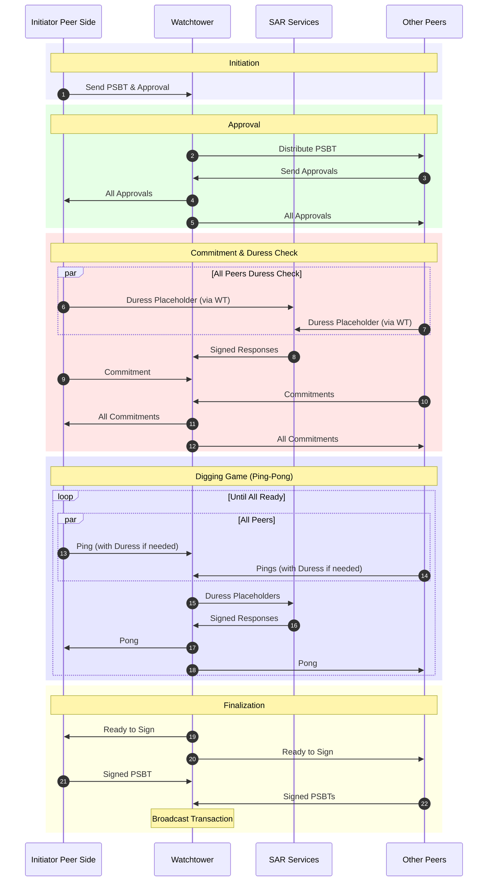

# Boomerang: Bitcoin Cold Storage with Built-in Coercion Resistance

> **Note:** This is a simplified overview. For a comprehensive technical deep dive, refer to [DEEPDIVE.md](DEEPDIVE.md).

credit: <https://xkcd.com/538/>

## Table of Contents

- [Boomerang: Bitcoin Cold Storage with Built-in Coercion Resistance](#boomerang-bitcoin-cold-storage-with-built-in-coercion-resistance)
  - [Table of Contents](#table-of-contents)
  - [What is Boomerang?](#what-is-boomerang)
  - [Why Boomerang?](#why-boomerang)
    - [The Problem](#the-problem)
    - [The Solution](#the-solution)
  - [How It Works](#how-it-works)
    - [Key Components](#key-components)
    - [Setup](#setup)
    - [Withdrawal Process](#withdrawal-process)
    - [Duress Protection](#duress-protection)
  - [Target Users](#target-users)
  - [Threat Model](#threat-model)
  - [Core Design Goals](#core-design-goals)
  - [Boomerang in Action](#boomerang-in-action)
    - [Sequence Diagram](#sequence-diagram)
  - [Progress So Far](#progress-so-far)
  - [Contributing](#contributing)
  - [License](#license)

## What is Boomerang?

Boomerang is a Bitcoin cold storage protocol designed to protect against both digital and physical threats. While traditional cold storage (e.g., hardware wallets) secures funds from online hackers, it offers little defense against real-world coercion, such as "wrench attacks" where attackers physically force you to transfer funds.

Boomerang introduces **coercion resistance** by making withdrawals unpredictable and risky for attackers during what we call the "boomerang regime." It incorporates randomized delays and discrete duress signals, deterring forced transfers. After a predefined milestone (e.g., 2 years) the "normal regime" begins, in which transactions can be made in a standard, deterministic manner for long-term reliability.

Think of it as a time-locked vault with a secret alarm: the opening time is randomized within user-defined ranges, and you can discreetly trigger help without alerting the attacker.

## Why Boomerang?

### The Problem

Large Bitcoin holders—such as companies or high-net-worth individuals—often rely on a small group of trusted custodians. These setups are resilient to cyberattacks but vulnerable to physical coercion. Attackers can force immediate transfers because standard Bitcoin transactions are fast and irrevocable.

### The Solution

Boomerang makes coercion a poor strategy for attackers:

- **Unpredictable Timing:** Withdrawals involve randomized "steps" tied to Bitcoin's blockchain, creating uncertainty (e.g., months to years) that gives victims time for rescue.
- **Discrete and Unavoidable Duress Signals:** Users can secretly indicate distress during the process, triggering automated alerts to rescue services without detectable changes.
- **Eventual Determinism:** After a milestone block height, access becomes quick and predictable, like regular multisig cold storage.
- **Risk for Attackers:** The process will halt if anomalies are detected, and duress signals can initiate search-and-rescue operations.

This shifts the risk-reward balance, making physical attacks less appealing while ensuring legitimate users can always access funds eventually.

## How It Works

Boomerang is optimized for long-term holdings, not frequent transactions. It leverages multisig, encryption, and external services for coordination and security.

### Key Components

- **Peers:** A small group (e.g., 5 trusted individuals) who share control via hardware devices.
- **Boomlet:** A secure smart card or app holding key shares and handling randomness/duress logic.
- **Niso:** A non-isolated computer for network interactions.
- **Iso:** An isolated computer for signing and some sensitive cryptographic operations.
- **ST (Secure Terminal):** A device for secure input/output, preventing tampering.
- **Watchtower (WT):** A neutral service coordinating peer communications.
- **Search and Rescue (SAR) Services:** Handle duress alerts, decrypting pre-encrypted personal info (e.g., location) to initiate rescues.
- **Tor/Encryption:** Ensures anonymous, secure communications.

### Setup

1. Peers generate and split keys using a multisig taproot descriptor.
2. Each peer privately sets a min-max range for "digging steps" (randomized rounds, e.g., equivalent to 6 months–2 years).
3. Encrypt personal "doxing" data (e.g., contacts, location) for SAR, unlocked only on duress.
4. Define a milestone block height (e.g., ~2 years out) for transitioning to normal regime.
5. Memorialize a "consent set" (e.g., 5 countries) for duress signaling.

The funds are locked in a Taproot address with Boomerang spending conditions.

### Withdrawal Process

- **Initiation:** Create and verify a PSBT (Partially Signed Bitcoin Transaction).
- **Approval Phase:** All peers review and approve via Boomlets.
- **Commitment Phase:** Includes duress checks; commitments are exchanged via WT.
- **Digging Game (Boomerang Phase):** Randomized rounds of "ping-pong" messages synced to Bitcoin blocks. Each peer's Boomlet draws a secret "mystery" number from their range. Rounds continue until all reach their mystery, introducing unpredictable delays.
  - Random duress checks will occur mid-game.
- **Signing and Broadcast:** Once all are ready, sign and finalize the PSBT.
- **Post-Milestone:** Bypasses randomness for instant, deterministic multisig.

### Duress Protection

- During checks, the system presents randomized lists of countries.
- Selecting your memorized consent set signals "all clear."
- Any other combination signals duress, encrypting a key for SAR to access your data and start rescue (e.g., alert authorities).
- The interface looks identical regardless, hiding the signal from attackers.
- SAR processes placeholders silently, signing responses to maintain flow.

If duress is detected or peers go offline, the process halts without transferring funds.

## Target Users

- **Enterprise/High-Value Holders:** Businesses with Bitcoin reserves (e.g., treasuries).
- **High-Risk Environments:** Individuals in regions prone to physical threats or kidnappings.
- **Not Suitable For:** Day traders, casual users, or frequent access needs—it's deliberately slow during the boomerang phase.

Costs include hardware (Boomlets), service fees (WT/SAR), and Bitcoin transaction fees.

## Threat Model

Boomerang assumes:

* Large Bitcoin holdings controlled by a small set of trusted operators
* Attackers capable of physical coercion
* Attackers expecting deterministic transaction execution
* Participants who may need silent distress signaling

Boomerang does **not** attempt to:

* prevent device theft alone
* replace general wallet security practices
* eliminate all human risk

Instead, it targets the gap between cryptographic safety and real-world coercion.

## Core Design Goals

* **Coercion resistance** — make forced withdrawal unpredictable and risky
* **Silent distress signaling** — participants can signal duress invisibly
* **Eventual liveness** — legitimate withdrawals always complete
* **Coordination transparency** — all peers verify system state
* **Hardware isolation** — signing logic remains physically separated
* **Operational plausibility** — all duress actions appear normal

## Boomerang in Action

Below is a simplified walkthrough of a withdrawal under the non-deterministic (boomerang) regime. For full details, see the [setup](setup) and [withdrawal](withdrawal) folders.

1. **Initiation**
   One peer (the *initiator*) constructs an unsigned PSBT representing the intended withdrawal transaction.

2. **PSBT Transfer to Boomlet**
   The initiator sends the PSBT to their Niso. Niso performs structural validation and forwards the PSBT to the Boomlet via the smart-card interface.

3. **Boomlet Verification**
   The Boomlet verifies that the PSBT spends from the Boomerang descriptor. It extracts the transaction ID (txid), encrypts it using its shared key with the Secure Terminal (ST), and returns the encrypted payload to Niso for display.

4. **Human Confirmation via ST**
   The ST scans the encrypted txid from Niso, decrypts it, and displays the txid to the initiator for verification. If approved, the ST signs the confirmation and returns it to the Boomlet via Niso.

5. **Initiator Approval Submission**
   After validating the ST’s signed approval, the Boomlet issues its approval. Niso forwards both the approval and the PSBT to the Watchtower (WT).

6. **Distribution to Peers**
   The WT validates the initiator’s approval and distributes the PSBT and approval to all other peers.

7. **Peer Verification**
   Each peer independently validates the PSBT and approval using their Boomlet and human verification flow. Approved peers submit their approvals to the WT.

8. **Consensus Confirmation**
   The WT aggregates approvals and broadcasts the full approval set to all peers, confirming group consensus.

**Duress Check Phase**

9. **Duress Challenge Generation**
   Each Boomlet initiates a duress check by generating five randomized country lists, encrypting them for the ST, and transmitting them via Niso.

10.  **Peer Duress Input**
    The ST decrypts and displays the lists. The peer selects one country from each list.

* If selections match the preconfigured consent set → no duress
* Any other combination → duress signaled

The ST encrypts the selections and returns them to the Boomlet.

11. **Duress Placeholder Creation**
    The Boomlet evaluates the response:

* No duress → encrypts a zero placeholder for SAR
* Duress → encrypts a rescue key enabling SAR to access protected peer data

The Boomlet appends the placeholder to a commitment message, encrypts it, and sends it to the WT via Niso.

12. **WT Processing**
    The WT verifies the commitment message and forwards the duress placeholder to SAR.

13. **SAR Evaluation**
    SAR decrypts the placeholder:

* Rescue key present → decrypt peer data and initiate rescue
* Otherwise → no action

SAR signs the encrypted placeholder and returns it to the WT.

14. **Peer Commitments**
    All other peers perform the duress check and commitment process. The WT handles each commitment identically.

15. **Commitment Synchronization**
    Once all commitments are received, the WT distributes them to all peers for verification.

**Digging Game (Non-Deterministic Phase)**

16.  **Initialization**
    Each Boomlet has a private "mystery" threshold which was drawn randomly by the Boomlet at setup phase, from a range selected by each pertinent user. Now, at this stage of the withdrawal, every Boomlet initializes a counter at zero. Signing becomes available only after the counter reaches this threshold.

17.  **Ping Creation**
    Each Boomlet constructs a signed Ping containing its latest observed Bitcoin block height (As reported by its Niso). A duress placeholder is attached, and the message is encrypted for the WT and transmitted via Niso.

18.  **WT Ping Processing**
    The WT validates incoming Pings and their recency, forwards placeholders to SAR, and SAR processes them as in step 13.

19.  **Pong Broadcast**
    The WT aggregates all Pings into a Pong message, includes SAR signatures and the latest WT block height, and distributes it to all peers.

20.  **Synchronization Check**
    Each Boomlet verifies the Pong. If valid, it increments its counter and prepares the next Ping.

21.  **Random Duress Rechecks**
    At random intervals, a Boomlet may pause Ping creation to repeat the duress check procedure. The resulting placeholder is attached to the next Ping.

22.  **Completion and Signing**
    The loop continues until all Boomlets reach their mystery thresholds and signal readiness. The WT announces the signing phase. Peers sign the PSBT using their Boomlet and isolated computer (Iso), finalize the transaction, and broadcast it.

### Sequence Diagram

## Progress So Far

- **Protocol Design:** Full specifications, including message sequence diagrams for [setup](setup) and [withdrawal](withdrawal).
- **SVGs:** View diagrams for [setup](setup/setup_diagram_without_states.svg), [initiator withdrawal](withdrawal/initiator_withdrawal_diagram_without_states.svg), and [non-initiator withdrawal](withdrawal/non_initiator_withdrawal_diagram_without_states.svg).
- **Proof-of-Concept:** Rust implementation available at [github.com/bitryonix/boomerang](https://github.com/bitryonix/boomerang).

## Contributing

We welcome contributions! Open issues for bugs, features, or discussions.

## License

This project is licensed under the MIT License - see the [LICENSE](LICENSE) file for details.
