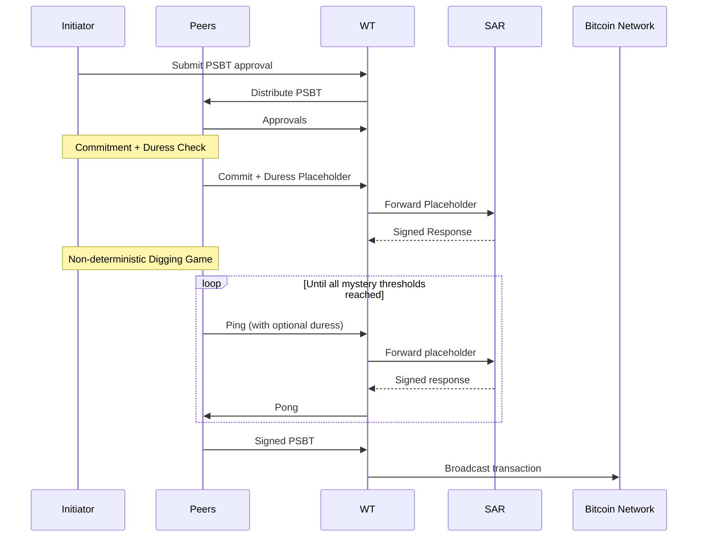

# Boomerang: Bitcoin Cold Storage with Enforced Non-Deterministic Withdrawal and Silent Duress Signaling

[](https://opensource.org/licenses/MIT)

> **Status:** Research-stage protocol design. Not production ready.  
> This repository contains the **design/specification** (message diagrams + docs). A separate repo contains a Rust PoC.


credit: <https://xkcd.com/538/>

Boomerang is a Bitcoin cold-storage protocol designed to protect not only against digital compromise, but also against **real-world coercion**. Conventional custody systems are largely **deterministic**: attackers can learn who must sign, what steps must occur, and approximately how long it will take. Under physical coercion, that predictability becomes the attacker’s advantage.

Boomerang explores a different primitive:
> **Hardware-enforced, bounded but unpredictable withdrawal time** + **plausibly deniable duress signaling** embedded in normal protocol flow — **without changing Bitcoin consensus**.

----

## Table of Contents

- [Boomerang: Bitcoin Cold Storage with Enforced Non-Deterministic Withdrawal and Silent Duress Signaling](#boomerang-bitcoin-cold-storage-with-enforced-non-deterministic-withdrawal-and-silent-duress-signaling)
  - [Table of Contents](#table-of-contents)
  - [Motivation](#motivation)
  - [Core Idea](#core-idea)
  - [What Boomerang Is and Is Not](#what-boomerang-is-and-is-not)
  - [Architecture Overview](#architecture-overview)
  - [System Topology](#system-topology)
  - [How Withdrawal Works](#how-withdrawal-works)
      - [Conceptual Withdrawal Flow](#conceptual-withdrawal-flow)
      - [What Makes It Non-Deterministic(But Bounded)](#what-makes-it-non-deterministicbut-bounded)
  - [Duress Signaling](#duress-signaling)
  - [Security Model](#security-model)
  - [Trade-offs](#trade-offs)
  - [Limitations and Open Problems](#limitations-and-open-problems)
  - [Progress So Far](#progress-so-far)
  - [Repository Map](#repository-map)
  - [Closing Thought](#closing-thought)

----

## Motivation

Bitcoin cryptography secures **keys**. It does not secure **people**.

In high-value custody settings (enterprise treasuries, sovereign individuals, multi-operator governance), a realistic adversary is not just a remote attacker. It may be a coercive attacker who:

- identifies key holders,
- forces them to participate,
- and relies on predictable procedures and timelines.

Most cold storage designs are deterministic under coercion. Boomerang is an attempt to **reduce the attacker’s confidence in time** and to create a **reaction window** for intervention — while still guaranteeing eventual recoverability.

----

## Core Idea

Funds are locked in a Taproot output with **two spending regimes**:

```
        Unspendable key path
                 |
    ---------------------------------
    |                               |
Boomerang regime                Normal regime
(non-deterministic)         (deterministic fallback)

```

#### 1) Boomerang regime (primary)<!-- omit from toc -->
- Requires **N-of-N MuSig2 aggregated keys**.
- Each aggregated key includes:
  - a recoverable **normal key** (mnemonic-backed), and
  - a **non-exportable hardware key share** inside a secure element (**Boomlet**).
- Withdrawals require a coordinated protocol and only become signable after a secret, per-device threshold (“**mystery**”) is reached.
- **No participant (including the victim) can know in advance when signing becomes possible.**

#### 2) Normal regime (fallback)<!-- omit from toc -->
- Activated after milestone block heights.
- Provides deterministic, time-locked scripts that gradually reduce the required signer threshold.
- Ensures **eventual liveness** even if hardware is lost or the Boomerang regime cannot complete.

Boomerang introduces uncertainty; the normal regime guarantees recoverability.

----

## What Boomerang Is and Is Not

#### Boomerang is:<!-- omit from toc -->
- A **research protocol** for coercion-aware custody.
- A design that treats **time determinism as an attack surface**.
- A Taproot/MuSig2/timelock construction that **requires no consensus changes**.

#### Boomerang is not:<!-- omit from toc -->
- “Duress-proof Bitcoin.”
- A consumer wallet.
- A replacement for simple multisig cold storage.
- Production ready.

----

## Architecture Overview

Boomerang is not a single device. It is a distributed custody protocol involving:

- multiple peer operators,
- dedicated hardware,
- an online coordination service,
- and a rescue service that only learns identity upon duress.

#### Actors<!-- omit from toc -->

Per peer:

- **Boomlet**: Secure element (JavaCard-class) that:
  - holds a MuSig2 key share,
  - enforces the withdrawal non-determinism (“mystery” threshold),
  - executes duress logic.
- **Boomletwo**: Backup smartcard (inactive until activation; activation procedure is an ancillary still under design).
- **Iso**: Offline environment for:
  - key derivation / installation,
  - sensitive operations,
  - final MuSig2 signing with Boomlet.
- **Niso**: Online environment for:
  - Tor communications with peers and Watchtower,
  - direct Bitcoin node RPC access,
  - mediating the withdrawal protocol.
- **ST (Secure Terminal)**: Air-gapped human interface for:
  - transaction approvals,
  - duress input,
  - minimizing trust in online components.
- **Phone**: Used to register with SAR and stream encrypted dynamic data.

External:

- **Bitcoin Network**
- **Bitcoin Node (RPC endpoint)**: used by each peer’s Niso (direct, not “restricted to Tor”).
- **Tor Network**: used for peer↔peer and peer↔WT communication.
- **WT (Watchtower)**: coordination + liveness service.
- **SAR (Search & Rescue)**: receives duress placeholders; decrypts identity only on duress.

----

## System Topology

This diagram reflects the setup and withdrawal design constraints:

- **Niso has direct RPC access to a Bitcoin node** for block height and transaction context.
- **Tor is used for peer and Watchtower communications**, not as a requirement for Bitcoin node access.
- **ST is air-gapped**: it communicates via QR through **Iso or Niso** (screen/camera relay), depending on phase.
- **Phone talks directly to SAR** for registration and dynamic doxing feed.
- **WT forwards duress placeholders to SAR** during withdrawal.

```
                       ┌──────────────────────────────┐
                       │        Bitcoin Network       │
                       └───────────────┬──────────────┘
                                       │
                                       ▼
                              ┌────────────────┐
                              │  Bitcoin Node  │
                              │  (RPC endpoint)│
                              └───────┬────────┘
                                      │  Direct RPC
                                      ▼
    ┌────────────────────────────────────────────────────┐
    │                    Tor Network                     │
    └────────────────────────────────────────────────────┘
                     ▲                         ▲
                     │                         │
               ┌─────┴─────┐             ┌─────┴─────┐
               │ Watchtower│◄───────────►│    SAR    │
               │    (WT)   │             │ (Rescue)  │
               └─────┬─────┘             └─────┬─────┘
                     │                         ▲
                     │                         │
    ┌────────────────┼───────────────────┐     │
    ▼                ▼                   ▼     │
┌────────┐      ┌────────┐         ┌────────┐  │
│ Peer 0 │      │ Peer 1 │   ...   │ Peer 4 │  │
└───┬────┘      └───┬────┘         └───┬────┘  │
    │               │                  │       │
    ▼               ▼                  ▼       │
┌─────────────────────────────────────────────────────────────┐
│                     Per-Peer Architecture                   │
│                                                             │
│   ┌────────────┐       ┌────────────┐                       │
│   │     Iso    │◄─────►│  Boomlet   │                       │
│   │ (offline)  │       │ (smartcard)│                       │
│   └─────┬──────┘       └─────┬──────┘                       │
│         │                    │                              │
│         │ (backup ceremony)  ▼                              │
│   ┌─────▼──────┐       ┌────────────┐                       │
│   │ Boomletwo  │       │    Niso    │                       │
│   │  (backup)  │       │ (online PC)│                       │
│   └────────────┘       └─────┬──────┘                       │
│                              │                              │
│                              │ Tor → peers & WT             │
│                              │ RPC → Bitcoin node           │
│                              ▼                              │
│                            (WT)                             │
│                                                             │
│   Air-gapped Human Interface:                               │
│                                                             │
│        ┌────────────┐                                       │
│        │     ST     │                                       │
│        └─────┬──────┘                                       │
│              │ QR relay via Iso or Niso (screen/camera)     │
│              ▼                                              │
│            Boomlet                                          │
│                                                             │
│   Phone ───────────────► SAR (registration & dynamic feed)  │
│                                                             │
└─────────────────────────────────────────────────────────────┘

```

----

## How Withdrawal Works

Withdrawal is a multi-phase ceremony coordinated through WT, with repeated human verification and duress opportunities. The full step-by-step protocol is defined in the PlantUML diagrams and the detailed specs (see [Repository Map](#repository-map)).

#### Conceptual Withdrawal Flow

This diagram is intentionally simplified to communicate the core structure without overwhelming detail:



#### What Makes It Non-Deterministic(But Bounded)

Each Boomlet draws a secret integer (“mystery”) during setup.

Importantly:

- Each peer selects, at setup time, a **minimum and maximum range** (in blocks) that defines acceptable withdrawal latency.
- The Boomlet then samples a random integer uniformly from within that user-selected range.
- The exact mystery value is stored only inside the secure element and is never revealed.
- Other peers do not know each other’s mystery values.
- The Watchtower does not know any mystery value.

During withdrawal:

- Each Boomlet maintains a counter.
- The counter advances only under valid block-height and freshness constraints inside the coordinated ping-pong loop.
- Signing becomes available only when the Boomlet’s internal counter reaches its mystery threshold.

Therefore:

- Withdrawal duration is **bounded** (by the selected range),
- But the exact completion time is **unpredictable** to any participant or adversary.

Boomerang enforces *bounded unpredictability*, not unbounded delay.

----

## Duress Signaling

Duress signaling is designed to be:

* **unavoidable** (recurs during withdrawal),
* **plausibly deniable** (no observable protocol divergence),
* **hardware-evaluated** (Boomlet is the trusted evaluator, ST is the trusted UI).

At setup, the user selects and memorizes a **consent pattern** (e.g., a set of countries). During withdrawal:

* Boomlet generates randomized challenges.
* ST displays them air-gapped.
* The user’s selection either matches the consent set (safe) or does not (duress).

Boomlet then produces a **duress placeholder** included in normal messages:

* Safe: an encrypted zero/padding placeholder
* Duress: an encrypted key that allows SAR to unlock the user’s encrypted doxing data

WT forwards these placeholders to SAR, and SAR responds with a signed acknowledgement while keeping protocol flow consistent.

----

## Security Model

Boomerang aims to increase attacker uncertainty and create a reaction window. It does **not** claim to eliminate coercion risk.

Assumptions (non-exhaustive):

* Secure element (Boomlet) resists key extraction and behaves correctly.
* ST is tamper-resistant/evident enough to preserve integrity of user verification and duress input.
* Cryptographic primitives hold.
* WT is non-custodial but is a coordination actor (liveness + metadata exposure).
* SAR operates under real-world legal constraints and only learns identity upon duress signal.

----

## Trade-offs

Boomerang intentionally trades simplicity for coercion resistance:

| Property                        | Cost                                                      |
| ------------------------------- | --------------------------------------------------------- |
| Enforced non-determinism        | Potentially long withdrawal latency                       |
| Embedded duress signaling       | Additional devices and ceremony complexity                |
| N-of-N Boomerang regime         | Coordination burden; peer non-cooperation blocks progress |
| Eventual deterministic recovery | Requires milestone planning and rollover discipline       |
| External services (WT/SAR)      | Operational trust and metadata exposure (not custody)     |

Boomerang is optimized for long-term holdings, not frequent spending.

----

## Limitations and Open Problems

Boomerang is research-stage; several issues are explicitly open:

#### 1) Forced determinism<!-- omit from toc -->

Boomerang can collapse into the deterministic regime if:

* a Boomlet is lost/destroyed,
* the backup path is unavailable,
* withdrawal is initiated too late relative to milestones,
* or a peer refuses to cooperate.

Mitigation today relies on disciplined rollover and operational guidance. More robust mitigations remain open research.

#### 2) Peer non-cooperation<!-- omit from toc -->

N-of-N preserves the coercion-resistance promise (one honest peer can prevent “silent bypass”), but it increases liveness risk.

#### 3) Hardware trust<!-- omit from toc -->

Security depends heavily on secure element behavior (RNG, side-channel resistance, lifecycle, supply chain). Compromise of Boomlet undermines the non-determinism guarantee.

#### 4) SAR trust + legal/jurisdiction constraints<!-- omit from toc -->

SAR intervention is jurisdiction-dependent and introduces legal exposure. Incentives, abuse resistance, and privacy implications require careful treatment.

#### 5) Complexity as attack surface<!-- omit from toc -->

The protocol is a distributed state machine with many checks. Complexity increases the risk of emergent failure modes and usability errors.

----

## Progress So Far

- **Protocol Design:** Full specifications, including message sequence diagrams for [setup](setup) and [withdrawal](withdrawal).
- **SVGs:** View diagrams for [setup](setup/setup_diagram_without_states.svg), [initiator withdrawal](withdrawal/initiator_withdrawal_diagram_without_states.svg), and [non-initiator withdrawal](withdrawal/non_initiator_withdrawal_diagram_without_states.svg).
- **Proof-of-Concept:** Rust implementation available at [github.com/bitryonix/boomerang](https://github.com/bitryonix/boomerang).
----

## Repository Map

This repository contains the design artifacts and specs:

* [DEEPDIVE.md](DEEPDIVE.md) — comprehensive technical deep dive (recommended for experts)
* [setup/](setup)

  * `setup_diagram_without_states.puml` (+ SVG render) — setup message sequence diagram
  * Setup procedure specification
* [withdrawal/](withdrawal)

  * `initiator_withdrawal_diagram_without_states.puml` (+ SVG render)
  * `non_initiator_withdrawal_diagram_without_states.puml` (+ SVG render)
  * Withdrawal procedure specification
* [duress_protection/](duress_protection) — duress mechanism design and rationale
* [secure_terminal/](secure_terminal) — ST design requirements and threat assumptions
* [security_models/](security_models) — threat analyses including forced determinism discussions

For the full protocol, always treat the PlantUML sequence diagrams and DEEPDIVE as the source of truth.

----

## Closing Thought

Bitcoin has spent years hardening keys against math, networks, and software.

Boomerang asks:

> What does it look like to harden Bitcoin custody against humans with guns — by making **time** uncertain?

This repository is an exploration of that question. It is intentionally adversarial, intentionally strict, and intentionally unfinished.
