# Boomerang: Bitcoin Cold Storage With Built-in Coercion Resistance

> **NOTE:** This is a simplified overview. For a more comprehensive review, please visit [DEEPDIVE.md](DEEPDIVE.md).

### What is Boomerang?

Imagine you have a lot of bitcoins - maybe for a company or personal savings - and you're worried not just about hackers, but about real-world threats like someone kidnapping you or threatening you to hand over the money. Regular "cold storage" (like keeping your keys offline on a hardware wallet) is great against online thieves, but it doesn't help if an attacker forces you to sign a transaction right away. That's where Boomerang comes in: it's a system designed to make stealing bitcoins through force way harder and riskier for bad guys.

### Why Does Boomerang Exist?

- **The Problem**: Big bitcoin holders (like businesses with millions in bitcoin) often have a few key people who control the ultimate access. Hackers can't easily get in, but a **"wrench attack"** - basically, physically forcing those people to transfer the money - works because normal systems let you send funds quickly and reliably.
- **The Goal**: Boomerang flips the script. It turns the withdrawal process into something unpredictable in timing during a certain period, with built-in ways to securely signal duress. Attackers can't count on getting the money in a set timeframe (or without risks), so they're less likely to try. Importantly, you can always withdraw eventually if everything's legit. It's just not instant or predictable at first, and becomes straightforward after a set time.

It's like hiding your treasure in a vault that takes a random, unknown, but within a wide range (selected by you privately), amount of time to open, and you can secretly hit a panic button without the attacker detecting if you have done such thing during the process. After a milestone (like 2 years), the vault can be opened normally and deterministically.

### How Does It Work?

Boomerang isn't for everyday spending. It's for long-term storage where you rarely need to touch the funds. Here's the basics:

1. **Setup Basics**:
   - You split control among a small group (e.g., 5 trusted people or "peers").
   - Each person uses special hardware devices (like secure cards or apps) to hold parts of the keys.
   - You also connect to neutral "watchtowers" (services that help coordinate) and "search and rescue services" (that can alert help if things go wrong).
   - You provide encrypted personal info (like your location) to the rescue service, locked with a secret password only you know.
   - Each peer privately sets their own range for how many "steps" (rounds of checks) their part of the process might take; say, a minimum and maximum number, like 6 months to 1 year worth of steps (tied to Bitcoin's blockchain timing). The group doesn't share these ranges; each person's device (Boomlet) randomly picks a number within their own private range when needed.
   - The group agrees on a future "milestone block 1" (a specific point on the Bitcoin blockchain, e.g., in 2 years) after which withdrawals become fast and predictable; no more randomness.
   - Prior to the milestone, the withdrawal is non-deterministic and the duress protection is in place. After that milestone, it is just a plain normal spending condition in a taproot address.

2. **Withdrawing Money**:
   - To move bitcoins, everyone in the group has to approve through a back-and-forth process.
   - In the boomerang period (before the milestone mentioned earlier, like the first 2 years), it involves multiple rounds of checks (the "digging game"). The exact number of steps for each peer's part is randomly picked by their Boomlet within their own private min-max range. No one (not even the group) knows the others' ranges or picks upfront, creating overall uncertainty in total time - so neither do attackers. This makes it hard for bad guys to plan around the timing, giving potential victims time (e.g., months) to be rescued if coerced.
   - During approvals, you can secretly signal "I'm under duress" (e.g., by choosing certain options in a quiz-like interface on a device). This looks normal to attackers but triggers the rescue service.
   - If anything seems off (like missed duress checks or messed up responses), the process just... stops. No money moves. But if all's good, it completes - you just don't know exactly how long it'll take ahead of time.
   - After the milestone block (e.g., 2 years in), you enter a "normal era" where everything is quick and deterministic, like regular cold storage.

3. **Duress Protection**:
   - The "secret signal" is easy: You memorize a set of 5 countries during setup as the consent set. Later, the system shows lists of countries, and your choices either confirm "all good" by entering the consent set or scream "help!" by entering any other combination of countries without obvious signs or stopping the ceremony. You signal the duress but the attacker observe no change compared to the non-duress situation.
   - If duress is signaled, the rescue service gets your info and can start a "search and rescue" - like contacting authorities or trusted contacts.

The whole thing uses encryption and anonymous networks (like Tor) to keep communications hidden. It's not foolproof against everything, but it makes coercion a bad bet for attackers: too uncertain in duration and too risky.

### Who Is It For?

- **Big Holders**: Companies or wealthy individuals with bitcoin they don't need to access often (e.g., long-term reserves).
- **High-Risk Situations**: Places where physical threats are real, like in unstable regions.
- **Not For**: Casual users or quick trades; it's too slow and complicated for that.

In short, Boomerang is like a bitcoin safe with a randomized time-delay lock and a hidden alarm during the boomerang phase, switching to normal access after a milestone. It prioritizes ultimate protection over convenience, making it tougher for anyone to force you out of your bitcoin. If you're curious about setting it up or the costs, it involves hardware, fees for services, and coordinating with others.

### What have we done so far?

We have designed the protocol and the full message sequence diagrams for [setup](setup) and [withdrawal](withdrawal). We have also made a [proof-of-concept implementation](https://github.com/bitryonix/boomerang) in Rust.

If you like to see the SVG files of the message sequence diagrams, here they are for the [setup](setup/setup_diagram_without_states.svg), [initiator peer's withdrawal](withdrawal/initiator_withdrawal_diagram_without_states.svg) and [non-initiator peer's withdrawal](withdrawal/non_initiator_withdrawal_diagram_without_states.svg) ceremonies.

### Boomerang in action

Here we demonstrate what happens when you want to withdraw from Boomerang while under the non-deterministic regime. Please note that this is a simplified version of the protocol and the detailed design can be found in [setup](setup) and [withdrawal](withdrawal) folders with pertinent detailed message sequence diagrams as mentioned before.

```mermaid
sequenceDiagram
    box Initiator Peer's Side
    participant IP as Initiator Peer
    participant IB as Boomlet<br>(A smart card)
    participant IST as ST<br>(A secure device<br>for input and display)
    participant IN as Niso<br>(A non-isolated computer)
    end
    participant WT as WT
    participant SARs as SARs
    participant NIPS as Non-Initiator Peers' Side

    autonumber

    rect rgb(240, 240, 255)
    note over IP, NIPS: Initiation (Initiator Starts Withdrawal)
    IP->>IN: Provide PSBT
    note over IN: Examines the PSBT
    IN->>IB: Forward PSBT
    note over IB: Checks the PSBT and if OK,<br>encrypts the txid by the shared key with ST<br>to show to Peer to check with PSBT's txid
    IB->>IST: Encrypted tx_id via Niso<br>then Niso's monitor into<br>ST's camera (abbreviated here)
    IST->>IP: Show tx_id to initiator peer
    note over IP: Checks the txid with<br>the one from the PSBT
    IP->>IST: Approve
    note over IST: Signs user approval<br>and encrypts the result for Boomlet
    IST->>IB: Signed and encrypted approval<br>(again through Niso but abbreviated here)
    note over IB: Verifies peer's approval
    IB->>WT: Send approval & encrypted PSBTs via Niso to WT
    note over WT: Verifies & prepares for distribution
    end

    rect rgb(230, 255, 230)
    note over IP, NIPS: Approval (Non-Initiators Review & Approve)
    WT->>NIPS: WT/Initiator peer's approvals & encrypted PSBT
    note over NIPS: All non-initiator peers check and approve the PSBT
    NIPS->>WT: Send non-initiator peers' approvals to WT via pertinent Nisos
    note over WT: Collects all approvals
    WT->>IB: All approvals via Niso
    note over IB: Check and verify all approvals
    WT->>NIPS: All approvals via pertinent Nisos
    note over NIPS: Check and verify all approvals
    end

    rect rgb(255, 230, 230)
    note over IP, SARs: Commitment (Duress Check & Commit)
    par Duress Check (All Peers)
    note over IB: Creates a duress check space to<br>present to user for duress check via the ST
    IB->>IST: Encrypted duress check via Niso
    note over IST: Decrypts the duress check for user to see
    IST->>IP: Show duress check space
    note over IP: If in duress, the peer chooses<br>any combination of countries other<br>than the consent set. If not,<br>the peer chooses the<br>consent set countries. 
    IP->>IST: Duress signal (5 countries)
    IST->>IB: Encrypted signal
    note over IB: Boomlet evaluates the signal and<br>creates a duress placeholder based on<br>the signal. If the signal is positive<br>and the peer is in duress,<br>Boomlet will put the key for SAR to decrypt<br>peer's data and start the rescue operation.<br>If not, just puts a bunch of zeros there<br>and encrypts the placeholder for SAR.
    and
    note over NIPS: Same duress check procedure occurs in every other peer
    end
    note over IB: Boomlet creates a commitment to the<br>transaction and appends the duress placeholder
    IB->>WT: Encrypted commitment and duress placeholder via Niso
    note over WT: WT decrypts and checks the message.<br>Then sends the encrypted duress placeholder to the SAR.
    WT->>SARs: Encrypted duress placeholder
    note over SARs: Checks the duress placeholder.<br>If the signal is positive, decrypts peer's<br>data and start the rescue operation.<br>If the signal is negative,<br>does nothing. Then regardless of the signal,<br>signs the encrypted duress placeholder and<br>sends it back to the WT.
    SARs->>WT: Signed encrypted duress placeholder
    note over WT: Verifies the initiator's commitment
    WT->>NIPS: Initiator's commitment
    note over NIPS: All non-initiator peers verify initiator's<br>commitment and go through duress check<br>themselves and at last commit to the transaction.
    NIPS ->> WT: All non-initiator commitments.
    note over WT: Collect all commits
    WT->>IB: All commitments via Niso
    note over IB: Boomlet checks all commitments
    WT->>NIPS: All commitments via pertinent Nisos
    note over NIPS: All non-initiator Boomlets check<br>all the commitments as well
    end

    rect rgb(230, 230, 255)
    note over IP, NIPS: Ping-Pong (the non-deterministic part that takes time and nobody knows exactly how long)
    loop Until All Reach Mystery Threshold
    par All Peers
    note over IB: Boomlet draws a random number, and<br>based on the result, decides if it wants<br>a duress check like before or wants to<br>create a Ping.
    note over IB: If Boomlet decides duress check, something like step 12 repeats.
    note over IB: If Boomlet decides it wants to do the Ping,<br>it creates a Ping data structure<br>with its best known (most work) bitcoin<br>block height as per its Niso and signs it.
    note over IB: No matter what, the duress placeholder will<br>be attached to the Ping and sent to SAR.
    IB->>WT: Ping with duress placeholder via Niso
    note over NIPS: The same goes for every other peer.
    NIPS->>WT: Ping with duress placeholder via pertinent Nisos
    end
  
    note over WT: WT receives all pongs, checks them for recency,<br>verifies all signatures, and sends the encrypted<br>duress placeholders to pertinent SARs for each peer.
    WT->>SARs: Encrypted duress placeholder
    note over SARs: Checks the duress placeholder.<br>If the signal is positive, decrypts peer's<br>data and start the rescue operation.<br>If the signal is negative,<br>does nothing. Then regardless of the signal,<br>signs the encrypted duress placeholder and<br>sends it back to the WT.
    SARs->>WT: Signed encrypted duress placeholder
    
    note over WT: Creates a Pong data structure with all the pings<br>received and the signed encrypted duress placeholder<br>and sends it to all peers
    WT->> IB: Pong
    note over IB: Verifies the Pong and checks it for recency.<br>If all is OK, increases the counter by 1.<br>If the counter has reached the mystery amount,<br>Boomlet will activate the reached flag and informs the WT of its status.<br>Nevertheless, it will continue as usual.
    WT->>NIPS: Pong
    note over NIPS: Same goes for all other peers
    end
    end

    rect rgb(255, 255, 230)
    note over IP, NIPS: Finalization (Sign & Relay TX)
    note over WT: When all peers inform WT of their reaching their own mystery, WT informs all, of the situation and the signing begins.
    WT->>IB: Reached signing stage via Niso
    note over IB: Peer signs the PSBT via their isolated computer and Boomlet.
    WT->>NIPS: Reached signing stage via pertinent Nios
    note over NIPS: All other peers signs the PSBT via<br>their isolated computer and Boomlet.
    IB->>WT: Signed PSBT via Niso
    NIPS->>WT: Signed PSBT via Niso
    note over WT: Aggregate Signatures Relay TX to Network
    end
```

### Online discussions and mentions

#### Posts

1. Post on [bitcointalk.org](https://bitcointalk.org/index.php?topic=5572779.0).
2. Post on [stacker.news](https://stacker.news/items/1429719).
3. Post on [delvingbitcoin.org](https://delvingbitcoin.org/t/boomerang-bitcoin-cold-storage-with-built-in-coercion-resistance/2239).
4. Post on [X](https://x.com/bitryonix/status/2020757517387895247?s=20).
5. Post on [Reddit](https://www.reddit.com/r/Bitcoin/comments/1qz5t5e/cold_storage_with_duress_protection/).

#### Mentions

1. [Stacker News Live post](https://stacker.news/items/1433540).
2. [Stacker New Live video on youtube](https://www.youtube.com/live/jV-FSCFfBd4?si=3dHA0OGQIoa0VsCp&t=1320).
3. [SN Saturday Newsletter 2/14/26](https://stacker.news/items/1434008).
4. [Bitcoin Breakdown issue #468](https://www.btcbreakdown.com/p/issue-468) and their post on [X](https://x.com/BTCBreakdown/status/2022044778083283095?s=20).
