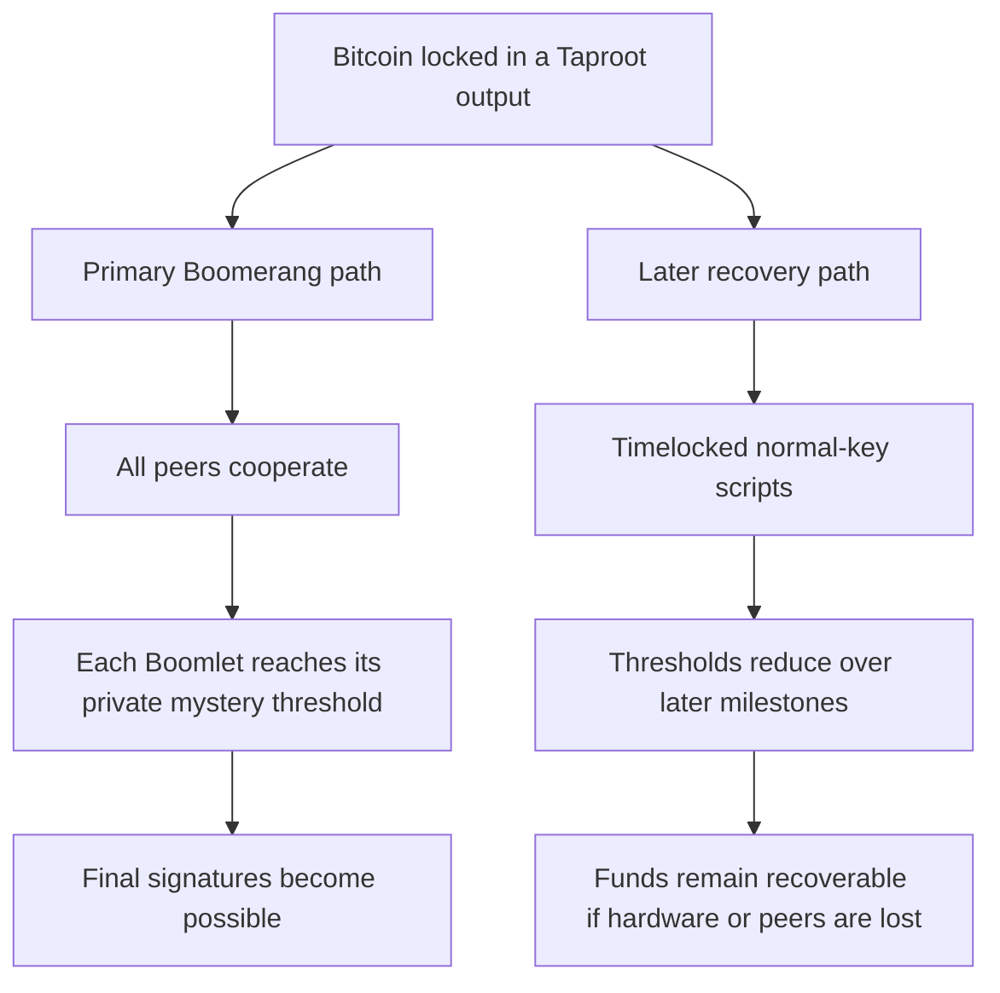
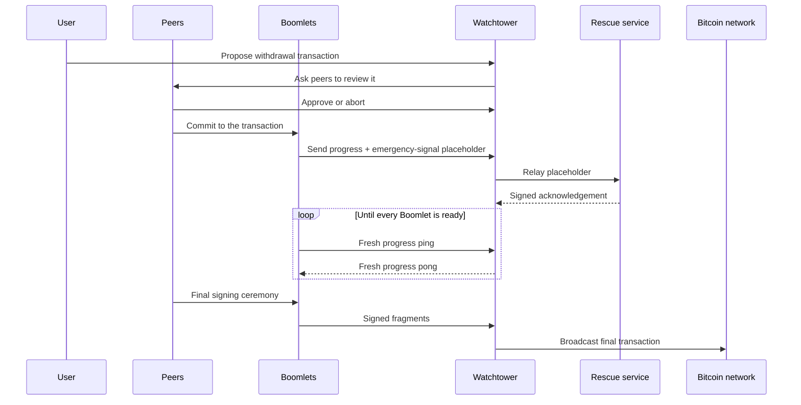

# Boomerang

**Bitcoin cold storage that treats withdrawal timing as part of security.**

> **Status:** Not production ready.
> This repository describes the protocol, diagrams, threat model, and open questions. It is not a consumer wallet and should not be used to custody real funds.

Boomerang is a design for high-value Bitcoin custody where the main risk is not only “can someone steal a key?” but also “can someone force a person to help move funds now?”

The core idea is simple:

> A withdrawal should eventually succeed, but it should not be rushable or precisely predictable.

Boomerang explores how to do that with standard Bitcoin tools: Taproot, MuSig2-style multisignature keys, timelocks, dedicated hardware, and a withdrawal ceremony that includes hidden emergency signaling.

---

## Table of Contents

- [Boomerang](#boomerang)
  - [Table of Contents](#table-of-contents)
  - [The one-minute version](#the-one-minute-version)
  - [Mental model](#mental-model)
    - [Primary path: Boomerang withdrawal](#primary-path-boomerang-withdrawal)
    - [Recovery path: deterministic fallback](#recovery-path-deterministic-fallback)
  - [Why the “mystery” matters](#why-the-mystery-matters)
  - [What a withdrawal looks like](#what-a-withdrawal-looks-like)
  - [Emergency signaling, without making it obvious](#emergency-signaling-without-making-it-obvious)
  - [What Boomerang is](#what-boomerang-is)
  - [What Boomerang is not](#what-boomerang-is-not)
  - [Who should care?](#who-should-care)
  - [Read this repo in the right order](#read-this-repo-in-the-right-order)
  - [The main security trade-offs](#the-main-security-trade-offs)
  - [Open problems worth working on](#open-problems-worth-working-on)
  - [Contribution ideas](#contribution-ideas)
  - [Contact](#contact)
  - [Closing thought](#closing-thought)

## The one-minute version

Most cold storage protects **keys**. Boomerang also tries to protect the **timeline**.

In a normal multisig setup, once the required people are forced or tricked into cooperating, the process is often predictable: the attacker can estimate who must sign, what steps are required, and how long it should take.

Boomerang changes that in three ways:

1. **Hardware-enforced waiting**
   Each signer has a small secure device, called a **Boomlet**, that will not sign until its own secret internal threshold has been reached.

2. **Bounded but unpredictable completion**
   The withdrawal range is chosen during setup, so the delay is not infinite. But the exact point at which each device becomes ready is hidden, even from the user.

3. **Emergency signaling inside the normal flow**
   During withdrawal, the user periodically answers challenges on an air-gapped **Secure Terminal**. A normal answer says “continue.” A different answer can quietly signal duress to a rescue service without changing the visible protocol flow.

Boomerang does **not** make coercion impossible. It is meant to reduce the attacker’s confidence, increase the cost of a rushed withdrawal, and create time for detection or intervention.

---

## Mental model

Think of Boomerang as a vault with two exits:

```mermaid
flowchart TB
    A[Bitcoin locked in a Taproot output]
    A --> B[Primary Boomerang path]
    A --> C[Later recovery path]

    B --> B1[All peers cooperate]
    B1 --> B2[Each Boomlet reaches its private mystery threshold]
    B2 --> B3[Final signatures become possible]

    C --> C1[Timelocked normal-key scripts]
    C1 --> C2[Thresholds reduce over later milestones]
    C2 --> C3[Funds remain recoverable if hardware or peers are lost]
```

### Primary path: Boomerang withdrawal

This is the path the protocol wants you to use first.

It requires every peer in the current design profile. Each peer contributes a key that is made from two parts:

- a normal, recoverable key backed by a mnemonic; and
- a non-exportable key share held inside the peer’s Boomlet.

The Boomlet does not simply sign on command. It tracks a withdrawal ceremony and only becomes ready after reaching a secret internal value called its **mystery**.

### Recovery path: deterministic fallback

The fallback path exists so funds do not become permanently stuck if the primary path cannot complete.

After later milestone block heights, normal-key timelocked scripts become available. Their thresholds gradually weaken over time. This improves recoverability, but it also means operators must plan rollovers carefully so the system does not drift into a predictable fallback state too early.

---

## Why the “mystery” matters

During setup, each Boomlet chooses a secret number inside a range selected by the user or policy.

During withdrawal, the device advances only when it sees valid, fresh protocol progress tied to Bitcoin block height and the current withdrawal. When its internal counter reaches the secret number, that Boomlet becomes ready to sign.

The important result:

- the delay is **bounded** by the configured range;
- the exact finish time is **not known** to the user, the peers, or the Watchtower;
- pressure on a human signer should not make the hardware sign early.

That is the “boomerang” idea: the process comes back with a result, but not on an attacker’s schedule.

---

## What a withdrawal looks like

A Boomerang withdrawal is a ceremony, not a single click.

```mermaid
sequenceDiagram
    participant User
    participant Peers
    participant Boomlets
    participant WT as Watchtower
    participant SAR as Rescue service
    participant BTC as Bitcoin network

    User->>WT: Propose withdrawal transaction
    WT->>Peers: Ask peers to review it
    Peers->>WT: Approve or abort

    Peers->>Boomlets: Commit to the transaction
    Boomlets->>WT: Send progress + emergency-signal placeholder
    WT->>SAR: Relay placeholder
    SAR-->>WT: Signed acknowledgement

    loop Until every Boomlet is ready
        Boomlets->>WT: Fresh progress ping
        WT-->>Boomlets: Fresh progress pong
    end

    Peers->>Boomlets: Final signing ceremony
    Boomlets->>WT: Signed fragments
    WT->>BTC: Broadcast final transaction
```

The Watchtower coordinates messages and liveness. It is not supposed to custody funds. The rescue service receives encrypted placeholders and only learns meaningful identity or rescue information if a duress signal is actually sent.

---

## Emergency signaling, without making it obvious

Boomerang’s duress mechanism is designed around a hard constraint: the outside world should not be able to tell whether the user answered “safe” or “help.”

At setup, the user memorizes a consent pattern. During withdrawal, the Secure Terminal displays challenges. A matching answer means normal continuation. A non-matching answer means duress.

Either way, the Boomlet produces a normal-looking encrypted placeholder and the protocol continues through the same visible steps.

In the safe case, the placeholder contains inert encrypted material. In the duress case, it contains unlock material that allows the rescue service to identify the user’s encrypted rescue information and begin its real-world response process.

This mechanism is not magic. It depends on hardware integrity, careful protocol design, jurisdiction-aware rescue operations, and operational discipline. It is an area for serious review, not blind trust.

---

## What Boomerang is

Boomerang is:

- a research protocol for coercion-aware Bitcoin custody;
- a design that treats predictable withdrawal timing as an attack surface;
- a Taproot / MuSig2 / timelock construction that aims to avoid Bitcoin consensus changes;
- a collection of specifications, diagrams, threat models, and open design questions;
- a useful place for security researchers, Bitcoin engineers, hardware engineers, and UX designers to collaborate.

## What Boomerang is not

Boomerang is not:

- a production wallet;
- a replacement for ordinary multisig for most users;
- a promise of “duress-proof Bitcoin”;
- a way to remove all human safety risk;
- a finished hardware product;
- ready for real funds.

---

## Who should care?

Boomerang is most relevant if you think about one of these problems:

- high-value Bitcoin custody;
- physical coercion and key-holder safety;
- multisig ceremonies under stress;
- hardware-enforced policy;
- Taproot spending-policy design;
- wallet UX for rare but high-risk events;
- formal threat modeling for custody systems.

You do not need to believe Boomerang is the final answer to find the project useful. The repository is valuable because it makes a neglected custody problem concrete enough to inspect, attack, and improve.

---

## Read this repo in the right order

Start here if you are new:

1. **This README** — the high-level mental model.
2. **[`READING_GUIDE.md`](READING_GUIDE.md)** — choose a 10-minute, 30-minute, or deep-review path.
3. **[`GLOSSARY.md`](GLOSSARY.md)** — decode the names: Boomlet, Iso, Niso, ST, WT, SAR, mystery, fallback, and more.
4. **[`TECHNICAL_OVERVIEW.md`](TECHNICAL_OVERVIEW.md)** — preserves the previous root README material as a denser technical overview.
5. **[`spec/SPEC.md`](spec/SPEC.md)** — the canonical protocol narrative and the best place to check exact behavior.
6. **[`DEEPDIVE.md`](DEEPDIVE.md)** — motivation, economics, design rationale, and broader context.
7. **[`security_models/`](security_models/README.md)** — threat model, assumptions, risk register, and design gaps.

Subsystem docs:

| Area | Where to look | What it explains |
| --- | --- | --- |
| Setup | [`setup/`](setup/README.md) | How peers, devices, keys, rescue registration, and shared parameters are established |
| Withdrawal | [`withdrawal/`](withdrawal/README.md) | How a withdrawal is proposed, checked, delayed, signed, and broadcast |
| Duress mechanism | [`duress_protection/`](duress_protection/README.md) | How hidden emergency signaling is intended to work |
| Secure Terminal | [`secure_terminal/`](secure_terminal/README.md) | Why an air-gapped UI exists and what it must protect |
| Threat model | [`security_models/`](security_models/README.md) | Assumptions, attacks, mitigations, and known gaps |
| Protocol spec | [`spec/SPEC.md`](spec/SPEC.md) | The canonical protocol behavior, status, and TODOs |

---

## The main security trade-offs

Boomerang intentionally buys one kind of safety by spending complexity elsewhere.

| Design choice | Benefit | Cost |
| --- | --- | --- |
| Hardware-enforced mystery threshold | Makes the primary withdrawal hard to rush | Requires trusted hardware and careful lifecycle management |
| N-of-N primary path | Prevents a subset of peers from silently bypassing the Boomerang path | One non-cooperating peer can block the primary path |
| Timelocked fallback path | Keeps funds recoverable over time | Eventually becomes more predictable and requires rollover discipline |
| Recurring emergency checks | Creates repeated chances to signal distress | Adds ceremony burden and UX risk |
| Watchtower and rescue service | Enables coordination and response | Adds non-custodial but security-critical services |

The protocol’s value depends on whether these trade-offs are acceptable for a specific threat model.

---

## Open problems worth working on

The project is intentionally open about unfinished pieces. Useful contributions include:

- choosing safe and usable timing parameters;
- improving reorg and chain-view disagreement policy;
- specifying exact cryptographic encodings, KDFs, AEAD choices, and transcript binding;
- hardening Boomlet and Secure Terminal assumptions;
- designing backup and device-replacement procedures;
- improving timeout, blame, and failover rules;
- reducing ceremony complexity;
- red-teaming the duress signaling model;
- making the fallback and rollover process safer for real operators.

A good contribution does not need to “finish Boomerang.” A good contribution can simply make one assumption explicit, one diagram clearer, one failure mode testable, or one part of the ceremony harder to misuse.

---

## Contribution ideas

High-impact help would come from:

- Bitcoin protocol engineers reviewing the Taproot and timelock structure;
- cryptographers reviewing transcript binding, MuSig2 usage, and encrypted placeholder design;
- secure-element and JavaCard developers reviewing Boomlet feasibility;
- embedded engineers reviewing Secure Terminal feasibility;
- threat modelers and red-teamers attacking the assumptions;
- UX designers simplifying the setup and withdrawal ceremonies;
- technical writers making the design easier to audit.

When contributing, prefer precision over optimism. Boomerang is most useful when its claims, assumptions, and limits are written down clearly.

---

## Contact

Project contact from the original repository:

- <bitryonix@proton.me>
- <bitryonix@gmail.com>

---

## Closing thought

Boomerang asks a narrow but important question:

> What if Bitcoin custody protected not only the key, but also the time it takes to use the key?

That question is worth exploring carefully.
