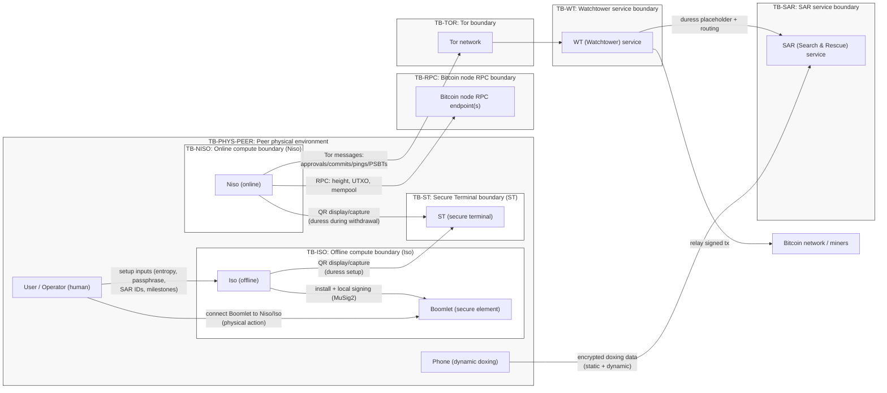
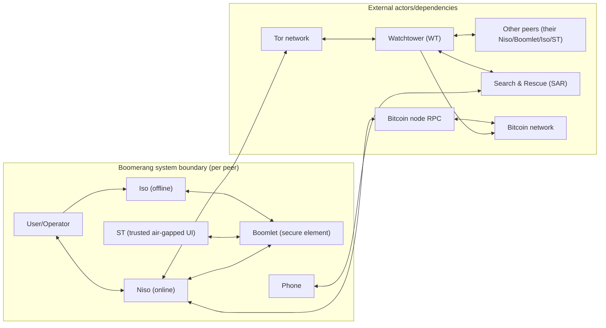
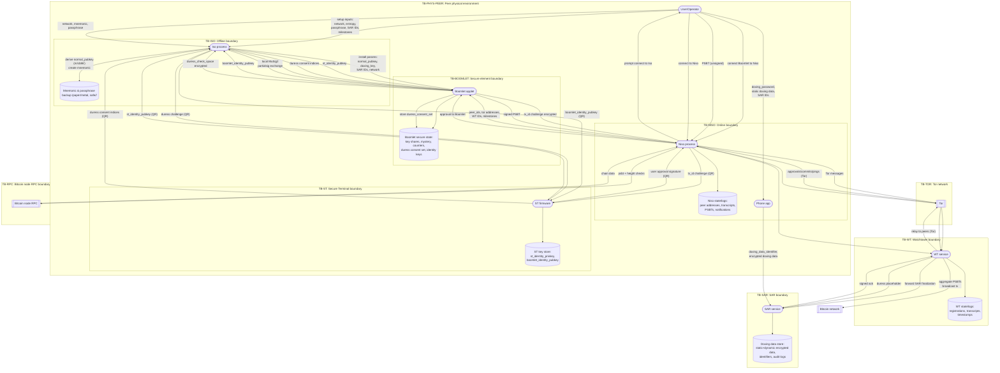
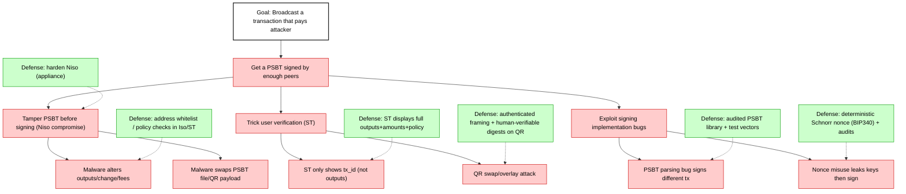
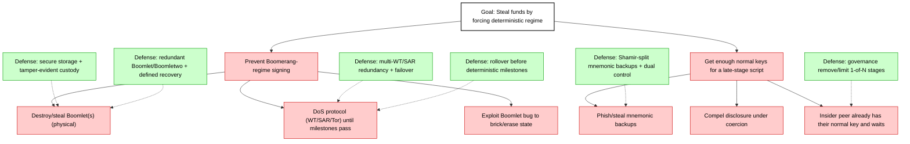
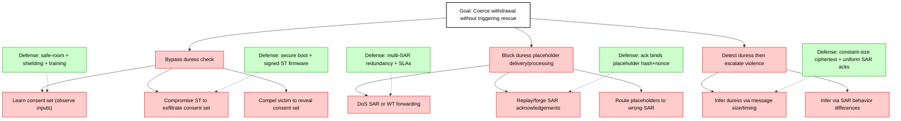
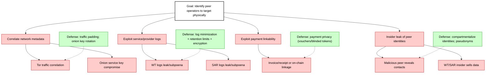
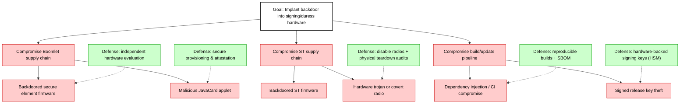

# Boomerang Threat Model

**Comprehensive STRIDE + Systematic Attack Identification + OWASP Design Review + OCTAVE Risk Assessment + NIST SP 800-30r1 Risk Register + CCSS v9 Coverage**  

- **Document date:** 2026-02-26  
- **Scope:** Boomerang Bitcoin cold-storage protocol (setup + withdrawal), including duress protection (ST/SAR/WT), peer ops, and supporting infrastructure.  
- **Design inputs used:** Canonical PlantUML sequence diagrams (setup, withdrawal initiator, withdrawal non-initiator, duress protection) + design/spec markdown + security WIP artifacts (leaked-data + integrity/freshness checks).  
- **Status:** Threat model for a research-stage design; many operational and implementation details are marked **Unknown** where not specified.  

---

## Table of Contents

- [Scope & assumptions](#scope-assumptions)
- [Attacker personas](#attacker-personas)
- [Trust boundaries + Trust Boundary Diagram](#trust-boundaries)
- [Human & Physical Risk](#human-physical-risk)
- [Architecture & data flows](#architecture-data-flows)
- [Systematic attack identification](#systematic-attack-identification)
- [Threat catalog (STRIDE)](#threat-catalog-stride)
- [OWASP design review](#owasp-design-review)
- [OCTAVE risk assessment](#octave-risk-assessment)
- [Risk register (NIST-style)](#risk-register)
- [Attack / attack-defense trees](#attack-trees)
- [Mitigations & roadmap](#mitigations-roadmap)

---

## Scope & assumptions
[Back to Table of Contents](#table-of-contents)

### System summary (what is being threat-modeled)

Boomerang is a Bitcoin cold-storage protocol intended to **raise the cost of coercion (“wrench attacks”)** by making withdrawals **hardware-enforced, bounded-but-unpredictable in time**, and by embedding **plausibly deniable duress signaling** into the standard withdrawal flow.

Core design elements (as specified in the canonical message diagrams and design docs):

- **Taproot descriptor with two spending regimes**
  - **Boomerang regime (probabilistic / coercion-resistant):** Spend becomes possible only after `milestone_block_0` **and** after each peer’s Boomlet reaches a secret internal threshold (`mystery`) through a coordinated “digging game” (ping/pong) that increments a Boomlet counter under strict freshness rules.
  - **Normal regime (deterministic fallback / liveness):** A **waterfall** of timelocked scripts that gradually reduces the required signer threshold over future milestone block heights (e.g., 5-of-5 → 4-of-5 → … → 1-of-5 using **normal keys**).

- **Two-layer signing per peer in the Boomerang regime**
  - Each peer’s on-chain `boom_pubkey_i` is a **MuSig2 aggregate** of:
    - a **normal key** (mnemonic-backed; held/used by `Iso`), and
    - a **Boomlet-held non-exportable key share** (held/used by `Boomlet`).
  - Practical implication: even if an attacker steals a mnemonic, they still cannot sign in the Boomerang regime without the corresponding Boomlet.

- **Duress signaling**
  - Duress checks occur at **commitment** and at randomized intervals during the digging game.
  - `ST` is the **trusted UI** for duress challenges; `Boomlet` is the **trusted evaluator**.
  - A duress “placeholder” is included in messages such that:
    - **no duress:** placeholder decrypts to all-zero padding
    - **duress:** placeholder decrypts to `doxing_key` (or equivalent unlock material) enabling `SAR` to decrypt the user’s encrypted doxing data and initiate rescue procedures.
  - `WT` forwards placeholders to `SAR`; `SAR` returns signed acknowledgements to keep protocol flow consistent and to give Boomlet assurance that SAR received the placeholder.

### In-scope components

Per peer/operator (×5 peers typical in the current design):

- **User / Operator (human)**
- **Iso (offline)**: key derivation & signing environment for normal keys; interacts with Boomlet and ST.
- **Boomlet (secure element)**: holds key share + enforces non-determinism + runs duress logic.
- **Boomletwo (backup secure element)**: backup of Boomlet state *excluding* `mystery` (activation procedure is still under design).
- **ST (Secure Terminal)**: air-gapped, tamper-evident UI for user verification and duress challenges.
- **Niso (online)**: networked coordinator per peer; Tor comms; talks to Bitcoin node RPC; interfaces with WT; mediates QR flows to ST.
- **Phone**: used for SAR registration + encrypted dynamic doxing feed.

External dependencies/services:

- **Bitcoin network / miners** (confirmation, timelocks, reorgs, fee market)
- **Bitcoin node RPC endpoint(s)** used by each peer’s Niso
- **Tor network**
- **WT (Watchtower)**: coordination service + liveness oracle (block height anchoring) + relays signed PSBT/tx
- **SAR (Search & Rescue)**: receives encrypted doxing data; detects duress; initiates physical response

### Out-of-scope (explicit)

These are still security-relevant, but not fully modelable without additional design detail:

- SAR’s real-world response procedures (law enforcement coordination, field ops, use-of-force, etc.)
- Detailed org governance (legal agreements, HR policies, audit regimes)
- Manufacturing processes for Boomlet/ST hardware (we treat as supply-chain risk inputs)
- Wallet UX beyond what’s specified by the protocol messages (e.g., exact address display formats)

### Primary assets

**Custody / value assets**
- **Bitcoin funds** locked by the Boomerang Taproot output (UTXO(s))
- **Transaction authorization correctness** (PSBT contents, destination, amounts, fees)

**Key material & cryptographic assets**
- `mnemonic`, `passphrase`, derived **normal private keys**
- Boomlet-held `boom_musig2_privkey_share` (non-exportable)
- Boomlet identity keypair (signing/encryption)
- ST identity keypair (Boomlet↔ST secure channel)
- Tor onion service secret keys (peer Niso addresses)
- WT and SAR long-term signing/encryption keys

**Duress & safety assets**
- `duress_consent_set` (user-memorized, Boomlet-stored consent pattern)
- `doxing_password` / `doxing_key` and derived `doxing_data_identifier`
- **Static doxing data** (highly sensitive PII) and **dynamic doxing feed** (e.g., location)

**Protocol state assets**
- Per-Boomlet `mystery` (secret threshold) and `counter`
- `boomerang_params` and `boomerang_descriptor`
- Protocol transcripts (approvals, commits, pings, pongs, acknowledgements)
- Milestone schedule (`milestone_block_collection`)

### Security objectives

**Funds protection**
- Prevent unauthorized spending in both regimes.
- Prevent silent transaction tampering (destination/amount changes).
- Ensure recoverability (normal regime) under loss scenarios, while managing the associated risk.

**Coercion resistance**
- Under coercion, reduce attacker’s confidence in *time-to-cashout*.
- Provide **unavoidable and plausibly deniable** duress signaling with minimal observable divergence.
- Maintain a **reaction window** (SAR response) and a deterrent effect.

**Privacy & safety**
- Minimize metadata that could enable targeting of key holders.
- Protect doxing data and duress signals from unauthorized disclosure.
- Resist correlation attacks that deanonymize peers, schedules, or duress events.

**Integrity & liveness**
- Prevent protocol state desynchronization and replay.
- Ensure withdrawal completes when honest peers cooperate and dependencies are available.
- Ensure protocol failures degrade safely (prefer “fail closed” in Boomerang regime).

### High-impact assumptions (explicit)

> Assumptions are treated as **risk drivers**. Where an assumption is strong, risks are rated higher unless mitigated.

- **Boomlet secure element security holds:** keys are non-exportable; PRNG is sound; fault/side-channel resistance is adequate.
- **ST integrity holds:** keys are non-extractable; firmware is not modifiable in the field; UI reflects user intent.
- **Cryptography holds:** Schnorr signatures, MuSig2, ECDH, AEAD are implemented correctly with proper nonce/KDF handling.
- **At least one honest peer exists** who will not collude to bypass Boomerang guarantees.
- **Bitcoin timelocks behave as expected** under standard reorg assumptions; block heights are measured correctly.
- **WT and SAR are non-custodial but security-critical dependencies**: they can affect availability and privacy even if they cannot directly steal funds.

### Key “Unknowns” (must be resolved for production readiness)

- Exact values and selection policy for:
  - `MIN_TRIES_FOR_DIGGING_GAME_IN_BLOCKS`, `MAX_TRIES_FOR_DIGGING_GAME_IN_BLOCKS`
  - `DURESS_CHECK_INTERVAL_IN_BLOCKS`
  - all `TOLERANCE_*` and `REQUIRED_MINIMUM_DISTANCE_*` parameters
- Reorg-handling policy (confirmations required at each stage; chainwork checks)
- WT/SAR redundancy (single vs multi-provider; quorum behavior)
- Cryptographic details: AEAD mode, KDF, transcript binding, serialization formats
- Boomletwo activation/recovery protocol
- Software supply-chain and update mechanisms for Iso/Niso/ST/Boomlet applets
- Monitoring, alerting, and incident response workflows

### Target CCSS level recommendation

Given the threat environment (high-value custody + coercion + external services), Boomerang should be evaluated against **CCSS Level III** targets for:
- key generation and entropy controls,
- key storage and access controls,
- operational governance and risk management,
- auditing/logging/monitoring,
- compromise documentation and response.

This threat model includes a CCSS v9 mapping and a **Now/Next/Later** roadmap to reach that posture.

---

## Attacker personas
[Back to Table of Contents](#table-of-contents)

This section enumerates representative attacker profiles with different resources and motivations. The threat catalog and risk register map to these personas.

### Persona A: External remote attacker (cybercriminal / APT-style remote)

**Goals**
- Steal funds by compromising online components (Niso, WT, SAR, phone) or by inducing operator mistakes.
- Deanonymize peers to enable later coercion/extortion.
- DoS withdrawal to force fallback regimes or extortion.

**Capabilities**
- Malware delivery (phishing, supply-chain, drive-by).
- Network attacks (MITM where possible, Tor traffic correlation attempts, DoS).
- Exploit common web vulnerabilities in WT/SAR infrastructure.
- Chain surveillance and payment linkage analysis.

**Constraints**
- Cannot directly access Boomlet internal keys if secure element holds.
- Must defeat user verification steps (ST/Iso) or exploit implementation flaws.

### Persona B: Malicious insider peer (one of the N peers / colluding subset)

**Goals**
- Steal or redirect funds, either immediately (if they can bypass boomerang regime) or later by waiting out timelocks in the normal regime.
- Force determinism by refusing to cooperate, vandalizing devices, or manipulating processes.
- Exfiltrate metadata or identify other peers for later targeting.

**Capabilities**
- Legitimate access to parts of protocol transcripts and to their own keys/devices.
- Ability to withhold approvals, commits, pings, or signatures.
- Ability to socially engineer or pressure other peers.

**Constraints**
- In boomerang regime the design is intentionally N-of-N; one honest peer can block a malicious subset.
- In later normal regime stages, threshold decreases; insider risk increases materially.

### Persona C: Compromised vendor / dependency (supply-chain attacker)

**Goals**
- Implant backdoors in Boomlet applets, secure element firmware, ST firmware, Iso/Niso build pipeline, or cryptographic libraries.
- Exfiltrate key material, duress consent sets, or allow deterministic withdrawals under coercion.

**Capabilities**
- Pre-positioned malicious code/firmware; covert channels; weakened RNG; selective signing.
- Can subvert integrity assumptions that the protocol relies on.

**Constraints**
- Increased chance of detection if reproducible builds, attestation, audits, and vendor diversity are used.
- Some attacks require physical access for activation or data exfiltration.

### Persona D: Coercion / wrench attacker (kidnapper, extortionist, violent robber)

**Goals**
- Force a peer (or multiple peers) to initiate or continue withdrawal to attacker-controlled destination.
- Prevent or detect duress signaling; keep victim controlled until funds are irreversibly moved.
- Force determinism by destroying Boomlets and waiting out timelocks if they also have compromised normal keys.

**Capabilities**
- Physical surveillance, confinement, intimidation, torture.
- Can observe screens/hands (depending on environment), confiscate devices, compel disclosures.
- Can perform vandalism/destruction of hardware.

**Constraints**
- Boomerang’s intended deterrent is **bounded unpredictability**: the attacker cannot reliably predict how long they must hold victims.
- Duress signaling is designed to be **plausibly deniable** and recurring.
- If the attacker cannot obtain all normal keys and/or cannot keep custody for long, probability of successful theft decreases.

### Persona E: Legal / jurisdictional coercion actor (state actor, court orders, border search)

**Goals**
- Compel SAR/WT cooperation or compel operators to disclose keys or to stop responding.
- Seize devices and attempt forensic extraction.
- Use legal pressure to prevent SAR action or to obtain PII.

**Capabilities**
- Subpoenas, device seizure, compelled decryption (varies by jurisdiction), cross-border powers.
- Long-term surveillance.

**Constraints**
- Jurisdiction-dependent; may be constrained by due process, technical protections, and organizational policies.

### Persona F: Opportunistic thief / “evil maid” (short physical access)

**Goals**
- Steal or swap devices (ST/Boomlet/phone), implant malware on Niso/Iso, capture mnemonics/backups.
- Create latent compromise for future theft.

**Capabilities**
- Brief physical access (hotel room, office, safe deposit, courier).
- May clone seals, replace cables, install keyloggers, etc.

**Constraints**
- Limited time; high value targets may use strong tamper-evident controls.

---

## Trust boundaries + Trust Boundary Diagram
[Back to Table of Contents](#table-of-contents)

Boomerang’s security hinges on explicit separation between **offline vs online**, **human vs device**, and **local vs external services**. Below are the trust boundaries used throughout the DFD, threat catalog, and risk register.

### Trust boundary list

| Boundary ID | Boundary type | Name | What it separates | Why it exists / security meaning |
|---|---|---|---|---|
| TB-PHYS-PEER | Physical | Peer physical environment | Operator + devices vs. outside world | Threats: theft, coercion, observation, device swap, unsafe travel |
| TB-ISO | Physical/Process | Offline compute boundary (Iso) | Air-gapped Iso execution vs. any networked environment | Protect normal keys; reduce malware risk during signing |
| TB-BOOMLET | Device/Process | Secure element boundary (Boomlet) | Secure element internal state vs. host computers (Iso/Niso) | Protect non-exportable key share; enforce non-determinism and duress logic |
| TB-ST | Device/Process | Secure Terminal boundary (ST) | Trusted UI + ST key store vs. outside world | Prevent Niso/attacker from manipulating duress input or user verification |
| TB-NISO | Host/OS | Online compute boundary (Niso) | Networked OS + apps vs. external networks | High malware exposure; treated as untrusted for duress integrity |
| TB-QR | Optical channel | QR air-gap channel | Offline/air-gapped comms (Iso/ST/Boomlet) vs. mediators (Niso displays/cameras) | Prevent direct electronic exfil; introduces parsing and swapping risks |
| TB-OOB | Process/Identity | Out-of-band peer coordination | Human secure channel vs. attacker-controlled communications | Peer identity and parameters must be verified across channels |
| TB-TOR | Network | Tor boundary | Peer onion services vs public Internet | Provides anonymity; susceptible to correlation/DoS/endpoint compromise |
| TB-RPC | Network | Bitcoin node RPC boundary | Niso vs Bitcoin node(s) | Block height and chain state are security-critical for freshness/timelocks |
| TB-WT | Org/Cloud | Watchtower service boundary | WT infrastructure/keys/logs vs. peers | Non-custodial but central for liveness, metadata, and transcript routing |
| TB-SAR | Org/Cloud/Jurisdiction | SAR service boundary | SAR infrastructure/keys/operators vs. peers | Handles PII and physical response; subject to legal and insider risks |
| TB-JURIS | Jurisdictional | Cross-jurisdiction boundary | Operators/W T/SAR across legal regimes | Compelled disclosure, censorship, or forced inaction can occur |

### Cross-boundary flows (high level)

These flows are referenced in the DFD and threat catalog:

- **F-QR-1:** Boomlet ↔ ST key exchange material and duress challenges/answers via QR (crosses TB-BOOMLET↔TB-QR↔TB-ST; often mediated by Iso/Niso displays).
- **F-USB-1:** Boomlet ↔ Iso during setup and during final signing (crosses TB-BOOMLET↔TB-ISO).
- **F-USB-2:** Boomlet ↔ Niso during online phases (crosses TB-BOOMLET↔TB-NISO).
- **F-NET-1:** Niso ↔ WT via Tor (crosses TB-NISO↔TB-TOR↔TB-WT).
- **F-NET-2:** WT ↔ SAR (crosses TB-WT↔TB-SAR; may be Internet-based and jurisdiction-dependent).
- **F-NET-3:** Phone ↔ SAR (crosses TB-PHYS-PEER↔Internet↔TB-SAR).
- **F-RPC-1:** Niso ↔ Bitcoin node RPC (crosses TB-NISO↔TB-RPC).
- **F-OOB-1:** User ↔ other peers (peer IDs, Tor addresses, WT IDs, milestones) via secure out-of-band channels (crosses TB-OOB).

### Trust Boundary Diagram

**Interpretation:**  
- Boomerang’s strongest intended security properties depend on TB-BOOMLET and TB-ST holding.  
- Boomerang’s strongest intended availability properties depend on TB-WT and TB-RPC behaving correctly (or having redundancy/failover).  
- Coercion resistance is fundamentally a **human + physical** problem; the technical protocol mainly shapes incentives and time.

---

## Human & Physical Risk
[Back to Table of Contents](#table-of-contents)

Boomerang is explicitly designed for a world where **physical coercion is realistic**. This section treats humans, facilities, and operational behaviors as first-class assets and attack surfaces.

### Human/physical threat scenarios (minimum set)

| Scenario | Trust boundaries involved | Primary assets at risk | What can go wrong | Candidate mitigations (design + ops) |
|---|---|---|---|---|
| **Coercion/wrench attack** on one peer during withdrawal | TB-PHYS-PEER, TB-ST, TB-BOOMLET | Funds, user safety, duress secrecy | Attacker forces approvals/continuation; tries to detect/bypass duress; holds victim until completion | Boomerang non-determinism; duress checks via ST; SAR response; safe-room procedures; training; decoy narratives; “never withdraw alone” rule |
| **Coercion on multiple peers** (kidnapping/round-up) | TB-PHYS-PEER across multiple sites | Funds, safety | Attacker attempts to capture multiple peers simultaneously to satisfy N-of-N | Geographic dispersion; time-zone dispersion; secrecy of peer identities; travel OPSEC; rapid alerting; decoy peers |
| **Insider collusion** among peers | TB-OOB, TB-PHYS-PEER | Funds, governance integrity | Colluding peers wait out waterfall timelocks; or coordinate coercion | Legal agreements; choose milestones to make late-stage far future; remove 1-of-N for high assurance; monitoring and alerts |
| **Social engineering** (phishing, fake ceremonies, fake peers, fake WT/SAR) | TB-OOB, TB-PHYS-PEER | Normal keys, peer set integrity, privacy | Attacker inserts themselves as peer; steals mnemonics; reroutes Tor addresses; tricks SAR enrollment | In-person verification; multi-channel fingerprint checks; pinned keys; training; anti-phishing playbooks |
| **Credential theft** (mnemonic/passphrase, device PINs) | TB-PHYS-PEER, TB-ISO | Normal keys | Offline theft enables later deterministic theft; coercer forces disclosure | Strong passphrases; split backups (Shamir); secure storage; no single-person access; duress narratives |
| **Process non-compliance** (missed rollover, skipped checks) | TB-PHYS-PEER, TB-OOB | Funds, coercion resistance | Users allow protocol to enter deterministic regime; late-stage scripts enable theft | Mandatory rollover schedule; automated reminders; rehearsals; “two-person rule” for any withdrawal |
| **Operator error** (wrong milestones, wrong outputs, wrong network) | TB-PHYS-PEER, TB-ISO, TB-ST | Funds | Setup produces wrong descriptor; withdrawal signs wrong tx | Strict checklists; ST shows full outputs; testnet rehearsals; sanity checks & invariants in Iso |
| **Travel/commute risk** (surveillance, ambush) | TB-PHYS-PEER | Safety | Attacker identifies peer movements; targets at vulnerable moments | Vary routines; secure transport; avoid advertising role; compartmentalize identities; personal security |
| **Site access failures** (unauthorized entry to storage areas) | TB-PHYS-PEER | Devices, backups | Evil-maid installs implants/swaps devices; steals backups | Access control, alarms, cameras; tamper seals; inventory; dual control |
| **Device theft/tampering** (ST/Boomlet/phone seized) | TB-PHYS-PEER, TB-BOOMLET, TB-ST | Duress & keys | Attacker extracts keys, learns consent set, or triggers forced determinism | Certified SE; tamper resistance; Faraday storage; spare devices; incident response |
| **Environmental threats** (fire/flood/power/EMP) | TB-PHYS-PEER | Devices/backups | Loss triggers forced determinism or permanent loss | Geo-redundant storage; fireproof safes; Faraday bags; periodic health checks |
| **Jurisdictional/legal coercion** (SAR compelled, border searches) | TB-JURIS, TB-SAR | PII, safety | SAR forced to reveal data or to delay action; operator compelled disclosure | Multi-jurisdiction SAR; minimize PII; legal counsel; documented policies; transparency |

### Duress mechanism assumptions: risk focus

The duress mechanism assumes:
- the attacker cannot simultaneously observe **the ST screen** and **the user’s hand/inputs** well enough to learn the consent set over time,
- the ST is not compromised and does not leak consent-set material,
- repeated checks during withdrawal meaningfully increase attacker uncertainty.

**Risk:** Many real coercion scenarios include cameras, multiple attackers, or controlled environments. Therefore, **operational procedures** (safe room, shielding, anti-surveillance) are as important as cryptography.

### Highest-risk human/physical goal: steal funds via coercion
Attack-defense tree (coercion always included)

```mermaid
flowchart TD
  A["Goal: Steal Boomerang funds via coercion"] --> B["Capture at least one peer"]
  A --> C["Obtain ability to spend"]
  B --> B1["Surveil/identify peer (deanonymize)"]
  B --> B2["Physical attack/kidnap"]
  B --> B3["Force access to devices"]
  C --> C1["Force Boomerang-regime spend (requires N peers + Boomlets)"]
  C --> C2["Force determinism then spend via normal keys"]
  C --> C3["Steal keys via device compromise"]

  %% Boomerang-regime path
  C1 --> C1a["Capture all N peers concurrently"]
  C1 --> C1b["Bypass Boomlet mystery/digging game"]
  C1 --> C1c["Suppress duress signaling"]

  %% Determinism path
  C2 --> C2a["Destroy/steal Boomlet(s) to block Boomerang signing"]
  C2 --> C2b["Wait for milestone(s) enabling normal scripts"]
  C2 --> C2c["Possess enough normal keys at that stage"]

  %% Defenses
  D1["Defense: peer anonymity + OPSEC"] -.-> B1
  D2["Defense: geographic/time dispersion"] -.-> C1a
  D3["Defense: N-of-N in Boomerang regime"] -.-> C1
  D4["Defense: Boomlet non-exportable key share"] -.-> C3
  D5["Defense: digging game unpredictability"] -.-> C1b
  D6["Defense: ST duress checks + SAR response"] -.-> C1c
  D7["Defense: strong normal key custody (Shamir, dual control)"] -.-> C2c
  D8["Defense: rollover before deterministic milestones"] -.-> C2b
  D9["Defense: tamper-evident storage & incident response"] -.-> C2a
```

### Operational hardening checklist (human/physical)

**People**
- Separate duties: no single operator can execute a full withdrawal alone.
- Regular coercion drills (what to do when captured; how to use duress UI safely).
- Strict OPSEC: minimize who knows peer identities; minimize public footprints.

**Facilities**
- Use secure, access-controlled environments for all ceremonies.
- Maintain tamper-evident seals + inspection logs for ST and Boomlets.
- Geo-redundant storage for Boomlet, Boomletwo, and mnemonic shares.

**Travel**
- Avoid predictable patterns; avoid advertising travel or role.
- Use secure transport for devices; consider “device separation” (ST never co-travels with Boomlet).

**Incident response**
- Pre-define “device stolen” and “coercion suspected” playbooks.
- Have a rapid plan to **move funds** (if possible) before deterministic milestones enable theft.

---

## Architecture & data flows
[Back to Table of Contents](#table-of-contents)

This section translates the design message diagrams into **diagram-first** architectural views: a context diagram (L0) and a DFD (L1), both with explicit trust boundaries.

### Context diagram (L0)

### Data flow diagram (L1) with trust boundaries

Legend:
- **Processes**: rounded rectangles
- **Data stores**: cylinders
- **External entities**: rectangles
- **Trust boundaries**: shown as subgraphs (named)

### Data classification

| Data | Classification | Notes |
|---|---|---|
| Mnemonic, passphrase, normal private keys | **Critical secret** | Compromise enables deterministic theft later; must be split and protected |
| Boomlet key shares + identity private key | **Critical secret** | Compromise breaks Boomerang regime, privacy, and duress |
| Duress consent set | **Critical secret** | If learned, coercer can bypass duress mechanism |
| Doxing data (static + dynamic) | **Highly sensitive PII** | Compromise enables targeting and harm |
| Doxing key / identifier | **Sensitive secret / metadata** | Password-derived; must resist brute-force |
| Boomerang descriptor, peer IDs | **Sensitive configuration** | Key substitution here is catastrophic |
| Protocol transcripts (approvals/commits/pings) | **Sensitive metadata** | Linkability and timing can enable targeting |
| Signed PSBTs / tx | **Public after broadcast** | Prior to broadcast still sensitive (front-running, privacy) |

### Protocol parameter surface

The design defines (at minimum) the following parameter families:

- Non-determinism window:
  - `MIN_TRIES_FOR_DIGGING_GAME_IN_BLOCKS`
  - `MAX_TRIES_FOR_DIGGING_GAME_IN_BLOCKS`

- Duress check cadence:
  - `DURESS_CHECK_INTERVAL_IN_BLOCKS`

- Freshness/tolerance windows (examples):
  - `TOLERANCE_IN_BLOCKS_FROM_TX_APPROVAL_BY_INITIATOR_PEER_TO_TX_APPROVAL_BY_WT`
  - `TOLERANCE_IN_BLOCKS_FROM_CREATING_PING_TO_RECEIVING_ALL_PINGS_BY_WT_AND_HAVING_SAR_RESPONSE_BACK_TO_WT`
  - `REQUIRED_MINIMUM_DISTANCE_IN_BLOCKS_BETWEEN_PING_AND_PONG`
  - …and several more `TOLERANCE_*` / `REQUIRED_MINIMUM_DISTANCE_*` constraints

**Threat modeling implication:** These parameters define the adversary’s feasible delay/replay windows and directly affect coercion cost, false positives, and liveness. Treat parameter selection as a governed security decision with testing and monitoring.

---

## Systematic attack identification
[Back to Table of Contents](#table-of-contents)

This section provides a methodical “attack pattern checklist” spanning **cyber, cryptographic, supply-chain, insider, and physical/coercion** attack classes. It is intended to prevent blind spots and to support traceability:

- Each row maps to **Threat IDs** (STRIDE catalog) and **Risk IDs** (risk register).
- Use this checklist during design reviews, implementation reviews, tabletop exercises, and red-team planning.

### Attack Pattern Checklist

| Attack Pattern                                                                                           | Applicable components/flows/stores/boundaries                                     | Likely impact                                                                         | Candidate mitigations                                                                                                                               | Mapped Threat IDs/Risk IDs             |
|:---------------------------------------------------------------------------------------------------------|:----------------------------------------------------------------------------------|:--------------------------------------------------------------------------------------|:----------------------------------------------------------------------------------------------------------------------------------------------------|:---------------------------------------|
| Supply chain compromise of secure element / JavaCard applet (malicious firmware/applet, backdoored RNG)  | Boomlet (TB-BOOMLET), Boomletwo; installation flows (Iso↔Boomlet)                 | Key extraction, predictable mystery/PRNG, duress bypass, theft of funds, false duress | Vendor due diligence; attestation; reproducible builds; independent labs; diversified hardware; secure provisioning; tamper-evident packaging       | T-SE-01, T-SC-01 / R-01, R-24          |
| Supply chain compromise of ST (firmware backdoor, exfil via covert channels)                             | ST (TB-ST), ST key store; QR flows                                                | Consent-set compromise; duress manipulation; user approval spoofing                   | Secure boot; signed firmware; disable radios; tamper seals; reproducible builds; independent device audits                                          | T-ST-01 / R-02, R-24                   |
| Device substitution (evil-maid swap) of Boomlet/ST/Iso/Niso                                              | Physical boundary TB-PHYS-PEER; USB/QR flows                                           | Key theft, message forgery, duress bypass, funds loss                                 | Inventory+seals; attestation; challenge-response identity checks; controlled ceremonies                                                             | T-PHYS-02 / R-19                       |
| Niso malware alters PSBT outputs (address substitution) while preserving tx_id expectation               | User→Niso PSBT input; Niso state; ST tx_id verification flow                      | Funds sent to attacker address; if user fails to verify tx_id/outputs                 | ST display full outputs and amounts, not just tx_id; address whitelisting; PSBT canonicalization; independent PSBT creation on offline host         | T-NISO-01, T-TAMP-02 / R-08            |
| Niso malware performs Tor MITM / traffic fingerprinting / onion key theft                                | Niso↔Tor boundary TB-TOR; peer_0_tor_secret_key                                   | Deanonymization; protocol disruption; MITM                                            | Harden Niso; isolate Tor keys in Boomlet or TPM; rotate onion keys; traffic padding                                                                 | T-PRIV-01, T-NET-04 / R-16             |
| Iso compromise (should be offline) via removable media during setup/withdrawal signing                   | Iso offline boundary TB-ISO; mnemonic/passphrase; PSBT signing                    | Normal key theft; forged signatures; funds theft                                      | True air-gap; ephemeral OS; deterministic builds; no network hardware; malware scanning of media; two-person integrity                              | T-ISO-01 / R-15, R-24                  |
| WT equivocation (sends different views/collections to different peers)                                   | WT boundary TB-WT; collections of approvals/commits/pings                         | State desync, liveness failure, coercion window reduction if peers confused           | Peers sign and cross-verify collections; transcript hashes; WT transparency log; multi-WT quorum                                                    | T-WT-02 / R-05, R-25                   |
| DoS on WT or SAR (network, application, legal pressure)                                                  | WT/SAR services; Tor network                                                      | Withdrawal unavailable; duress acknowledgement blocked                                | Redundancy; failover; rate limiting; alternative channels; SLAs                                                                                     | T-DOS-01, T-DOS-02 / R-13, R-22        |
| Bitcoin node RPC lies / eclipse attack; false block heights; reorg exploitation                          | Niso↔Bitcoin node boundary TB-RPC; WT height oracle                               | Premature milestone checks; counter manipulation; protocol desync                     | Multiple nodes; header+chainwork validation; compare WT vs node; anti-eclipse                                                                       | T-BTC-01, T-NET-01 / R-09              |
| Replay or delayed delivery of signed messages across Tor                                                 | All Tor flows; approvals/commits/pings; nonce fields                              | State confusion; potential counter acceleration/stall                                 | Strict nonce/seq checks; freshness windows; unique message IDs; caching                                                                             | T-REPLAY-01 / R-10, R-25               |
| Wrench attack: coercer captures one or more peers and forces withdrawal                                  | Human boundary TB-PHYS-PEER; ST duress input; all devices                             | Fund theft attempt; user harm; duress signal; forced determinism                      | Boomerang non-determinism; duress signal to SAR; operational OPSEC; safe rooms; split knowledge; travel security                                    | T-HUM-01, T-PHYS-01 / R-03, R-12, R-22 |
| Insider collusion among peers to wait out waterfall timelocks                                            | Out-of-band peer coordination boundary TB-OOB                                                   | Funds theft in deterministic stages                                                   | Governance agreements; remove 1-of-N; destination restrictions; monitoring                                                                          | T-INS-01 / R-04                        |
| Social engineering/phishing to steal mnemonic/passphrase or to enroll attacker as 'peer'                 | User; OOB channels; setup verification                                            | Normal key compromise; descriptor substitution                                        | In-person ceremonies; training; hardware wallets for normal keys; ST-based verification of peers; anti-phishing                                     | T-OOB-01, T-HUM-02 / R-17              |
| Legal/jurisdictional coercion of SAR or operators                                                        | Jurisdiction boundary TB-JURIS; SAR operations                                    | PII disclosure; forced inaction; compelled assistance                                 | Multi-jurisdiction SAR; minimization; legal counsel; transparency reports; encryption                                                               | T-LEGAL-01 / R-06                      |
| Malicious QR payload triggers parser vulnerability (buffer overflow) on ST or Niso                       | QR channel; ST firmware; Niso software                                            | Code execution; key theft; protocol manipulation                                      | Safe parsing libs; fuzzing; strict limits; sandboxing                                                                                               | T-PARSE-01 / R-11                      |
| QR swapping/overlay attack (physical) to trick ST into scanning different challenge or tx_id             | Physical boundary; QR displays on Iso/Niso                                        | User approves wrong tx; duress bypass                                                 | Display human-verifiable hashes on both ends; secure environment; camera verification; tamper-resistant display                                     | T-QR-02 / R-11, R-19                   |
| ECDH key reuse without AEAD or proper KDF leads to ciphertext malleability or key recovery               | Boomlet↔ST, Boomlet↔WT, Boomlet↔SAR encryption                                    | Message tampering; duress placeholder distinguishability; key leakage                 | HKDF + domain separation; AEAD (AES-GCM/ChaCha20-Poly1305); unique nonces; transcript binding                                                       | T-CRYPTO-01 / R-14                     |
| Weak doxing_password => brute-force doxing_key and decrypt PII                                           | SAR data store; phone dynamic feed                                                | PII compromise; targeting                                                             | Argon2id+salt; enforce passphrase; optional hardware secret                                                                                         | T-CRYPTO-03 / R-07                     |
| Side-channel attack (power/EM/timing) on Boomlet during signing or PRNG use                              | Boomlet (TB-BOOMLET); signing flow Iso↔Boomlet                                    | Key share leakage; mystery leakage; PRNG prediction                                   | Certified secure element; constant-time code; side-channel resistant implementation; shielding; limit signing frequency; lab testing                | T-SE-03 / R-01                         |
| Fault injection / glitching Boomlet to skip checks (freshness, duress eval, counter rules)               | Boomlet; ping/commit checks                                                       | Bypass non-determinism; suppress duress; sign early                                   | Fault-resistant SE; redundant checks; control-flow integrity; counters in secure NV storage; tamper response                                        | T-SE-04 / R-01, R-25                   |
| Compromise of peer normal key mnemonic (phishing, theft, insecure backup)                                | Mnemonic backups; Iso inputs; physical safes                                      | Funds theft in deterministic regime; blackmail                                        | Shamir/SSS for backups; split storage; hardware wallet for normal key; strong passphrase; access controls                                           | T-KEY-01 / R-03, R-15                  |
| Passphrase capture (shoulder surf, coercion, keylogger) reduces mnemonic security                        | Iso; user handling                                                                | Normal key compromise                                                                 | Long passphrase; never type on networked devices; ST-assisted entry; two-person policy; memory-only                                                 | T-HUM-02 / R-15                        |
| Compromise of phone; dynamic doxing data spoofing or leakage                                             | Phone boundary; phone↔SAR channel                                                 | Misleading SAR; privacy loss; attacker tracking                                       | Harden phone; use dedicated device; minimal apps; OS updates; secure enclave; frequent key rotation; include integrity/auth on feed                 | T-PHONE-01 / R-06, R-20                |
| SAR database breach (static doxing data ciphertext, identifiers, metadata)                               | SAR data store                                                                    | PII leak; targeting; offline cracking                                                 | Encrypt-at-rest with HSM; minimize fields; split storage; access controls; breach response                                                          | T-SAR-02 / R-06, R-07                  |
| WT database breach (peer IDs, Tor addresses, fingerprints, timestamps)                                   | WT data store                                                                     | Deanonymization; targeting; protocol disruption                                       | Minimize retention; encrypt; pseudonyms; rotate Tor addresses; security audits                                                                      | T-WT-03 / R-05, R-20                   |
| WT bribery / insider leak: exposes which peers are participating and their schedules                     | WT org boundary; human boundary                                                   | Targeting for coercion                                                                | Strong governance; background checks; least privilege; transparency reports                                                                         | T-WT-04 / R-16, R-20                   |
| Peer DoS / non-cooperation to force determinism or extort others                                         | Peer boundary; withdrawal protocol                                                | Forced determinism; delayed withdrawal; extortion                                     | Legal agreements; penalties; monitoring; choose parameters; consider threshold variants with anti-collusion proofs                                  | T-INS-02, T-FD-02 / R-03, R-04         |
| Manipulate milestone_block schedule (malicious suggestion, typo) leading to early deterministic regime   | Setup: user inputs milestone_block_collection; boomerang_params_seed verification | Reduced coercion resistance; early theft window                                       | Compute milestones from policy; require multi-operator verification; ST displays absolute dates; sanity checks                                      | T-OPS-02 / R-15                        |
| Time confusion / timezone mistakes in interpreting milestones and rollover deadlines                     | Human processes; Niso notifications                                               | Missed rollover; determinism forced                                                   | Use block-height only; calendar aids; multiple reminders; runbooks                                                                                  | T-HUM-03 / R-15                        |
| Protocol downgrade to deterministic regime intentionally by attacker (destroy boomlets, isolate peers)   | Physical + network                                                                | Loss of coercion protection; eventual theft                                           | Redundant boomlets; rapid incident response; move funds before milestones; monitoring                                                               | T-FD-01 / R-03                         |
| Compromised peer Niso forges messages to WT as if from Boomlet (if Boomlet identity key stolen)          | Boomlet identity keys; Niso↔WT flows                                              | Protocol manipulation; false commits/pings; possibly accelerate                       | Keep identity keys in Boomlet only; use secure channels; include device attestation; rate limits                                                    | T-SPOOF-03 / R-01, R-08                |
| Signature malleability / wrong sighash in PSBT leading to signing different transaction than intended    | PSBT creation; Iso/Boomlet signing; ST verification                               | Funds theft or stuck funds                                                            | Strict PSBT parsing; show outputs/amounts; lock sighash; test vectors                                                                               | T-BTC-02 / R-14, R-15                  |
| Reorg near milestone or during withdrawal leads to inconsistent block-height/freshness decisions         | Bitcoin chain; WT and Niso height sources                                         | Stall or premature counter increments; inconsistent state                             | Use confirmations; require stable height; incorporate chainwork; handle reorg explicitly                                                            | T-BTC-03 / R-09, R-25                  |
| WT or peers manipulate tolerance windows to accelerate counter (e.g., send crafted last_seen_block)      | Ping messages; counter increment conditions                                       | Reduced unpredictability; speed-up withdrawal under coercion                          | Conservative rules in Boomlet; monotonic constraints; include signed evidence; formal analysis                                                      | T-PROT-03 / R-25                       |
| State rollback attack on Boomlet (power loss, reset) to repeat nonces or reuse states                    | Boomlet NV storage; counters; nonces                                              | Nonce reuse => key compromise; protocol desync                                        | Monotonic counters in secure NV; anti-rollback; ensure nonce randomness; store transcript hash                                                      | T-SE-05 / R-01, R-14                   |
| Compromise of RNG in Boomlet or ST causing predictable nonces/mystery/duress intervals                   | Boomlet PRNG; ST keygen                                                           | Predictable withdrawal duration; key compromise                                       | Hardware RNG validation; health tests; DRBG per NIST SP 800-90A; entropy mixing                                                                     | T-CRYPTO-04 / R-01, R-14               |
| Coercion attacker uses surveillance to learn duress consent set over time                                | Human; ST UI interactions                                                         | Duress bypass; reduced deterrence                                                     | Never perform duress checks under observation; safe-room; rotate consent set periodically; multi-factor duress patterns                             | T-HUM-01 / R-12                        |
| Attacker compels user to reveal doxing_password/doxing_key to prevent rescue                             | Human; phone; SAR                                                                 | Rescue defeat; PII misuse                                                             | Split doxing secret; store part in Boomlet; SAR requires additional factor; keep doxing_password unknown to user after setup (dangerous) - research | T-DURESS-04 / R-22                     |
| Compromise of WT signing key allows forging receipts/acks and tricking peers                             | WT key management                                                                 | Protocol integrity; possibly spoof SAR ack suffixing                                  | HSM for WT keys; rotation; transparency; key pinning                                                                                                | T-WT-05 / R-05                         |
| Compromise of SAR signing key allows forging acknowledgements (hiding duress failure)                    | SAR key management                                                                | User safety; false assurance                                                          | HSM; rotation; multi-sig for SAR responses; audit logs                                                                                              | T-SAR-03 / R-06, R-22                  |
| Privacy attack via payment channels (invoice/receipt reuse, on-chain analysis)                           | WT fee payment; Bitcoin network                                                   | Link peers to Boomerang participation; targeting                                      | Use privacy-preserving payments; avoid address reuse; use Lightning with privacy; vouchers                                                          | T-FIN-01 / R-23                        |
| Environmental disaster (fire/flood/power) destroys devices and backups                                   | Physical storage; safes                                                           | Forced determinism; loss of keys; loss of funds                                       | Geographic redundancy; fireproof safes; offsite backups; insurance; tested recovery                                                                 | T-ENV-01 / R-15                        |
| EMP / magnetic event damages electronics (Boomlets, ST, Iso drives)                                      | Physical                                                                          | Forced determinism; liveness loss                                                     | Faraday storage; redundant devices; periodic health checks; fallback scripts                                                                        | T-ENV-02 / R-15                        |
| Unauthorized code execution on WT/SAR via common web vulnerabilities                                     | WT/SAR cloud boundary                                                             | DoS; metadata leaks; key compromise if keys online                                    | OWASP ASVS; hardened infra; WAF; patching; least privilege; secrets mgmt                                                                            | T-WEB-01 / R-05, R-06                  |
| Insider at SAR abuses *during a valid duress event* (exfiltrates decrypted PII, mishandles/forgets escalation) or causes DoS by refusing/delaying response *(without duress, SAR cannot decrypt and cannot meaningfully initiate rescue)* | T-SAR-04 / R-06 |
| Consensus-layer attacks or high-fee mempool conditions delay broadcast, extending coercion window        | Bitcoin network                                                                   | Availability; user safety                                                             | Fee bumping strategies (RBF/CPFP); mempool monitoring; pre-planned fee reserves                                                                     | T-BTC-04 / R-13                        |
| USB/HID injection (bad USB) to Iso/Niso during Boomlet connection                                        | Physical boundary; USB connection Iso↔Boomlet, Niso↔Boomlet                       | Malware infection; command injection; altered messages                                | USB data diodes; disable HID; allow-list USB classes; dedicated hardware; inspect cables                                                            | T-PHYS-03 / R-19, R-15                 |
| Key derivation path confusion/implementation mismatch leads to wrong normal_pubkey and loss of funds     | Iso key derivation; purpose_root_xpriv path m/cb86'                               | Funds unrecoverable; incorrect keys in descriptor                                     | Test vectors; strict spec; cross-implementation checks; display derived xpub fingerprint                                                            | T-PROT-04 / R-15                       |
| Tamper-evident seal cloning or replacement to hide ST/Boomlet compromise                                 | Physical boundary; seals                                                          | Undetected hardware compromise                                                        | Unique serial seals; multi-layer seals; photographic records; periodic inspections; use enclosures with tamper sensors                              | T-PHYS-04 / R-02, R-19                 |
| WT Sybil / collusion if multiple WTs used but controlled by one adversary                                | WT selection governance                                                           | False sense of redundancy; censorship/metadata                                        | Diversity of providers; independent governance; audits; verify AS/jurisdiction diversity                                                            | T-WT-06 / R-05                         |
| SAR 'duress placeholder' distinguishability via ciphertext length/timing or response differences         | WT↔SAR channel; SAR processing                                                    | Attacker infers duress occurred; escalates violence                                   | Constant-size ciphertext; constant-time SAR response; uniform acknowledgements; delay equalization                                                  | T-DURESS-05 / R-12, R-06               |
| Boomlet memory exhaustion / state corruption via malformed or oversized messages (DoS at secure element) | Boomlet message parsing; Tor inputs                                               | Withdrawal stall; forced determinism                                                  | Strict size limits; robust parsing; watchdog resets with anti-rollback; input validation                                                            | T-SE-06 / R-25, R-13                   |
| Phishing user into registering wrong SAR(s) or revealing SAR association                                 | Phone setup; SAR IDs selection                                                    | Duress compromised; PII leak                                                          | Pinned SAR public keys; signed SAR directory; in-person verification; redundancy                                                                    | T-SAR-05 / R-06                        |
| WT forwards duress placeholders to wrong SAR (routing error or malicious)                                | WT routing; sar_ids_collection                                                    | Duress not delivered; PII leak                                                        | Boomlet signs SAR IDs; WT verifies; SAR ack bound to identifier; multi-SAR checks                                                                   | T-WT-07 / R-22                         |
| Key compromise documentation/runbooks missing => slow response to theft/coercion                         | Operations                                                                        | Increased loss; delayed rescue; reputational harm                                     | Incident response plan; drills; defined contacts; automated alerts                                                                                  | T-OPS-03 / R-15                        |
| Operator travel/commute surveillance to identify and ambush key holders                                  | Human physical boundary                                                           | Coercion attack; theft                                                                | OPSEC training; varying routines; secure transport; decoy devices; bodyguards for high value                                                        | T-HUM-05 / R-12, R-16                  |
| Compromised peer leaks other peers’ identities (insider threat) enabling targeted coercion               | Governance/human boundary                                                         | Physical attacks; extortion                                                           | Need-to-know; pseudonymous peer identities; legal agreements; compartmentalize contact lists                                                        | T-INS-03 / R-16                        |
| Mempool / fee market manipulation to force long confirmation times (increasing exposure)                 | Bitcoin network                                                                   | Longer coercion window; denial of withdrawal                                          | Fee management; CPFP/RBF; multiple broadcast nodes; pre-fund fee reserves                                                                           | T-BTC-05 / R-13                        |

---

## Threat catalog (STRIDE)
[Back to Table of Contents](#table-of-contents)

This catalog enumerates threats using the STRIDE lens and maps each to the relevant DFD element/flow and to the risk register where applicable.

**ID conventions**
- `T-SPOOF-*` → Spoofing / identity binding failures
- `T-TAMP-*` → Tampering / integrity failures
- `T-REP-*` → Repudiation / dispute & audit failures
- `T-INFO-*` / `T-PRIV-*` → Information disclosure / privacy failures
- `T-DOS-*` → Denial of service / liveness failures
- `T-EOP-*` → Elevation of privilege / unauthorized capability escalation
- `T-CRYPTO-*`, `T-BTC-*`, `T-SE-*`, `T-DURESS-*`, etc. → domain-specific threats mapped to STRIDE categories as relevant

### STRIDE Threat Table

| Threat ID     | STRIDE   | Element/Flow                                                       | Threat scenario                                                                                                                                  | Impact                                                                                                  | Key mitigations                                                                                                                                             | Mapped Risk IDs   |
|:--------------|:---------|:-------------------------------------------------------------------|:-------------------------------------------------------------------------------------------------------------------------------------------------|:--------------------------------------------------------------------------------------------------------|:------------------------------------------------------------------------------------------------------------------------------------------------------------|:------------------|
| T-BACK-01     | E        | Boomletwo activation ceremony (unknown design)                     | Poorly designed activation allows attacker to activate backup without proper controls, or allows double-spend-like concurrent signing.           | Protocol integrity; potential theft or forced determinism.                                              | Define activation protocol with peer approvals and revocation; one-active-device invariant; logs; attestation.                                              | R-18              |
| T-BTC-01      | S/T      | Block-height freshness and milestone checks                        | Eclipse or reorg causes inconsistent heights; attacker manipulates chain view to affect counter/approval checks.                                 | State desync; DoS; potential counter manipulation.                                                      | Multiple nodes; confirmations; chainwork checks; explicit reorg handling; compare with WT & peers.                                                          | R-09,R-25         |
| T-BTC-02      | T        | PSBT hydration/aggregation                                         | WT aggregates signed PSBTs incorrectly or maliciously; or peers sign with wrong sighash type.                                                    | Invalid tx; stuck funds; or theft if wrong tx signed.                                                   | Independent validation of final tx by peers; deterministic PSBT checks; enforce sighash; use well-tested libraries.                                         | R-14,R-15         |
| T-BTC-03      | D        | UTXO management and change outputs                                 | Change output handling mistakes leak privacy or send change to attacker-controlled address.                                                      | Funds loss or deanonymization.                                                                          | Address whitelisting; deterministic change policies; ST shows full outputs.                                                                                 | R-15,R-08         |
| T-CONF-01     | T        | Confused deputy via Niso mediating QR                              | Niso displays QR from attacker that ST signs; Boomlet misattributes signature to user intent.                                                    | Approval bypass; tampering.                                                                             | Content binding and display of human-verifiable digest; ST shows origin ID; strict nonce checks.                                                            | R-11,R-08         |
| T-CRYPTO-01   | T/I      | ECDH→AES encryption channels (Boomlet↔ST, Boomlet↔WT, Boomlet↔SAR) | Improper KDF/nonce usage or non-AEAD mode enables malleability, replay, or key recovery.                                                         | Message tampering; duress distinguishability; key compromise.                                           | HKDF with domain separation; AEAD; unique nonces; transcript binding; test vectors.                                                                         | R-14              |
| T-CRYPTO-02   | T/I      | Schnorr/MuSig2 signing                                             | Nonce misuse (reuse/biased RNG), incorrect signing flows, or partialsig handling errors leak private keys.                                       | Key compromise; funds theft.                                                                            | Deterministic nonces per BIP340; audited libraries; side-channel defenses; extensive tests.                                                                 | R-14,R-01         |
| T-CRYPTO-03   | I        | doxing_key derived from doxing_password                            | Weak password + SHA256 derivation enables offline brute force of doxing_key if ciphertext/identifier leaks.                                      | PII compromise; targeting.                                                                              | Argon2id/scrypt with salt; strong password policies; minimize stored data; rotate credentials.                                                              | R-07,R-06         |
| T-CRYPTO-04   | I/T      | RNG/entropy inputs to Iso and Boomlet                              | Low entropy or manipulated entropy leads to predictable keys or predictable mystery.                                                             | Key compromise; reduced coercion resistance.                                                            | Entropy health tests; multiple sources; DRBG; secure element RNG validation; CCSS keygen controls.                                                          | R-15,R-01         |
| T-CRYPTO-05   | T        | Serialization/encoding mismatches across components                | Different parsers interpret messages differently (canonicalization bugs).                                                                        | Signature verification bypass; tampering; DoS.                                                          | Canonical encoding; test vectors; schema/versioning; strict parsing.                                                                                        | R-10,R-14         |
| T-DATA-01     | I        | Doxing_data_identifier as hash of doxing_key                       | Identifier enables offline guessing if doxing_password weak; also allows database linking across SARs.                                           | PII compromise; cross-service correlation.                                                              | Use salted KDF; include random per-user salt; avoid stable global identifiers.                                                                              | R-07,R-06         |
| T-DOS-01      | D        | WT availability                                                    | DoS on WT (network, application, legal) blocks withdrawals and SAR acknowledgements.                                                             | Funds temporarily locked; coercion window uncertain; safety risk if duress cannot be signaled reliably. | Multi-WT failover; rate limiting; anti-DoS infra; alternative channels; SLAs.                                                                               | R-13,R-05         |
| T-DOS-02      | D        | SAR availability                                                   | DoS or outage at SAR prevents acknowledgements or rescue response.                                                                               | Safety risk; duress mechanism degraded.                                                                 | Multi-SAR redundancy; alternative emergency channels; retries; offline escalation plan.                                                                     | R-22,R-13         |
| T-DOS-03      | D        | Peer non-cooperation / collusion                                   | A peer refuses to approve/commit/ping or intentionally delays to force determinism or extort others.                                             | Withdrawal stalls; forced fallback; governance crisis.                                                  | Governance/legal controls; penalties; monitoring; parameter tuning; consider protocol variants.                                                             | R-03,R-04         |
| T-DOS-04      | D        | Boomlet or ST bricking (malicious or accidental)                   | Device becomes unusable during critical window.                                                                                                  | Forced determinism; loss of duress; loss of liveness.                                                   | Redundant devices; health checks; secure storage; incident response and rollover plan.                                                                      | R-03,R-15         |
| T-DOS-05      | D        | Bitcoin network fee spikes / censorship                            | High fees or censorship delays confirmation, increasing exposure and potentially affecting liveness.                                             | Delayed withdrawal completion; increased coercion window.                                               | Fee management (RBF/CPFP); monitoring; multiple broadcast paths; fee reserves.                                                                              | R-13              |
| T-DOS-06      | D        | Tor availability / censorship                                      | Tor blocked or degraded prevents coordination with WT/peers.                                                                                     | Withdrawal stall; forced determinism risk.                                                              | Bridge relays; alternative transports; fallback comm paths; multiple WTs.                                                                                   | R-13,R-16         |
| T-DOS-07      | D        | Boomlet parser resource exhaustion                                 | Oversized or malformed encrypted payloads cause Boomlet to crash or reset.                                                                       | Withdrawal stall; forced determinism.                                                                   | Strict size limits; reject early; watchdog with anti-rollback; fuzzing.                                                                                     | R-25,R-13         |
| T-DURESS-01   | E        | Setup stage (SAR enrollment, consent set setup)                    | Coercer forces user during setup to choose known duress consent set or reveal doxing_password; duress mechanism does not protect setup ceremony. | Duress ineffective later; PII compromised.                                                              | Conduct setup only in high-security environment; two-person oversight; postpone SAR enrollment; allow later rotation of consent set and doxing credentials. | R-15,R-06         |
| T-DURESS-02   | D        | WT→SAR forwarding path                                             | WT drops or delays forwarding duress placeholder to SAR (malicious or outage) while still progressing protocol if acks can be forged/replayed.   | Safety risk; false assurance.                                                                           | Ack binding + anti-replay; multi-path forwarding; audit logs; multi-SAR.                                                                                    | R-22,R-05         |
| T-DURESS-03   | I        | SAR operational response                                           | SAR acts improperly (overreaction, wrong person, misuse of force) or is infiltrated.                                                             | Severe safety and legal risk.                                                                           | SAR governance, training, audited procedures, legal compliance, escalation verification.                                                                    | R-06,R-21         |
| T-ENV-01      | D        | Environmental disasters (fire/flood/EMP)                           | Destroy devices/backups, forcing determinism or making recovery impossible.                                                                      | Funds loss or coerced recovery paths.                                                                   | Geo-redundant storage; disaster recovery; Faraday protection; health checks.                                                                                | R-15              |
| T-ENV-02      | D        | Power failure during signing (Iso/Boomlet)                         | Interrupted signing causes partial state, nonce reuse, or lost progress.                                                                         | Key compromise or DoS.                                                                                  | Atomic signing sessions; anti-rollback; UPS; careful nonce management; recovery paths.                                                                      | R-14,R-15         |
| T-EOP-01      | E        | Boomlet applet parsing/logic                                       | Implementation bug allows host (Niso/Iso) to trigger signing without correct state (skip checks).                                                | Unauthorized signatures; funds theft; duress suppression.                                               | Formal state machine; code audits; fuzzing; constant-time; fault resistance; secure element safeguards.                                                     | R-01,R-14,R-25    |
| T-EOP-02      | E        | ST firmware compromise                                             | Attacker gains code execution on ST and can forge UI, leak consent set, or sign approvals incorrectly.                                           | Duress bypass; unauthorized approvals.                                                                  | Secure boot; signed firmware; hardware root-of-trust; disable radios; physical security.                                                                    | R-02,R-24         |
| T-EOP-03      | E        | Niso-to-Boomlet command channel                                    | Host sends unexpected 'magic' commands to coerce state transitions or to erase critical state.                                                   | Protocol integrity loss; DoS; potential bypass.                                                         | Explicit state machine; allow-list transitions; authenticated command wrappers; formal spec.                                                                | R-25,R-14         |
| T-EOP-04      | E        | QR decoding libraries (ST/Niso)                                    | Parser bug yields code execution; attacker gains elevated privileges on ST or Niso.                                                              | Key or consent set leak; duress bypass.                                                                 | Memory-safe languages; sandboxing; fuzzing; strict schema.                                                                                                  | R-11,R-02         |
| T-FIN-01      | I/R      | WT fee payment fraud                                               | Attacker forges receipts or tricks peer into paying attacker; links identity; disrupts registration.                                             | Privacy loss; DoS; financial loss (fees).                                                               | Signed receipts; verify WT pubkey; privacy-preserving payments; accounting audits.                                                                          | R-23,R-05         |
| T-FRESH-01    | T        | Freshness checks using block heights                               | Edge cases (reorg, delays) cause honest behavior to be rejected or malicious behavior accepted.                                                  | DoS or counter manipulation.                                                                            | Explicit confirmation rules; chainwork validation; tolerant but safe windows; testing.                                                                      | R-25,R-09         |
| T-GOV-01      | E        | Governance and risk management gaps                                | Lack of clear ownership, audits, or incident response turns manageable incidents into catastrophic losses.                                       | Systemic failure; unmitigated high risks.                                                               | Governance program; regular audits; RACI; risk acceptance process.                                                                                          | R-15              |
| T-HUM-01      | E        | Coercion during duress checks                                      | Attacker observes consent entry or compels victim to reveal consent set; bypasses duress.                                                        | Duress mechanism fails; increased violence risk.                                                        | Safe-room procedures; shielding; consent rotation; training; decoy behaviors.                                                                               | R-12              |
| T-HUM-02      | S        | Phishing/social engineering of operators                           | Attacker convinces operator to reveal mnemonic/passphrase or to accept malicious updates/ceremony changes.                                       | Key compromise; forced determinism; theft.                                                              | Training; dual control; out-of-band verification; hardened update procedures.                                                                               | R-15,R-24         |
| T-HUM-03      | T        | Operator mistakes in duress entry                                  | Mistyped duress selection triggers false rescue or fails to trigger when intended.                                                               | Safety risk; privacy incident; coercion window changes.                                                 | UX improvements; confirmation patterns; SAR playbooks to verify; reduce false positives.                                                                    | R-21,R-22         |
| T-HUM-04      | I        | Insider leaks in WT/SAR organizations                              | Employees leak logs, identifiers, or operational schedules.                                                                                      | Deanonymization; targeting; duress defeat.                                                              | Background checks; least privilege; auditing; encryption; transparency.                                                                                     | R-20,R-16         |
| T-INFO-01     | I        | SAR data store (static/dynamic doxing data)                        | SAR breach or insider leaks encrypted doxing data, identifiers, or metadata enabling offline attacks.                                            | PII exposure; targeting; coercion risk.                                                                 | Strong KDF for doxing_password; encrypt-at-rest with HSM; minimization; retention limits; audits.                                                           | R-06,R-07,R-20    |
| T-INFO-02     | I        | Duress consent set leakage                                         | Attacker observes consent inputs or ST leaks them; consent set becomes known.                                                                    | Coercion resistance collapses (attacker can bypass duress).                                             | Physical shielding; ST hardening; anti-shoulder-surf UI; rotate consent sets; strict procedures.                                                            | R-12,R-02         |
| T-INFO-03     | I        | WT logs / registration metadata                                    | WT retains Tor addresses, timing, peer IDs; logs leaked or subpoenaed.                                                                           | Deanonymization; targeting; legal exposure.                                                             | Log minimization; pseudonyms; encryption; retention limits; multi-jurisdiction; transparency.                                                               | R-16,R-20         |
| T-INFO-04     | I        | Tor traffic correlation                                            | Global adversary correlates traffic to infer peer identities or duress timing.                                                                   | Targeting; coercion; surveillance.                                                                      | Operational OPSEC; traffic padding; avoid payment linkability; rotate onion keys; diverse WTs.                                                              | R-16              |
| T-INFO-05     | I        | WT service fee payment metadata                                    | Invoice/receipt payments link peer real-world identity to Boomerang role or schedule.                                                            | Targeting; extortion; deanonymization.                                                                  | Privacy-preserving payments; vouchers; separate payment identity; avoid address reuse.                                                                      | R-23              |
| T-INFO-06     | I        | Niso logs/state on online host                                     | Niso logs store PSBTs, transcripts, Tor keys, peer IDs; malware or forensic seizure leaks them.                                                  | Privacy loss; possible protocol compromise; targeting.                                                  | Hardening; disk encryption; log minimization; secure deletion; separated roles.                                                                             | R-08,R-20         |
| T-INFO-07     | I        | Boomlet identity public keys                                       | Disclosure of boomlet_identity_pubkeys or mapping to people enables targeting; might leak across peers.                                          | Deanonymization; coercion risk.                                                                         | Treat identities as pseudonymous; avoid linking; rotate where possible; compartmentalize peer contact info.                                                 | R-16,R-20         |
| T-INFO-08     | I        | Dynamic doxing feed metadata (timing, IP)                          | Even if encrypted, network metadata reveals user movements or patterns.                                                                          | Targeting; stalking; coercion planning.                                                                 | Send via Tor/VPN; batching/delays; minimize frequency; dedicated device.                                                                                    | R-06              |
| T-INFO-09     | I        | Residual data on Niso/Iso/ST (memory, storage, swap)               | Sensitive data persists and is recovered later (forensics, malware).                                                                             | Privacy and key compromise.                                                                             | Data sanitization; secure wipe; avoid swap; ephemeral sessions; encrypted storage.                                                                          | R-20,R-15         |
| T-INFO-10     | I        | Duress placeholder distinguishability                              | Ciphertext length/timing/processing differences reveal duress status to observer (including coercer).                                            | Violence escalation; duress deterrence reduced.                                                         | Constant-size ciphertext; uniform SAR responses; constant-time processing; padding; delay equalization.                                                     | R-12,R-06         |
| T-INS-01      | E        | Insider peer theft in late-stage timelocks                         | Single peer steals funds when threshold reduces to 1-of-N, or collusion steals earlier.                                                          | Funds theft.                                                                                            | Set far-future milestones; remove/limit low thresholds; destination controls; governance/legal deterrence.                                                  | R-04              |
| T-INS-02      | D        | Insider peer intentional stalling                                  | Peer refuses to participate to force determinism or extort.                                                                                      | Forced determinism; DoS.                                                                                | Governance; penalties; redundancy; contract enforcement.                                                                                                    | R-03,R-04         |
| T-LEGAL-01    | D/I      | Jurisdictional compulsion                                          | Court orders force SAR/WT to disclose metadata or to refuse service; border searches seize devices.                                              | Privacy loss; safety risk; DoS.                                                                         | Multi-jurisdiction; minimization; legal counsel; clear policies; transparency reports.                                                                      | R-06,R-05         |
| T-MEM-01      | D        | Message size/channel fragmentation                                 | Large PSBTs or transcripts exceed QR capacities; fragmentation errors allow tampering or DoS.                                                    | Withdrawal failure or mis-parse; potential security bypass.                                             | Chunking with authenticated framing; size limits; canonicalization; tests.                                                                                  | R-11,R-10         |
| T-OPS-01      | T/D      | Operational rollover discipline                                    | Peers fail to rollover before deterministic regime; or miss milestone schedule; attacker waits for low-threshold stage.                          | High likelihood of theft by insiders or compromised keys later.                                         | Monitoring & alerts; enforced policies; runbooks; remove/limit 1-of-N stage for high assurance use cases.                                                   | R-15,R-04         |
| T-OPS-02      | D        | Monitoring gaps for approaching milestones                         | Peers are unaware that deterministic stage is approaching; miss rollover window.                                                                 | Increased theft risk.                                                                                   | Automated alerts; dashboards; governance process.                                                                                                           | R-15              |
| T-PHONE-01    | E/I      | Phone compromise                                                   | Malware on phone steals doxing_password, feeds false location data, or reveals SAR association.                                                  | PII leak; rescue misdirection; coercion targeting.                                                      | Dedicated hardened phone; minimal apps; OS updates; send via Tor/VPN; rotate credentials.                                                                   | R-06,R-20         |
| T-PHYS-01     | D/E      | Physical theft/destruction of Boomlet(s) to force determinism      | Attacker steals or destroys Boomlets to prevent Boomerang regime signing and later spend using compromised normal keys.                          | Loss of coercion protection; eventual funds theft.                                                      | Secure storage; redundancy; incident response; rollover; strengthen normal key custody.                                                                     | R-03              |
| T-PHYS-02     | S/T      | Visual channel integrity (QR)                                      | Attacker overlays/photographs QR codes; swaps them; or replays old QRs.                                                                          | Message tampering or disclosure; parser exploitation.                                                   | Nonces; freshness; checksums; safe-room; camera discipline.                                                                                                 | R-11,R-19         |
| T-PHYS-03     | E        | USB interface abuse (BadUSB/HID)                                   | Malicious USB device/cable injects keystrokes or malware onto Iso/Niso.                                                                          | Key theft; signing manipulation.                                                                        | USB class allow-list; data diodes; dedicated hardware; inspect cables.                                                                                      | R-19,R-15         |
| T-PHYS-04     | T        | Tamper seal bypass                                                 | Attacker clones/replaces tamper-evident seals to hide compromise.                                                                                | Undetected device compromise.                                                                           | Unique seals with serials; multi-layer seals; periodic inspections; photographic records.                                                                   | R-02,R-19         |
| T-PRIV-01     | I        | General metadata leakage (timing, sizes, routing)                  | Even encrypted messages leak timing/size patterns; correlation identifies peers or duress frequency.                                             | Targeting; coercion planning; privacy loss.                                                             | Traffic padding; batching; constant-size messages; minimize logs.                                                                                           | R-16,R-20         |
| T-PRIV-02     | I        | ST user-approval step leaks tx intent to coercer                   | Coercer learns tx details, destination, or sees user approval steps; increases pressure.                                                         | Safety risk; potential forced destination change.                                                       | Safe rooms; minimize displayed info if under risk; pre-approved destinations; policy controls.                                                              | R-12              |
| T-PROTO-01    | T        | Magic strings / message type confusion                             | Attacker crafts message with wrong type fields to confuse state machine or cause mis-parse.                                                      | Unexpected transitions; DoS.                                                                            | Strict schemas; versioning; reject unknown types; fuzzing.                                                                                                  | R-25,R-14         |
| T-REP-01      | R        | Peer approvals and commitments                                     | Peer later denies having approved a withdrawal; dispute or fraud claims.                                                                         | Governance/legal disputes; operational paralysis.                                                       | Signed transcripts; append-only logs; timestamping; independent archival by peers.                                                                          | R-04              |
| T-REP-02      | R        | WT forwarding to SAR/Peers                                         | WT denies having forwarded duress placeholder or claims SAR failed.                                                                              | Safety incident; accountability gap.                                                                    | WT transparency logs; SAR acknowledgements bound to placeholder; audit logs and external monitors.                                                          | R-05,R-22         |
| T-REP-03      | R        | SAR duress handling                                                | SAR denies receiving duress material or denies failing to respond.                                                                               | Safety, liability, and trust erosion.                                                                   | Signed acknowledgements; audited incident logs; multi-SAR redundancy; SLAs.                                                                                 | R-22              |
| T-REP-04      | R        | WT service fee invoices/receipts                                   | Dispute about whether a peer paid WT; forged receipts or denial by WT.                                                                           | Operational conflict; inability to register/withdraw; possible extortion.                               | WT receipts signed; peer archival; transparency logs; auditable billing.                                                                                    | R-23,R-05         |
| T-REPLAY-01   | T        | All message channels with nonces                                   | Replay of old approvals/commits/pings or old ST signatures if nonce/freshness checks fail or are buggy.                                          | State desync; unauthorized progression; DoS.                                                            | Unique nonces; strict freshness checks; monotonic seq numbers; store seen IDs; transcript hashes.                                                           | R-10,R-14         |
| T-REPLAY-02   | T        | SAR acknowledgements                                               | WT or attacker replays an old SAR ack to satisfy Boomlet even though SAR did not receive current placeholder.                                    | False assurance; duress suppressed.                                                                     | Ack binds placeholder hash + current event_block_height + nonce; anti-replay storage.                                                                       | R-22              |
| T-ROLLBACK-01 | T        | Boomlet persistent state (counter, ping_seq_num)                   | Power cycling or fault injection causes state rollback; repeats nonces or allows counter manipulation.                                           | Nonce reuse (key compromise); unpredictable behavior; bypass checks.                                    | Monotonic counters; anti-rollback storage; secure NV; state snapshot hashing.                                                                               | R-01,R-14,R-25    |
| T-SIDE-01     | I        | Side channels on ST (EM/optical)                                   | Attacker uses camera/EM to infer user selections over time.                                                                                      | Consent set learned; duress bypass.                                                                     | Shielding; secure enclosures; privacy screens; operational safe-room; random UI layouts.                                                                    | R-12              |
| T-SPOOF-01    | S        | F-OOB-1 Peer identity exchange (peer_ids, Tor addresses)           | Attacker inserts themselves as a peer or swaps peer IDs/Tor addresses during setup via compromised out-of-band channel.                          | Catastrophic funds loss (attacker key in descriptor); deanonymization; protocol takeover.               | Authenticated OOB channels; multi-channel fingerprint verification; ST-assisted verification of boomerang_params_seed; ceremony runbooks.                   | R-17              |
| T-SPOOF-02    | S        | ST / Boomlet device identity                                       | Device substitution (evil-maid): attacker swaps ST/Boomlet with malicious hardware that uses different keys or leaks secrets.                    | Consent-set exfiltration; key theft; duress bypass; forged approvals.                                   | Tamper-evident seals; inventory; challenge-response/attestation; controlled environments.                                                                   | R-19,R-02         |
| T-SPOOF-03    | S        | Niso↔WT and WT↔Peers over Tor                                      | WT impersonation or onion-service MITM causes peers to talk to attacker-controlled WT.                                                           | DoS, equivocation, metadata leakage; potentially duress disruption.                                     | WT key pinning; signed registrations; multiple WTs; onion key rotation; TLS inside Tor with pinned certs.                                                   | R-05,R-16         |
| T-SPOOF-04    | S        | Phone↔SAR registration                                             | SAR impersonation (fake SAR app/service) captures doxing data or doxing_password-derived material.                                               | PII compromise; duress mechanism subverted.                                                             | Pinned SAR public keys; signed SAR directory; app attestation; in-person verification.                                                                      | R-06              |
| T-SPOOF-05    | S        | Niso↔Bitcoin node RPC                                              | RPC endpoint spoofed or compromised; returns false height/UTXO/mempool state.                                                                    | Incorrect milestone checks; freshness manipulation; counter anomalies; stalled withdrawal.              | Multiple independent nodes; header validation; compare with WT and other peers; anti-eclipse.                                                               | R-09              |
| T-SPOOF-06    | S        | Peer↔Peer approvals/commits                                        | Malicious peer spoofs another peer’s approval/commit if identity keys are misbound or signature verification is flawed.                          | State confusion; potential acceptance of forged approvals.                                              | Strict signature verification; pin identity pubkeys from setup; transcript hashing.                                                                         | R-10,R-14         |
| T-SPOOF-07    | S        | WT↔SAR acknowledgements                                            | Attacker spoofs SAR acknowledgements to Boomlets to convince them SAR received placeholder when it did not.                                      | False sense of safety; duress response suppressed.                                                      | SAR signatures with pinned keys; include placeholder hash/nonce in ack; anti-replay.                                                                        | R-22,R-06         |
| T-TAMP-01     | T        | User→Niso PSBT input                                               | Malware tampers PSBT outputs/fees/change, or swaps PSBT entirely.                                                                                | Funds theft or stuck funds if signing wrong tx.                                                         | ST displays full transaction details (outputs/amounts), not only tx_id; address whitelisting; PSBT canonicalization; offline PSBT creation.                 | R-08,R-15         |
| T-TAMP-02     | T        | Boomlet↔ST approval challenge (tx_id + nonce)                      | Attacker tampers QR payloads so ST signs wrong challenge or Boomlet accepts mismatched approval.                                                 | Unauthorized withdrawal approval; weakened user intent checks.                                          | Nonce binding; strict content checks; human-verifiable hashes; QR anti-swap practices.                                                                      | R-11,R-08         |
| T-TAMP-03     | T        | Boomlet↔WT approvals/commits/pings                                 | Attacker tampers encrypted messages or exploits malleability (if not AEAD) to alter approvals/commits/pings.                                     | State desync; counter manipulation; duress suppression; DoS.                                            | AEAD; domain-separated KDF; transcript hashing; strict parsing and size limits.                                                                             | R-14,R-10,R-25    |
| T-TAMP-04     | T        | boomerang_params_seed verification                                 | User fails to verify peer IDs/WT IDs/milestones; attacker tampers seed to include attacker keys or unsafe milestones.                            | Catastrophic funds loss; reduced coercion resistance.                                                   | ST-assisted verification; multi-operator check; display fingerprints; mandatory checklist.                                                                  | R-17,R-15         |
| T-TAMP-05     | T        | Boomlet backup export/import (Boomlet→Boomletwo)                   | Backup ciphertext altered or replayed; backup imports corrupted state; or attacker injects backup that weakens security.                         | Loss of liveness; possible security invariants broken; forced determinism.                              | AEAD with explicit versioning; include hashes; anti-rollback counters; formalize backup activation protocol.                                                | R-18,R-15         |
| T-TAMP-06     | T        | WT reached_pings_collection                                        | WT tampers reached_pings_collection (drops or alters reached_mystery evidence) to stall or to influence signing readiness.                       | DoS; forced determinism; coercion window manipulation.                                                  | Peers verify presence and validity of each peer_i_reached_ping; include transcript commitments; multi-WT quorum.                                            | R-05,R-25         |
| T-TAMP-07     | T        | Ping/pong sequence numbers and last_seen_block                     | Adversary crafts pings with manipulated last_seen_block to trigger counter increment or prevent it (stall).                                      | Acceleration or stalling of withdrawal; reduced unpredictability.                                       | Monotonic constraints; strict tolerance checks; reject inconsistent last_seen_block; formal verification.                                                   | R-25              |
| T-UPDATE-01   | E        | Update/build pipeline compromise                                   | Malicious update introduces backdoor into Iso/Niso/ST/Boomlet software.                                                                          | Catastrophic (key theft, duress bypass).                                                                | Signed releases; reproducible builds; SBOM; dependency pinning; hardware-backed signing keys; audits.                                                       | R-24              |
| T-WT-06       | S        | Multi-WT redundancy selection                                      | Apparent redundancy but all WTs controlled by same adversary (Sybil).                                                                            | Censorship/metadata risk persists.                                                                      | Provider diversity; jurisdiction diversity; governance checks; audits.                                                                                      | R-05              |

### STRIDE coverage notes (design-specific)

- **Spoofing** risks are highest during **setup** (peer/WT/SAR identity binding) and during any flow where `Niso` mediates content over QR.
- **Tampering** risks concentrate around PSBT integrity, message framing/canonicalization, and encryption mode correctness (AEAD vs non-AEAD).
- **Repudiation** matters for governance and incident response: without immutable signed transcripts, disputes become likely.
- **Information disclosure** is dominated by *metadata* (Tor, WT logs, payments) and by *PII* (doxing data), plus the critical secret `duress_consent_set`.
- **DoS** is fundamental: WT/SAR/Tor outages can freeze withdrawals and (in duress scenarios) undermine safety.
- **Elevation of privilege** primarily concerns **secure element and ST compromise**, and state-machine bugs that allow host-driven abuse.

---

## OWASP design review
[Back to Table of Contents](#table-of-contents)

While Boomerang is not a conventional web application, several components (WT, SAR, phone app, networked Niso) face **classic application security risks**. This section maps OWASP-style practices to Boomerang components and highlights gaps linked to Threat IDs and Risk IDs.

## OWASP-to-Boomerang mapping and gap review

| OWASP practice / cheat-sheet theme              | Applies to                                              | What to check                                                                         | Gaps / concerns                                                                                   | Map to Threat/Risk                 |
|:------------------------------------------------|:--------------------------------------------------------|:--------------------------------------------------------------------------------------|:--------------------------------------------------------------------------------------------------|:-----------------------------------|
| Secure design & threat modeling (early in SDLC)    | All components                                          | Document security invariants; explicit assumptions; design reviews at each milestone. | Several protocol parameters, crypto details, and backup activation are unspecified → hidden risk. | T-GOV-01 / R-15,R-24               |
| Input validation & safe parsing                 | ST QR decoder, Niso QR decoder, Boomlet message parsing | Schema validation, length limits, canonical encoding, fuzzing.                        | QR and message payloads are high-risk; ensure no memory-unsafe parsing.                           | T-EOP-04,T-MEM-01 / R-11,R-25      |
| Cryptographic storage                           | Phone (doxing data), SAR DB, Niso disk                  | AEAD, key rotation, encryption-at-rest, HSM usage for services.                       | doxing_key currently SHA256(password) → brute-forceable if leaked.                                | T-CRYPTO-03,T-DATA-01 / R-07,R-06  |
| Key management                                  | WT keys, SAR keys, ST keys, Boomlet keys                | HSM, rotation, backup, revocation, pinning.                                           | Key rotation and revocation flows not specified.                                                  | T-WT-05,T-SAR-03 / R-05,R-06       |
| Authentication and secure channels              | Niso↔WT, WT↔Peers, WT↔SAR, Phone↔SAR                    | Mutual auth; pinned identities; replay protection; TLS-over-Tor where appropriate.    | Need explicit transcript binding and anti-replay for acks.                                        | T-SPOOF-03,T-REPLAY-02 / R-05,R-22 |
| Access control & least privilege                | WT/SAR server-side ops                                  | Admin separation, least privilege, audited access to logs and PII.                    | PII handling high risk; must enforce strict controls and audits.                                  | T-INFO-01,T-HUM-04 / R-06,R-20     |
| Logging & monitoring (secure and privacy-aware) | WT, SAR, Niso                                           | Detect abuse/DoS; preserve evidence; minimize sensitive logs; protect logs.           | Logging strategy not specified; risk of deanonymization via logs.                                 | T-INFO-03,T-LOG-01 / R-20,R-16     |
| Rate limiting & DoS resistance                  | WT and SAR APIs                                         | Rate limits, WAF, DDoS protection, graceful degradation.                              | WT/SAR are liveness dependencies; must withstand adversarial load and legal pressure.             | T-DOS-01,T-WEB-01 / R-13,R-05      |
| Secure update mechanisms                        | Iso/Niso/ST firmware/Boomlet applets/Phone app          | Signed updates, reproducible builds, SBOM, dependency pinning.                        | Update pipeline not specified; high impact of compromise.                                         | T-UPDATE-01 / R-24                 |
| Secrets handling in memory                      | Niso, Iso, ST, Phone                                    | Avoid swapping, memory zeroization, secure enclaves, crash dump hygiene.              | Residual secrets may persist; forensic risk.                                                      | T-INFO-09 / R-20,R-15              |
| Error handling and uniform responses            | SAR acks, WT relays, protocol messages                  | Constant-size messages; avoid duress-distinguishing error codes/timing.               | Duress distinguishability is safety-critical.                                                     | T-INFO-10 / R-12                   |
| Mobile application security                     | Phone app used for SAR registration + dynamic feed      | Secure storage; jailbreak detection; least privilege; network privacy.                | Phone is a major privacy and coercion targeting risk.                                             | T-PHONE-01 / R-06,R-20             |
| Dependency management & SBOM                    | Niso/Iso/WT/SAR builds                                  | Pin dependencies; track CVEs; verify signatures; SBOM generation.                     | Cryptographic and Tor dependencies are high risk and fast-moving.                                 | T-UPDATE-01 / R-24                 |
| Business logic abuse prevention                 | WT coordination logic, digging game logic               | State-machine invariants; adversarial inputs; equivocation detection.                 | Complex logic (tolerance windows, counters) needs adversarial testing.                            | T-PROT-02,T-TAMP-07 / R-25         |
| Secure configuration & hardening                | Niso host OS, WT/SAR servers                            | Minimal services; patching; secure defaults; firewalling; hardening baselines.        | Niso is high-exposure and high-impact; treat as hardened appliance.                               | T-NISO-01 / R-08                   |

### Key OWASP-driven recommendations (highest leverage)

1. **Treat all QR and protocol message parsing as hostile input**: implement strict schema validation, length limits, and fuzzing harnesses (ST and Boomlet especially).  
   - Links: `T-EOP-04`, `T-MEM-01`, `R-11`, `R-25`

2. **Fix password-derived doxing key derivation**: replace `sha256(password)` with a memory-hard KDF + per-user salt; add minimization and retention policies at SAR.  
   - Links: `T-CRYPTO-03`, `T-DATA-01`, `R-07`, `R-06`

3. **Harden update pipelines** (Iso/Niso/ST/Boomlet/phone) with signed releases, reproducible builds, and SBOMs.  
   - Links: `T-UPDATE-01`, `R-24`

4. **Implement privacy-aware logging** for WT/SAR/Niso: minimize metadata, protect logs, and define retention.  
   - Links: `T-INFO-03`, `T-INFO-06`, `R-20`, `R-16`

---

## OCTAVE risk assessment
[Back to Table of Contents](#table-of-contents)

This section applies an OCTAVE-style asset-driven risk analysis: identify critical assets, enumerate threat scenarios, identify predisposing conditions, and define protection strategies.

### OCTAVE Risk Profile (asset → scenario → protection strategy)

| Critical asset                                                     | Security requirement(s)                                                                           | Threat scenario (mapped)                                                                                  | Mapped Threat IDs                                     | Vulnerabilities / predisposing conditions                                                                       | Impact areas / severity                                                         | Likelihood drivers                                                | Risk rating / priority   | Protection strategy actions                                                                                                                                     |
|:-------------------------------------------------------------------|:--------------------------------------------------------------------------------------------------|:----------------------------------------------------------------------------------------------------------|:------------------------------------------------------|:----------------------------------------------------------------------------------------------------------------|:--------------------------------------------------------------------------------|:------------------------------------------------------------------|:-------------------------|:----------------------------------------------------------------------------------------------------------------------------------------------------------------|
| Bitcoin funds (UTXO) locked in Boomerang Taproot output            | Integrity (only intended spend), Availability (recoverability), Safety (reduce coercion success)  | Coercer forces withdrawal; attacker tampers PSBT outputs; insider waits for late-stage normal script.     | T-HUM-01, T-TAMP-01, T-INS-01, T-PHYS-01              | Late-stage low-threshold scripts; insufficient output verification UI; weak governance and rollover discipline. | Financial catastrophic; safety high; reputational high.                         | High-value target; complex human processes; adversarial pressure. | High                     | Strengthen output verification (ST shows outputs); tighten late-stage script policy; enforce rollover monitoring; governance/legal controls; incident response. |
| Normal key mnemonic & passphrase (per peer)                        | Confidentiality; Integrity of derivation; Availability (backup)                                   | Phishing or theft of mnemonic; compromised Iso during signing; insider theft.                             | T-HUM-02, T-ISO-01, T-KEY-01, T-UPDATE-01             | Weak passphrases; insecure storage; single-person access; unvetted updates; poor air-gap.                       | Financial high (esp. in deterministic regime); compliance high.                 | Humans handle secrets; common phishing tactics.                   | High                     | Shamir-split backups; dual control; hardened offline environment; secure update process; training.                                                              |
| Boomlet secure element key share + identity key                    | Confidentiality (non-exportable), Integrity (enforce state machine), Availability (device health) | Secure element compromise; fault/side-channel; malicious applet update; rollback.                         | T-SE-01, T-SE-03, T-SE-04, T-ROLLBACK-01, T-UPDATE-01 | Weak SE choice; insufficient tamper resistance; lack of attestation/audits.                                     | Financial catastrophic; coercion resistance catastrophic.                       | High-value targeted hardware attacks; supply-chain risk.          | High                     | Hardware evaluation; diversify suppliers; signed applets; secure provisioning; physical controls; red-team testing.                                             |
| Duress consent set (Boomlet-stored; user-memorized)                | Confidentiality; Usability under stress; Integrity of evaluation                                  | Attacker learns consent pattern via observation or ST compromise; coerces user to reveal.                 | T-INFO-02, T-SIDE-01, T-HUM-01, T-EOP-02              | Insufficient physical shielding; compromised ST; repeated withdrawals in insecure environments.                 | Safety catastrophic; financial high (coercion success).                         | Coercion scenarios include surveillance; UI is observable.        | High                     | Safe-room procedures; UI hardening; ST assurance; periodic consent rotation; training.                                                                          |
| Doxing data (static + dynamic) and doxing key material             | Confidentiality; Integrity (rescue accuracy); Availability (reach SAR)                            | SAR breach; brute-force doxing key; phone compromise; legal compulsion.                                   | T-INFO-01, T-CRYPTO-03, T-PHONE-01, T-LEGAL-01        | Password-derived key without KDF/salt; SAR logging/retention; phone insecure.                                   | Safety high; privacy catastrophic; legal high.                                  | Online service exposure; common breaches.                         | High                     | Argon2id/scrypt; per-user salt; minimization/retention; HSM; mobile hardening; multi-SAR.                                                                       |
| Protocol non-determinism state (mystery, counter, ping/pong rules) | Integrity (unpredictability), Availability (liveness), Safety (coercion cost)                     | State-machine bugs or adversarial message timing accelerates/stalls counter; rollback causes nonce reuse. | T-TAMP-07, T-PROT-02, T-ROLLBACK-01, T-FRESH-01       | Complex tolerance parameters; unspecified reorg handling; insufficient formal verification.                     | Safety high; availability high; financial medium-high (via forced determinism). | Complexity; adversarial networks.                                 | High                     | Formal model checking; simulations; conservative parameter selection; explicit reorg/timeout rules.                                                             |
| WT service (coordination, transcript routing, block-height oracle) | Availability; Integrity; Privacy                                                                  | WT compromise, equivocation, DoS, metadata leak, Sybil in multi-WT setup.                                 | T-DOS-01, T-WT-03, T-TAMP-06, T-WT-06                 | Centralization; insufficient redundancy; logging retention; weak key mgmt.                                      | Availability high; privacy high; safety medium-high.                            | Public-facing service; targeted DoS.                              | High                     | Multi-WT redundancy with diversity; transparency logs; hardened infra; HSM keys; privacy-by-design logging.                                                     |
| SAR service (duress detection + rescue ops)                        | Safety effectiveness; Confidentiality of PII; Availability                                        | SAR outage; insider misuse; legal coercion; ack replay/forgery.                                           | T-DOS-02, T-HUM-04, T-LEGAL-01, T-REPLAY-02           | Jurisdiction dependency; PII retention; insufficient audited procedures.                                        | Safety catastrophic; legal high.                                                | Online exposure; political/legal variability.                     | High                     | Multi-SAR; strict governance; audited procedures; HSM keys; uniform response; retention limits.                                                                 |
| Peer anonymity and physical safety (meta-asset)                    | Confidentiality (identity), Availability (ability to operate safely)                              | Tor deanonymization; payment linkage; WT/SAR log leaks; insider leak of peer identities.                  | T-INFO-03, T-INFO-05, T-PRIV-01, T-INS-03             | Linkable payments; centralized logs; insufficient OPSEC.                                                        | Safety high; financial high (enables coercion).                                 | Powerful adversaries can correlate; common metadata leaks.        | High                     | Payment privacy; log minimization; OPSEC training; compartmentalization; traffic padding.                                                                       |
| Software supply chain and update pipelines                         | Integrity; Authenticity                                                                           | Backdoored build or update for Iso/Niso/ST/Boomlet/phone.                                                 | T-UPDATE-01                                           | Unsigned builds; non-reproducible binaries; unpinned dependencies.                                              | Financial catastrophic; safety high.                                            | Supply-chain attacks are common against high-value targets.       | High                     | Signed releases; reproducible builds; SBOM; code review; hardware-backed signing keys; staged rollouts.                                                         |

### OCTAVE prioritization summary

Across assets, **highest priority** clusters are:

1. **Secure element & ST integrity** (Boomlet/ST compromise)  
   - Drives: `R-01`, `R-02`, `R-14`, `R-24`

2. **Operational safety + coercion response** (duress effectiveness, SAR availability)  
   - Drives: `R-12`, `R-22`, `R-06`

3. **Forced determinism and late-stage script risk** (governance, rollover)  
   - Drives: `R-03`, `R-04`, `R-15`

4. **Metadata deanonymization** (Tor + logging + payments)  
   - Drives: `R-16`, `R-20`, `R-23`

---

## Risk register (NIST-style)
[Back to Table of Contents](#table-of-contents)

This risk register follows a NIST SP 800-30r1 style structure: identify threat events, vulnerabilities/predisposing conditions, likelihood, impact, and recommended risk responses. Risks are mapped to Threat IDs and to CCSS v9 control areas.

### Scoring method (practical)

- **Likelihood (1–5):**
  - 1 = Rare (requires exceptional conditions)
  - 2 = Unlikely
  - 3 = Possible (credible for targeted attackers)
  - 4 = Likely (credible with common tactics or moderate resources)
  - 5 = Almost certain (expected over system lifetime)

- **Impact (1–5):**
  - 1 = Negligible
  - 2 = Minor
  - 3 = Moderate
  - 4 = Major
  - 5 = Catastrophic (funds loss, severe safety incident, or existential governance failure)

- **Risk score:** `Likelihood × Impact`
  - 1–5 Low, 6–10 Medium, 11–15 High, 16–25 Critical

### Risk register table

| Risk ID   | Title                                                                                                                               | Mapped Threat IDs               | Primary Assets                                                            |   Likelihood (1-5) |   Impact (1-5) |   Risk Score | Current Controls (from design)                                                                                                                                              | Treatment / Mitigations                                                                                                                                                                                                                                                                                                                | Verification                                                                                                                                          | Mapped CCSS v9 controls                                        |
|:----------|:------------------------------------------------------------------------------------------------------------------------------------|:--------------------------------|:--------------------------------------------------------------------------|-------------------:|---------------:|-------------:|:----------------------------------------------------------------------------------------------------------------------------------------------------------------------------|:---------------------------------------------------------------------------------------------------------------------------------------------------------------------------------------------------------------------------------------------------------------------------------------------------------------------------------------|:------------------------------------------------------------------------------------------------------------------------------------------------------|:---------------------------------------------------------------|
| R-08      | Niso compromise (malware) tampers PSBT / tx_id presentation / tor comms; attempts to bypass user intent                             | T-NISO-01, T-MAL-01, T-TAMP-02  | Transaction integrity; privacy; liveness                                  |                  4 |              4 |           16 | ST mediates tx_id verification; Boomlet uses nonce + ST signature; PSBT encrypted for non-initiator boomlets; many signatures/checks; Niso considered untrusted for duress. | Harden Niso OS; minimal attack surface; reproducible builds; run in dedicated hardware; disk encryption; mandatory access control; separate comms from wallet creation; secure update; malware scanning; strict QR parsing; UI warnings; hardware write-protect for configs.                                                           | Niso hardening benchmark; penetration tests; supply-chain checks; runtime integrity monitoring; incident response playbooks.                          | 1.05.2, 1.05.8, 2.02.1, 2.02.3, 1.06.1, 1.06.2, 2.01.1         |
| R-15      | Operator error in ceremonies (wrong milestone blocks, wrong peers, wrong network, lost backups) leads to loss or forced determinism | T-HUM-03, T-OPS-01              | Funds; liveness; coercion resistance                                      |                  4 |              4 |           16 | ST user verification steps; signed fingerprints; multi-party agreement; backup procedure.                                                                                   | Runbooks + checklists; training; rehearsal; two-person integrity; automated validation in Iso; safe defaults; UX improvements; monitoring for approaching milestones; disaster recovery plan.                                                                                                                                          | Ceremony drills; audits; incident simulations; testnet end-to-end.                                                                                    | 2.03.1, 2.03.2, 2.04.2, 1.02.5, 1.05.6, 1.05.7, 1.05.8         |
| R-01      | Boomlet secure element compromise (key extraction / logic tamper)                                                                   | T-SE-01, T-TAMP-01, T-SC-01     | Boomlet boom_musig2_privkey_share; duress_consent_set; protocol integrity |                  3 |              5 |           15 | Assumption: JavaCard-class secure element resists extraction; Boomlet key share non-exportable; N-of-N boomerang regime; fallback timelocks.                                | Secure element selection & evaluation; side-channel/fault-injection hardening; secure boot & signed applets; attestation (if feasible); diversified vendors; tamper-evident custody; key ceremonies for device provenance; periodic red-team.                                                                                          | Independent hardware security evaluation; penetration tests; supply-chain audits; on-device self-tests; attestation evidence.                         | 1.05.2, 1.01.2, 1.01.3, 1.01.4, 1.03.1, 2.01.1, 2.03.3, 2.04.1 |
| R-14      | Implementation bugs in cryptography (nonce reuse, signature misuse, incorrect key derivation) lead to key compromise                | T-CRYPTO-01, T-CRYPTO-02        | All private keys; funds; duress                                           |                  3 |              5 |           15 | Assumption cryptography holds; protocol uses schnorr signatures, nonces, ECDH, AES.                                                                                         | Use audited libraries; constant-time implementations; deterministic nonce for Schnorr (BIP340); KDF with domain separation; AEAD; comprehensive test vectors; independent reviews.                                                                                                                                                     | Crypto audit; testnet integration; static analysis; differential testing.                                                                             | 2.01.1, 1.01.2, 1.01.3, 1.01.4                                 |
| R-03      | Forced determinism: attacker destroys/steals Boomlet(s) to force fallback regime, then spends with compromised normal keys          | T-PHYS-01, T-FD-01, T-KEY-02    | Bitcoin UTXO; normal keys; safety of operators                            |                  3 |              5 |           15 | Waterfall timelocks; Boomletwo backup (excluding mystery) to reduce single-card loss; operational rollover guidance.                                                        | Hard operational policy: rollover before deterministic milestones; secure storage & geographic separation of Boomlets; duress response plan; faster 'safe exit' transaction patterns (research); monitor for device theft; threshold design review (1-of-N stage is high risk).                                                        | Operational drills; periodic rollover testnet rehearsal; audit of milestone schedule vs mystery range; incident response exercises.                   | 1.02.1, 1.02.2, 1.02.3, 1.03.2, 2.03.2, 2.04.1, 2.04.2         |
| R-24      | Software update / build pipeline compromise (Iso/Niso/ST firmware/Boomlet applet) introduces backdoors                              | T-SC-03, T-UPDATE-01            | All keys; duress; funds                                                   |                  3 |              5 |           15 | Not specified; implicit trust.                                                                                                                                              | Signed releases; reproducible builds; dependency pinning; SBOM; code review; hardware-backed signing keys; staged rollouts; offline verification; secure distribution.                                                                                                                                                                 | Supply-chain audits; build reproducibility checks; signature verification; compromise drills.                                                         | 2.01.1, 2.03.3, 2.03.2                                         |
| R-22      | False negative duress: SAR does not receive/act, or attacker blocks SAR comms; user remains captive                                 | T-DURESS-02, T-DOS-02           | User safety                                                               |                  3 |              5 |           15 | Boomlet verifies SAR signed acknowledgement delivered via WT; duress checks recur.                                                                                          | Multi-SAR redundancy; alternative emergency comm channels; SAR SLA & on-call; WT multi-path forwarding; offline rescue contact lists; escalation verification.                                                                                                                                                                         | End-to-end duress delivery tests; SAR response drills; failover exercises.                                                                            | 2.03.3, 2.04.2, 2.03.2                                         |
| R-17      | Out-of-band peer exchange compromise (peer IDs / Tor addresses / WT IDs / milestones) causes key substitution or MITM               | T-OOB-01, T-SPOOF-01, T-TAMP-03 | Descriptor correctness; peer set integrity; funds                         |                  3 |              5 |           15 | User verifies boomerang_params_seed via ST; peers sign boomerang_params; WT registers sorted pubkeys.                                                                       | Use authenticated OOB channels (in-person key ceremonies, PGP, Signal safety numbers); multi-channel verification; human-readable fingerprint display; independent verification by multiple operators; record signatures; ceremony checklists.                                                                                         | Ceremony audits; simulated substitution tests; UX tests for fingerprint verification.                                                                 | 1.04.2, 1.04.3, 2.03.1, 2.03.2                                 |
| R-23      | WT service fee payment metadata links peer identity to custody participation                                                        | T-PRIV-06, T-FIN-01             | Operator anonymity; safety                                                |                  4 |              3 |           12 | WT issues per-peer invoice; user pays and provides receipt.                                                                                                                 | Use privacy-preserving payment methods; avoid on-chain linkability; use vouchers or blinded tokens; separate payment identity from Tor identity; WT privacy policy.                                                                                                                                                                    | Payment flow privacy review; chain analysis; audit of WT accounting.                                                                                  | 2.03.3, 2.03.2, 2.02.1                                         |
| R-20      | Logging/monitoring data leaks (WT logs, SAR logs, Niso logs) deanonymize peers or expose sensitive protocol states                  | T-LOG-01, T-PRIV-05             | Privacy; safety; duress confidentiality                                   |                  4 |              3 |           12 | Not explicitly specified; relies on operational security.                                                                                                                   | Log minimization; encryption at rest; strict access controls; retention limits; pseudonymous identifiers; audit logs; privacy-by-design reviews.                                                                                                                                                                                       | Log review; privacy audits; data retention tests.                                                                                                     | 2.02.1, 2.02.2, 2.02.3, 1.06.1, 1.06.2, 2.03.2                 |
| R-19      | Device substitution attacks during setup/withdrawal (swap Boomlet/ST/Iso/Niso hardware or cables)                                   | T-PHYS-02, T-SC-02, T-SPOOF-02  | Keys; transaction integrity; duress mechanism                             |                  3 |              4 |           12 | Signatures bind identities; ST stores boomlet_identity_pubkey; WT registration uses signed pubkeys; user verification steps.                                                | Hardware provenance checks; tamper seals; serial-number inventory; secure storage; challenge-response attestation between devices; cable-locking; controlled environments; two-person checks.                                                                                                                                          | Operational inspections; red-team physical swap attempts; attestation tests.                                                                          | 1.05.2, 1.03.5, 2.03.1, 2.04.1                                 |
| R-16      | Tor traffic correlation / onion service deanonymization leading to targeting of peers for coercion                                  | T-PRIV-01, T-NET-04, T-HUM-01   | Operator anonymity; physical safety; funds                                |                  3 |              4 |           12 | Peer↔peer and peer↔WT comms over Tor; PSBT encrypted to boomlets; limited data shared.                                                                                      | Operational anonymity discipline; separate network identities; avoid linking WT payments to real identity; use multiple Tor guards; onion hardening; traffic padding; minimize metadata; consider mixnet for WT; threat intel.                                                                                                         | Privacy assessment; traffic analysis simulations; red-team correlation tests; review logs for linkability.                                            | 1.04.2, 2.03.2, 2.03.3, 2.02.1                                 |
| R-13      | Service DoS (WT or SAR unreachable) blocks withdrawal and may prevent rescue acknowledgment                                         | T-DOS-01, T-DOS-02              | Availability; user safety                                                 |                  4 |              3 |           12 | Multiple WT candidates; SAR ack required for progress (in some stages).                                                                                                     | Redundant WT/SAR; offline fallback rescue channel; cached SAR pubkeys; retry strategies; anti-DoS infra; alternative comm paths; emergency procedure if SAR unreachable.                                                                                                                                                               | Load testing; failover drills; runbooks; chaos engineering.                                                                                           | 2.03.3, 2.03.2, 2.02.3                                         |
| R-02      | ST compromise (tampering, code injection, key extraction) enabling duress bypass or consent-set exfiltration                        | T-ST-01, T-PRIV-02, T-HUM-02    | duress_consent_set; ST keys; user approvals                               |                  3 |              4 |           12 | Air-gapped QR; tamper-evident requirement; ST does not accept new code; ST keys non-extractable (assumption).                                                               | Secure boot + signed firmware; hardware root of trust; disable radios; physical tamper seals + inspections; reproducible builds; UI anti-shoulder-surfing; independent STs for redundancy; secure key provisioning; periodic integrity check (hash display).                                                                           | Firmware signing pipeline; device attestation or boot measurement; hardware teardown audit; user inspection checklist; red-team with physical access. | 1.05.8, 1.04.2, 1.05.2, 2.01.1, 2.03.2, 2.04.1                 |
| R-12      | Duress signal leakage through side channels (attacker observes selection / ST screen / timing)                                      | T-HUM-01, T-SIDE-01             | Coercion resistance; user safety                                          |                  3 |              4 |           12 | Assumption: attacker cannot see hand+screen simultaneously; small screen coverable; protocol messages indistinguishable.                                                    | Physical shielding; anti-shoulder-surfing UI; randomized UI layouts; haptic-only mode; privacy screens; operational training; safe-room procedures; decoy procedures.                                                                                                                                                                  | Usability studies under observation; red-team coercion simulations; UI security review.                                                               | 1.05.6, 1.05.7, 2.03.2, 2.04.2                                 |
| R-11      | QR-code channel attacks (malformed payloads, parser bugs, QR swapping, camera trickery)                                             | T-QR-01, T-PARSE-01             | Iso/ST/Boomlet integrity; user approvals; duress input                    |                  4 |              3 |           12 | Air-gap; signatures; nonces; limited UI.                                                                                                                                    | Harden QR parsers; strict length limits; canonical encoding; content-type tags; use checksums; display human-verifiable hashes; camera security; anti-QR overlay; use one-way diodes; test with fuzzing.                                                                                                                               | Fuzzing QR decoding; security review; unit tests; user acceptance tests; red-team of physical QR swapping.                                            | 2.01.1, 1.05.8, 1.06.1                                         |
| R-10      | Replay / reordering / desync of protocol messages causing premature counter increments or erroneous reached_mystery                 | T-PROT-01, T-REPLAY-01          | Non-determinism integrity; liveness; fund safety                          |                  3 |              4 |           12 | Nonces; ping_seq_num; block-height freshness constraints; signatures over content and padding; WT verifies.                                                                 | Formal state-machine specification; model checking; strict monotonic sequence checks; unique message IDs; include transcript hashes; robust serialization; reject duplicates; timeouts and recovery paths.                                                                                                                             | Property-based tests; protocol fuzzing; formal verification (TLA+/Ivy); interop test vectors.                                                         | 2.01.1, 1.04.2, 2.02.1                                         |
| R-09      | False block-height / eclipse attacks against Niso or peers to manipulate freshness checks and counters                              | T-NET-01, T-NET-02, T-BTC-01    | Freshness guarantees; digging game correctness; milestone enforcement     |                  3 |              4 |           12 | Niso has direct bitcoin node RPC; WT provides height; Boomlet checks tolerance windows; multiple checks at WT and peers.                                                    | Use multiple independent nodes; compare heights; use headers validation; anti-eclipse measures; require chainwork proofs; avoid trusting single RPC endpoint; WT cross-check.                                                                                                                                                          | Network security tests; simulated eclipse scenarios; monitoring divergence between sources.                                                           | 2.02.4, 1.04.2, 2.03.2, 2.01.1                                 |
| R-07      | Password-based doxing_key brute-force if SAR database or ciphertext leaks                                                           | T-CRYPTO-03, T-SAR-02           | Doxing data confidentiality                                               |                  4 |              3 |           12 | doxing_key = sha256(doxing_password) (currently).                                                                                                                           | Replace with memory-hard KDF (Argon2id/scrypt) with unique salt; enforce minimum entropy; consider hardware-bound secrets; rotate doxing credentials; rate-limit registration attempts if online; encrypt-at-rest at SAR with HSM.                                                                                                     | Crypto design review; test vectors; password policy tests; simulated leak + cracking resistance assessment.                                           | 1.03.1, 2.03.2, 2.01.1                                         |
| R-06      | SAR compromise or legal/jurisdictional coercion causes doxing data disclosure or misuse                                             | T-SAR-01, T-PRIV-04, T-LEGAL-01 | Static & dynamic doxing data (PII); user safety; privacy                  |                  3 |              4 |           12 | Doxing data encrypted with doxing_key; SAR only learns identifier until duress; placeholder is indistinguishable padding when no duress.                                    | Strong KDF for doxing_password (Argon2id) + per-user salt; minimize data stored; data retention limits; SAR compartmentalization; audited access; legal agreements; multi-SAR with split knowledge; emergency revocation; threat intelligence & insider controls.                                                                      | SAR security program; audits; encryption review; privacy impact assessment; data deletion tests.                                                      | 2.03.3, 2.03.2, 1.03.1, 2.04.1, 2.02.1                         |
| R-05      | Watchtower (WT) compromise/maliciousness: censorship, equivocation, block-height lies, metadata leakage                             | T-WT-01, T-NET-03, T-PRIV-03    | Protocol liveness; privacy; correctness of freshness checks               |                  3 |              4 |           12 | Boomlet verifies signatures; freshness uses block heights; peers have direct node RPC via Niso; multiple WT candidates list; payment receipt signed by WT.                  | Multi-watchtower quorum / failover; WT transparency logs; rate-limit & anti-DoS; independent blockheight validation (multiple nodes); minimize metadata; onion-service hardening; SLAs; key rotation; incident response when WT fails.                                                                                                 | WT security audits; chaos testing; monitoring for censorship/latency; independent height-check comparisons.                                           | 2.03.3, 2.02.1, 2.02.3, 2.03.2, 2.04.1                         |
| R-25      | State-machine edge cases in digging game (counter increment rules, tolerance windows) enable adversarial acceleration or stalling   | T-PROT-02, T-FRESH-01           | Non-determinism guarantee; liveness                                       |                  3 |              4 |           12 | Detailed tolerance checks and block-height constraints in Boomlet/WT; ping_seq_num; reached_mystery_flag rules.                                                             | Formal verification of liveness and safety properties; adversarial network model tests; conservative tolerance selection; clear spec for reorg handling; monotonic constraints.                                                                                                                                                        | Simulation harness; fuzzing with network delay/adversary; formal models.                                                                              | 2.01.1, 2.03.2, 2.02.4                                         |
| R-04      | Malicious or compromised peer waits for later waterfall timelock to steal (e.g., 1-of-5 normal stage)                               | T-INS-01, T-GOV-01              | Bitcoin UTXO; governance integrity                                        |                  2 |              5 |           10 | Early stage requires 5-of-5 (boomerang & normal initial stages); later stages reduce threshold to ensure recoverability.                                                    | Governance: contractual / legal agreements; choose milestone schedule to make 1-of-N extremely remote; require additional constraints in late-stage scripts (e.g., destination whitelists, covenant-like patterns, vault/unvault); monitoring/alerts; social/legal deterrence; consider removing 1-of-N stage for enterprise contexts. | Governance review; script review; tabletop exercises for peer dispute; monitoring plan.                                                               | 2.03.1, 2.03.2, 1.02.1, 1.05.9                                 |
| R-21      | False duress (user mistake) triggers SAR escalation and personal data exposure / safety risks                                       | T-HUM-04, T-DURESS-03           | User privacy & safety; SAR operations                                     |                  3 |              3 |            9 | Duress check designed to resist typos; repeated confirmation at setup; same protocol flow on duress.                                                                        | UX hardening; confirmation prompts; training; allow safe cancellation signal; SAR playbook for verification to avoid overreaction; rate limiting of duress triggers; multi-signal requirement (e.g., consecutive failures).                                                                                                            | Usability tests; false-positive rate measurement; SAR tabletop exercises.                                                                             | 1.05.6, 2.04.2, 2.03.2                                         |
| R-18      | Boomletwo backup misuse: backup used to bypass non-determinism or to clone state; backup confidentiality compromise                 | T-BACK-01, T-SE-02              | Boomlet state (excluding mystery); identity keys; protocol integrity      |                  2 |              4 |            8 | Backup excludes mystery; backup encrypted to Boomletwo identity; Boomlet locks after backup completion.                                                                     | Define explicit recovery/activation ceremony (still under design); prevent concurrent use; include revocation lists; hardware tamper evidence; ensure backup cannot sign without fresh mystery; formalize invariants.                                                                                                                  | Design review of activation protocol; tests ensuring backup cannot recreate original mystery; red-team backup activation.                             | 1.03.2, 1.03.4, 1.03.5, 1.03.6, 1.02.2, 2.04.1                 |

### Top risk themes (what to focus on first)

1. **Niso compromise and message/PSBT tampering** (`R-08`, `R-11`)  
2. **Operator error + governance + rollover discipline** (`R-15`, `R-04`)  
3. **Secure element / ST compromise and cryptographic implementation correctness** (`R-01`, `R-02`, `R-14`)  
4. **Forced determinism and late-stage waterfall risks** (`R-03`, `R-04`)  
5. **Safety-critical dependencies (WT/SAR) and metadata deanonymization** (`R-05`, `R-06`, `R-16`, `R-23`)  

---

### Rollup: top CCSS-driven gaps

The largest gaps are in **programmatic and operational controls**, not only protocol mechanics:

- **Governance & risk management**: `2.03.1`, `2.03.2`
- **Service provider management (WT/SAR)**: `2.03.3`
- **Key compromise response**: `2.04.1`, `2.04.2`
- **Audit logging & monitoring**: `2.02.*`
- **Operator controls**: training/background checks/responsibilities `1.05.3–1.05.7`
- **Data sanitization**: `1.06.*`
- **Cryptographic implementation detail** (DRBG/KDF/AEAD): `1.01.2–1.01.4`, `1.05.10` (implementation-dependent)

### Now / Next / Later roadmap linked to CCSS, Threat IDs, and Risk IDs

#### Now (security-critical prerequisites)
- **Specify cryptography precisely** (AEAD modes, KDF/HKDF contexts, nonce handling, transcript binding, canonical encoding).  
  - CCSS: `1.01.2`, `1.01.3`, `2.01.1`  
  - Threat/Risk: `T-CRYPTO-01`, `T-CRYPTO-02` / `R-14`, `R-10`

- **Fix doxing key derivation + SAR privacy posture** (Argon2id/scrypt + per-user salt; minimization; retention).  
  - CCSS: `1.03.1`, `2.03.3`, `2.03.2`  
  - Threat/Risk: `T-CRYPTO-03`, `T-INFO-01` / `R-07`, `R-06`

- **Upgrade spend verification UX**: ST must show outputs/amounts and policy constraints, not only tx_id.  
  - CCSS: `1.05.8`  
  - Threat/Risk: `T-TAMP-01` / `R-08`, `R-15`

- **Define and rehearse key compromise policies** (lost Boomlet, suspected coercion, SAR/WT outage).  
  - CCSS: `2.04.1`, `2.04.2`  
  - Threat/Risk: `T-OPS-01`, `T-DURESS-02` / `R-03`, `R-22`, `R-15`

#### Next (scale and resilience)
- **WT/SAR redundancy with provider diversity** (multi-jurisdiction, failover, transparency).  
  - CCSS: `2.03.3`, `2.02.*`  
  - Threat/Risk: `T-DOS-01`, `T-INFO-03` / `R-05`, `R-13`, `R-16`

- **Harden supply chain** (signed builds, reproducible artifacts, SBOM, secure provisioning).  
  - CCSS: `2.01.1`, `2.03.3`  
  - Threat/Risk: `T-UPDATE-01` / `R-24`

- **Formalize operational environment requirements** (air-gap, device custody, inspections).  
  - CCSS: `1.05.2`, `1.03.5`  
  - Threat/Risk: `T-PHYS-02`, `T-PHYS-04` / `R-19`, `R-02`

#### Later (high assurance)
- **Formal verification and simulation** of the digging game/state machine under adversarial delays and reorgs.  
  - CCSS: `2.01.1`, `2.03.2`  
  - Threat/Risk: `T-PROT-02`, `T-FRESH-01` / `R-25`

- **Independent hardware security evaluation** of Boomlet and ST (side-channel/fault injection).  
  - CCSS: `1.05.2`, `2.01.1`  
  - Threat/Risk: `T-SE-03`, `T-SE-04` / `R-01`

---

## Attack / attack-defense trees
[Back to Table of Contents](#table-of-contents)

This section provides attack/attack-defense trees for the highest-risk goals. Trees include defense nodes (mitigations) to support roadmap planning.

### Tree 1: Steal funds by tampering PSBT or tricking user intent checks

### Tree 2: Force determinism then steal with normal keys

### Tree 3: Suppress duress signaling / prevent SAR response

### Tree 4: Deanonymize peers → target with coercion

### Tree 5: Supply chain compromise of Boomlet/ST

---

## Mitigations & roadmap (Now/Next/Later)
[Back to Table of Contents](#table-of-contents)

This roadmap turns threats and risks into actionable mitigation work. Each line item includes verification and measurable success criteria.

### Mitigation roadmap

| Horizon   | Mitigation                                                                                                                                            | Addresses Risks     | Verification                                                                                    | Success criteria                                                                                |
|:----------|:------------------------------------------------------------------------------------------------------------------------------------------------------|:--------------------|:------------------------------------------------------------------------------------------------|:------------------------------------------------------------------------------------------------|
| Now       | Specify and implement cryptographic primitives with AEAD + HKDF domain separation; publish serialization formats and test vectors.                    | R-14,R-10,R-25      | Independent cryptography review; test vectors across implementations; fuzzing of serialization. | No unauthenticated ciphertext malleability; deterministic nonce scheme; all interop tests pass. |
| Now       | Replace doxing_key derivation with Argon2id/scrypt + per-user random salt; update SAR protocol to avoid stable identifiers; enforce password entropy. | R-07,R-06           | Crypto review; simulated breach with offline cracking evaluation; privacy impact assessment.    | Offline cracking cost exceeds policy threshold; no stable cross-SAR identifier.                 |
| Now       | Improve ST spend verification: display full outputs, amounts, fees, and policy constraints; require user confirmation of destination(s).              | R-08,R-15           | UX review; adversarial test cases (address substitution); red-team.                             | Tampered PSBT detected by user+ST in tests.                                                     |
| Now       | Harden Niso as a dedicated appliance: minimal OS, disk encryption, MAC, strict update, no general browsing, dedicated peripherals.                    | R-08,R-20,R-11      | Hardening benchmark; penetration test; malware simulation.                                      | No privilege escalation in standard tests; reduced attack surface.                              |
| Now       | Define and rehearse incident response: suspected coercion, lost/stolen Boomlet/ST, WT outage, SAR outage, approaching milestones.                     | R-15,R-03,R-22,R-13 | Tabletop exercises; runbook reviews; drill results.                                             | Operators can execute response within defined time; roles and contacts are clear.               |
| Now       | Formalize operational rollover policy and monitoring/alerts for milestone schedule; automated reminders and dashboards.                               | R-15,R-03,R-04      | Operational audit; testnet rollover drill; monitoring tests.                                    | No funds remain in low-threshold deterministic stage beyond policy window.                      |
| Next      | Multi-WT architecture with provider/jurisdiction diversity; transparency logs; WT key management with HSM.                                            | R-05,R-13,R-16      | Failover tests; WT security audit; chaos testing.                                               | Withdrawal completes under single-WT failure; logs do not deanonymize peers.                    |
| Next      | Multi-SAR design: redundant SARs, uniform acknowledgements, audited access; emergency alternative channels.                                           | R-06,R-22,R-21      | Duress end-to-end drills; privacy audit; SLA testing.                                           | Duress delivery success rate meets target; false positives handled safely.                      |
| Next      | Hardware security evaluation of Boomlet and ST (side-channel, fault injection, supply chain); improve tamper evidence.                                | R-01,R-02,R-19      | Independent lab reports; teardown reviews; provenance controls.                                 | No key extraction in evaluation threat model; tamper attempts detected.                         |
| Next      | Formalize Boomletwo activation/recovery protocol ensuring one-active-device invariant and preventing mystery cloning.                                 | R-18,R-03           | Design review; adversarial tests; formal invariants.                                            | Backup cannot reduce unpredictability; recovery works without weakening security.               |
| Later     | Formal verification and simulation of digging-game state machine under adversarial delays, reorgs, equivocation; publish proofs/claims.               | R-25,R-09,R-10      | TLA+/Ivy model; simulation harness; third-party review.                                         | Safety/liveness properties proven under stated assumptions.                                     |
| Later     | Advanced privacy protections: traffic padding, constant-size messaging, payment unlinkability, improved anonymity set management.                     | R-16,R-23,R-20      | Traffic analysis tests; chain analysis; privacy audit.                                          | Correlation risk reduced below defined threshold.                                               |

### Component-specific hardening (summary)

**Boomlet**
- Secure element selection and evaluation; anti-rollback counters; strict parsing; signed applets; minimal command surface.
- Persist transcript commitments to prevent replay or equivocation acceptance.

**ST**
- Secure boot; signed firmware; no radios; hardened QR parser; anti-shoulder-surf UI; physical tamper evidence.
- Consider display of compact but complete tx summaries (outputs/amounts).

**Iso**
- True air-gap; minimal OS; deterministic builds; no removable media except controlled; protect mnemonic entry.
- Provide deterministic key derivation test vectors and fingerprint displays.

**Niso**
- Hardened appliance; minimal services; strict network egress; disk encryption; log minimization; safe QR display/capture.
- Treat as hostile environment: never trust it for duress integrity.

**WT**
- HSM for keys; transparency logs; rate limiting; failover; strict privacy posture.
- Consider multiple independent operators/providers.

**SAR**
- PII minimization; retention limits; HSM; audited access; uniform responses; redundant on-call.
