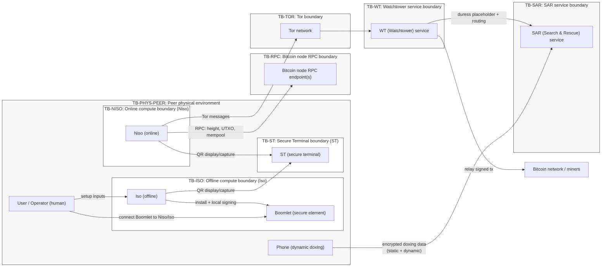
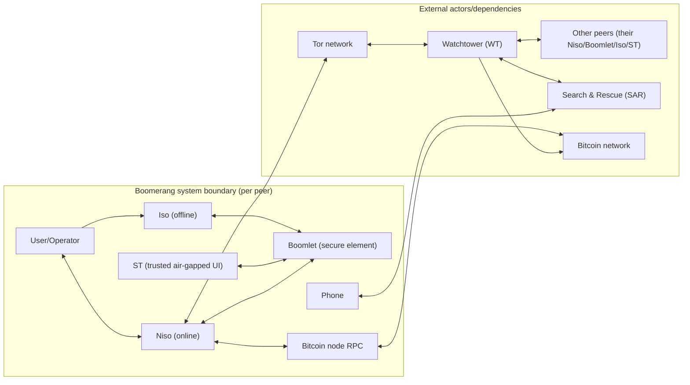
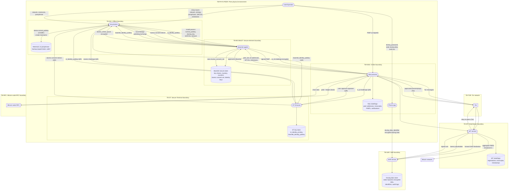
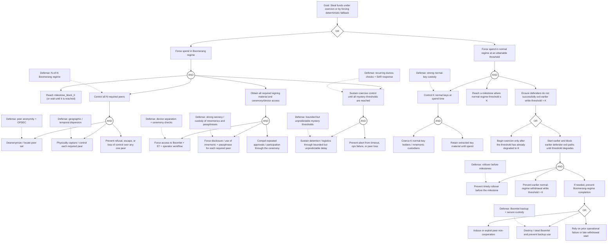
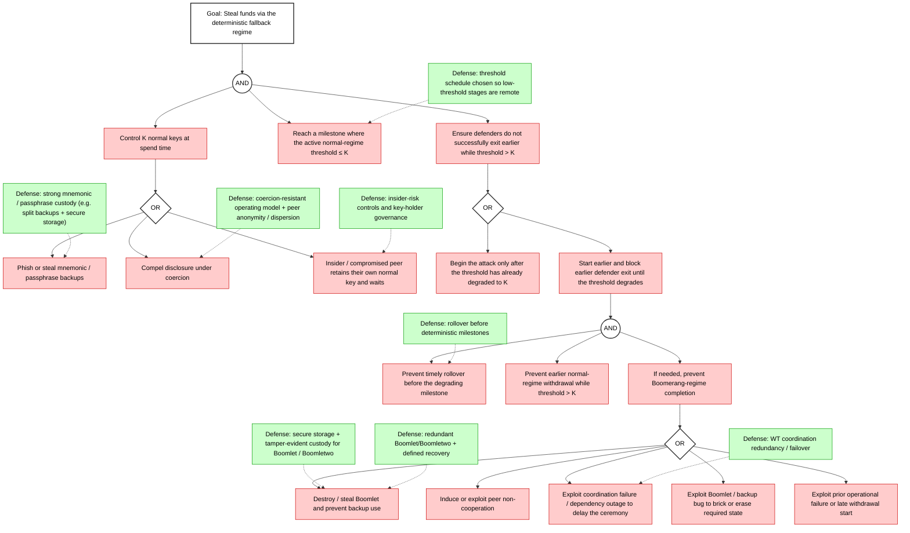
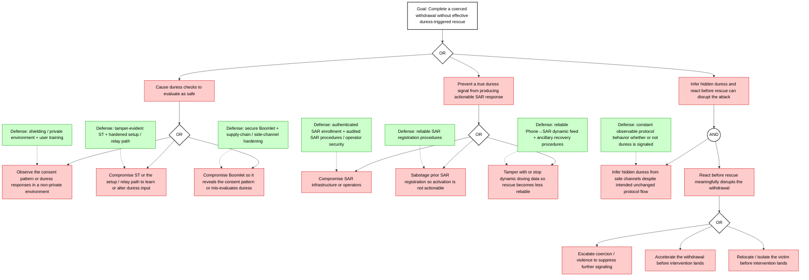
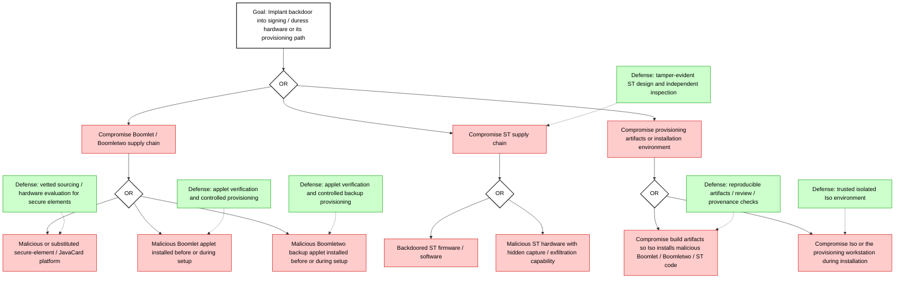

# Boomerang Threat Model

## Table of Contents

- [Summary](#summary)
- [Scope & assumptions](#scope-assumptions)
- [Attacker personas](#attacker-personas)
- [Trust boundaries + Trust Boundary Diagram](#trust-boundaries)
- [Human & Physical Risk](#human-physical-risk)
- [Architecture & data flows](#architecture-data-flows)
- [Systematic attack identification](#systematic-attack-identification)
- [Risk register (NIST-style)](#risk-register)
- [Attack / attack-defense trees](#attack-trees)
- [Mitigations & roadmap](#mitigations-roadmap)
- [Appendix A: STRIDE mapping](#appendix-stride)
- [Appendix B: OWASP mapping](#appendix-owasp)
- [Appendix C: CCSS mapping & roadmap](#appendix-ccss)

---

## Summary
[Back to Table of Contents](#table-of-contents)

Boomerang materially improves coercion resistance over plain multisig by combining two-layer signing, protocol-enforced unpredictability, and plausibly deniable duress signaling. It does **not** eliminate theft or coercion risk; it mainly tries to raise attacker cost, preserve user safety time, and fail more safely than conventional cold-storage workflows.

### Executive summary

- **Security value proposition:** the Boomerang regime requires both the mnemonic-backed normal key and the Boomlet-held non-exportable share for each peer, while the digging game and duress checks aim to make a forced withdrawal slower, less predictable, and more visible to SAR.
- **Most important trust assumptions:** Boomlet secure-element security, ST integrity, correct cryptographic design/implementation, honest-peer availability, correct Bitcoin timelock behavior, and sustained WT/SAR availability.
- **Top risk themes:**  
  1. **Niso compromise and message / PSBT tampering** (`R-08`, `R-11`)  
  2. **Operator error, governance, and rollover discipline** (`R-15`, `R-04`)  
  3. **Secure-element / ST compromise and cryptographic implementation correctness** (`R-01`, `R-02`, `R-14`)  
  4. **Forced determinism and late-stage waterfall risks** (`R-03`, `R-04`)  
  5. **Safety-critical dependencies and deanonymization around WT / SAR / Tor / payment flows** (`R-05`, `R-06`, `R-16`, `R-23`)
- **Production-readiness blockers:** cryptographic details are still underspecified; reorg handling is not finalized; WT/SAR redundancy is unresolved; Boomletwo activation/recovery remains under design; software supply-chain and monitoring/incident-response processes are not yet sufficiently specified.
- **Immediate priorities:**  
  - specify AEAD/KDF/transcript-binding/serialization details and publish test vectors;  
  - replace password-hash doxing key derivation with a memory-hard KDF and tighten SAR privacy posture;  
  - preserve a simple ST trust boundary while requiring independent PSBT verification on dedicated operator hardware;  
  - define and rehearse key-compromise, coercion, outage, and rollover procedures.
- **Control target:** given the custody value, coercion risk, and service dependencies, the current design should be assessed against **CCSS Level III** expectations.

### Bottom line

Boomerang has a credible **coercion-resistance story** only if three things hold simultaneously:

1. **The human / physical operating model is strong**, because coercion, travel risk, device theft, and observation are first-class threats.  
2. **The protocol state machine is specified and validated rigorously**, because freshness, replay, counter, and tolerance-window bugs can collapse the non-determinism guarantees.  
3. **Operational dependencies are hardened and diversified**, because WT, SAR, Tor, node-RPC, logging, and payment metadata can still undermine either safety or privacy even if the core cryptography is sound.

## Scope & assumptions
[Back to Table of Contents](#table-of-contents)

### System summary

Boomerang is a Bitcoin cold-storage protocol designed to raise the cost of coercion by making withdrawals hardware-enforced and bounded but unpredictable in time, while embedding plausibly deniable duress signaling in the standard withdrawal path.

The design, as specified in the canonical message diagrams and design docs, has four relevant properties:

- **Taproot descriptor with two spending regimes**
  - **Boomerang regime (probabilistic / coercion-resistant):** spend becomes possible only after `milestone_block_0` and after each peer’s Boomlet reaches a secret internal threshold (`mystery`) through a coordinated ping/pong process that increments a local counter under strict freshness rules.
  - **Normal regime (deterministic fallback / liveness):** a waterfall of timelocked scripts gradually reduces the required signer threshold over future milestone block heights (for example, 5-of-5 → 4-of-5 → … → 1-of-5 using **normal keys**).

- **Two-layer signing per peer in the Boomerang regime**
  - Each peer’s on-chain `boom_pubkey_i` is a **MuSig2 aggregate** of:
    - a **normal key** (mnemonic-backed; held and used by `Iso`), and
    - a **Boomlet-held non-exportable key share** (held and used by `Boomlet`).
  - Implication: mnemonic compromise alone is insufficient to produce a Boomerang-regime signature; the corresponding Boomlet is also required.

- **Duress signaling**
  - Duress checks occur at commitment and at randomized intervals during the digging game.
  - `ST` is the trusted UI for duress challenges; `Boomlet` is the trusted evaluator.
  - A duress placeholder is embedded in protocol messages such that:
    - **no duress:** the placeholder decrypts to all-zero padding;
    - **duress:** the placeholder decrypts to `doxing_key` (or equivalent unlock material), allowing `SAR` to decrypt the user’s encrypted doxing data and initiate rescue procedures.
  - `WT` forwards placeholders to `SAR`; `SAR` returns signed acknowledgements so the protocol flow stays unchanged while Boomlet still obtains assurance of receipt.

### In-scope components

Peers are joint custodians of the bitcoin involved. Per peer/operator (×5 peers typical in the current design):

- **User (human)**
- **Iso (offline):** key-derivation and signing environment for normal keys; interacts with Boomlet and ST.
- **Boomlet (secure element):** holds key share, enforces non-determinism, and runs duress logic.
- **Boomletwo (backup secure element):** backup of Boomlet state *excluding* `mystery` (activation procedure remains under design).
- **ST (Secure Terminal):** air-gapped, tamper-evident UI for user verification and duress challenges.
- **Niso (online):** networked coordinator per peer; handles Tor communications, talks to Bitcoin node RPC, interfaces with WT, and mediates QR flows to ST.
- **Phone:** used for SAR registration and the encrypted dynamic doxing feed.

External dependencies and services:

- **Bitcoin network / miners** (confirmation, timelocks, reorgs, fee market)
- **Bitcoin node RPC endpoint(s)** used by each peer’s Niso
- **Tor network**
- **WT (Watchtower):** coordination service, liveness oracle, and relay for signed PSBTs / transactions
- **SAR (Search & Rescue):** receives encrypted doxing data, detects duress, and initiates physical response

### Out-of-scope (explicit)

These items remain security-relevant but are outside the current model because the design does not yet specify them in enough detail:

- SAR’s real-world response procedures
- Detailed organizational governance
- Manufacturing processes for Boomlet / ST hardware
- Wallet UX beyond what is specified by the protocol messages

### Primary assets

**Custody / value assets**
- **Bitcoin funds** locked by the Boomerang Taproot output (UTXO(s))
- **Transaction authorization correctness** (PSBT contents, destination, amounts, fees)

**Key material & cryptographic assets**
- `mnemonic`, `passphrase`, and derived **normal private keys**
- Boomlet-held `boom_musig2_privkey_share` (non-exportable)
- Boomlet identity keypair (signing / encryption)
- ST identity keypair (Boomlet↔ST secure channel)
- Tor onion-service secret keys (peer Niso addresses)
- WT and SAR long-term signing / encryption keys

**Duress & safety assets**
- `duress_consent_set`
- `doxing_password` / `doxing_key` and derived `doxing_data_identifier`
- **Static doxing data** and **dynamic doxing feed**

**Protocol state assets**
- Per-Boomlet `mystery` and `counter`
- `boomerang_params` and `boomerang_descriptor`
- Protocol transcripts
- Milestone schedule (`milestone_block_collection`)

### Security objectives

**Funds protection**
- Prevent unauthorized spending in both regimes.
- Prevent silent transaction tampering.
- Ensure recoverability in the normal regime under loss scenarios, while managing the associated risk.

**Coercion resistance**
- Under coercion, reduce attacker confidence in *time to cash-out*.
- Provide unavoidable, plausibly deniable duress signaling with minimal observable divergence.
- Preserve a reaction window for SAR response and deterrence.

**Privacy & safety**
- Minimize metadata that could enable targeting of key holders.
- Protect doxing data and duress signals from unauthorized disclosure.
- Resist correlation attacks that deanonymize peers, schedules, or duress events.

**Integrity & liveness**
- Prevent protocol-state desynchronization and replay.
- Ensure withdrawal completes when honest peers cooperate and dependencies are available.
- Ensure failures degrade safely, preferably fail-closed in the Boomerang regime.

### High-impact assumptions (explicit)

These assumptions materially drive risk. Where an assumption is strong, the risk rating stays elevated unless the design or operating model compensates for it.

- **Boomlet secure-element security holds**
- **ST integrity holds**
- **Cryptography holds**
- **At least one honest peer exists**
- **Bitcoin timelocks behave as expected**
- **WT and SAR remain available**
- **Peers have a secure out-of-band channel**

### Key unknowns blocking production readiness

- Exact values and selection policy for the non-determinism and duress-check parameters
- Reorg-handling policy
- WT / SAR redundancy model
- Cryptographic details: AEAD mode, KDF, transcript binding, serialization
- Boomletwo activation / recovery protocol
- Software supply chain and update mechanisms
- Monitoring, alerting, and incident-response workflows

CCSS rationale, mapping, and roadmap are in [Appendix C](#appendix-ccss).

---

## Attacker personas
[Back to Table of Contents](#table-of-contents)

The personas below anchor the threat catalog and risk register. They are not exhaustive; they are the attacker classes most relevant to the current design.

### Persona A: External remote attacker
Goals: compromise online components, deanonymize peers, or deny service.  
Capabilities: malware delivery, network attacks, web exploitation, chain surveillance.  
Constraints: cannot directly access Boomlet internals if the secure element holds.

### Persona B: Malicious insider peer
Goals: steal or redirect funds, force determinism, or exfiltrate metadata.  
Capabilities: legitimate access to their own keys and partial transcripts; ability to refuse, delay, or manipulate process.  
Constraints: one honest peer blocks malicious subsets in the N-of-N Boomerang regime.

### Persona C: Compromised vendor / dependency
Goals: implant backdoors or weaken the assumptions Boomerang relies on.  
Capabilities: malicious firmware, covert channels, weakened RNG, selective signing.  
Constraints: reproducible builds, attestation, audits, and vendor diversity raise cost.

### Persona D: Coercion / wrench attacker
Goals: force withdrawal, suppress duress signaling, and keep victims under control until funds move.  
Capabilities: surveillance, confinement, intimidation, device confiscation, hardware destruction.  
Constraints: bounded unpredictability and recurring duress checks materially increase attacker cost.

### Persona E: Legal / jurisdictional coercion actor
Goals: confiscate funds, freeze funds, or compel SAR / operator disclosure.  
Capabilities: subpoenas, device seizure, compelled decryption, long-term surveillance.  
Constraints: jurisdiction, due process, technical controls, and geographic dispersion.

### Persona F: Opportunistic thief / evil maid
Goals: create latent compromise through brief physical access.  
Capabilities: device swap, seal cloning, cable replacement, backup theft, keylogging.  
Constraints: strong tamper-evident controls materially reduce practical opportunity.

---

## Trust boundaries + Trust Boundary Diagram
[Back to Table of Contents](#table-of-contents)

Boomerang depends on hard separation between offline and online systems, between human intent and host-mediated I/O, and between local components and external coordination services. The boundaries below are used consistently across the DFD, threat catalog, and risk register.

### Trust boundary list

| Boundary ID  | Boundary type          | Name                              | What it separates                                                               | Why it exists / security meaning                                           |
| ------------ | ---------------------- | --------------------------------- | ------------------------------------------------------------------------------- | -------------------------------------------------------------------------- |
| TB-PHYS-PEER | Physical               | Peer physical environment         | Operator + devices vs. outside world                                            | Theft, coercion, observation, device swap, unsafe travel                   |
| TB-ISO       | Physical/Process       | Offline compute boundary (Iso)    | Air-gapped Iso execution vs. any networked environment                          | Protect normal keys; reduce signing-time malware risk                      |
| TB-BOOMLET   | Device/Process         | Secure element boundary (Boomlet) | Secure element internal state vs. host computers (Iso/Niso)                     | Protect non-exportable key share; enforce non-determinism and duress logic |
| TB-ST        | Device/Process         | Secure Terminal boundary (ST)     | Trusted UI + ST key store vs. outside world                                     | Prevent duress-input and verification manipulation                         |
| TB-NISO      | Host/OS                | Online compute boundary (Niso)    | Networked OS + apps vs. external networks                                       | High malware exposure; untrusted for duress integrity                      |
| TB-QR        | Optical channel        | QR air-gap channel                | Offline / air-gapped comms vs. mediators                                        | Prevent direct electronic exfiltration; introduce parsing and swapping risk|
| TB-OOB       | Process/Identity       | Out-of-band peer coordination     | Human secure channel vs. attacker-controlled communications                     | Peer identity and parameters must be verified                              |
| TB-TOR       | Network                | Tor boundary                      | Peer onion services vs public Internet                                          | Anonymity with correlation / DoS exposure                                  |
| TB-RPC       | Network                | Bitcoin node RPC boundary         | Niso vs Bitcoin node(s)                                                         | Block height and chain state are security-critical                         |
| TB-WT        | Org/Cloud              | Watchtower service boundary       | WT infrastructure / keys / logs vs peers                                        | Central for liveness, metadata, and transcript routing                     |
| TB-SAR       | Org/Cloud/Jurisdiction | SAR service boundary              | SAR infrastructure / keys / operators vs peers                                  | Holds PII and handles physical response                                    |
| TB-JURIS     | Jurisdictional         | Cross-jurisdiction boundary       | Operators / WT / SAR across legal regimes                                       | Compelled disclosure or forced inaction can occur                          |

### Cross-boundary flows

- **F-QR-1:** Boomlet ↔ ST key exchange and duress challenges / answers via QR
- **F-USB-1:** Boomlet ↔ Iso during setup and final signing
- **F-USB-2:** Boomlet ↔ Niso during online phases
- **F-NET-1:** Niso ↔ WT via Tor
- **F-NET-2:** WT ↔ SAR
- **F-NET-3:** Phone ↔ SAR
- **F-RPC-1:** Niso ↔ Bitcoin node RPC
- **F-OOB-1:** User ↔ other peers through secure out-of-band channels

### Trust Boundary Diagram

```mermaid
flowchart LR
  %% External actors / networks (not a single trust boundary)
  BTC["Bitcoin network / miners"]

  subgraph TORB["TB-TOR: Tor boundary"]
    TOR["Tor network"]
  end

  subgraph RPCB["TB-RPC: Bitcoin node RPC boundary"]
    NODE["Bitcoin node RPC endpoint(s)"]
  end

  subgraph WTB["TB-WT: Watchtower service boundary"]
    WT["WT (Watchtower) service"]
  end

  subgraph SARB["TB-SAR: SAR service boundary"]
    SAR["SAR (Search & Rescue) service"]
  end

  subgraph PEER["TB-PHYS-PEER: Peer physical environment"]
    USER["User / Operator (human)"]

    subgraph OFF["TB-ISO: Offline compute boundary (Iso)"]
      ISO["Iso (offline)"]
      BOOM["Boomlet (secure element)"]
    end

    subgraph STB["TB-ST: Secure Terminal boundary (ST)"]
      ST["ST (secure terminal)"]
    end

    subgraph ON["TB-NISO: Online compute boundary (Niso)"]
      NISO["Niso (online)"]
    end

    PHONE["Phone (dynamic doxing)"]
  end

  USER -- "setup inputs" --> ISO
  ISO -- "install + local signing" --> BOOM
  ISO -- "QR display/capture" --> ST
  NISO -- "QR display/capture" --> ST
  USER -- "connect Boomlet to Niso/Iso" --> BOOM

  NISO -- "Tor messages" --> TOR
  TOR --> WT
  NISO -- "RPC: height, UTXO, mempool" --> NODE

  WT -- "relay signed tx" --> BTC
  WT -- "duress placeholder + routing" --> SAR
  PHONE -- "encrypted doxing data\n(static + dynamic)" --> SAR

  %% Styling for boundary boxes
  style TORB fill:#f8f8f8,stroke:#333,stroke-width:1px
  style RPCB fill:#f8f8f8,stroke:#333,stroke-width:1px
  style WTB fill:#f8f8f8,stroke:#333,stroke-width:1px
  style SARB fill:#f8f8f8,stroke:#333,stroke-width:1px
  style PEER fill:#f8f8f8,stroke:#333,stroke-width:1px
  style OFF fill:#ffffff,stroke:#333,stroke-width:1px
  style STB fill:#ffffff,stroke:#333,stroke-width:1px
  style ON fill:#ffffff,stroke:#333,stroke-width:1px
```

**Interpretation:**  
- Boomerang’s strongest intended security properties depend on TB-BOOMLET and TB-ST holding.  
- Boomerang’s strongest intended availability properties depend on TB-WT and TB-RPC behaving correctly (or having redundancy/failover).  
- Coercion resistance is fundamentally a **human + physical** problem; the technical protocol mainly shapes incentives and time.

---

## Human & Physical Risk
[Back to Table of Contents](#table-of-contents)

Boomerang is designed for a threat environment in which physical coercion is credible. Human operators, facilities, travel patterns, and operational discipline are therefore first-class attack surfaces.

### Human/physical threat scenarios (minimum set)

| Scenario                                                            | Trust boundaries involved          | Primary assets at risk                   | What can go wrong                                                                                    | Candidate mitigations (design + ops)                                                                                                         |
| ------------------------------------------------------------------- | ---------------------------------- | ---------------------------------------- | ---------------------------------------------------------------------------------------------------- | -------------------------------------------------------------------------------------------------------------------------------------------- |
| **Coercion/wrench attack** on one peer during withdrawal            | TB-PHYS-PEER, TB-ST, TB-BOOMLET    | Funds, user safety, duress secrecy       | Attacker forces approvals/continuation; tries to detect/bypass duress; holds victim until completion | Boomerang non-determinism; duress checks via ST; SAR response; safe-room procedures; training; decoy narratives; “never withdraw alone” rule |
| **Coercion on multiple peers** (kidnapping/round-up)                | TB-PHYS-PEER across multiple sites | Funds, safety                            | Attacker attempts to capture multiple peers simultaneously to satisfy N-of-N                         | Geographic dispersion; time-zone dispersion; secrecy of peer identities; travel OPSEC; rapid alerting; decoy peers                           |
| **Insider collusion** among peers                                   | TB-OOB, TB-PHYS-PEER               | Funds, governance integrity              | Colluding peers wait out waterfall timelocks; or coordinate coercion                                 | Legal agreements; choose milestones to make late-stage far future; monitoring and alerts                   |
| **Social engineering** (phishing, fake ceremonies, fake WT/SAR)     | TB-OOB, TB-PHYS-PEER               | Normal keys, peer set integrity, privacy | steals mnemonics; reroutes Tor addresses; tricks SAR enrollment                                      | multi-channel fingerprint checks; pinned keys; training; anti-phishing playbooks                                                             |
| **Credential theft** (mnemonic/passphrase, device PINs)             | TB-PHYS-PEER, TB-ISO               | Normal keys                              | Offline theft enables later deterministic theft; coercer forces disclosure                           | Strong passphrases; split backups (Shamir); secure storage; duress narratives                                                                 |
| **Process non-compliance** (missed rollover, skipped checks)        | TB-PHYS-PEER, TB-OOB               | Funds, coercion resistance               | Users allow protocol to enter deterministic regime; late-stage scripts enable theft                  | Mandatory rollover schedule; automated reminders; rehearsals;                                           |
| **Operator error** (wrong milestones, wrong outputs, wrong network) | TB-PHYS-PEER, TB-ISO, TB-ST        | Funds                                    | Setup produces wrong descriptor; withdrawal signs wrong tx                                           | Strict checklists; ST shows full outputs; testnet rehearsals; sanity checks & invariants in Iso                                              |
| **Travel/commute risk** (surveillance, ambush)                      | TB-PHYS-PEER                       | Safety                                   | Attacker identifies peer movements; targets at vulnerable moments                                    | Vary routines; secure transport; avoid advertising role; compartmentalize identities; personal security                                      |
| **Site access failures** (unauthorized entry to storage areas)      | TB-PHYS-PEER                       | Devices, backups                         | Evil-maid installs implants/swaps devices; steals backups                                            | Access control, alarms, cameras; tamper seals; inventory                                                                                      |
| **Device theft/tampering** (ST/Boomlet/phone seized)                | TB-PHYS-PEER, TB-BOOMLET, TB-ST    | Duress & keys                            | Attacker extracts keys, learns consent set, or triggers forced determinism                           | Certified SE; tamper resistance; Faraday storage; spare devices; incident response                                                           |
| **Environmental threats** (fire/flood/power/EMP)                    | TB-PHYS-PEER                       | Devices/backups                          | Loss triggers forced determinism or permanent loss                                                   | Geo-redundant storage; fireproof safes; Faraday bags; periodic health checks                                                                 |
| **Jurisdictional/legal coercion** (SAR compelled, border searches)  | TB-JURIS, TB-SAR                   | PII, safety                              | SAR forced to reveal data or to delay action; operator compelled disclosure                          | Minimize PII; legal counsel; documented policies; transparency                                                                                |

### Duress mechanism assumptions

The duress mechanism assumes two things:
- the attacker cannot observe consent-set entry without detection by the user; and
- ST does not leak consent-set material.

These assumptions are operationally fragile. Many realistic coercion scenarios involve cameras, multiple attackers, or controlled environments. Safe-room procedures, shielding, and anti-surveillance discipline matter as much here as the cryptography.

The primary coercion campaign tree is moved to [Tree 0](#attack-trees) in the main **Attack / attack-defense trees** section.

### Operational hardening checklist

**People**
- Separate duties so no single operator can execute a full withdrawal alone.
- Run regular coercion drills.
- Minimize who knows peer identities and minimize public footprint.

**Facilities**
- Use secure, access-controlled environments for all ceremonies.
- Maintain tamper-evident seals and inspection logs for ST and Boomlets.
- Keep Boomlet, Boomletwo, and mnemonic shares in geo-redundant storage.

**Travel**
- Avoid predictable patterns and role disclosure.
- Use secure transport for devices; device separation remains strongly preferable.

**Incident response**
- Predefine “device stolen” and “coercion suspected” playbooks.
- Maintain a rapid plan to move funds before deterministic milestones enable theft, where that remains possible.

---

## Architecture & data flows
[Back to Table of Contents](#table-of-contents)

The design is shown below in two forms: a context view (L0) and a trust-boundary-aware DFD (L1).

### Context diagram (L0)

```mermaid
flowchart LR
  subgraph SYS["Boomerang system boundary (per peer)"]
    USER["User/Operator"]
    ISO["Iso (offline)"]
    BOOM["Boomlet (secure element)"]
    ST["ST (trusted air-gapped UI)"]
    NISO["Niso (online)"]
    PHONE["Phone"]
    BTCN["Bitcoin node RPC"]
  end

  subgraph EXT["External actors/dependencies"]
    PEERS["Other peers (their Niso/Boomlet/Iso/ST)"]
    WT["Watchtower (WT)"]
    SAR["Search & Rescue (SAR)"]
    BTC["Bitcoin network"]
    TOR["Tor network"]
  end

  %% High-level flows
  USER --> ISO
  ISO <--> BOOM
  ST <--> BOOM
  USER <--> NISO
  NISO <--> BOOM
  NISO <--> TOR
  TOR <--> WT
  WT <--> PEERS
  WT <--> SAR
  PHONE <--> SAR
  NISO <--> BTCN
  BTCN <--> BTC
  WT --> BTC
```

### Data flow diagram (L1) with trust boundaries

Legend:
- **Processes**: rounded rectangles
- **Data stores**: cylinders
- **External entities**: rectangles
- **Trust boundaries**: shown as subgraphs (named)

```mermaid
flowchart TB
  %% Peer boundary
  subgraph TBPHYS["TB-PHYS-PEER: Peer physical environment"]
    USER([User/Operator])

    subgraph TBISO["TB-ISO: Offline boundary"]
      ISO([Iso process])
      D_MN[(Mnemonic & passphrase backup /paper/metal, safe//)]
    end

    subgraph TBBOOM["TB-BOOMLET: Secure element boundary"]
      BOOM([Boomlet applet])
      D_BOOM[(Boomlet secure state:
key shares, mystery, counters,
duress consent set, identity keys)]
      BOOM --> D_BOOM
    end

    subgraph TBST["TB-ST: Secure Terminal boundary"]
      ST([ST firmware])
      D_ST[(ST key store:
st_identity_privkey,
boomlet_identity_pubkey)]
      ST --> D_ST
    end

    subgraph TBNISO["TB-NISO: Online boundary"]
      NISO([Niso process])
      D_NISO[(Niso state/logs:
peer addresses, transcripts,
PSBTs, notifications)]
      NISO --> D_NISO
      PHONE([Phone app])
    end
  end

  %% External boundaries
  subgraph TBTOR["TB-TOR: Tor network"]
    TOR[[Tor]]
  end
  subgraph TBWT["TB-WT: Watchtower boundary"]
    WT([WT service])
    D_WT[(WT state/logs:
registrations, transcripts,
timestamps)]
  end
  subgraph TBSAR["TB-SAR: SAR boundary"]
    SAR([SAR service])
    D_SAR[(Doxing data store:
static+dynamic encrypted data,
identifiers, audit logs)]
  end
  subgraph TBRPC["TB-RPC: Bitcoin node RPC boundary"]
    RPC[[Bitcoin node RPC]]
  end
  BTC[[Bitcoin network]]

  %% Flows (setup)
  USER -- "setup inputs:
network, entropy,
passphrase, SAR IDs,
milestones" --> ISO
  ISO -- "derive normal_pubkey
(m/cb86')
create mnemonic" --> D_MN
  ISO -- "install params:
normal_pubkey, doxing_key,
SAR IDs, network" --> BOOM

  %% ST key exchange & duress setup (QR boundary implied)
  BOOM -- "boomlet_identity_pubkey" --> ISO
  ISO -- "boomlet_identity_pubkey (QR)" --> ST
  ST -- "st_identity_pubkey (QR)" --> ISO
  ISO -- "st_identity_pubkey" --> BOOM
  BOOM -- "duress_check_space encrypted" --> ISO
  ISO -- "duress challenge (QR)" --> ST
  ST -- "duress consent indices (QR)" --> ISO
  ISO -- "duress consent indices" --> BOOM
  BOOM -- "store duress_consent_set" --> D_BOOM

  %% Setup: online peer coordination
  NISO -- "peer_ids, tor addresses,
WT IDs, milestones" --> BOOM
  NISO -- "Tor messages" --> TOR --> WT
  WT --> D_WT
  WT -- "forward SAR finalization" --> SAR --> D_SAR

  %% Phone to SAR (setup & ongoing)
  USER -- "doxing_password,
static doxing data,
SAR IDs" --> PHONE
  PHONE -- "doxing_data_identifier,
encrypted doxing data" --> SAR

  %% Withdrawal flow (high-level)
  USER -- "PSBT (unsigned)" --> NISO
  NISO -- "psbt + height checks" --> RPC
  RPC -- "chain data" --> NISO
  BOOM -- "tx_id challenge encrypted" --> NISO
  NISO -- "tx_id challenge (QR)" --> ST
  ST -- "user approval signature (QR)" --> NISO
  NISO -- "approval to Boomlet" --> BOOM

  %% WT-mediated approvals/commits/pings
  NISO -- "approvals/commits/pings (Tor)" --> TOR --> WT
  WT -- "relay to peers (Tor)" --> TOR --> NISO
  WT -- "duress placeholder" --> SAR
  SAR -- "signed ack" --> WT

  %% Final signing

  USER -- "network, mnemonic, passphrase" --> ISO
  ISO <--> BOOM
  ISO -- "local MuSig2
partialsig exchange" --> BOOM

  BOOM -- "signed PSBT" --> NISO --> WT
  WT -- "aggregate PSBTs
broadcast tx" --> BTC
```

### Data classification

The classification below combines custody impact, safety impact, and privacy sensitivity rather than using a pure confidentiality label.

| Data                                           | Classification                    | Notes                                                                     |
| ---------------------------------------------- | --------------------------------- | ------------------------------------------------------------------------- |
| Mnemonic, passphrase, normal private keys      | **Critical secret**               | Compromise enables deterministic theft later                              |
| Boomlet key shares + identity private key      | **Critical secret**               | Compromise breaks Boomerang regime, privacy, and duress                   |
| Duress consent set                             | **Critical secret**               | If learned, a coercer can bypass the duress mechanism                     |
| Doxing data (static + dynamic)                 | **Critical safety-sensitive PII** | Compromise enables targeting and harm                                     |
| Doxing key / identifier                        | **Critical secret / metadata**    | Password-derived; compromise weakens rescue privacy and duress safety     |
| Boomerang descriptor, peer IDs                 | **Sensitive configuration**       | Key substitution is catastrophic                                          |
| Protocol transcripts                           | **Sensitive metadata**            | Linkability and timing can enable targeting                               |
| Signed PSBTs / transaction                     | **Public after broadcast**        | Before broadcast, still sensitive                                         |

### Protocol parameter surface

The design defines (at minimum) the following parameter families:

- Non-determinism window:
  - `MIN_TRIES_FOR_DIGGING_GAME_IN_BLOCKS`
  - `MAX_TRIES_FOR_DIGGING_GAME_IN_BLOCKS`

- Duress check cadence:
  - `DURESS_CHECK_INTERVAL_IN_BLOCKS`

- Freshness/tolerance windows (examples):
  - `TOLERANCE_IN_BLOCKS_FROM_TX_APPROVAL_BY_INITIATOR_PEER_TO_TX_APPROVAL_BY_WT`
  - `TOLERANCE_IN_BLOCKS_FROM_CREATING_PING_TO_RECEIVING_ALL_PINGS_BY_WT_AND_HAVING_SAR_RESPONSE_BACK_TO_WT`
  - `REQUIRED_MINIMUM_DISTANCE_IN_BLOCKS_BETWEEN_PING_AND_PONG`
  - …and several more `TOLERANCE_*` / `REQUIRED_MINIMUM_DISTANCE_*` constraints

Implication: these parameters define the adversary’s feasible delay and replay windows and materially affect coercion cost, false positives, and liveness. Parameter selection belongs under explicit security governance, with test coverage and operational monitoring.

---

## Systematic attack identification
[Back to Table of Contents](#table-of-contents)

The checklist below is intended for design review, implementation review, tabletop exercises, and red-team planning. It spans cyber, cryptographic, supply-chain, insider, and physical / coercion attack classes and preserves traceability to both the STRIDE catalog and the risk register.

- Each row maps to **Threat IDs** (STRIDE catalog) and **Risk IDs** (risk register).
- Use this checklist during design reviews, implementation reviews, tabletop exercises, and red-team planning.

### Attack Pattern Checklist

| Attack Pattern                                                                                                                                                                                                                            | Applicable components/flows/stores/boundaries                                     | Likely impact                                                                                                                      | Candidate mitigations                                                                                                                         | Mapped Threat IDs/Risk IDs                   |
| ----------------------------------------------------------------------------------------------------------------------------------------------------------------------------------------------------------------------------------------- | --------------------------------------------------------------------------------- | ---------------------------------------------------------------------------------------------------------------------------------- | --------------------------------------------------------------------------------------------------------------------------------------------- | -------------------------------------------- |
| Supply chain compromise of secure element / JavaCard applet (malicious firmware/applet, backdoored RNG)                                                                                                                                   | Boomlet (TB-BOOMLET), Boomletwo; installation flows (Iso↔Boomlet)                 | Key extraction, predictable mystery/PRNG, duress bypass, theft of funds, false duress                                              | Vendor due diligence; attestation; reproducible builds; independent labs; diversified hardware; secure provisioning; tamper-evident packaging | T-SE-01, T-SC-01 / R-01, R-24                |
| Supply chain compromise of ST (firmware backdoor, exfil via covert channels)                                                                                                                                                              | ST (TB-ST), ST key store; QR flows                                                | Consent-set compromise; duress manipulation; user approval spoofing                                                                | Secure boot; signed firmware; disable radios; tamper seals; reproducible builds; independent device audits                                    | T-ST-01 / R-02, R-24                         |
| Device substitution (evil-maid swap) of Boomlet/ST/Iso/Niso                                                                                                                                                                               | Physical boundary TB-PHYS-PEER; USB/QR flows                                      | Key theft, message forgery, duress bypass, funds loss                                                                              | Inventory+seals; attestation; challenge-response identity checks; controlled ceremonies                                                       | T-PHYS-02 / R-19                             |
| Niso malware performs Tor MITM / traffic fingerprinting / onion key theft                                                                                                                                                                 | Niso↔Tor boundary TB-TOR; peer_0_tor_secret_key                                   | Deanonymization; protocol disruption; MITM                                                                                         | Harden Niso; isolate Tor keys in Boomlet or TPM; rotate onion keys; traffic padding                                                           | T-NISO-01, T-INFO-04, T-INFO-06 / R-08, R-16 |
| Iso compromise (should be offline) via removable media during setup/withdrawal signing                                                                                                                                                    | Iso offline boundary TB-ISO; mnemonic/passphrase; PSBT signing                    | Normal key theft; forged signatures; funds theft                                                                                   | True air-gap; ephemeral OS; deterministic builds; no network hardware; malware scanning of media;                                             | T-ISO-01 / R-15, R-24                        |
| WT equivocation (sends different views/collections to different peers)                                                                                                                                                                    | WT boundary TB-WT; collections of approvals/commits/pings                         | State desync, liveness failure, coercion window reduction if peers confused                                                        | Peers sign and cross-verify collections; transcript hashes; WT transparency log; multi-WT quorum                                              | T-TAMP-06 / R-05, R-25                       |
| DoS on WT or SAR (network, application, legal pressure)                                                                                                                                                                                   | WT/SAR services; Tor network                                                      | Withdrawal unavailable; duress acknowledgement blocked                                                                             | Redundancy; failover; rate limiting; alternative channels; SLAs                                                                               | T-DOS-01, T-DOS-02 / R-13, R-22              |
| Bitcoin node RPC lies / eclipse attack; false block heights; reorg exploitation                                                                                                                                                           | Niso↔Bitcoin node boundary TB-RPC; WT height oracle                               | Premature milestone checks; counter manipulation; protocol desync                                                                  | Multiple nodes; header+chainwork validation; compare WT vs node; anti-eclipse                                                                 | T-BTC-01, T-SPOOF-05 / R-09                  |
| Replay or delayed delivery of signed messages across Tor                                                                                                                                                                                  | All Tor flows; approvals/commits/pings; nonce fields                              | State confusion;                                                                                                                   | Strict nonce/seq checks; freshness windows; unique message IDs; caching                                                                       | T-REPLAY-01 / R-10, R-25                     |
| Wrench attack: coercer captures one or more peers and forces withdrawal                                                                                                                                                                   | Human boundary TB-PHYS-PEER; ST duress input; all devices                         | Fund theft attempt; user harm; duress signal; forced determinism                                                                   | Boomerang non-determinism; duress signal to SAR; operational OPSEC; safe rooms; split knowledge; travel security                              | T-HUM-01, T-PHYS-01 / R-03, R-12, R-22       |
| Insider collusion among peers to wait out waterfall timelocks                                                                                                                                                                             | Out-of-band peer coordination boundary TB-OOB                                     | Funds theft in deterministic stages                                                                                                | Governance agreements; monitoring                                                                                                             | T-INS-01 / R-04                              |
| Social engineering/phishing to steal mnemonic/passphrase or to subvert peer verification during setup                                                                                                                                     | User; OOB channels; setup verification                                            | Normal key compromise; descriptor substitution                                                                                     | Training; hardware wallets for normal keys; authenticated OOB verification of peers; anti-phishing                                            | T-HUM-02, T-SPOOF-01, T-TAMP-04 / R-17       |
| Legal/jurisdictional coercion of SAR or operators                                                                                                                                                                                         | Jurisdiction boundary TB-JURIS; SAR operations                                    | PII disclosure; forced inaction; compelled assistance                                                                              | minimization; legal counsel; transparency reports; encryption                                                                                 | T-LEGAL-01 / R-06                            |
| Malicious QR payload triggers parser vulnerability (buffer overflow) on ST or Niso                                                                                                                                                        | QR channel; ST firmware; Niso software                                            | Code execution; key theft; protocol manipulation                                                                                   | Safe parsing libs; fuzzing; strict limits; sandboxing                                                                                         | T-EOP-04, T-MEM-01 / R-11                    |
| QR swapping/overlay attack (physical) to corrupt or replay visual messages                                                                                                                                                                | Physical boundary; QR displays on Iso/Niso                                        | Ceremony interruption, message disclosure, or parser exploitation; silent approval bypass should fail if nonce/content checks hold | Nonces; freshness checks; authenticated framing; human-verifiable digests where practical; secure environment                                 | T-PHYS-02, T-TAMP-02 / R-11, R-19            |
| ECDH key reuse without AEAD or proper KDF leads to ciphertext malleability or key recovery                                                                                                                                                | Boomlet↔ST, Boomlet↔WT, Boomlet↔SAR encryption                                    | Message tampering; duress placeholder distinguishability; key leakage                                                              | HKDF + domain separation; AEAD (AES-GCM/ChaCha20-Poly1305); unique nonces; transcript binding                                                 | T-CRYPTO-01 / R-14                           |
| Weak doxing_password => brute-force doxing_key and decrypt PII                                                                                                                                                                            | SAR data store; phone dynamic feed                                                | PII compromise; targeting; weakening duress protection                                                                             | Argon2id+salt; enforce passphrase; optional hardware secret                                                                                   | T-CRYPTO-03 / R-07                           |
| Side-channel attack (power/EM/timing) on Boomlet during signing or PRNG use                                                                                                                                                               | Boomlet (TB-BOOMLET); signing flow Iso↔Boomlet                                    | Key share leakage; mystery leakage; PRNG prediction                                                                                | Certified secure element; constant-time code; side-channel resistant implementation; shielding; limit signing frequency; lab testing          | T-SE-03 / R-01                               |
| Fault injection / glitching Boomlet to skip checks (freshness, duress eval, counter rules)                                                                                                                                                | Boomlet; ping/commit checks                                                       | Bypass non-determinism; suppress duress; sign early                                                                                | Fault-resistant SE; redundant checks; control-flow integrity; counters in secure NV storage; tamper response                                  | T-SE-04 / R-01, R-25                         |
| Compromise of peer normal key mnemonic (phishing, theft, insecure backup)                                                                                                                                                                 | Mnemonic backups; Iso inputs; physical safes                                      | Funds theft in deterministic regime; blackmail                                                                                     | Shamir/SSS for backups; split storage; hardware wallet for normal key; strong passphrase; access controls                                     | T-KEY-01, T-HUM-02 / R-03, R-15              |
| Passphrase capture (shoulder surf, coercion, keylogger) reduces mnemonic security                                                                                                                                                         | Iso; user handling                                                                | Normal key compromise                                                                                                              | Long passphrase; never type on networked devices; ST-assisted entry; memory-only                                                              | T-HUM-02 / R-15                              |
| Compromise of phone; dynamic doxing data spoofing or leakage                                                                                                                                                                              | Phone boundary; phone↔SAR channel                                                 | Misleading SAR; privacy loss; attacker tracking                                                                                    | Harden phone; use dedicated device; minimal apps; OS updates; secure enclave; frequent key rotation; include integrity/auth on feed           | T-PHONE-01 / R-06, R-20                      |
| SAR database breach (static doxing data ciphertext, identifiers, metadata)                                                                                                                                                                | SAR data store                                                                    | PII leak; targeting; offline cracking                                                                                              | Encrypt-at-rest with HSM; minimize fields; split storage; access controls; breach response                                                    | T-INFO-01, T-DATA-01 / R-06, R-07            |
| WT database breach (peer IDs, Tor addresses, fingerprints, timestamps)                                                                                                                                                                    | WT data store                                                                     | Deanonymization; targeting; protocol disruption                                                                                    | Minimize retention; encrypt; pseudonyms; rotate Tor addresses; security audits                                                                | T-INFO-03 / R-16, R-20                       |
| WT bribery / insider leak: exposes which peers are participating and their schedules                                                                                                                                                      | WT org boundary; human boundary                                                   | Targeting for coercion                                                                                                             | Strong governance; background checks; least privilege; transparency reports                                                                   | T-HUM-04, T-INFO-03 / R-16, R-20             |
| Peer DoS / non-cooperation to force determinism or extort others                                                                                                                                                                          | Peer boundary; withdrawal protocol                                                | Forced determinism; delayed withdrawal; extortion                                                                                  | Legal agreements; penalties; monitoring; choose parameters; consider threshold variants with anti-collusion proofs                            | T-DOS-03, T-INS-02 / R-03, R-04              |
| Manipulate milestone_block schedule (malicious suggestion, typo) leading to early deterministic regime                                                                                                                                    | Setup: user inputs milestone_block_collection; boomerang_params_seed verification | Reduced coercion resistance; early theft window                                                                                    | Compute milestones from policy; require multi-operator verification; sanity checks                                                            | T-OPS-02 / R-15                              |
| Time confusion / timezone mistakes in interpreting milestones and rollover deadlines                                                                                                                                                      | Human processes; Niso notifications                                               | Missed rollover; determinism forced                                                                                                | Use block-height only; calendar aids; multiple reminders; runbooks                                                                            | T-HUM-03 / R-15                              |
| Protocol downgrade to deterministic regime intentionally by attacker (destroy boomlets, isolate peers)                                                                                                                                    | Physical + network                                                                | Loss of coercion protection; eventual theft                                                                                        | Redundant boomlets; rapid incident response; move funds before milestones; monitoring                                                         | T-PHYS-01, T-DOS-03, T-OPS-01 / R-03, R-15   |
| Compromised peer Niso forges messages to WT as if from Boomlet (if Boomlet identity key stolen)                                                                                                                                           | Boomlet identity keys; Niso↔WT flows                                              | Protocol manipulation; false commits/pings; possibly accelerate                                                                    | Keep identity keys in Boomlet only; use secure channels; include device attestation; rate limits                                              | T-SPOOF-03 / R-01, R-08                      |
| Signature malleability / wrong sighash in PSBT leading to signing different transaction than intended                                                                                                                                     | PSBT creation; Iso/Boomlet signing; ST verification                               | Funds theft or stuck funds                                                                                                         | Strict PSBT parsing; independent PSBT verification on dedicated operator hardware; lock sighash; test vectors                                 | T-BTC-02 / R-14, R-15                        |
| Reorg near milestone or during withdrawal leads to inconsistent block-height/freshness decisions                                                                                                                                          | Bitcoin chain; WT and Niso height sources                                         | Stall or premature counter increments; inconsistent state                                                                          | Use confirmations; require stable height; incorporate chainwork; handle reorg explicitly                                                      | T-BTC-03 / R-09, R-25                        |
| WT or peers manipulate tolerance windows to accelerate counter (e.g., send crafted last_seen_block)                                                                                                                                       | Ping messages; counter increment conditions                                       | Reduced unpredictability; speed-up withdrawal under coercion                                                                       | Conservative rules in Boomlet; monotonic constraints; include signed evidence; formal analysis                                                | T-TAMP-07, T-FRESH-01 / R-25                 |
| State rollback attack on Boomlet (power loss, reset) to repeat nonces or reuse states                                                                                                                                                     | Boomlet NV storage; counters; nonces                                              | Nonce reuse => key compromise; protocol desync                                                                                     | Monotonic counters in secure NV; anti-rollback; ensure nonce randomness; store transcript hash                                                | T-SE-05 / R-01, R-14                         |
| Compromise of RNG in Boomlet or ST causing predictable nonces/mystery/duress intervals                                                                                                                                                    | Boomlet PRNG; ST keygen                                                           | Predictable withdrawal duration; key compromise                                                                                    | Hardware RNG validation; health tests; DRBG per NIST SP 800-90A; entropy mixing                                                               | T-CRYPTO-04 / R-01, R-14                     |
| Coercion attacker uses surveillance to learn duress consent set over time                                                                                                                                                                 | Human; ST UI interactions                                                         | Duress bypass; reduced deterrence                                                                                                  | Never perform duress checks under observation; shielding/private environment; ST hardening; operator training                                 | T-HUM-01 / R-12                              |
| Attacker compels user to reveal doxing_password/doxing_key to weaken rescue                                                                                                                                                               | Human; phone; SAR                                                                 | Rescue weakening; PII misuse                                                                                                       | Split doxing secret; store part in Boomlet; SAR requires additional factor;                                                                   | T-DURESS-04 / R-06, R-12                     |
| Compromise of WT signing key allows forging receipts/acks and tricking peers                                                                                                                                                              | WT key management                                                                 | Protocol integrity;                                                                                                                | HSM for WT keys; rotation; transparency; key pinning                                                                                          | T-WT-05 / R-05                               |
| Compromise of SAR signing key allows forging acknowledgements (hiding duress failure)                                                                                                                                                     | SAR key management                                                                | User safety; false assurance                                                                                                       | HSM; rotation; multi-sig for SAR responses; audit logs                                                                                        | T-SAR-03 / R-06, R-22                        |
| Privacy attack via payment channels (invoice/receipt reuse, on-chain analysis)                                                                                                                                                            | WT fee payment; Bitcoin network                                                   | Link peers to Boomerang participation; targeting                                                                                   | Use privacy-preserving payments; avoid address reuse; use Lightning with privacy; vouchers                                                    | T-FIN-01 / R-23                              |
| Environmental disaster (fire/flood/power) destroys devices and backups                                                                                                                                                                    | Physical storage; safes                                                           | Forced determinism; loss of keys; loss of funds                                                                                    | Geographic redundancy; fireproof safes; offsite backups; insurance; tested recovery                                                           | T-ENV-01 / R-15                              |
| EMP / magnetic event damages electronics (Boomlets, ST)                                                                                                                                                                                   | Physical                                                                          | Forced determinism; liveness loss                                                                                                  | Faraday storage; redundant devices; periodic health checks; fallback scripts                                                                  | T-ENV-02 / R-15                              |
| Unauthorized code execution on WT/SAR via common web vulnerabilities                                                                                                                                                                      | WT/SAR cloud boundary                                                             | DoS; metadata leaks; key compromise if keys online                                                                                 | OWASP ASVS; hardened infra; WAF; patching; least privilege; secrets mgmt                                                                      | T-WEB-01 / R-05, R-06                        |
| Insider at SAR abuses *during a valid duress event* (exfiltrates decrypted PII, mishandles/forgets escalation) or causes DoS by refusing/delaying response *(without duress, SAR cannot decrypt and cannot meaningfully initiate rescue)* | SAR operators; decrypted doxing data handling; duress escalation workflow         | PII exposure; rescue failure; delayed or absent intervention                                                                       | Compartmentalized access; audited SAR procedures; least privilege; dual control for sensitive actions; on-call redundancy; incident review    | T-DURESS-03, T-DOS-02, T-HUM-04 / R-06, R-22 |
| Consensus-layer attacks or high-fee mempool conditions delay broadcast, extending coercion window                                                                                                                                         | Bitcoin network                                                                   | Availability; user safety                                                                                                          | Fee bumping strategies (RBF/CPFP); mempool monitoring; pre-planned fee reserves                                                               | T-DOS-05 / R-13                              |
| USB/HID injection (bad USB) to Iso/Niso during Boomlet connection                                                                                                                                                                         | Physical boundary; USB connection Iso↔Boomlet, Niso↔Boomlet                       | Malware infection; command injection; altered messages                                                                             | USB data diodes; disable HID; allow-list USB classes; dedicated hardware; inspect cables                                                      | T-PHYS-03 / R-19, R-15                       |
| Key derivation path confusion/implementation mismatch leads to wrong normal_pubkey and loss of funds                                                                                                                                      | Iso key derivation; purpose_root_xpriv path m/cb86'                               | Funds unrecoverable; incorrect keys in descriptor                                                                                  | Test vectors; strict spec; cross-implementation checks; display derived xpub fingerprint                                                      | T-PROT-04 / R-15                             |
| Tamper-evident seal cloning or replacement to hide ST/Boomlet compromise                                                                                                                                                                  | Physical boundary; seals                                                          | Undetected hardware compromise                                                                                                     | Unique serial seals; multi-layer seals; photographic records; periodic inspections; use enclosures with tamper sensors                        | T-PHYS-04 / R-02, R-19                       |
| WT Sybil / collusion if multiple WTs used but controlled by one adversary                                                                                                                                                                 | WT selection governance                                                           | False sense of redundancy; censorship/metadata                                                                                     | Diversity of providers; independent governance; audits; verify AS/jurisdiction diversity                                                      | T-WT-06 / R-05                               |
| SAR processing/timing differences around duress placeholder handling                                                                                                                                                                      | WT↔SAR channel; SAR processing                                                    | Attacker infers duress handling occurred; escalates violence                                                                       | Constant-time processing where feasible; delay equalization; minimize distinguishable operational side effects                                | T-INFO-10 / R-12, R-06                       |
| Boomlet memory exhaustion / state corruption via malformed or oversized messages (DoS at secure element)                                                                                                                                  | Boomlet message parsing; Tor inputs                                               | Withdrawal stall; forced determinism                                                                                               | Strict size limits; robust parsing; watchdog resets with anti-rollback; input validation                                                      | T-SE-06 / R-25, R-13                         |
| Phishing user into registering wrong SAR(s) or revealing SAR association                                                                                                                                                                  | Phone setup; SAR IDs selection                                                    | Duress compromised; PII leak                                                                                                       | Pinned SAR public keys; signed SAR directory; authenticated directory checks; redundancy                                                      | T-SPOOF-04 / R-06                            |
| Key compromise documentation/runbooks missing => slow response to theft/coercion                                                                                                                                                          | Operations                                                                        | Increased loss; delayed rescue; reputational harm                                                                                  | Incident response plan; drills; defined contacts; automated alerts                                                                            | T-OPS-03 / R-15                              |
| Operator travel/commute surveillance to identify and ambush key holders                                                                                                                                                                   | Human physical boundary                                                           | Coercion attack; theft                                                                                                             | OPSEC training; varying routines; secure transport; decoy devices; bodyguards for high value                                                  | T-HUM-05 / R-12, R-16                        |
| Compromised peer leaks other peers’ identities (insider threat) enabling targeted coercion                                                                                                                                                | Governance/human boundary                                                         | Physical attacks; extortion                                                                                                        | Need-to-know; pseudonymous peer identities; legal agreements; compartmentalize contact lists                                                  | T-INS-03, T-INFO-07 / R-16                   |
| Mempool / fee market manipulation to force long confirmation times (increasing exposure)                                                                                                                                                  | Bitcoin network                                                                   | Longer coercion window; denial of withdrawal                                                                                       | Fee management; CPFP/RBF; multiple broadcast nodes; pre-fund fee reserves                                                                     | T-DOS-05 / R-13                              |

---

## Risk register (NIST-style)
[Back to Table of Contents](#table-of-contents)

The register below follows the NIST SP 800-30r1 structure: threat event, vulnerability or predisposing condition, likelihood, impact, and response. Each risk is mapped to threat IDs and CCSS v9 controls.

### Scoring method

- **Likelihood (1–5):** Rare → Almost certain
- **Impact (1–5):** Negligible → Catastrophic
- **Risk score:** `Likelihood × Impact`
  - 1–5 Low, 6–10 Medium, 11–15 High, 16–25 Critical

### Risk register table

| Risk ID | Title | Mapped Threat IDs | Primary Assets | Likelihood (1-5) | Impact (1-5) | Risk Score | Current Controls (from design) | Treatment / Mitigations | Verification | Mapped CCSS v9 controls |
| --- | --- | --- | --- | --- | --- | --- | --- | --- | --- | --- |
| R-01 | Boomlet secure element compromise (key extraction / logic tamper) | T-SE-01, T-SC-01, T-SE-04 | Boomlet boom_musig2_privkey_share; duress_consent_set; protocol integrity | 3 | 5 | 15 | Assumption: JavaCard-class secure element resists extraction; Boomlet key share non-exportable; N-of-N boomerang regime; fallback timelocks. | Secure element selection & evaluation; side-channel/fault-injection hardening; secure boot & signed applets; attestation (if feasible); diversified vendors; tamper-evident custody; key ceremonies for device provenance; periodic red-team. | Independent hardware security evaluation; penetration tests; supply-chain audits; on-device self-tests; attestation evidence. | 1.05.2, 1.01.2, 1.01.3, 1.01.4, 1.03.1, 2.01.1, 2.03.3, 2.04.1 |
| R-02 | ST compromise (tampering, code injection, key extraction) enabling duress bypass or consent-set exfiltration | T-ST-01, T-PRIV-02, T-EOP-02 | duress_consent_set; ST keys; user approvals | 3 | 4 | 12 | Air-gapped QR; tamper-evident requirement; ST does not accept new code; ST keys non-extractable (assumption). | Secure boot + signed firmware; hardware root of trust; disable radios; physical tamper seals + inspections; reproducible builds; UI anti-shoulder-surfing; independent STs for redundancy; secure key provisioning; periodic integrity check (hash display). | Firmware signing pipeline; device attestation or boot measurement; hardware teardown audit; user inspection checklist; red-team with physical access. | 1.05.8, 1.04.2, 1.05.2, 2.01.1, 2.03.2, 2.04.1 |
| R-03 | Forced determinism: attacker destroys/steals Boomlet(s) to force fallback regime, then spends with compromised normal keys | T-PHYS-01, T-KEY-01 | Bitcoin UTXO; normal keys; safety of operators | 3 | 5 | 15 | Waterfall timelocks; Boomletwo backup (excluding mystery) to reduce single-card loss; operational rollover guidance. | Hard operational policy: rollover before deterministic milestones; secure storage & geographic separation of Boomlets; duress response plan; faster 'safe exit' transaction patterns (research); monitor for device theft; milestone schedule review. | Operational drills; periodic rollover testnet rehearsal; audit of milestone schedule vs mystery range; incident response exercises. | 1.02.1, 1.02.2, 1.02.3, 1.03.2, 2.03.2, 2.04.1, 2.04.2 |
| R-04 | Malicious or compromised peer waits for later waterfall timelock to steal (e.g., 1-of-5 normal stage) | T-INS-01, T-GOV-01 | Bitcoin UTXO; governance integrity | 2 | 5 | 10 | Early stage requires 5-of-5 (boomerang & normal initial stages); later stages reduce threshold to ensure recoverability. | Governance: contractual / legal agreements; choose milestone schedule to make low-threshold stages extremely remote; enforce rollover monitoring; social/legal deterrence. | Governance review; milestone schedule review; tabletop exercises for peer dispute; monitoring plan. | 2.03.1, 2.03.2, 1.02.1, 1.05.9 |
| R-05 | Watchtower (WT) compromise/maliciousness: censorship, equivocation, block-height lies, metadata leakage | T-DOS-01, T-TAMP-06, T-INFO-03, T-WT-05 | Protocol liveness; privacy; correctness of freshness checks | 3 | 4 | 12 | Boomlet verifies signatures; freshness uses block heights; peers have direct node RPC via Niso; multiple WT candidates list; payment receipt signed by WT. | Multi-watchtower quorum / failover; WT transparency logs; rate-limit & anti-DoS; independent blockheight validation (multiple nodes); minimize metadata; onion-service hardening; SLAs; key rotation; incident response when WT fails. | WT security audits; chaos testing; monitoring for censorship/latency; independent height-check comparisons. | 2.03.3, 2.02.1, 2.02.3, 2.03.2, 2.04.1 |
| R-06 | SAR compromise or legal/jurisdictional coercion causes doxing data disclosure or misuse | T-INFO-01, T-LEGAL-01 | Static & dynamic doxing data (PII); user safety; privacy | 3 | 4 | 12 | Doxing data encrypted with doxing_key; SAR only learns identifier until duress; placeholder is indistinguishable padding when no duress. | Strong KDF for doxing_password (Argon2id) + per-user salt; minimize data stored; data retention limits; SAR compartmentalization; audited access; legal agreements; multi-SAR with split knowledge; emergency revocation; threat intelligence & insider controls. | SAR security program; audits; encryption review; privacy impact assessment; data deletion tests. | 2.03.3, 2.03.2, 1.03.1, 2.04.1, 2.02.1 |
| R-07 | Password-based doxing_key brute-force if SAR database or ciphertext leaks | T-CRYPTO-03, T-DATA-01, T-INFO-01 | Doxing data confidentiality | 4 | 3 | 12 | doxing_key = sha256(doxing_password) (currently). | Replace with memory-hard KDF (Argon2id/scrypt) with unique salt; enforce minimum entropy; consider hardware-bound secrets; rotate doxing credentials; rate-limit registration attempts if online; encrypt-at-rest at SAR with HSM. | Crypto design review; test vectors; password policy tests; simulated leak + cracking resistance assessment. | 1.03.1, 2.03.2, 2.01.1 |
| R-08 | Niso compromise (malware) tampers PSBT / tx_id presentation / tor comms; attempts to bypass user intent | T-NISO-01, T-TAMP-01, T-TAMP-02 | Transaction integrity; privacy; liveness | 4 | 4 | 16 | ST mediates tx_id verification; Boomlet uses nonce + ST signature; PSBT encrypted for non-initiator boomlets; many signatures/checks; Niso considered untrusted for duress. | Harden Niso OS; minimal attack surface; reproducible builds; run in dedicated hardware; disk encryption; mandatory access control; separate comms from wallet creation; secure update; malware scanning; strict QR parsing; UI warnings; hardware write-protect for configs. | Niso hardening benchmark; penetration tests; supply-chain checks; runtime integrity monitoring; incident response playbooks. | 1.05.2, 1.05.8, 2.02.1, 2.02.3, 1.06.1, 1.06.2, 2.01.1 |
| R-09 | False block-height / eclipse attacks against Niso or peers to manipulate freshness checks and counters | T-BTC-01, T-SPOOF-05, T-FRESH-01 | Freshness guarantees; digging game correctness; milestone enforcement | 3 | 4 | 12 | Niso has direct bitcoin node RPC; WT provides height; Boomlet checks tolerance windows; multiple checks at WT and peers. | Use multiple independent nodes; compare heights; use headers validation; anti-eclipse measures; require chainwork proofs; avoid trusting single RPC endpoint; WT cross-check. | Network security tests; simulated eclipse scenarios; monitoring divergence between sources. | 2.02.4, 1.04.2, 2.03.2, 2.01.1 |
| R-10 | Replay / reordering / desync of protocol messages causing premature counter increments or erroneous reached_mystery | T-REPLAY-01, T-TAMP-03, T-FRESH-01 | Non-determinism integrity; liveness; fund safety | 3 | 4 | 12 | Nonces; ping_seq_num; block-height freshness constraints; signatures over content and padding; WT verifies. | Formal state-machine specification; model checking; strict monotonic sequence checks; unique message IDs; include transcript hashes; robust serialization; reject duplicates; timeouts and recovery paths. | Property-based tests; protocol fuzzing; formal verification (TLA+/Ivy); interop test vectors. | 2.01.1, 1.04.2, 2.02.1 |
| R-11 | QR-code channel attacks (malformed payloads, parser bugs, QR swapping, camera trickery) | T-TAMP-02, T-EOP-04, T-MEM-01, T-PHYS-02 | Iso/ST/Boomlet integrity; user approvals; duress input | 4 | 3 | 12 | Air-gap; signatures; nonces; limited UI. | Harden QR parsers; strict length limits; canonical encoding; content-type tags; use checksums; display human-verifiable hashes; camera security; anti-QR overlay; use one-way diodes; test with fuzzing. | Fuzzing QR decoding; security review; unit tests; user acceptance tests; red-team of physical QR swapping. | 2.01.1, 1.05.8, 1.06.1 |
| R-12 | Duress signal leakage through side channels (attacker observes selection / ST screen / timing) | T-HUM-01, T-SIDE-01 | Coercion resistance; user safety | 3 | 4 | 12 | Assumption: attacker cannot observe consent entry without the operator noticing; small screen coverable; protocol messages indistinguishable. | Physical shielding; anti-shoulder-surfing UI; randomized consent-set presentation; haptic-only mode; privacy screens; operational training; private/shielded environment procedures. | Usability studies under observation; red-team coercion simulations; UI security review. | 1.05.6, 1.05.7, 2.03.2, 2.04.2 |
| R-13 | Service DoS (WT or SAR unreachable) blocks withdrawal and may prevent rescue acknowledgment | T-DOS-01, T-DOS-02 | Availability; user safety | 4 | 3 | 12 | Multiple WT candidates; SAR ack required for progress (in some stages). | Redundant WT/SAR; offline fallback rescue channel; cached SAR pubkeys; retry strategies; anti-DoS infra; alternative comm paths; emergency procedure if SAR unreachable. | Load testing; failover drills; runbooks; chaos engineering. | 2.03.3, 2.03.2, 2.02.3 |
| R-14 | Implementation bugs in cryptography (nonce reuse, signature misuse, incorrect key derivation) lead to key compromise | T-CRYPTO-01, T-CRYPTO-02 | All private keys; funds; duress | 3 | 5 | 15 | Assumption cryptography holds; protocol uses schnorr signatures, nonces, ECDH, AES. | Use audited libraries; constant-time implementations; deterministic nonce for Schnorr (BIP340); KDF with domain separation; AEAD; comprehensive test vectors; independent reviews. | Crypto audit; testnet integration; static analysis; differential testing. | 2.01.1, 1.01.2, 1.01.3, 1.01.4 |
| R-15 | Operator error in ceremonies (wrong milestone blocks, wrong peers, wrong network, lost backups) leads to loss or forced determinism | T-HUM-03, T-OPS-01 | Funds; liveness; coercion resistance | 4 | 4 | 16 | ST user verification steps; signed fingerprints; multi-party agreement; backup procedure. | Runbooks + checklists; training; rehearsal; automated validation in Iso; safe defaults; UX improvements; monitoring for approaching milestones; disaster recovery plan. | Ceremony drills; audits; incident simulations; testnet end-to-end. | 2.03.1, 2.03.2, 2.04.2, 1.02.5, 1.05.6, 1.05.7, 1.05.8 |
| R-16 | Tor traffic correlation / onion service deanonymization leading to targeting of peers for coercion | T-PRIV-01, T-INFO-04, T-HUM-05 | Operator anonymity; physical safety; funds | 3 | 4 | 12 | Peer↔peer and peer↔WT comms over Tor; PSBT encrypted to boomlets; limited data shared. | Operational anonymity discipline; separate network identities; avoid linking WT payments to real identity; use multiple Tor guards; onion hardening; traffic padding; minimize metadata; consider mixnet for WT; threat intel. | Privacy assessment; traffic analysis simulations; red-team correlation tests; review logs for linkability. | 1.04.2, 2.03.2, 2.03.3, 2.02.1 |
| R-17 | Out-of-band peer exchange compromise (peer IDs / Tor addresses / WT IDs / milestones) causes key substitution or MITM | T-SPOOF-01, T-TAMP-04, T-HUM-02 | Descriptor correctness; peer set integrity; funds | 3 | 5 | 15 | User verifies boomerang_params_seed via ST; peers sign boomerang_params; WT registers sorted pubkeys. | Use authenticated OOB channels (PGP, Signal safety numbers); multi-channel verification; human-readable fingerprint display; independent verification by multiple operators; record signatures; ceremony checklists. | Ceremony audits; simulated substitution tests; UX tests for fingerprint verification. | 1.04.2, 1.04.3, 2.03.1, 2.03.2 |
| R-18 | Boomletwo backup misuse: backup used to bypass non-determinism or to clone state; backup confidentiality compromise | T-BACK-01, T-TAMP-05, T-SE-02 | Boomlet state (excluding mystery); identity keys; protocol integrity | 2 | 4 | 8 | Backup excludes mystery; backup encrypted to Boomletwo identity; Boomlet locks after backup completion. | Define explicit recovery/activation ceremony (still under design); prevent concurrent use; include revocation lists; hardware tamper evidence; ensure backup cannot sign without fresh mystery; formalize invariants. | Design review of activation protocol; tests ensuring backup cannot recreate original mystery; red-team backup activation. | 1.03.2, 1.03.4, 1.03.5, 1.03.6, 1.02.2, 2.04.1 |
| R-19 | Device substitution attacks during setup/withdrawal (swap Boomlet/ST/Iso/Niso hardware or cables) | T-SPOOF-02, T-PHYS-03 | Keys; transaction integrity; duress mechanism | 3 | 4 | 12 | Signatures bind identities; ST stores boomlet_identity_pubkey; WT registration uses signed pubkeys; user verification steps. | Hardware provenance checks; tamper seals; serial-number inventory; secure storage; challenge-response attestation between devices; cable-locking; controlled environments; | Operational inspections; red-team physical swap attempts; attestation tests. | 1.05.2, 1.03.5, 2.03.1, 2.04.1 |
| R-20 | Logging/monitoring data leaks (WT logs, SAR logs, Niso logs) deanonymize peers or expose sensitive protocol states | T-INFO-03, T-INFO-06, T-HUM-04 | Privacy; safety; duress confidentiality | 4 | 3 | 12 | Not explicitly specified; relies on operational security. | Log minimization; encryption at rest; strict access controls; retention limits; pseudonymous identifiers; audit logs; privacy-by-design reviews. | Log review; privacy audits; data retention tests. | 2.02.1, 2.02.2, 2.02.3, 1.06.1, 1.06.2, 2.03.2 |
| R-21 | False duress (user mistake) triggers SAR escalation and personal data exposure / safety risks | T-HUM-04, T-DURESS-03 | User privacy & safety; SAR operations | 3 | 3 | 9 | Duress check designed to resist typos; repeated confirmation at setup; same protocol flow on duress. | UX hardening; confirmation prompts; training; allow safe cancellation signal; SAR playbook for verification to avoid overreaction; rate limiting of duress triggers; multi-signal requirement (e.g., consecutive failures). | Usability tests; false-positive rate measurement; SAR tabletop exercises. | 1.05.6, 2.04.2, 2.03.2 |
| R-22 | False negative duress: SAR does not receive/act, or attacker blocks SAR comms; user remains captive | T-DOS-02 | User safety | 3 | 5 | 15 | Boomlet verifies SAR signed acknowledgement delivered via WT; duress checks recur. | Redundant SAR operations where policy permits; alternative emergency channels; SAR SLA & on-call; offline rescue contact lists; escalation verification. | End-to-end duress delivery tests; SAR response drills; failover exercises. | 2.03.3, 2.04.2, 2.03.2 |
| R-23 | WT service fee payment metadata links peer identity to custody participation | T-INFO-05, T-FIN-01 | Operator anonymity; safety | 4 | 3 | 12 | WT issues per-peer invoice; user pays and provides receipt. | Use privacy-preserving payment methods; avoid on-chain linkability; use vouchers or blinded tokens; separate payment identity from Tor identity; WT privacy policy. | Payment flow privacy review; chain analysis; audit of WT accounting. | 2.03.3, 2.03.2, 2.02.1 |
| R-24 | Software update / build pipeline compromise (Iso/Niso/ST firmware/Boomlet applet) introduces backdoors | T-UPDATE-01 | All keys; duress; funds | 3 | 5 | 15 | Not specified; implicit trust. | Signed releases; reproducible builds; dependency pinning; SBOM; code review; hardware-backed signing keys; staged rollouts; offline verification; secure distribution. | Supply-chain audits; build reproducibility checks; signature verification; compromise drills. | 2.01.1, 2.03.3, 2.03.2 |
| R-25 | State-machine edge cases in digging game (counter increment rules, tolerance windows) enable adversarial acceleration or stalling | T-PROTO-01, T-FRESH-01, T-TAMP-07 | Non-determinism guarantee; liveness | 3 | 4 | 12 | Detailed tolerance checks and block-height constraints in Boomlet/WT; ping_seq_num; reached_mystery_flag rules. | Formal verification of liveness and safety properties; adversarial network model tests; conservative tolerance selection; clear spec for reorg handling; monotonic constraints. | Simulation harness; fuzzing with network delay/adversary; formal models. | 2.01.1, 2.03.2, 2.02.4 |
### Top risk themes

1. **Niso compromise and message / PSBT tampering** (`R-08`, `R-11`)  
2. **Operator error, governance, and rollover discipline** (`R-15`, `R-04`)  
3. **Secure-element / ST compromise and cryptographic implementation correctness** (`R-01`, `R-02`, `R-14`)  
4. **Forced determinism and late-stage waterfall risks** (`R-03`, `R-04`)  
5. **Safety-critical dependencies (WT / SAR) and metadata deanonymization** (`R-05`, `R-06`, `R-16`, `R-23`)  

---

## Attack / attack-defense trees
[Back to Table of Contents](#table-of-contents)

The following trees capture the highest-risk attacker goals and the main defenses that constrain them.

### Tree 0: Primary attacker campaign — steal funds under coercion or force deterministic fallback

Tree 0 is the top-level attacker campaign for Boomerang. Trees 1–5 decompose the supporting technical paths and enabling conditions.

```mermaid
flowchart TD
  A["Goal: Steal funds under coercion or by forcing deterministic fallback"] --> OR0{OR}
  OR0 --> B["Force spend in Boomerang regime"]
  OR0 --> C["Force spend in normal regime at an attainable threshold"]

  B --> AND1((AND))
  AND1 --> B0["Reach milestone_block_0 (or wait until it is reached)"]
  AND1 --> B1["Control all N required peers"]
  AND1 --> B2["Obtain all required signing material and ceremony/device access"]
  AND1 --> B3["Sustain coercive control until all mystery thresholds are reached"]

  B1 --> AND2((AND))
  AND2 --> B1a["Deanonymize / locate peer set"]
  AND2 --> B1b["Physically capture / control each required peer"]
  AND2 --> B1c["Prevent refusal, escape, or loss of control over any one peer"]

  B2 --> AND3((AND))
  AND3 --> B2a["Force access to Boomlet + ST + operator workflow"]
  AND3 --> B2b["Force disclosure / use of mnemonic + passphrase for each required peer"]
  AND3 --> B2c["Compel repeated approvals / participation through the ceremony"]

  B3 --> AND4((AND))
  AND4 --> B3a["Sustain detention / logistics through bounded but unpredictable delay"]
  AND4 --> B3b["Prevent abort from timeout, ops failure, or peer loss"]

  %% ----------------------------
  %% Normal-regime coercion path
  %% ----------------------------
  C --> AND5((AND))
  AND5 --> C1["Control K normal keys at spend time"]
  AND5 --> C2["Reach a milestone where normal-regime threshold ≤ K"]
  AND5 --> C3["Ensure defenders do not successfully exit earlier while threshold > K"]

  C1 --> AND6((AND))
  AND6 --> C1a["Coerce K normal-key holders / mnemonic custodians"]
  AND6 --> C1b["Retain extracted key material until spend"]

  C3 --> OR1{OR}
  OR1 --> C3a["Begin coercion only after the threshold has already degraded to K"]
  OR1 --> C3b["Start earlier and block earlier defender exit paths until threshold degrades"]

  C3b --> AND7((AND))
  AND7 --> C3b1["Prevent timely rollover before the milestone"]
  AND7 --> C3b2["Prevent earlier normal-regime withdrawal while threshold > K"]
  AND7 --> C3b3["If needed, prevent Boomerang-regime completion"]

  C3b3 --> OR2{OR}
  OR2 --> C3b3a["Destroy / steal Boomlet and prevent backup use"]
  OR2 --> C3b3b["Induce or exploit peer non-cooperation"]
  OR2 --> C3b3c["Rely on prior operational failure or late withdrawal start"]

  %% ----------------------------
  %% Defenses / countermeasures
  %% ----------------------------
  D1["Defense: peer anonymity + OPSEC"] -.-> B1a
  D2["Defense: geographic / temporal dispersion"] -.-> B1b
  D3["Defense: N-of-N Boomerang regime"] -.-> B1
  D4["Defense: device separation + ceremony checks"] -.-> B2a
  D5["Defense: strong secrecy / custody of mnemonics and passphrases"] -.-> B2b
  D6["Defense: bounded but unpredictable mystery thresholds"] -.-> B3a
  D7["Defense: recurring duress checks + SAR response"] -.-> B3
  D8["Defense: strong normal-key custody"] -.-> C1
  D9["Defense: rollover before milestones"] -.-> C3b1
  D10["Defense: Boomlet backup + secure custody"] -.-> C3b3a

  classDef gate fill:#fff,stroke:#333,stroke-width:2px;
  class OR0,OR1,OR2,AND1,AND2,AND3,AND4,AND5,AND6,AND7 gate;

```

### Tree 1: Steal funds by tampering PSBT or breaking intent continuity

```mermaid
flowchart TD
  A["Goal: Steal funds by tampering the transaction or breaking intent continuity"] --> OR0{OR}

  OR0 --> B["Get a malicious PSBT approved by all required peers"]
  OR0 --> C["Cause a different PSBT / transaction to be signed than the one approved"]
  OR0 --> D["Exploit signing / parser / state-machine implementation bugs"]

  %% ----------------------------
  %% 1) Malicious PSBT gets approved
  %% ----------------------------
  B --> AND1((AND))
  AND1 --> B1["Modify or substitute the PSBT before peer approval"]
  AND1 --> B2["Defeat or mislead operator verification at every required peer"]
  AND1 --> B3["Keep the malicious PSBT / tx_id presentation consistent across all approval synchronization steps"]

  B1 --> OR1{OR}
  OR1 --> B1a["Malware alters outputs / change / fees before first verification"]
  OR1 --> B1b["Swap the PSBT or per-peer encrypted PSBT payload before recipient peer decrypts it"]

  B2 --> OR2{OR}
  OR2 --> B2a["Compromise initiator watch-only wallet / Niso view so the malicious PSBT appears intended"]
  OR2 --> B2b["Compromise non-initiator Niso verification views so the same malicious PSBT is accepted"]
  OR2 --> B2c["Exploit operator-review weakness so tx_id approval is given for a malicious but consistently presented PSBT"]

  %% ----------------------------
  %% 2) Intent continuity breaks after approval
  %% ----------------------------
  C --> AND2((AND))
  AND2 --> C1["Defeat tx_id / continuity protections across the withdrawal state machine"]
  AND2 --> C2["Make the finally signed PSBT / transaction differ from the operator-approved one"]

  C1 --> OR3{OR}
  OR3 --> C1a["Exploit inconsistent PSBT parsing / tx_id derivation / serialization across components"]
  OR3 --> C1b["Exploit replay or state-confusion bug despite nonce / freshness / sequence checks"]
  OR3 --> C1c["Exploit approval-to-commit / commit-to-ping / reached-state binding flaw"]

  C2 --> OR4{OR}
  OR4 --> C2a["Exploit PSBT hydration mismatch at finalization"]
  OR4 --> C2b["Exploit message substitution between reached-state verification and Iso/Boomlet signing"]

  %% ----------------------------
  %% 3) Direct implementation failures
  %% ----------------------------
  D --> OR5{OR}
  OR5 --> D1["PSBT parser / serializer bug causes signing of a different transaction"]
  OR5 --> D2["MuSig2 implementation bug (nonce / session / transcript binding failure)"]
  OR5 --> D3["State-machine bug skips or misapplies prerequisite approval / reached-state checks"]

  %% ----------------------------
  %% Defenses
  %% ----------------------------
  F1["Defense: independent PSBT verification on operator tooling + ST tx_id approval at each peer"] -.-> B2
  F2["Defense: repeated tx_id / freshness checks across approval, commitment, ping, pong, and reached-state"] -.-> C1
  F3["Defense: nonces + recency + sequence-number checks to block replay / stale-state reuse"] -.-> C1b
  F4["Defense: duplicate validation in Niso and Boomlet, including final re-verification before signing"] -.-> C2
  F5["Defense: isolated Iso + audited PSBT / MuSig2 implementation + test vectors"] -.-> D1
  F6["Defense: session binding, deterministic nonce discipline, and signing-code audits"] -.-> D2
  F7["Defense: state-machine hardening / formal review / error-handling on prerequisite checks"] -.-> D3

  %% Styles
  classDef goal fill:#ffffff,stroke:#222,stroke-width:2px,color:#000;
  classDef attack fill:#ffcccc,stroke:#cc0000,color:#000;
  classDef defense fill:#ccffcc,stroke:#009900,color:#000;
  classDef gate fill:#ffffff,stroke:#333,stroke-width:2px,color:#000;

  class A goal;
  class B,C,D,B1,B2,B3,B1a,B1b,B2a,B2b,B2c,C1,C2,C1a,C1b,C1c,C2a,C2b,D1,D2,D3 attack;
  class F1,F2,F3,F4,F5,F6,F7 defense;
  class OR0,OR1,OR2,OR3,OR4,OR5,AND1,AND2 gate;

```

### Tree 2: Reach deterministic fallback, then steal with normal keys

```mermaid
flowchart TD
  A["Goal: Steal funds via the deterministic fallback regime"] --> AND0((AND))

  AND0 --> B["Control K normal keys at spend time"]
  AND0 --> C["Reach a milestone where the active normal-regime threshold ≤ K"]
  AND0 --> D["Ensure defenders do not successfully exit earlier while threshold > K"]

  %% ----------------------------
  %% 1) Obtain enough normal keys
  %% ----------------------------
  B --> OR1{OR}
  OR1 --> B1["Phish or steal mnemonic / passphrase backups"]
  OR1 --> B2["Compel disclosure under coercion"]
  OR1 --> B3["Insider / compromised peer retains their own normal key and waits"]

  %% ----------------------------
  %% 2) Prevent earlier defender exit
  %% ----------------------------
  D --> OR2{OR}
  OR2 --> D1["Begin the attack only after the threshold has already degraded to K"]
  OR2 --> D2["Start earlier and block earlier defender exit until the threshold degrades"]

  D2 --> AND1((AND))
  AND1 --> D2a["Prevent timely rollover before the degrading milestone"]
  AND1 --> D2b["Prevent earlier normal-regime withdrawal while threshold > K"]
  AND1 --> D2c["If needed, prevent Boomerang-regime completion"]

  D2c --> OR3{OR}
  OR3 --> D2c1["Destroy / steal Boomlet and prevent backup use"]
  OR3 --> D2c2["Induce or exploit peer non-cooperation"]
  OR3 --> D2c3["Exploit coordination failure / dependency outage to delay the ceremony"]
  OR3 --> D2c4["Exploit Boomlet / backup bug to brick or erase required state"]
  OR3 --> D2c5["Exploit prior operational failure or late withdrawal start"]

  %% ----------------------------
  %% Defenses
  %% ----------------------------
  E1["Defense: strong mnemonic / passphrase custody (e.g. split backups + secure storage)"] -.-> B1
  E2["Defense: coercion-resistant operating model + peer anonymity / dispersion"] -.-> B2
  E3["Defense: insider-risk controls and key-holder governance"] -.-> B3
  E4["Defense: rollover before deterministic milestones"] -.-> D2a
  E5["Defense: threshold schedule chosen so low-threshold stages are remote"] -.-> C
  E6["Defense: secure storage + tamper-evident custody for Boomlet / Boomletwo"] -.-> D2c1
  E7["Defense: redundant Boomlet/Boomletwo + defined recovery"] -.-> D2c1
  E8["Defense: WT coordination redundancy / failover"] -.-> D2c3

  %% Styles
  classDef goal fill:#ffffff,stroke:#222,stroke-width:2px,color:#000;
  classDef attack fill:#ffcccc,stroke:#cc0000,color:#000;
  classDef defense fill:#ccffcc,stroke:#009900,color:#000;
  classDef gate fill:#ffffff,stroke:#333,stroke-width:2px,color:#000;

  class A goal;
  class B,C,D,B1,B2,B3,D1,D2,D2a,D2b,D2c,D2c1,D2c2,D2c3,D2c4,D2c5 attack;
  class E1,E2,E3,E4,E5,E6,E7,E8 defense;
  class AND0,AND1,OR1,OR2,OR3 gate;

```

### Tree 3: Complete a coerced withdrawal without effective duress-triggered rescue

```mermaid
flowchart TD
  A["Goal: Complete a coerced withdrawal without effective duress-triggered rescue"] --> OR0{OR}

  OR0 --> B["Cause duress checks to evaluate as safe"]
  OR0 --> C["Prevent a true duress signal from producing actionable SAR response"]
  OR0 --> D["Infer hidden duress and react before rescue can disrupt the attack"]

  %% ----------------------------
  %% 1) Make duress appear safe
  %% ----------------------------
  B --> OR1{OR}
  OR1 --> B1["Observe the consent pattern or duress responses in a non-private environment"]
  OR1 --> B2["Compromise ST or the setup / relay path to learn or alter duress input"]
  OR1 --> B3["Compromise Boomlet so it reveals the consent pattern or mis-evaluates duress"]

  %% ----------------------------
  %% 2) True duress is generated, but SAR response is neutralized
  %% ----------------------------
  C --> OR2{OR}
  OR2 --> C1["Compromise SAR infrastructure or operators"]
  OR2 --> C2["Sabotage prior SAR registration so activation is not actionable"]
  OR2 --> C3["Tamper with or stop dynamic doxing data so rescue becomes less reliable"]

  %% ----------------------------
  %% 3) Duress stays hidden in protocol flow, but attacker infers it anyway
  %% ----------------------------
  D --> AND1((AND))
  AND1 --> D1["Infer hidden duress from side channels despite intended unchanged protocol flow"]
  AND1 --> D2["React before rescue meaningfully disrupts the withdrawal"]

  D2 --> OR3{OR}
  OR3 --> D2a["Escalate coercion / violence to suppress further signaling"]
  OR3 --> D2b["Accelerate the withdrawal before intervention lands"]
  OR3 --> D2c["Relocate / isolate the victim before intervention lands"]

  %% ----------------------------
  %% Defenses
  %% ----------------------------
  E1["Defense: shielding / private environment + user training"] -.-> B1
  E2["Defense: tamper-evident ST + hardened setup / relay path"] -.-> B2
  E3["Defense: secure Boomlet + supply-chain / side-channel hardening"] -.-> B3
  E4["Defense: authenticated SAR enrollment + audited SAR procedures / operator security"] -.-> C1
  E5["Defense: reliable SAR registration procedures"] -.-> C2
  E6["Defense: reliable Phone→SAR dynamic feed + ancillary recovery procedures"] -.-> C3
  E7["Defense: constant observable protocol behavior whether or not duress is signaled"] -.-> D1

  %% Styles
  classDef goal fill:#ffffff,stroke:#222,stroke-width:2px,color:#000;
  classDef attack fill:#ffcccc,stroke:#cc0000,color:#000;
  classDef defense fill:#ccffcc,stroke:#009900,color:#000;
  classDef gate fill:#ffffff,stroke:#333,stroke-width:2px,color:#000;

  class A goal;
  class B,C,D,B1,B2,B3,C1,C2,C3,D1,D2,D2a,D2b,D2c attack;
  class E1,E2,E3,E4,E5,E6,E7 defense;
  class OR0,OR1,OR2,OR3,AND1 gate;

```

### Tree 4: Deanonymize peers → target with coercion

```mermaid
flowchart TD
  A["Goal: Identify at least one peer operator to target physically"] --> OR0{OR}

  OR0 --> B["Exploit network / communication metadata"]
  OR0 --> C["Exploit WT metadata or service-provider records"]
  OR0 --> D["Exploit SAR registration / payment / account records"]
  OR0 --> E["Exploit out-of-band peer-data exchange or operator OPSEC failure"]
  OR0 --> F["Exploit insider leakage"]

  %% ----------------------------
  %% Network / communication deanonymization
  %% ----------------------------
  B --> OR1{OR}
  OR1 --> B1["Tor traffic / endpoint correlation against peer↔peer or peer↔WT communications"]
  OR1 --> B2["Compromise Niso / host / local network environment to reveal peer communication metadata"]

  %% ----------------------------
  %% WT-side exposure
  %% ----------------------------
  C --> OR2{OR}
  OR2 --> C1["WT logs / retained metadata leak, subpoena, or compromise"]
  OR2 --> C2["WT registration / coordination records reveal peer IDs, params, or communication relationships"]

  %% ----------------------------
  %% SAR-side exposure
  %% ----------------------------
  D --> OR3{OR}
  OR3 --> D1["SAR payment invoice / receipt / customer records leak, subpoena, or compromise"]
  OR3 --> D2["SAR registration / account metadata leak, subpoena, or compromise"]
  OR3 --> D3["SAR learns identity on duress, then turns rogue or later leaks that knowledge"]

  %% ----------------------------
  %% Out-of-band exchange / OPSEC failure
  %% ----------------------------
  E --> OR4{OR}
  OR4 --> E1["Intercept or compromise out-of-band sharing of peer IDs and signed Tor addresses"]
  OR4 --> E2["Operator reuses identifiable channels / accounts / devices during peer coordination"]
  OR4 --> E3["Compromise a peer device that stores peer address collections or signed peer data"]

  %% ----------------------------
  %% Insider leakage
  %% ----------------------------
  F --> OR5{OR}
  OR5 --> F1["Malicious peer reveals peer contacts / identities"]
  OR5 --> F2["WT insider sells or discloses metadata"]
  OR5 --> F3["SAR insider sells or discloses registration / rescue data"]

  %% ----------------------------
  %% Defenses
  %% ----------------------------
  G1["Defense: Tor hygiene, endpoint hardening, and communication-metadata minimization"] -.-> B
  G2["Defense: WT log minimization + retention limits + encryption"] -.-> C1
  G3["Defense: minimize WT-visible metadata / compartmentalize identifiers"] -.-> C2
  G4["Defense: privacy-preserving SAR payment and record-minimization practices"] -.-> D1
  G5["Defense: minimize SAR-held account metadata; encrypt sensitive doxing data; compartmentalize identifiers"] -.-> D2
  G6["Defense: secure out-of-band exchange discipline and operator OPSEC"] -.-> E
  G7["Defense: compartmentalize peer knowledge and governance"] -.-> F1

  %% Styles
  classDef goal fill:#ffffff,stroke:#222,stroke-width:2px,color:#000;
  classDef attack fill:#ffcccc,stroke:#cc0000,color:#000;
  classDef defense fill:#ccffcc,stroke:#009900,color:#000;
  classDef gate fill:#ffffff,stroke:#333,stroke-width:2px,color:#000;

  class A goal;
  class B,C,D,E,F,B1,B2,C1,C2,D1,D2,D3,E1,E2,E3,F1,F2,F3 attack;
  class G1,G2,G3,G4,G5,G6,G7 defense;
  class OR0,OR1,OR2,OR3,OR4,OR5 gate;

```

### Tree 5: Supply chain compromise of Boomlet/ST

```mermaid
flowchart TD
  A["Goal: Implant backdoor into signing / duress hardware or its provisioning path"] --> OR0{OR}

  OR0 --> B["Compromise Boomlet / Boomletwo supply chain"]
  OR0 --> C["Compromise ST supply chain"]
  OR0 --> D["Compromise provisioning artifacts or installation environment"]

  %% ----------------------------
  %% Boomlet / Boomletwo compromise
  %% ----------------------------
  B --> OR1{OR}
  OR1 --> B1["Malicious or substituted secure-element / JavaCard platform"]
  OR1 --> B2["Malicious Boomlet applet installed before or during setup"]
  OR1 --> B3["Malicious Boomletwo backup applet installed before or during setup"]

  %% ----------------------------
  %% ST compromise
  %% ----------------------------
  C --> OR2{OR}
  OR2 --> C1["Backdoored ST firmware / software"]
  OR2 --> C2["Malicious ST hardware with hidden capture / exfiltration capability"]

  %% ----------------------------
  %% Provisioning / installation compromise
  %% ----------------------------
  D --> OR3{OR}
  OR3 --> D1["Compromise build artifacts so Iso installs malicious Boomlet / Boomletwo / ST code"]
  OR3 --> D2["Compromise Iso or the provisioning workstation during installation"]

  %% ----------------------------
  %% Defenses
  %% ----------------------------
  E1["Defense: vetted sourcing / hardware evaluation for secure elements"] -.-> B1
  E2["Defense: applet verification and controlled provisioning"] -.-> B2
  E3["Defense: applet verification and controlled backup provisioning"] -.-> B3
  E4["Defense: tamper-evident ST design and independent inspection"] -.-> C
  E5["Defense: reproducible artifacts / review / provenance checks"] -.-> D1
  E6["Defense: trusted isolated Iso environment"] -.-> D2

  %% Styles
  classDef goal fill:#ffffff,stroke:#222,stroke-width:2px,color:#000;
  classDef attack fill:#ffcccc,stroke:#cc0000,color:#000;
  classDef defense fill:#ccffcc,stroke:#009900,color:#000;
  classDef gate fill:#ffffff,stroke:#333,stroke-width:2px,color:#000;

  class A goal;
  class B,C,D,B1,B2,B3,C1,C2,D1,D2 attack;
  class E1,E2,E3,E4,E5,E6 defense;
  class OR0,OR1,OR2,OR3 gate;

```

---

## Mitigations & roadmap
[Back to Table of Contents](#table-of-contents)

The roadmap below translates the threat model into implementation and operational work, grouped by time horizon.

### Mitigation roadmap

| Horizon | Mitigation                                                                                                                                            | Addresses Risks     | Verification                                                                                    | Success criteria                                                                                |
| :------ | :---------------------------------------------------------------------------------------------------------------------------------------------------- | :------------------ | :---------------------------------------------------------------------------------------------- | :---------------------------------------------------------------------------------------------- |
| Now     | Specify and implement cryptographic primitives with AEAD + HKDF domain separation; publish serialization formats and test vectors.                    | R-14,R-10,R-25      | Independent cryptography review; test vectors across implementations; fuzzing of serialization. | No unauthenticated ciphertext malleability; deterministic nonce scheme; all interop tests pass. |
| Now     | Replace doxing_key derivation with Argon2id/scrypt + per-user random salt; update SAR protocol to avoid stable identifiers; enforce password entropy. | R-07,R-06           | Crypto review; simulated breach with offline cracking evaluation; privacy impact assessment.    | Offline cracking cost exceeds policy threshold; no stable cross-SAR identifier.                 |
| Now     | Preserve a simple ST trust boundary: require independent PSBT verification on dedicated operator hardware and keep ST focused on tx_id continuity and duress checks. | R-08,R-15           | UX review; adversarial test cases; red-team exercises around tx_id continuity.                  | Tampered PSBT detected by the operator verification path and continuity checks in tests.        |
| Now     | Harden Niso as a dedicated appliance: minimal OS, disk encryption, MAC, strict update, no general browsing, dedicated peripherals.                    | R-08,R-20,R-11      | Hardening benchmark; penetration test; malware simulation.                                      | No privilege escalation in standard tests; reduced attack surface.                              |
| Now     | Define and rehearse incident response: suspected coercion, lost/stolen Boomlet/ST, WT outage, SAR outage, approaching milestones.                     | R-15,R-03,R-22,R-13 | Tabletop exercises; runbook reviews; drill results.                                             | Operators can execute response within defined time; roles and contacts are clear.               |
| Now     | Formalize operational rollover policy and monitoring/alerts for milestone schedule; automated reminders and dashboards.                               | R-15,R-03,R-04      | Operational audit; testnet rollover drill; monitoring tests.                                    | No funds remain in low-threshold deterministic stage beyond policy window.                      |
| Next    | Multi-WT architecture with provider/jurisdiction diversity; transparency logs; WT key management with HSM.                                            | R-05,R-13,R-16      | Failover tests; WT security audit; chaos testing.                                               | Withdrawal completes under single-WT failure; logs do not deanonymize peers.                    |
| Next    | Redundant SAR design where policy permits: audited access and emergency alternative channels.                                                          | R-06,R-22,R-21      | Duress end-to-end drills; privacy audit; SLA testing.                                           | Duress delivery success rate meets target; false positives handled safely.                      |
| Next    | Hardware security evaluation of Boomlet and ST (side-channel, fault injection, supply chain); improve tamper evidence.                                | R-01,R-02,R-19      | Independent lab reports; teardown reviews; provenance controls.                                 | No key extraction in evaluation threat model; tamper attempts detected.                         |
| Next    | Formalize Boomletwo activation/recovery protocol ensuring one-active-device invariant and preventing mystery cloning.                                 | R-18,R-03           | Design review; adversarial tests; formal invariants.                                            | Backup cannot reduce unpredictability; recovery works without weakening security.               |
| Later   | Formal verification and simulation of digging-game state machine under adversarial delays, reorgs, equivocation; publish proofs/claims.               | R-25,R-09,R-10      | TLA+/Ivy model; simulation harness; third-party review.                                         | Safety/liveness properties proven under stated assumptions.                                     |
| Later   | Advanced privacy protections: traffic padding, constant-size messaging, payment unlinkability, improved anonymity set management.                     | R-16,R-23,R-20      | Traffic analysis tests; chain analysis; privacy audit.                                          | Correlation risk reduced below defined threshold.                                               |

### Component-specific hardening summary

**Boomlet**
- Secure-element selection and evaluation
- Anti-rollback counters
- Strict parsing
- Signed applets
- Minimal command surface
- Persist transcript commitments to prevent replay or equivocation acceptance

**ST**
- Secure boot
- Signed firmware
- No radios
- Hardened QR parser
- Anti-shoulder-surf UI
- Physical tamper evidence

**Iso**
- True air-gap
- Minimal OS
- Deterministic builds
- Controlled media only
- Deterministic key-derivation test vectors and fingerprint displays

**Niso**
- Hardened appliance
- Minimal services
- Strict network egress
- Disk encryption
- Log minimization
- Safe QR display / capture

**WT**
- HSM-backed keys
- Transparency logs
- Rate limiting
- Failover
- Strict privacy posture
- Multiple independent operators where possible

**SAR**
- PII minimization
- Retention limits
- HSM-backed key handling
- Audited access
- Redundant on-call coverage
---

## Appendix A: STRIDE mapping
[Back to Table of Contents](#table-of-contents)

This catalog maps design-specific threats to the STRIDE lens, the relevant element or flow in the DFD, and the corresponding risks.
**ID conventions**
- `T-SPOOF-*` → Spoofing / identity binding failures
- `T-TAMP-*` → Tampering / integrity failures
- `T-REP-*` → Repudiation / dispute & audit failures
- `T-INFO-*` / `T-PRIV-*` → Information disclosure / privacy failures
- `T-DOS-*` → Denial of service / liveness failures
- `T-EOP-*` → Elevation of privilege / unauthorized capability escalation
- `T-CRYPTO-*`, `T-BTC-*`, `T-SE-*`, `T-DURESS-*`, etc. → domain-specific threats mapped to STRIDE categories as relevant

### STRIDE Threat Table

| Threat ID | STRIDE | Element/Flow | Threat scenario | Impact | Key mitigations | Mapped Risk IDs |
| --- | --- | --- | --- | --- | --- | --- |
| T-BACK-01 | E | Boomletwo activation ceremony (unknown design) | Poorly designed activation allows attacker to activate backup without proper controls, or allows double-spend-like concurrent signing. | Protocol integrity; potential theft or forced determinism. | Define activation protocol with peer approvals and revocation; one-active-device invariant; logs; attestation. | R-18 |
| T-BTC-01 | S/T | Block-height freshness and milestone checks | Eclipse or reorg causes inconsistent heights; attacker manipulates chain view to affect counter/approval checks. | State desync; DoS; potential counter manipulation. | Multiple nodes; confirmations; chainwork checks; explicit reorg handling; compare with WT & peers. | R-09,R-25 |
| T-BTC-02 | T | PSBT hydration/aggregation | WT aggregates signed PSBTs incorrectly or maliciously; or peers sign with wrong sighash type. | Invalid tx; stuck funds; or theft if wrong tx signed. | Independent validation of final tx by peers; deterministic PSBT checks; enforce sighash; use well-tested libraries. | R-14,R-15 |
| T-BTC-03 | D | UTXO management and change outputs | Change output handling mistakes leak privacy or send change to attacker-controlled address. | Funds loss or deanonymization. | Deterministic change policies; independent transaction construction checks; change-address verification | R-15,R-08 |
| T-CRYPTO-01 | T/I | ECDH→AES encryption channels (Boomlet↔ST, Boomlet↔WT, Boomlet↔SAR) | Improper KDF/nonce usage or non-AEAD mode enables malleability, replay, or key recovery. | Message tampering; duress distinguishability; key compromise. | HKDF with domain separation; AEAD; unique nonces; transcript binding; test vectors. | R-14 |
| T-CRYPTO-02 | T/I | Schnorr/MuSig2 signing | Nonce misuse (reuse/biased RNG), incorrect signing flows, or partialsig handling errors leak private keys. | Key compromise; funds theft. | Deterministic nonces per BIP340; audited libraries; side-channel defenses; extensive tests. | R-14,R-01 |
| T-CRYPTO-03 | I | doxing_key derived from doxing_password | Weak password + SHA256 derivation enables offline brute force of doxing_key if ciphertext/identifier leaks. | PII compromise; targeting; weakening of duress protection. | Argon2id/scrypt with per-user salt; strong password policies; minimize stored data and stable identifiers. | R-07,R-06 |
| T-CRYPTO-04 | I/T | RNG/entropy inputs to Iso and Boomlet | Low entropy or manipulated entropy leads to predictable keys or predictable mystery. | Key compromise; reduced coercion resistance. | Entropy health tests; multiple sources; DRBG; secure element RNG validation; CCSS keygen controls. | R-15,R-01 |
| T-CRYPTO-05 | T | Serialization/encoding mismatches across components | Different parsers interpret messages differently (canonicalization bugs). | Signature verification bypass; tampering; DoS. | Canonical encoding; test vectors; schema/versioning; strict parsing. | R-10,R-14 |
| T-DATA-01 | I | Doxing_data_identifier as hash of doxing_key | Identifier enables offline guessing if doxing_password weak; also allows database linking across SARs. | PII compromise; cross-service correlation. | Use salted KDF; include random per-user salt; avoid stable global identifiers. | R-07,R-06 |
| T-DOS-01 | D | WT availability | DoS on WT (network, application, legal) blocks withdrawals and SAR acknowledgements. | Funds temporarily locked; coercion window uncertain; safety risk if duress cannot be signaled reliably. | Multi-WT failover; rate limiting; anti-DoS infra; alternative channels; SLAs. | R-13,R-05 |
| T-DOS-02 | D | SAR availability | DoS or outage at SAR prevents acknowledgement or rescue response. | Safety risk; duress mechanism degraded; funds temporarily locked | Redundant SAR operations where policy permits; alternative emergency channels; retries; offline escalation plan. | R-22,R-13 |
| T-DOS-03 | D | Peer non-cooperation / collusion | A peer refuses to approve/commit/ping or intentionally delays to force determinism or extort others. | Withdrawal stalls; forced fallback; governance crisis. | Governance/legal controls; penalties; monitoring; parameter tuning; consider protocol variants. | R-03,R-04 |
| T-DOS-04 | D | Boomlet or ST bricking (malicious or accidental) | Device becomes unusable during critical window. | Forced determinism; loss of duress; loss of liveness. | Redundant devices; health checks; secure storage; incident response and rollover plan. | R-03,R-15 |
| T-DOS-05 | D | Bitcoin network fee spikes / censorship | High fees or censorship delays confirmation, increasing exposure and potentially affecting liveness. | Delayed withdrawal completion; increased coercion window. | Fee management (RBF/CPFP); monitoring; multiple broadcast paths; fee reserves. | R-13 |
| T-DOS-06 | D | Tor availability / censorship | Tor blocked or degraded prevents coordination with WT/peers. | Withdrawal stall; forced determinism risk. | Bridge relays; alternative transports; fallback comm paths; multiple WTs. | R-13,R-16 |
| T-DOS-07 | D | Boomlet parser resource exhaustion | Oversized or malformed encrypted payloads cause Boomlet to crash or reset. | Withdrawal stall; forced determinism. | Strict size limits; reject early; watchdog with anti-rollback; fuzzing. | R-25,R-13 |
| T-DURESS-01 | E | Setup stage (SAR enrollment, consent set setup) | Coercer forces user during setup to choose known duress consent set or reveal doxing_password; duress mechanism does not protect setup ceremony. | Duress ineffective later; PII compromised. | Conduct setup only in a high-security environment; authenticated SAR enrollment; protect doxing_password entry; ceremony runbooks. | R-15,R-06 |
| T-DURESS-03 | I | SAR operational response | SAR acts improperly (overreaction, wrong person, misuse of force) or is infiltrated. | Severe safety and legal risk. | SAR governance, training, audited procedures, legal compliance, escalation verification. | R-06,R-21 |
| T-DURESS-04 | I/E | Doxing password / doxing_key under coercion | Attacker compels the user to reveal doxing_password, doxing_key, or equivalent rescue secret, weakening SAR privacy and rescue effectiveness. | Privacy loss; degraded rescue capability; increased targeting risk. | Minimize user-held rescue secrets; split knowledge where possible; private input procedures; training; emergency revocation/rotation. | R-06,R-12 |
| T-ENV-01 | D | Environmental disasters (fire/flood/EMP) | Destroy devices/backups, forcing determinism or making recovery impossible. | Funds loss or coerced recovery paths. | Geo-redundant storage; disaster recovery; Faraday protection; health checks. | R-15 |
| T-ENV-02 | D | Power failure during signing (Iso/Boomlet) | Interrupted signing causes partial state, nonce reuse, or lost progress. | Key compromise or DoS. | Atomic signing sessions; anti-rollback; UPS; careful nonce management; recovery paths. | R-14,R-15 |
| T-EOP-01 | E | Boomlet applet parsing/logic | Implementation bug allows host (Niso/Iso) to trigger signing without correct state (skip checks). | Unauthorized signatures; funds theft; duress suppression. | Formal state machine; code audits; fuzzing; constant-time; fault resistance; secure element safeguards. | R-01,R-14,R-25 |
| T-EOP-02 | E | ST firmware compromise | Attacker gains code execution on ST and can forge UI, leak consent set, or sign approvals incorrectly. | Duress bypass; unauthorized approvals. | Secure boot; signed firmware; hardware root-of-trust; disable radios; physical security. | R-02,R-24 |
| T-EOP-03 | E | Niso-to-Boomlet command channel | Host sends unexpected 'magic' commands to coerce state transitions or to erase critical state. | Protocol integrity loss; DoS; potential bypass. | Explicit state machine; allow-list transitions; authenticated command wrappers; formal spec. | R-25,R-14 |
| T-EOP-04 | E | QR decoding libraries (ST/Niso) | Parser bug yields code execution; attacker gains elevated privileges on ST or Niso. | Key or consent set leak; duress bypass. | Memory-safe languages; sandboxing; fuzzing; strict schema. | R-11,R-02 |
| T-FIN-01 | I/R | WT fee payment fraud | Attacker forges receipts or tricks peer into paying attacker; links identity; disrupts registration. | Privacy loss; DoS; financial loss (fees). | Signed receipts; verify WT pubkey; privacy-preserving payments; accounting audits. | R-23,R-05 |
| T-FRESH-01 | T | Freshness checks using block heights | Edge cases (reorg, delays) cause honest behavior to be rejected or malicious behavior accepted. | DoS or counter manipulation. | Explicit confirmation rules; chainwork validation; tolerant but safe windows; testing. | R-25,R-09 |
| T-GOV-01 | E | Governance and risk management gaps | Lack of clear ownership, audits, or incident response turns manageable incidents into catastrophic losses. | Systemic failure; unmitigated high risks. | Governance program; regular audits; RACI; risk acceptance process. | R-15 |
| T-HUM-01 | E, I | Duress consent set leakage | Attacker observes consent inputs or ST leaks them; consent set becomes known. | Coercion resistance collapses | Safe-room procedures; training; decoy behaviors; Physical shielding; ST hardening; anti-shoulder-surf UI; strict procedures. | R-12, R-02 |
| T-HUM-02 | S | Phishing/social engineering of operators | Attacker convinces operator to reveal mnemonic/passphrase or to accept malicious updates/ceremony changes. | Key compromise; forced determinism; theft. | Training; authenticated out-of-band verification; hardened update procedures. | R-15,R-24 |
| T-HUM-03 | T | Operator mistakes in duress entry | Mistyped duress selection triggers false rescue. | Safety risk; privacy incident; coercion window changes. | UX improvements; confirmation patterns; SAR playbooks to verify; reduce false positives. | R-21,R-22 |
| T-HUM-04 | I | Insider leaks in WT/SAR organizations | Employees leak logs, identifiers, or operational schedules. | Deanonymization; targeting; duress weakening. | Background checks; least privilege; auditing; encryption; transparency. | R-20,R-16 |
| T-HUM-05 | I/D | Operator travel, commute, or routine | Physical surveillance of a key holder’s movements identifies when and where to target them for coercion or theft. | Targeted coercion; theft; safety risk. | Strict OPSEC; vary routines; secure transport; avoid co-travel of sensitive devices; physical-security procedures for high-risk operators. | R-12,R-16 |
| T-INFO-01 | I | SAR data store (static/dynamic doxing data) | SAR breach or insider leaks encrypted doxing data, identifiers, or metadata enabling offline attacks. | PII exposure; targeting; coercion risk. | Strong KDF for doxing_password; encrypt-at-rest with HSM; minimization; retention limits; audits. | R-06,R-07,R-20 |
| T-INFO-03 | I | WT logs / registration metadata | WT retains Tor addresses, timing, peer IDs; logs leaked or subpoenaed. | Facilitating deanonymization; facilitating targeting; legal exposure. | Log minimization; pseudonyms; encryption; retention limits; transparency. | R-16,R-20 |
| T-INFO-04 | I | Tor traffic correlation | Global adversary correlates traffic to infer peer identities or duress timing. | Targeting; coercion; surveillance. | Operational OPSEC; traffic padding; avoid payment linkability; rotate onion keys; diverse WTs. | R-16 |
| T-INFO-05 | I | WT service fee payment metadata | Invoice/receipt payments link peer real-world identity to Boomerang role or schedule. | Targeting; extortion; deanonymization. | Privacy-preserving payments; vouchers; separate payment identity; avoid address reuse. | R-23 |
| T-INFO-06 | I | Niso logs/state on online host | Niso logs store PSBTs, transcripts, Tor keys, peer IDs; malware or forensic seizure leaks them. | Privacy loss; possible protocol compromise; targeting. | Hardening; disk encryption; log minimization; secure deletion; separated roles. | R-08,R-20 |
| T-INFO-07 | I | Boomlet identity public keys | Disclosure of boomlet_identity_pubkeys or mapping to people enables targeting; might leak across peers. | Deanonymization; coercion risk. | Treat identities as pseudonymous; avoid linking; rotate where possible; compartmentalize peer contact info. | R-16,R-20 |
| T-INFO-08 | I | Dynamic doxing feed metadata (timing, IP) | Even if encrypted, network metadata reveals user movements or patterns. | Targeting; stalking; coercion planning. | Send via Tor/VPN; batching/delays; minimize frequency; dedicated device. | R-06 |
| T-INFO-09 | I | Residual data on Niso/Iso/ST (memory, storage, swap) | Sensitive data persists and is recovered later (forensics, malware). | Privacy and key compromise. | Data sanitization; secure wipe; avoid swap; ephemeral sessions; encrypted storage. | R-20,R-15 |
| T-INFO-10 | I | Duress placeholder distinguishability | Processing differences reveal duress handling status to an observer (including a coercer). | Violence escalation; duress deterrence reduced. | Constant-time processing where feasible; delay equalization. | R-12,R-06 |
| T-INS-01 | E | Insider peer theft in late-stage timelocks | Single peer steals funds when threshold reduces to 1-of-N, or collusion steals earlier. | Funds theft. | Set far-future milestones; enforce rollover before low-threshold stages; governance/legal deterrence. | R-04 |
| T-INS-02 | D | Insider peer intentional stalling | Peer refuses to participate to force determinism or extort. | Forced determinism; DoS. | Governance; penalties; redundancy; contract enforcement. | R-03,R-04 |
| T-INS-03 | I | Peer identity knowledge and coordination metadata | A malicious or compromised peer leaks other peers’ identities, locations, or schedules, enabling targeted coercion. | Deanonymization; physical targeting; governance harm. | Need-to-know peer identity sharing; pseudonyms; compartmentalized contact lists; legal agreements; incident response for identity leaks. | R-16,R-20 |
| T-ISO-01 | T/E | Iso offline boundary and removable media | Malware reaches Iso via removable media, compromised boot media, or fake air-gap procedures, allowing key theft or wrong-tx signing. | Normal-key compromise; forged signatures; funds loss. | True air-gap; verified boot media; ephemeral OS; media hygiene; deterministic builds; offline procedure audits. | R-15,R-24 |
| T-KEY-01 | I | Mnemonic/passphrase backups and operator-held normal-key material | Phishing, theft, or insecure storage exposes a peer’s mnemonic, passphrase, or derived normal private key. | Future deterministic theft; targeted coercion; loss of custody margin. | Split backups; secure storage; anti-phishing training; hardware-backed handling where possible; monitoring and incident response. | R-03,R-15 |
| T-LEGAL-01 | D/I | Jurisdictional compulsion | Court orders force SAR/WT to disclose metadata or to refuse service; border searches seize devices. | Privacy loss; safety risk; DoS. | Multi-jurisdiction; minimization; legal counsel; clear policies; transparency reports. | R-06,R-05 |
| T-MEM-01 | D | Message size/channel fragmentation | Large PSBTs or transcripts exceed QR capacities; fragmentation errors allow tampering or DoS. | Withdrawal failure or mis-parse; potential security bypass. | Chunking with authenticated framing; size limits; canonicalization; tests. | R-11,R-10 |
| T-NISO-01 | T/E/I | Niso host OS, wallet view, and Tor-connected coordination | Compromise of Niso lets an attacker tamper with PSBT presentation, alter relayed messages, or exfiltrate sensitive metadata. | Wrong-tx approval attempts; privacy loss; protocol disruption. | Hardened appliance-style config; least privilege; reproducible builds; runtime monitoring; compartmentalized functions; update hygiene. | R-08,R-20 |
| T-OPS-01 | T/D | Operational rollover discipline | Peers fail to rollover before deterministic regime; or miss milestone schedule; attacker waits for low-threshold stage. | High likelihood of theft by insiders or compromised keys later. | Monitoring & alerts; enforced policies; runbooks. | R-15,R-04 |
| T-OPS-02 | D | Monitoring gaps for approaching milestones | Peers are unaware that deterministic stage is approaching; miss rollover window. | Increased theft risk. | Automated alerts; dashboards; governance process. | R-15 |
| T-OPS-03 | R/D | Incident response and key-compromise runbooks | Missing or incomplete compromise-response documentation slows containment, rescue, rollover, and communications after theft or coercion. | Increased losses; delayed rescue; governance failure. | Documented runbooks; drills; clear contacts/escalation paths; automated alerts; post-incident review. | R-15,R-22 |
| T-PHONE-01 | E/I | Phone compromise | Malware on phone steals doxing_password, feeds false location data, or reveals SAR association. | PII leak; rescue misdirection; coercion targeting. | Dedicated hardened phone; minimal apps; OS updates; send via Tor/VPN; rotate credentials. | R-06,R-20 |
| T-PHYS-01 | D/E | Physical theft/destruction of Boomlet(s) to force determinism | Attacker steals or destroys Boomlets to prevent Boomerang regime signing and later spend using compromised normal keys. | Loss of coercion protection; eventual funds theft. | Secure storage; redundancy; incident response; rollover; strengthen normal key custody. | R-03 |
| T-PHYS-02 | S/T | Visual channel integrity (QR) | Attacker overlays, photographs, swaps, or replays QR payloads. | Message disclosure, parser exploitation, or ceremony interruption; silent approval bypass should fail if nonce/content checks hold. | Nonces; freshness; strict content matching; camera discipline; hardened parsers. | R-11,R-19 |
| T-PHYS-03 | E | USB interface abuse (BadUSB/HID) | Malicious USB device/cable injects keystrokes or malware onto Iso/Niso. | Key theft; signing manipulation. | USB class allow-list; data diodes; dedicated hardware; inspect cables. | R-19,R-15 |
| T-PHYS-04 | T | Tamper seal bypass | Attacker clones/replaces tamper-evident seals to hide compromise. | Undetected device compromise. | Unique seals with serials; multi-layer seals; periodic inspections; photographic records. | R-02,R-19 |
| T-PRIV-01 | I | General metadata leakage (timing, sizes, routing) | Even encrypted messages leak timing/size patterns; correlation identifies peers or duress frequency. | Targeting; coercion planning; privacy loss. | Traffic padding; batching; constant-size messages; minimize logs. | R-16,R-20 |
| T-PRIV-02 | I | ST user-approval step leaks tx intent to coercer | Coercer learns tx details or observes user approval steps during an active ceremony. | Safety risk; increased pressure; ceremony disruption. | Private/shielded environment; minimize displayed information to what is operationally necessary; operator training. | R-12 |
| T-PROT-04 | T | Key derivation path and descriptor construction | Implementation mismatch or path confusion derives the wrong normal_pubkey or descriptor, causing funds to become unrecoverable or mis-bound. | Loss of funds; failed recovery; incorrect descriptors. | Strict specification; cross-implementation test vectors; deterministic derivation checks; display of derived fingerprints/xpubs. | R-15,R-14 |
| T-PROTO-01 | T | Magic strings / message type confusion | Attacker crafts message with wrong type fields to confuse state machine or cause mis-parse. | Unexpected transitions; DoS. | Strict schemas; versioning; reject unknown types; fuzzing. | R-25,R-14 |
| T-REP-01 | R | Peer approvals and commitments | Peer later denies having approved a withdrawal; dispute or fraud claims. | Governance/legal disputes; operational paralysis. | Signed transcripts; append-only logs; timestamping; independent archival by peers. | R-04 |
| T-REP-02 | R | WT forwarding to SAR/Peers | WT denies having forwarded duress placeholder or claims SAR failed. | Safety incident; accountability gap. | WT transparency logs; SAR acknowledgements bound to placeholder; audit logs and external monitors. | R-05,R-22 |
| T-REP-03 | R | SAR duress handling | SAR denies receiving duress material or denies failing to respond. | Safety, liability, and trust erosion. | Signed acknowledgements; audited incident logs; SLAs; policy-appropriate redundancy. | R-22 |
| T-REP-04 | R | WT service fee invoices/receipts | Dispute about whether a peer paid WT; forged receipts or denial by WT. | Operational conflict; inability to register/withdraw; possible extortion. | WT receipts signed; peer archival; transparency logs; auditable billing. | R-23,R-05 |
| T-REPLAY-01 | T | All message channels with nonces | Replay of old approvals/commits/pings or old ST signatures if nonce/freshness checks fail or are buggy. | State desync; unauthorized progression; DoS. | Unique nonces; strict freshness checks; monotonic seq numbers; store seen IDs; transcript hashes. | R-10,R-14 |
| T-ROLLBACK-01 | T | Boomlet persistent state (counter, ping_seq_num) | Power cycling or fault injection causes state rollback; repeats nonces or allows counter manipulation. | Nonce reuse (key compromise); unpredictable behavior; bypass checks. | Monotonic counters; anti-rollback storage; secure NV; state snapshot hashing. | R-01,R-14,R-25 |
| T-SAR-03 | S/T | SAR signing key management | Compromise of SAR signing keys allows forged acknowledgements or hides SAR delivery failures, creating false assurance during duress handling. | User safety risk; false assurance; protocol integrity loss. | HSM-backed keys; rotation; multi-party approval for sensitive operations; audit logs; key pinning and revocation. | R-06,R-22 |
| T-SC-01 | T/E | Secure element / applet supply chain and provisioning | Backdoored secure-element firmware, applets, or provisioning steps undermine Boomlet security before deployment. | Key-share compromise; predictable mystery/PRNG; duress bypass; theft. | Vendor due diligence; reproducible builds; attestation; independent labs; secure provisioning; tamper-evident custody. | R-01,R-24 |
| T-SE-01 | E/T | Boomlet secure element trust boundary | Extraction or logic subversion of the Boomlet secure element breaks non-exportability or permits unauthorized signing/state changes. | Catastrophic key compromise; funds theft; duress bypass. | Secure-element evaluation; tamper resistance; side-channel/fault hardening; attestation where feasible; red-team testing. | R-01 |
| T-SE-02 | T/I | Boomletwo backup confidentiality and clone resistance | Backup material or restored state is abused to clone device state, bypass one-device assumptions, or reveal sensitive backup contents. | Protocol integrity loss; backup confidentiality loss; forced determinism. | One-active-device invariant; encrypted backups; revocation lists; secure recovery ceremony; anti-cloning controls. | R-18 |
| T-SE-03 | I | Boomlet signing and randomness side channels | Power, EM, or timing leakage during signing or PRNG use reveals key-share material or mystery-related state. | Key-share leakage; reduced coercion resistance; funds risk. | Certified secure elements; constant-time code; shielding; side-channel labs; rate limiting and operational controls. | R-01 |
| T-SE-04 | E/T | Boomlet fault handling and critical checks | Fault injection or glitching skips freshness, duress, or counter checks, allowing premature signing or state transitions. | Bypass of non-determinism; duress suppression; unsafe signing. | Fault-resistant hardware; redundant checks; secure NV counters; tamper response; control-flow hardening. | R-01,R-25 |
| T-SE-05 | T/I | Boomlet non-volatile state and nonce/counter storage | Rollback or reset causes nonce reuse or stale-state reuse, undermining signing safety and protocol correctness. | Key compromise; protocol desync; unsafe signing. | Monotonic counters; anti-rollback design; transcript binding; secure state persistence; recovery testing. | R-01,R-14 |
| T-SE-06 | D | Boomlet parser/resource limits | Malformed or oversized messages exhaust Boomlet resources or corrupt state, stalling the protocol. | Withdrawal stall; forced determinism; loss of liveness. | Strict size limits; robust parsing; watchdog resets with anti-rollback; fuzzing and negative testing. | R-25,R-13 |
| T-SIDE-01 | I | Side channels on ST (EM/optical) | Attacker uses camera/EM to infer user selections over time. | Consent set learned; duress bypass. | Shielding; secure enclosures; privacy screens; operational shielding/private environments; randomized consent-set presentation. | R-12 |
| T-SPOOF-01 | S | F-OOB-1 Peer identity exchange (peer_ids, Tor addresses) | Attacker inserts themselves as a peer or swaps peer IDs/Tor addresses during setup via compromised out-of-band channel. | Catastrophic funds loss (attacker key in descriptor); deanonymization; protocol takeover. | Authenticated OOB channels; multi-channel fingerprint verification; ST-assisted verification of boomerang_params_seed; ceremony runbooks. | R-17 |
| T-SPOOF-02 | S | ST / Boomlet device identity | Device substitution (evil-maid): attacker swaps ST/Boomlet with malicious hardware that uses different keys or leaks secrets. | Consent-set exfiltration; key theft; duress bypass; forged approvals. | Tamper-evident seals; inventory; challenge-response/attestation; controlled environments. | R-19,R-02 |
| T-SPOOF-03 | S | Niso↔WT and WT↔Peers over Tor | WT impersonation or onion-service MITM causes peers to talk to attacker-controlled WT. | DoS, equivocation, metadata leakage; potentially duress disruption. | WT key pinning; signed registrations; multiple WTs; onion key rotation; TLS inside Tor with pinned certs. | R-05,R-16 |
| T-SPOOF-04 | S | Phone↔SAR registration | SAR impersonation (fake SAR app/service) captures doxing data or doxing_password-derived material. | PII compromise; duress mechanism subverted. | Pinned SAR public keys; signed SAR directory; app attestation; authenticated directory verification. | R-06 |
| T-SPOOF-05 | S | Niso↔Bitcoin node RPC | RPC endpoint spoofed or compromised; returns false height/UTXO/mempool state. | Incorrect milestone checks; freshness manipulation; counter anomalies; stalled withdrawal. | Multiple independent nodes; header validation; compare with WT and other peers; anti-eclipse. | R-09 |
| T-SPOOF-06 | S | Peer↔Peer approvals/commits | Malicious peer spoofs another peer’s approval/commit if identity keys are misbound or signature verification is flawed. | State confusion; potential acceptance of forged approvals. | Strict signature verification; pin identity pubkeys from setup; transcript hashing. | R-10,R-14 |
| T-ST-01 | E/T/I | Secure Terminal firmware and supply chain | Backdoored or malicious ST firmware leaks the consent set, manipulates duress input, or spoofs user approvals. | Duress bypass; user-intent failure; privacy loss. | Secure boot; signed firmware; disable radios; reproducible builds; tamper-evident custody; independent audits. | R-02,R-24 |
| T-TAMP-01 | T | User→Niso PSBT input | Malware tampers PSBT outputs/fees/change, or swaps PSBT entirely before operator verification. | Funds theft or stuck funds if the tampered PSBT is independently approved. | Independent PSBT verification on dedicated operator hardware; tx_id continuity check via ST/Boomlet; PSBT canonicalization; offline PSBT creation. | R-08,R-15 |
| T-TAMP-02 | T | Boomlet↔ST approval challenge (tx_id + nonce) | Attacker tampers with or replays QR payloads in the ST challenge/response path. | Ceremony interruption or parser exploitation; unauthorized approval should fail if nonce/content checks hold. | Nonce binding; strict content checks; hardened QR handling; QR anti-swap practices. | R-11,R-08 |
| T-TAMP-03 | T | Boomlet↔WT approvals/commits/pings | Attacker tampers encrypted messages or exploits malleability (if not AEAD) to alter approvals/commits/pings. | State desync; counter manipulation; duress suppression; DoS. | AEAD; domain-separated KDF; transcript hashing; strict parsing and size limits. | R-14,R-10,R-25 |
| T-TAMP-04 | T | boomerang_params_seed verification | User fails to verify peer IDs/WT IDs/milestones; attacker tampers seed to include attacker keys or unsafe milestones. | Catastrophic funds loss; reduced coercion resistance. | ST-assisted verification; multi-operator check; display fingerprints; mandatory checklist. | R-17,R-15 |
| T-TAMP-05 | T | Boomlet backup export/import (Boomlet→Boomletwo) | Backup ciphertext altered or replayed; backup imports corrupted state; or attacker injects backup that weakens security. | Loss of liveness; possible security invariants broken; forced determinism. | AEAD with explicit versioning; include hashes; anti-rollback counters; formalize backup activation protocol. | R-18,R-15 |
| T-TAMP-06 | T | WT reached_pings_collection | WT tampers reached_pings_collection (drops or alters reached_mystery evidence) to stall or to influence signing readiness. | DoS; forced determinism; coercion window manipulation. | Peers verify presence and validity of each peer_i_reached_ping; include transcript commitments; multi-WT quorum. | R-05,R-25 |
| T-TAMP-07 | T | Ping/pong sequence numbers and last_seen_block | Adversary crafts pings with manipulated last_seen_block to trigger counter increment or prevent it (stall). | Acceleration or stalling of withdrawal; reduced unpredictability. | Monotonic constraints; strict tolerance checks; reject inconsistent last_seen_block; formal verification. | R-25 |
| T-UPDATE-01 | E | Update/build pipeline compromise | Malicious update introduces backdoor into Iso/Niso/ST/Boomlet software. | Catastrophic (key theft, duress bypass). | Signed releases; reproducible builds; SBOM; dependency pinning; hardware-backed signing keys; audits. | R-24 |
| T-WEB-01 | E/T/I/D | WT/SAR web applications and cloud services | Common web vulnerabilities on WT or SAR allow remote code execution, data leakage, or service disruption. | Metadata compromise; service DoS; key compromise if online. | OWASP-aligned hardening; least privilege; WAF; patching; secrets management; service isolation. | R-05,R-06,R-13 |
| T-WT-05 | S/T | WT signing key management | Compromise of WT signing keys allows forged receipts, acknowledgements, or transcript material that peers may trust. | Protocol integrity loss; false assurances; service abuse. | HSM-backed keys; rotation; transparency logs; key pinning; revocation procedures; audits. | R-05 |
| T-WT-06 | S | Multi-WT redundancy selection | Apparent redundancy but all WTs controlled by same adversary (Sybil). | Censorship/metadata risk persists. | Provider diversity; jurisdiction diversity; governance checks; audits. | R-05 |
### STRIDE coverage notes (design-specific)

- **Spoofing** risks are highest during **setup** (peer/WT/SAR identity binding) and during any flow where `Niso` mediates content over QR.
- **Tampering** risks concentrate around PSBT integrity, message framing/canonicalization, and encryption mode correctness (AEAD vs non-AEAD).
- **Repudiation** matters for governance and incident response: without immutable signed transcripts, disputes become likely.
- **Information disclosure** is dominated by *metadata* (Tor, WT logs, payments) and by *PII* (doxing data), plus the critical secret `duress_consent_set`.
- **DoS** is fundamental: WT/SAR/Tor outages can freeze withdrawals and (in duress scenarios) undermine safety.
- **Elevation of privilege** primarily concerns **secure element and ST compromise**, and state-machine bugs that allow host-driven abuse.

---

## Appendix B: OWASP mapping
[Back to Table of Contents](#table-of-contents)

Boomerang is not a conventional web application, but WT, SAR, the phone app, and networked Niso components still inherit ordinary application-security failure modes. The table below maps OWASP-style practices to those components and identifies the main gaps.

| OWASP practice / cheat-sheet theme              | Applies to                                              | What to check                                                                         | Gaps / concerns                                                                                   | Map to Threat/Risk                 |
| ----------------------------------------------- | ------------------------------------------------------- | ------------------------------------------------------------------------------------- | ------------------------------------------------------------------------------------------------- | ---------------------------------- |
| Secure design & threat modeling (early in SDLC) | All components                                          | Document security invariants; explicit assumptions; design reviews at each milestone. | Several protocol parameters, crypto details, and backup activation are unspecified → hidden risk. | T-GOV-01 / R-15,R-24               |
| Input validation & safe parsing                 | ST QR decoder, Niso QR decoder, Boomlet message parsing | Schema validation, length limits, canonical encoding, fuzzing.                        | QR and message payloads are high-risk; ensure no memory-unsafe parsing.                           | T-EOP-04,T-MEM-01 / R-11,R-25      |
| Cryptographic storage                           | Phone (doxing data), SAR DB, Niso disk                  | AEAD, key rotation, encryption-at-rest, HSM usage for services.                       | doxing_key currently SHA256(password) → brute-forceable if leaked.                                | T-CRYPTO-03,T-DATA-01 / R-07,R-06  |
| Key management                                  | WT keys, SAR keys, ST keys, Boomlet keys                | HSM, rotation, backup, revocation, pinning.                                           | Key rotation and revocation flows not specified.                                                  | T-WT-05, T-SAR-03 / R-05,R-06      |
| Authentication and secure channels              | Niso↔WT, WT↔Peers, WT↔SAR, Phone↔SAR                    | Mutual auth; pinned identities; replay protection; TLS-over-Tor where appropriate.    | Need explicit transcript binding and anti-replay for inter-service acknowledgements.              | T-SPOOF-03,T-REPLAY-01 / R-05,R-22 |
| Access control & least privilege                | WT/SAR server-side ops                                  | Admin separation, least privilege, audited access to logs and PII.                    | PII handling high risk; must enforce strict controls and audits.                                  | T-INFO-01,T-HUM-04 / R-06,R-20     |
| Logging & monitoring (secure and privacy-aware) | WT, SAR, Niso                                           | Detect abuse/DoS; preserve evidence; minimize sensitive logs; protect logs.           | Logging strategy not specified; risk of deanonymization via logs.                                 | T-INFO-03, T-INFO-06 / R-20,R-16   |
| Rate limiting & DoS resistance                  | WT and SAR APIs                                         | Rate limits, WAF, DDoS protection, graceful degradation.                              | WT/SAR are liveness dependencies; must withstand adversarial load and legal pressure.             | T-DOS-01, T-WEB-01 / R-13,R-05     |
| Secure update mechanisms                        | Iso/Niso/ST firmware/Boomlet applets/Phone app          | Signed updates, reproducible builds, SBOM, dependency pinning.                        | Update pipeline not specified; high impact of compromise.                                         | T-UPDATE-01 / R-24                 |
| Secrets handling in memory                      | Niso, Iso, ST, Phone                                    | Avoid swapping, memory zeroization, secure enclaves, crash dump hygiene.              | Residual secrets may persist; forensic risk.                                                      | T-INFO-09 / R-20,R-15              |
| Error handling and uniform responses            | SAR acks, WT relays, protocol messages                  | Constant-size messages; avoid duress-distinguishing error codes/timing.               | Duress distinguishability is safety-critical.                                                     | T-INFO-10 / R-12                   |
| Mobile application security                     | Phone app used for SAR registration + dynamic feed      | Secure storage; jailbreak detection; least privilege; network privacy.                | Phone is a major privacy and coercion targeting risk.                                             | T-PHONE-01 / R-06,R-20             |
| Dependency management & SBOM                    | Niso/Iso/WT/SAR builds                                  | Pin dependencies; track CVEs; verify signatures; SBOM generation.                     | Cryptographic and Tor dependencies are high risk and fast-moving.                                 | T-UPDATE-01 / R-24                 |
| Business logic abuse prevention                 | WT coordination logic, digging game logic               | State-machine invariants; adversarial inputs; equivocation detection.                 | Complex logic (tolerance windows, counters) needs adversarial testing.                            | T-PROTO-01, T-TAMP-07 / R-25       |
| Secure configuration & hardening                | Niso host OS, WT/SAR servers                            | Minimal services; patching; secure defaults; firewalling; hardening baselines.        | Niso is high-exposure and high-impact; treat as hardened appliance.                               | T-NISO-01 / R-08                   |
### Key OWASP-driven recommendations (highest leverage)

1. **Treat all QR and protocol message parsing as hostile input**: implement strict schema validation, length limits, and fuzzing harnesses (ST and Boomlet especially).  
   - Links: `T-EOP-04`, `T-MEM-01`, `R-11`, `R-25`

2. **Fix password-derived doxing key derivation**: replace `sha256(password)` with a memory-hard KDF + per-user salt; add minimization and retention policies at SAR.  
   - Links: `T-CRYPTO-03`, `T-DATA-01`, `R-07`, `R-06`

3. **Harden update pipelines** (Iso/Niso/ST/Boomlet/phone) with signed releases, reproducible builds, and SBOMs.  
   - Links: `T-UPDATE-01`, `R-24`

4. **Implement privacy-aware logging** for WT/SAR/Niso: minimize metadata, protect logs, and define retention.  
   - Links: `T-INFO-03`, `T-INFO-06`, `R-20`, `R-16`

---

## Appendix C: CCSS mapping & roadmap
[Back to Table of Contents](#table-of-contents)

This appendix collects the CCSS-facing material so the main body stays focused on Boomerang-specific attack paths and risks.

### Target CCSS level recommendation

Given the threat environment — high-value custody, coercion risk, and external-service dependencies — Boomerang should be evaluated against **CCSS Level III** targets for:
- key generation and entropy controls
- key storage and access controls
- operational governance and risk management
- auditing, logging, and monitoring
- compromise documentation and response

### Main CCSS-driven gaps

- **Governance & risk management**: `2.03.1`, `2.03.2`
- **Service provider management (WT / SAR)**: `2.03.3`
- **Key compromise response**: `2.04.1`, `2.04.2`
- **Audit logging & monitoring**: `2.02.*`
- **Operator controls**: training, background checks, responsibility assignment
- **Data sanitization**: `1.06.*`
- **Cryptographic implementation detail**: DRBG, KDF, AEAD, transcript binding

### Now / Next / Later roadmap linked to CCSS, Threat IDs, and Risk IDs

#### Now (security-critical prerequisites)
- **Specify cryptography precisely** (AEAD modes, KDF/HKDF contexts, nonce handling, transcript binding, canonical encoding).  
  - CCSS: `1.01.2`, `1.01.3`, `2.01.1`  
  - Threat/Risk: `T-CRYPTO-01`, `T-CRYPTO-02` / `R-14`, `R-10`

- **Fix doxing key derivation + SAR privacy posture** (Argon2id/scrypt + per-user salt; minimization; retention).  
  - CCSS: `1.03.1`, `2.03.3`, `2.03.2`  
  - Threat/Risk: `T-CRYPTO-03`, `T-INFO-01` / `R-07`, `R-06`

- **Preserve simple ST trust boundary**: keep ST focused on tx_id continuity and duress checks, while requiring independent PSBT verification on dedicated operator hardware.  
  - CCSS: `1.05.8`  
  - Threat/Risk: `T-TAMP-01` / `R-08`, `R-15`

- **Define and rehearse key compromise policies** (lost Boomlet, suspected coercion, SAR/WT outage).  
  - CCSS: `2.04.1`, `2.04.2`  
  - Threat/Risk: `T-OPS-01` / `R-03`, `R-22`, `R-15`

#### Next (scale and resilience)
- **WT/SAR redundancy with provider diversity** (multi-jurisdiction, failover, transparency).  
  - CCSS: `2.03.3`, `2.02.*`  
  - Threat/Risk: `T-DOS-01`, `T-INFO-03` / `R-05`, `R-13`, `R-16`

- **Harden supply chain** (signed builds, reproducible artifacts, SBOM, secure provisioning).  
  - CCSS: `2.01.1`, `2.03.3`  
  - Threat/Risk: `T-UPDATE-01` / `R-24`

- **Formalize operational environment requirements** (air-gap, device custody, inspections).  
  - CCSS: `1.05.2`, `1.03.5`  
  - Threat/Risk: `T-PHYS-02`, `T-PHYS-04` / `R-19`, `R-02`

#### Later (high assurance)
- **Formal verification and simulation** of the digging game/state machine under adversarial delays and reorgs.  
  - CCSS: `2.01.1`, `2.03.2`  
  - Threat/Risk: `T-PROTO-01`, `T-FRESH-01`, `T-TAMP-07` / `R-25`

- **Independent hardware security evaluation** of Boomlet and ST (side-channel/fault injection).  
  - CCSS: `1.05.2`, `2.01.1`  
  - Threat/Risk: `T-SE-03`, `T-SE-04` / `R-01`

