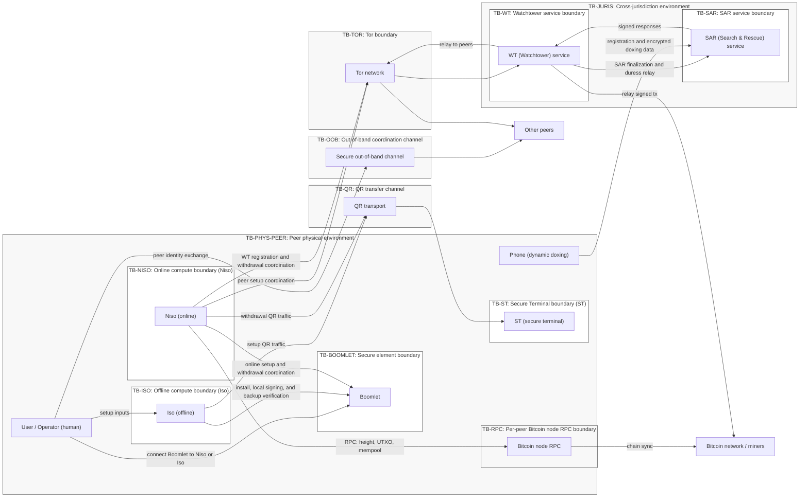
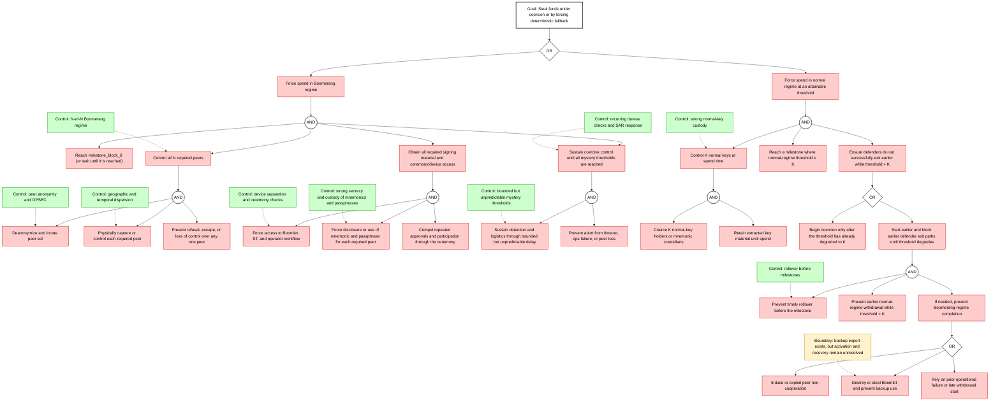
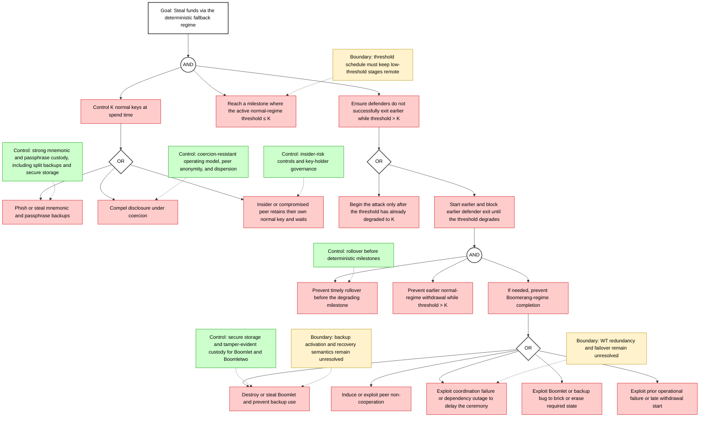
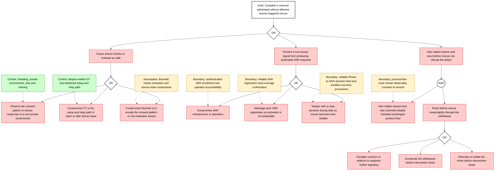
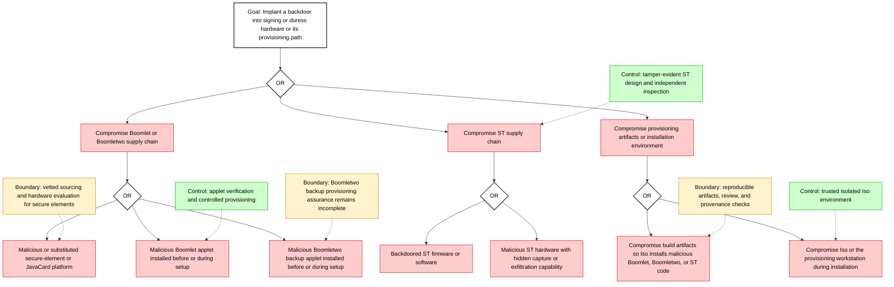

# Boomerang Threat Model

## Table of Contents

- [Scope & assumptions](#scope-assumptions)
- [Trust boundaries + Trust Boundary Diagram](#trust-boundaries)
- [Human & Physical Risk](#human-physical-risk)
- [Architecture & data flows](#architecture-data-flows)
- [Systematic attack identification](#systematic-attack-identification)
- [Risk register](#risk-register)
- [Attack / attack-defense trees](#attack-trees)
- [Mitigations & roadmap](#mitigations-roadmap)
- [Appendix A: STRIDE mapping](#appendix-stride)
- [Appendix B: OWASP mapping](#appendix-owasp)
- [Appendix C: CCSS mapping & roadmap](#appendix-ccss)
- [Appendix D: Detailed design gaps](#appendix-design-gaps)

---

## Scope & assumptions
[Back to Table of Contents](#table-of-contents)

### System summary

Boomerang is a Bitcoin cold-storage protocol designed to raise the cost of coercion by making withdrawals hardware-enforced and bounded but unpredictable in time, while embedding plausibly deniable duress signaling in the standard withdrawal path.

The design, as specified in the canonical message diagrams and design docs, has four relevant properties:

- **Taproot descriptor with two spending regimes**
  - **Boomerang regime, probabilistic and coercion-resistant:** spend becomes possible only after `milestone_block_0` and after each peer’s Boomlet reaches a secret internal threshold, `mystery`, through a coordinated ping/pong process that increments a local counter under strict freshness rules.
  - **Normal regime, deterministic fallback for liveness:** a waterfall of timelocked scripts gradually reduces the required signer threshold over future milestone block heights, for example 5-of-5 → 4-of-5 → … → 1-of-5 using **normal keys**.

- **Two-layer signing per peer in the Boomerang regime**
  - Each peer’s on-chain `boom_pubkey_i` is a **MuSig2 aggregate** of:
    - a mnemonic-backed **normal key** held and used by `Iso`, and
    - a **Boomlet-held non-exportable key share** held and used by `Boomlet`.
  - Implication: mnemonic compromise alone is insufficient to produce a Boomerang-regime signature; the corresponding Boomlet is also required.

- **Duress signaling**
  - Duress checks occur at commitment and at randomized intervals during the digging game.
  - `ST` is the trusted UI for duress challenges; `Boomlet` is the trusted evaluator.
  - A duress placeholder is embedded in protocol messages such that:
    - **no duress:** the placeholder decrypts to all-zero padding;
    - **duress:** the placeholder decrypts to `doxing_key` or equivalent unlock material, allowing `SAR` to decrypt the user’s encrypted doxing data and initiate rescue procedures.
  - `WT` forwards placeholders to `SAR`; `SAR` returns signed acknowledgements so the protocol flow stays unchanged while Boomlet still obtains assurance of receipt.

### In-scope components

Peers are joint custodians of the bitcoin involved. Per peer or operator, with five peers typical in the current design:

- **User:** the human operator.
- **Iso, offline:** key-derivation and signing environment for normal keys; interacts with Boomlet and ST.
- **Boomlet, secure element:** holds key share, enforces non-determinism, and runs duress logic.
- **Boomletwo, backup secure element:** backup of Boomlet state *excluding* `mystery`; activation procedure remains under design.
- **ST, Secure Terminal:** air-gapped, tamper-evident UI for user verification and duress challenges.
- **Niso, online:** networked coordinator per peer; handles Tor communications, talks to Bitcoin node RPC, interfaces with WT, and mediates QR flows to ST.
- **Phone:** used for SAR registration and the encrypted dynamic doxing feed.

External dependencies and services:

- **Bitcoin network / miners:** confirmation, timelocks, reorgs, fee market
- **Bitcoin node RPC endpoint(s)** used by each peer’s Niso
- **Tor network**
- **WT (Watchtower):** coordination service, liveness oracle, and relay for signed PSBTs / transactions
- **SAR (Search & Rescue):** receives encrypted doxing data, detects duress, and initiates physical response

### Out-of-scope

These items remain security-relevant but are outside the current model because the design does not yet specify them in enough detail:

- SAR’s real-world response procedures
- Detailed organizational governance
- Manufacturing processes for Boomlet / ST hardware
- Wallet UX beyond what is specified by the protocol messages

### Primary assets

**Custody / value assets**
- **Bitcoin funds** locked by the Boomerang Taproot output
- **Transaction authorization correctness:** PSBT contents, destination, amounts, fees

**Key material & cryptographic assets**
- `mnemonic`, `passphrase`, and derived **normal private keys**
- Boomlet-held `boom_musig2_privkey_share`, non-exportable
- Boomlet identity keypair for signing and encryption
- ST identity keypair for the Boomlet↔ST secure channel
- Tor onion-service secret keys for peer Niso addresses
- WT and SAR long-term signing / encryption keys

**Duress & safety assets**
- `duress_consent_set`
- `doxing_password` / `doxing_key` and derived `doxing_data_identifier`
- **Static doxing data** and **dynamic doxing feed**

**Protocol state assets**
- Per-Boomlet `mystery` and `counter`
- `boomerang_params` and `boomerang_descriptor`
- Protocol transcripts
- Milestone schedule, `milestone_block_collection`

### Security objectives

**Funds protection**
- Prevent unauthorized spending in both regimes.
- Prevent silent transaction tampering.
- Ensure recoverability in the normal regime under loss scenarios, while managing the associated risk.

**Coercion resistance**
- Under coercion, reduce attacker confidence in *time to cash-out*.
- Provide unavoidable, plausibly deniable duress signaling with minimal observable divergence.
- Preserve a reaction window for SAR response and deterrence.

**Privacy & safety**
- Minimize metadata that could enable targeting of key holders.
- Protect doxing data and duress signals from unauthorized disclosure.
- Resist correlation attacks that deanonymize peers, schedules, or duress events.

**Integrity & liveness**
- Prevent protocol-state desynchronization and replay.
- Ensure withdrawal completes when honest peers cooperate and dependencies are available.
- Ensure failures degrade safely, preferably fail-closed in the Boomerang regime.

### High-impact assumptions

Assumptions that materially affect risk ratings.

- **Boomlet secure-element security holds**
- **ST integrity holds**
- **Cryptography holds for the message set and signing flows**
- **Software build, update, and deployment paths for Iso, Niso, ST, Boomlet, WT, and SAR are trustworthy enough**
- **At least one honest peer exists**
- **Bitcoin timelocks behave as expected**
- **`most_work_bitcoin_block_height` obtained by Niso and WT is trustworthy enough to drive milestone gating, freshness, and counter advancement**
- **Local freshness checks, `tx_id`, and signed transcripts are sufficient to keep each setup instance and withdrawal ceremony correctly bound**
- **`tx_id` continuity is sufficient to preserve operator intent across PSBT hydration and final signing**
- **SAR acknowledgements are bound to the exact duress-placeholder instance and do not create a publicly distinguishable safe branch or duress branch**
- **Only one of Boomlet and Boomletwo is ever active for a given peer identity**
- **WT and SAR remain available**
- **Peers have a secure out-of-band channel**

### Key unknowns blocking production readiness

Items that block production-readiness claims.

- Exact values and selection policy for the non-determinism and duress-check parameters
- Reorg-handling policy
- WT / SAR redundancy model
- Cryptographic details: AEAD mode, KDF, transcript binding, serialization
- Boomletwo activation / recovery protocol
- Software supply chain and update mechanisms
- Monitoring, alerting, and incident-response workflows

### Open design boundaries

Current-stage security boundaries that remain unresolved.

| Boundary | Why it matters now |
| --- | --- |
| **Chain view and reorg policy** | Milestone gating, freshness, and counter advancement depend on chain view, but reorg and divergent-node policy is not yet fixed. |
| **Setup / withdrawal binding** | Binding still relies on local freshness checks, `tx_id`, and signed context rather than one authenticated setup or withdrawal session identifier. |
| **Hydrated PSBT authorization contract** | Niso hydrates the PSBT after the digging game and Boomlet checks `tx_id` continuity, but allowed mutations and re-verification duties are not fixed. |
| **Boomlet and Boomletwo activation semantics** | Backup export and import exist, but activation, deactivation, and the one-active-device invariant are not yet fixed. |
| **Duress-placeholder lifecycle** | Safety still depends on placeholder-instance binding, SAR replay memory, signed acknowledgements, and timing discipline that does not distinguish safe from duress. |
| **Operational transitions** | Device movement, replacement, and recovery for Phone, Niso, ST, WT selection, and SAR-set changes remain only partly specified. |
| **Honest-path liveness / fairness policy** | Completion still depends on peer availability, timeout policy, blame handling, and scheduler or service fairness that the corpus does not yet define. |
| **Parameter selection and timing policy** | Security still depends on workable choices for milestones, mystery range, duress cadence, and freshness tolerances. |
| **Cryptographic profile and canonical transcript encoding** | AEAD and KDF choices, authoritative serializations, transcript objects, and message-binding rules are not yet fixed. |
| **Trusted-hardware assurance boundary** | Boomlet and ST are treated as trusted boundaries, but attestation, audit, hardening profile, and production assurance remain incomplete. |
| **Software supply chain and service implementation security** | Build pipelines, update paths, deployment hardening, patching discipline, and ordinary implementation hardening are not yet fixed. |
| **WT / SAR service governance and accountability** | WT and SAR behavior, failover, single-SAR semantics, misuse resistance, and jurisdictional fit are not yet fully specified. |
| **Privacy and network exposure policy** | Tor, RPC, WT, SAR, and doxing-data flows still lack a final minimization policy for metadata leakage, correlation, and acceptable exposure. |

Boomlet and ST are treated as trusted devices. The cited prototype materials do not establish production-grade tamper resistance, secure boot, or hardened lifecycle controls.

## Trust boundaries + Trust Boundary Diagram
[Back to Table of Contents](#table-of-contents)

Boomerang depends on hard separation between offline and online systems, between human intent and host-mediated I/O, and between local components and external coordination services. The boundaries below are used consistently across the DFD, threat catalog, and risk register.

### Trust boundary list

| Boundary ID  | Boundary type  | Name                        | What it separates                                         | Why it exists / security meaning                                 |
| ------------ | -------------- | --------------------------- | --------------------------------------------------------- | ---------------------------------------------------------------- |
| TB-PHYS-PEER | Environment    | Peer physical environment   | Peer operators and devices vs. the surrounding world      | Theft, coercion, observation, device swap, and unsafe travel     |
| TB-ISO       | Device/Host    | Iso offline host            | Iso execution environment vs. networked or untrusted host contexts | Protect normal keys; reduce signing-time malware risk            |
| TB-BOOMLET   | Device/Host    | Boomlet secure-element devices | Boomlet and Boomletwo internal state vs. attached hosts | Protect non-exportable key share and backup state; enforce non-determinism and duress logic |
| TB-ST        | Device/Host    | ST trusted UI device        | ST UI and key store vs. attached hosts and observers      | Prevent duress-input and verification manipulation               |
| TB-NISO      | Device/Host    | Niso online host            | Niso OS and applications vs. external networks and services | High malware exposure; untrusted for duress integrity            |
| TB-QR        | Channel/Service | QR transfer channel            | Air-gapped devices vs. optical mediators                       | Prevent direct electronic exfiltration; add parsing and swapping risk |
| TB-OOB       | Channel/Service | Out-of-band coordination channel | Peer identity verification vs. attacker-controlled communications | Peer identity and parameters must be verified                    |
| TB-TOR       | Channel/Service | Tor communication path         | Peer onion services vs. the public Internet                    | Provide anonymity with correlation and DoS exposure              |
| TB-RPC       | Channel/Service | Per-peer Bitcoin node RPC path | Niso vs. the peer's chosen Bitcoin node endpoint(s)            | Block height and chain state are security-critical               |
| TB-WT        | Channel/Service | Watchtower service             | Peer systems vs. WT infrastructure, keys, and logs             | Central for liveness, metadata, and transcript routing           |
| TB-SAR       | Channel/Service | SAR service                    | Peer systems vs. SAR infrastructure, keys, operators, and data stores | Holds PII and handles physical response                          |
| TB-JURIS     | Environment    | Cross-jurisdiction environment | Operators, WT, and SAR across legal regimes               | Compelled disclosure or forced inaction can occur                |

### Cross-boundary flows

- **F-QR-1:** Iso ↔ ST over QR during setup key exchange and duress-set confirmation
- **F-QR-2:** Niso ↔ ST over QR during withdrawal `tx_id` verification and duress checks
- **F-USB-1:** Boomlet ↔ Iso during setup and final signing
- **F-USB-2:** Boomlet ↔ Niso during online setup and withdrawal
- **F-USB-3:** Boomletwo ↔ Iso during backup installation and backup import
- **F-NET-1:** Niso ↔ peer Nisos via Tor during setup coordination
- **F-NET-2:** Niso ↔ WT via Tor during registration and withdrawal coordination
- **F-NET-3:** WT ↔ SAR during SAR finalization and duress handling
- **F-NET-4:** Phone ↔ SAR during registration and dynamic doxing updates
- **F-RPC-1:** Niso ↔ per-peer Bitcoin node RPC
- **F-OOB-1:** User ↔ other peers through secure out-of-band channels

### Trust Boundary Diagram

```mermaid
flowchart LR
  %% External actors / networks (not a single trust boundary)
  BTC["Bitcoin network / miners"]
  PEERS["Other peers"]

  subgraph OOBB["TB-OOB: Out-of-band coordination channel"]
    OOB["Secure out-of-band channel"]
  end

  subgraph QRB["TB-QR: QR transfer channel"]
    QR["QR transport"]
  end

  subgraph TORB["TB-TOR: Tor boundary"]
    TOR["Tor network"]
  end

  subgraph JURB["TB-JURIS: Cross-jurisdiction environment"]
    subgraph WTB["TB-WT: Watchtower service boundary"]
      WT["WT (Watchtower) service"]
    end

    subgraph SARB["TB-SAR: SAR service boundary"]
      SAR["SAR (Search & Rescue) service"]
    end
  end

  subgraph PEER["TB-PHYS-PEER: Peer physical environment"]
    USER["User / Operator (human)"]

    subgraph OFF["TB-ISO: Offline compute boundary (Iso)"]
      ISO["Iso (offline)"]
    end

    subgraph BOOMB["TB-BOOMLET: Secure element boundary"]
      BOOM["Boomlet"]
    end

    subgraph STB["TB-ST: Secure Terminal boundary (ST)"]
      ST["ST (secure terminal)"]
    end

    subgraph ON["TB-NISO: Online compute boundary (Niso)"]
      NISO["Niso (online)"]
    end

    subgraph RPCB["TB-RPC: Per-peer Bitcoin node RPC boundary"]
      NODE["Bitcoin node RPC"]
    end

    PHONE["Phone (dynamic doxing)"]
  end

  USER -- "setup inputs" --> ISO
  USER -- "connect Boomlet to Niso or Iso" --> BOOM

  ISO -- "install, local signing, and backup verification" --> BOOM
  NISO -- "online setup and withdrawal coordination" --> BOOM

  USER -- "peer identity exchange" --> OOB
  OOB --> PEERS

  ISO -- "setup QR traffic" --> QR
  NISO -- "withdrawal QR traffic" --> QR
  QR --> ST

  NISO -- "peer setup coordination" --> TOR
  TOR --> PEERS
  NISO -- "WT registration and withdrawal coordination" --> TOR
  TOR --> WT
  NISO -- "RPC: height, UTXO, mempool" --> NODE
  NODE -- "chain sync" --> BTC

  WT -- "relay signed tx" --> BTC
  WT -- "relay to peers" --> TOR
  WT -- "SAR finalization and duress relay" --> SAR
  SAR -- "signed responses" --> WT
  PHONE -- "registration and encrypted doxing data" --> SAR

  %% Styling for boundary boxes
  style OOBB fill:#f8f8f8,stroke:#333,stroke-width:1px
  style QRB fill:#f8f8f8,stroke:#333,stroke-width:1px
  style TORB fill:#f8f8f8,stroke:#333,stroke-width:1px
  style RPCB fill:#f8f8f8,stroke:#333,stroke-width:1px
  style JURB fill:#f8f8f8,stroke:#333,stroke-width:1px
  style WTB fill:#ffffff,stroke:#333,stroke-width:1px
  style SARB fill:#ffffff,stroke:#333,stroke-width:1px
  style PEER fill:#f8f8f8,stroke:#333,stroke-width:1px
  style OFF fill:#ffffff,stroke:#333,stroke-width:1px
  style BOOMB fill:#ffffff,stroke:#333,stroke-width:1px
  style STB fill:#ffffff,stroke:#333,stroke-width:1px
  style ON fill:#ffffff,stroke:#333,stroke-width:1px
```

**Interpretation**

- Boomerang’s strongest intended security properties depend on TB-BOOMLET and TB-ST holding.  
- Boomerang’s strongest intended availability properties depend on TB-WT and TB-RPC behaving correctly, or having redundancy and failover.  
- Coercion resistance is fundamentally a **human + physical** problem; the technical protocol mainly shapes incentives and time.

---

## Human & Physical Risk
[Back to Table of Contents](#table-of-contents)

Boomerang is designed for a threat environment in which physical coercion is credible. Human operators, facilities, travel patterns, and operational discipline are therefore first-class attack surfaces.

### Human/physical threat scenarios

| Scenario                                                            | Trust boundaries involved          | Primary assets at risk                   | What can go wrong                                                                                    | Candidate mitigations, design and operations                                                                                                 |
| ------------------------------------------------------------------- | ---------------------------------- | ---------------------------------------- | ---------------------------------------------------------------------------------------------------- | -------------------------------------------------------------------------------------------------------------------------------------------- |
| **Coercion or wrench attack** on one peer during withdrawal         | TB-PHYS-PEER, TB-ST, TB-BOOMLET    | Funds, user safety, duress secrecy       | Attacker forces approvals or continuation, tries to detect or bypass duress, or holds the victim until completion | Boomerang non-determinism; duress checks via ST; SAR response; safe-room procedures; operator drills; split-knowledge procedures |
| **Coercion on multiple peers, kidnapping, or round-up**             | TB-PHYS-PEER, TB-OOB               | Funds, user safety                       | Attacker captures multiple peers, or learns enough identity and schedule data to stage a simultaneous round-up | Geographic dispersion; time-zone dispersion; compartmentalized peer identity sharing; travel OPSEC; independent alerting paths |
| **Insider collusion** among peers                                   | TB-OOB, TB-PHYS-PEER               | Funds, governance integrity              | Colluding peers wait out waterfall timelocks; or coordinate coercion                                 | Legal agreements; choose milestones to make late-stage far future; monitoring and alerts |
| **Social engineering, including phishing and fake ceremonies**      | TB-OOB, TB-PHYS-PEER, TB-SAR       | Normal keys, peer set integrity, rescue readiness, privacy | Steals mnemonics; reroutes peer or WT Tor addresses; tricks the operator into fake SAR enrollment or ceremony steps | Multi-channel fingerprint checks; pinned keys; authenticated SAR directory; training; anti-phishing playbooks |
| **Credential theft, including mnemonic or passphrase compromise**   | TB-PHYS-PEER, TB-ISO               | Normal keys                              | Theft or coerced disclosure enables later deterministic theft once normal-key stages open            | Strong passphrases; split backups; secure storage; anti-phishing discipline |
| **Process non-compliance, such as missed rollover or skipped checks** | TB-PHYS-PEER, TB-OOB             | Funds, coercion resistance               | Users miss rollover windows or skip required checks, allowing the protocol to drift into weaker deterministic stages | Mandatory rollover schedule; automated reminders; rehearsals; documented exception handling and sign-off |
| **Operator error, including wrong milestones, outputs, or network** | TB-PHYS-PEER, TB-ISO, TB-ST        | Funds, liveness                          | Setup produces the wrong descriptor or milestones; withdrawal signs the wrong transaction or wrong network | Strict checklists; independent operator-side transaction review on dedicated hardware; testnet rehearsals; sanity checks and invariants in Iso |
| **Travel and commute risk, including surveillance or ambush**       | TB-PHYS-PEER                       | User safety, anonymity                   | Attacker identifies peer movements and targets vulnerable moments                                    | Vary routines; secure transport; avoid role disclosure; compartmentalize identities; personal-security procedures |
| **Site access failures, including unauthorized storage access**     | TB-PHYS-PEER                       | Devices, backups                         | Evil-maid installs implants or swaps devices; steals backups                                         | Access control, alarms, cameras; tamper seals; inventory |
| **Device theft or tampering of ST or Boomlet**                      | TB-PHYS-PEER, TB-BOOMLET, TB-ST    | Duress secrecy, protocol integrity, keys | Attacker tampers with trusted devices, learns consent-set material, or destroys Boomerang-state devices to force fallback | Certified secure element; tamper resistance; secure storage; spare devices; incident response |
| **Environmental disasters, including fire, flood, or EMP**          | TB-PHYS-PEER                       | Devices, backups                         | Damage or destruction forces fallback or makes recovery impossible                                   | Geo-redundant storage; fireproof safes; Faraday protection; disaster recovery drills |
| **Power interruption during signing or backup procedures**          | TB-PHYS-PEER, TB-BOOMLET, TB-ISO   | Signing state, liveness                  | Interrupted sessions cause partial state, nonce reuse, or lost progress                              | Atomic signing sessions; anti-rollback; UPS; recovery paths |
| **Jurisdictional or legal coercion of SAR or operators**            | TB-JURIS, TB-SAR                   | PII, user safety, service availability   | SAR forced to reveal data, delay action, or refuse service; operator compelled disclosure            | Minimize PII; legal counsel; documented policies; transparency reports |

### Duress mechanism assumptions

The duress mechanism assumes two things:
- the attacker cannot observe consent-set entry without detection by the user; and
- ST does not leak consent-set material.

- The attacker cannot observe both the ST display and the user's selection behavior well enough to learn the consent set.
- ST does not leak consent-set material.
- Users can reproduce the consent set reliably under stress, fatigue, or coercion.

These assumptions are operationally fragile. Cameras, multiple attackers, and controlled environments directly weaken them. Shielding, private environments, and operator drills remain necessary.

Primary coercion campaign: [Tree 0](#attack-trees).

### Operational hardening checklist

**People**
- Run regular coercion, recovery, and rollover drills.
- Minimize who knows peer identities and custody roles.

**Facilities**
- Use secure, access-controlled environments for setup, backup, and withdrawal ceremonies.
- Maintain tamper-evident seals and inspection logs for ST, Boomlet, and Boomletwo.
- Keep Boomlet, Boomletwo, and mnemonic backups in geographically separated storage.

**Travel**
- Avoid predictable patterns and role disclosure.
- Use secure transport and avoid carrying all critical devices or backups together.

**Incident response**
- Predefine device-loss, coercion-suspected, and missed-rollover playbooks.
- Maintain a rehearsed rollover or fund-movement plan before deterministic stages.

---

## Architecture & data flows
[Back to Table of Contents](#table-of-contents)

The trust-boundary-aware data-flow diagram below summarizes the current design at a system level.

### Data flow diagram with trust boundaries

**Legend**

- **Processes**: rounded rectangles
- **Data stores**: cylinders
- **External entities**: rectangles
- **Trust boundaries**: shown as subgraphs (named)

```mermaid
flowchart TB
  PEERS[Other peers]

  %% Peer boundary
  subgraph TBPHYS["TB-PHYS-PEER: Peer physical environment"]
    USER([User/Operator])

    subgraph TBISO["TB-ISO: Offline boundary"]
      ISO([Iso process])
      D_MN[(Mnemonic and passphrase backup, paper or metal, in safe)]
    end

    subgraph TBBOOM["TB-BOOMLET: Secure element boundary"]
      BOOM([Boomlet applet])
      D_BOOM[(Boomlet secure state:
key shares, mystery, counters,
duress consent set, identity keys)]
      BOOM --> D_BOOM
    end

    subgraph TBST["TB-ST: Secure Terminal boundary"]
      ST([ST firmware])
      D_ST[(ST key store:
st_identity_privkey,
boomlet_identity_pubkey)]
      ST --> D_ST
    end

    subgraph TBNISO["TB-NISO: Online boundary"]
      NISO([Niso process])
      D_NISO[(Niso state and logs:
peer addresses, transcripts,
PSBTs, notifications)]
      NISO --> D_NISO
    end

    subgraph TBRPC["TB-RPC: Per-peer Bitcoin node RPC boundary"]
      RPC[[Bitcoin node RPC]]
    end

    PHONE([Phone app])
  end

  %% External boundaries
  subgraph TBQR["TB-QR: QR transfer channel"]
    QR[[QR transport]]
  end
  subgraph TBOOB["TB-OOB: Out-of-band coordination channel"]
    OOB[[Secure out-of-band channel]]
  end
  subgraph TBTOR["TB-TOR: Tor network"]
    TOR[[Tor]]
  end
  subgraph TBWT["TB-WT: Watchtower boundary"]
    WT([WT service])
    D_WT[(WT state and logs:
registrations, transcripts,
timestamps)]
  end
  subgraph TBSAR["TB-SAR: SAR boundary"]
    SAR([SAR service])
    D_SAR[(Doxing data store:
static+dynamic encrypted data,
identifiers, audit logs)]
  end
  BTC[[Bitcoin network]]

  %% Flows (setup)
  USER -- "setup inputs:
network, entropy,
passphrase, SAR IDs,
milestones" --> ISO
  ISO -- "derive normal_pubkey
(m/cb86')
create mnemonic" --> D_MN
  ISO -- "install params:
normal_pubkey, doxing_key,
SAR IDs, network" --> BOOM

  %% ST key exchange and duress setup
  BOOM -- "boomlet_identity_pubkey" --> ISO
  ISO -- "boomlet_identity_pubkey by QR" --> QR
  QR --> ST
  ST -- "st_identity_pubkey by QR" --> QR
  QR --> ISO
  ISO -- "st_identity_pubkey" --> BOOM
  BOOM -- "duress_check_space encrypted" --> ISO
  ISO -- "duress challenge by QR" --> QR
  QR --> ST
  ST -- "display duress challenge" --> USER
  USER -- "duress consent input" --> ST
  ST -- "duress consent indices by QR" --> QR
  QR --> ISO
  ISO -- "duress consent indices" --> BOOM
  BOOM -- "store duress_consent_set" --> D_BOOM

  %% Setup: ST-assisted parameter verification and OOB exchange
  BOOM -- "boomerang params seed encrypted" --> NISO
  NISO -- "peer IDs, Tor addresses, WT IDs,\nmilestones, boomerang params seed by QR" --> QR
  QR --> ST
  ST -- "display peer IDs and params" --> USER
  USER -- "peer and params acknowledgement" --> ST
  ST -- "signed params confirmation by QR" --> QR
  QR --> NISO
  NISO --> BOOM
  USER -- "peer identity exchange" --> OOB
  OOB --> PEERS
  PEERS --> OOB
  OOB --> USER

  %% Setup: online peer coordination
  NISO -- "peer_ids, tor addresses,
WT IDs, milestones" --> BOOM
  NISO -- "peer setup coordination over Tor" --> TOR
  TOR --> PEERS
  NISO -- "WT registration over Tor" --> TOR
  TOR --> WT
  WT --> D_WT
  WT -- "forward SAR finalization" --> SAR --> D_SAR
  SAR -- "setup response" --> WT
  WT -- "registration and setup receipts over Tor" --> TOR
  TOR --> NISO

  %% Phone to SAR during setup and ongoing use
  USER -- "doxing_password,
static doxing data,
SAR IDs" --> PHONE
  PHONE -- "doxing_data_identifier,
encrypted doxing data" --> SAR

  %% Withdrawal flow at a high level
  USER -- "unsigned PSBT" --> NISO
  NISO -- "psbt + height checks" --> RPC
  RPC -- "chain data" --> NISO
  RPC <--> BTC
  BOOM -- "tx_id challenge encrypted" --> NISO
  NISO -- "tx_id and duress challenges by QR" --> QR
  QR --> ST
  ST -- "display tx_id and duress prompts" --> USER
  USER -- "approval or duress response" --> ST
  ST -- "user approval and duress response by QR" --> QR
  QR --> NISO
  NISO -- "approval to Boomlet" --> BOOM

  %% WT-mediated approvals, commits, and pings
  NISO -- "approvals, commits, and pings over Tor" --> TOR --> WT
  WT -- "relay to peers over Tor" --> TOR --> PEERS
  WT -- "approvals, pongs, and reached_pings over Tor" --> TOR --> NISO
  WT -- "duress placeholder" --> SAR
  SAR -- "signed ack" --> WT

  %% Final signing

  USER -- "network, mnemonic, passphrase" --> ISO
  ISO <--> BOOM
  ISO -- "local MuSig2
partialsig exchange" --> BOOM

  BOOM -- "signed PSBT" --> NISO --> WT
  WT -- "aggregate PSBTs
broadcast tx" --> BTC
```

### Data classification

The classification below combines custody impact, safety impact, and privacy sensitivity rather than using a pure confidentiality label.

| Data                                           | Classification                    | Notes                                                                     |
| ---------------------------------------------- | --------------------------------- | ------------------------------------------------------------------------- |
| Mnemonic, passphrase, normal private keys      | **Critical secret**               | Compromise enables deterministic theft later                              |
| Boomlet key shares + identity private key      | **Critical secret**               | Compromise breaks Boomerang regime, privacy, and duress                   |
| Duress consent set                             | **Critical secret**               | If learned, a coercer can bypass the duress mechanism                     |
| Doxing data (static + dynamic)                 | **Critical safety-sensitive PII** | Compromise enables targeting and harm                                     |
| Doxing key / identifier                        | **Critical secret / metadata**    | Password-derived; compromise weakens rescue privacy and duress safety     |
| Boomerang descriptor, peer IDs                 | **Sensitive configuration**       | Key substitution is catastrophic                                          |
| Protocol transcripts                           | **Sensitive metadata**            | Linkability and timing can enable targeting                               |
| Signed PSBTs / transaction                     | **Public after broadcast**        | Before broadcast, still sensitive                                         |

### Protocol parameter surface

The design defines at least the following parameter families:

- Milestone and fallback schedule:
  - `milestone_block_0`
  - later `milestone_block_*` values that control deterministic fallback stages

- Mystery and digging-game range:
  - per-peer `mystery`
  - `MIN_TRIES_FOR_DIGGING_GAME_IN_BLOCKS`
  - `MAX_TRIES_FOR_DIGGING_GAME_IN_BLOCKS`

- Non-determinism window:
  - the effective interaction between `mystery`, digging-game bounds, and milestone spacing

- Duress check cadence:
  - `DURESS_CHECK_INTERVAL_IN_BLOCKS`
  - recurring-duress trigger behavior and any PRNG-state assumptions that drive it

- Freshness and tolerance windows:
  - `TOLERANCE_IN_BLOCKS_FROM_TX_APPROVAL_BY_INITIATOR_PEER_TO_TX_APPROVAL_BY_WT`
  - `TOLERANCE_IN_BLOCKS_FROM_CREATING_PING_TO_RECEIVING_ALL_PINGS_BY_WT_AND_HAVING_SAR_RESPONSE_BACK_TO_WT`
  - `REQUIRED_MINIMUM_DISTANCE_IN_BLOCKS_BETWEEN_PING_AND_PONG`
  - …and several more `TOLERANCE_*` / `REQUIRED_MINIMUM_DISTANCE_*` constraints

Implication: these parameters define the adversary’s feasible delay and replay windows and materially affect coercion cost, false positives, and liveness. Parameter selection belongs under explicit security governance, with test coverage and operational monitoring.

### Current protocol-binding boundaries

- Setup currently binds state through local freshness checks, peer and service identity checks, and signed transcripts. Withdrawal adds committed `tx_id`, later approvals, and signing-state continuity. The current design still does not define one authenticated setup-instance identifier or one authenticated withdrawal-session identifier spanning the full ceremony.
- After the digging game, Niso hydrates the PSBT and Boomlet checks that the derived `tx_id` still matches the committed transaction. The exact hydration contract, including allowed mutations, operator-side re-verification duties, and failure handling, remains a boundary.
- Duress safety depends on the exact placeholder instance, SAR replay memory, and signed acknowledgement reaching the originating Boomlet without a publicly distinguishable safe branch or duress branch.

---

## Systematic attack identification
[Back to Table of Contents](#table-of-contents)

The checklist below is intended for design review, implementation review, tabletop exercises, and red-team planning. It spans cyber, cryptographic, supply-chain, insider, and physical / coercion attack classes and preserves traceability to both the STRIDE catalog and the risk register.

- Each row maps to **Threat IDs** (STRIDE catalog) and **Risk IDs** (risk register).
- Use this checklist during design reviews, implementation reviews, tabletop exercises, and red-team planning.
- The main threat tables in this document apply to the current canonical design only. Future architecture concerns belong in the roadmap or in the open design boundaries above, not in the threat inventory.

### Attack Pattern Checklist

| Attack Pattern                                                                                                                                                                                                                            | Applicable components/flows/stores/boundaries                                     | Likely impact                                                                                                                      | Candidate mitigations                                                                                                                         | Mapped Threat IDs/Risk IDs                   |
| ----------------------------------------------------------------------------------------------------------------------------------------------------------------------------------------------------------------------------------------- | --------------------------------------------------------------------------------- | ---------------------------------------------------------------------------------------------------------------------------------- | --------------------------------------------------------------------------------------------------------------------------------------------- | -------------------------------------------- |
| Supply chain compromise of secure element or JavaCard applet through malicious firmware, malicious applet, or backdoored RNG                                                                                                             | TB-BOOMLET provisioning flows; Iso↔Boomlet installation                            | Key extraction; predictable mystery or PRNG; duress bypass; theft of funds; false duress                                           | Vendor due diligence; attestation; reproducible builds; independent labs; diversified hardware; secure provisioning; tamper-evident packaging | T-SE-01, T-SC-01 / R-01, R-24                |
| Supply chain compromise of ST through firmware backdoor or covert exfiltration                                                                                                                                                            | ST boundary TB-ST; ST key store; QR flows                                         | Consent-set compromise; duress manipulation; user approval spoofing                                                                | Secure boot; signed firmware; disable radios; tamper seals; reproducible builds; independent device audits                                    | T-ST-01 / R-02, R-24                         |
| Device substitution, including evil-maid swap, of Boomlet, ST, Iso, or Niso                                                                                                                                                              | TB-PHYS-PEER; device identity checks; USB and QR flows                            | Key theft; message forgery; duress bypass; funds loss                                                                              | Inventory and seals; attestation; challenge-response identity checks; controlled ceremonies                                                   | T-SPOOF-02, T-PHYS-03 / R-19                 |
| Niso malware performs Tor MITM, traffic fingerprinting, or onion key theft                                                                                                                                                                | TB-NISO; TB-TOR; Boomlet-held Tor key material                                    | Deanonymization; protocol disruption; MITM                                                                                         | Harden Niso; keep Tor key material out of general-purpose user workflows; rotate onion keys; traffic padding                                 | T-NISO-01, T-INFO-04, T-INFO-06 / R-08, R-16 |
| Offline Iso compromise via removable media during setup or withdrawal signing                                                                                                                                                             | Iso offline boundary TB-ISO; mnemonic and passphrase handling; PSBT signing       | Normal key theft; forged signatures; funds theft                                                                                   | True air-gap; ephemeral OS; deterministic builds; no network hardware; malware scanning of media                                              | T-ISO-01 / R-15, R-24                        |
| WT equivocation, sending different views or collections to different peers                                                                                                                                                                 | TB-WT; collections of approvals, commits, and pings                               | State desync; liveness failure; coercion window reduction if peers are confused                                                    | Peers sign and cross-verify collections; transcript hashes; WT transparency logs; failover policy                                              | T-TAMP-06 / R-05, R-25                       |
| DoS on WT or SAR                                                                                                                                                                                                                           | TB-WT; TB-SAR; TB-TOR                                                             | Withdrawal unavailable; duress acknowledgement blocked                                                                             | Redundancy; failover; rate limiting; alternative channels; service-level monitoring                                                           | T-DOS-01, T-DOS-02 / R-05, R-13, R-22        |
| Bitcoin node RPC lies, eclipse attack, or reorg exploitation                                                                                                                                                                              | TB-RPC; WT height comparison                                                      | Premature milestone checks; counter manipulation; protocol desync                                                                  | Multiple nodes; header and chainwork validation; compare WT vs node; anti-eclipse                                                            | T-BTC-01, T-SPOOF-05 / R-09                  |
| Replay or delayed delivery of signed messages across Tor                                                                                                                                                                                  | All Tor flows; approvals, commits, and pings; nonce fields                        | State desync, liveness failure, or unauthorized progression if freshness checks fail                                               | Strict nonce and sequence-number checks; freshness windows; unique message IDs; caching                                                       | T-REPLAY-01 / R-10, R-14                     |
| Coercer captures one or more peers and forces withdrawal                                                                                                                                                                                  | TB-PHYS-PEER; ST duress input; operator devices                                   | Fund theft attempt; user harm; duress signal; forced determinism                                                                   | Boomerang non-determinism; duress signal to SAR; operational OPSEC; private environments; split-knowledge procedures; travel security        | T-HUM-01, T-PHYS-01 / R-03, R-12             |
| Insider collusion among peers to wait out waterfall timelocks                                                                                                                                                                             | Out-of-band peer coordination boundary TB-OOB                                     | Funds theft in deterministic stages                                                                                                | Governance agreements; monitoring                                                                                                             | T-INS-01 / R-04                              |
| Social engineering or phishing subverts peer verification during setup                                                                                                                            | TB-OOB; setup verification; operator workflow                                     | Descriptor substitution; wrong peer set or WT binding                                                                             | Training; authenticated out-of-band verification of peers; anti-phishing procedures                                                           | T-SPOOF-01, T-TAMP-04 / R-17                 |
| Legal or jurisdictional coercion of SAR or operators                                                                                                                                                                                      | Jurisdiction boundary TB-JURIS; SAR operations                                    | PII disclosure; forced inaction; compelled assistance                                                                              | Minimization; legal counsel; transparency reports; encryption                                                                                 | T-LEGAL-01 / R-06                            |
| Malicious QR payload triggers parser vulnerability on ST or Niso                                                                                                                                                                           | TB-QR; ST firmware; Niso software                                                 | Code execution; key theft; protocol manipulation                                                                                   | Memory-safe parsing libraries where practical; fuzzing; strict size limits; sandboxing                                                        | T-EOP-04, T-MEM-01 / R-11                    |
| QR swapping or overlay attack corrupts or replays visual messages                                                                                                                                                                         | TB-QR; QR displays on Iso and Niso                                                | Ceremony interruption, message disclosure, or parser exploitation; silent approval bypass should fail if nonce and content checks hold | Nonces; freshness checks; authenticated framing; human-verifiable digests where practical; secure environment                              | T-PHYS-02, T-TAMP-02 / R-11, R-19            |
| ECDH key reuse without AEAD or proper KDF leads to ciphertext malleability or key recovery                                                                                                                                                | Boomlet↔ST, Boomlet↔WT, Boomlet↔SAR encryption                                    | Message tampering; duress placeholder distinguishability; key leakage                                                              | HKDF + domain separation; AEAD (AES-GCM/ChaCha20-Poly1305); unique nonces; transcript binding                                                 | T-CRYPTO-01 / R-14                           |
| Weak doxing_password allows brute-force recovery of doxing_key and decryption of PII                                                                                                                                                     | SAR data store; phone dynamic feed                                                | PII compromise; targeting; weakening duress protection                                                                             | Argon2id with salt; strong passphrase policy                                                                                                  | T-CRYPTO-03 / R-07                           |
| Side-channel attack through power, EM, or timing on Boomlet during signing or PRNG use                                                                                                                                                    | Boomlet boundary TB-BOOMLET; signing flow Iso↔Boomlet                             | Key share leakage; mystery leakage; PRNG prediction                                                                                | Certified secure element; constant-time code; side-channel resistant implementation; shielding; limit signing frequency; lab testing          | T-SE-03 / R-01                               |
| Fault injection or glitching of Boomlet skips freshness, duress-evaluation, or counter checks                                                                                                                                             | Boomlet; ping and commit checks                                                   | Bypass non-determinism; suppress duress; sign early                                                                                | Fault-resistant SE; redundant checks; control-flow integrity; counters in secure NV storage; tamper response                                  | T-SE-04 / R-01, R-25                         |
| Compromise of peer normal key mnemonic through phishing, theft, or insecure backup                                                                                                                                                        | Mnemonic backups; Iso inputs; physical safes                                      | Funds theft in deterministic regime; blackmail                                                                                     | Split backups; split storage; strong passphrase; access controls                                                                              | T-KEY-01, T-HUM-02 / R-03, R-15              |
| Passphrase capture through shoulder surfing, coercion, or keylogging reduces mnemonic security                                                                                                                                            | Iso; user handling                                                                | Normal key compromise                                                                                                              | Long passphrase; never type on networked devices; protected entry procedures; memory-only handling where feasible                             | T-HUM-02 / R-15                              |
| Phone compromise causes dynamic doxing data spoofing or leakage                                                                                                                                                                           | Phone boundary; phone↔SAR channel                                                 | Misleading SAR; privacy loss; attacker tracking                                                                                    | Harden phone; use dedicated device; minimal apps; OS updates; frequent key rotation; include integrity protection for the feed               | T-PHONE-01 / R-06, R-20                      |
| SAR database breach (static doxing data ciphertext, identifiers, metadata)                                                                                                                                                                | SAR data store                                                                    | PII leak; targeting; offline cracking                                                                                              | Encrypt-at-rest with HSM; minimize fields; split storage; access controls; breach response                                                    | T-INFO-01, T-DATA-01 / R-06, R-07            |
| WT database breach (peer IDs, Tor addresses, fingerprints, timestamps)                                                                                                                                                                    | WT data store                                                                     | Deanonymization; targeting; protocol disruption                                                                                    | Minimize retention; encrypt; pseudonyms; rotate Tor addresses; security audits                                                                | T-INFO-03 / R-16, R-20                       |
| WT insider leak exposes which peers are participating and their schedules                                                                                                                                                                  | WT organization and service logs                                                  | Targeting for coercion                                                                                                             | Strong governance; background checks; least privilege; auditing; encryption                                                                   | T-HUM-04, T-INFO-03 / R-16, R-20             |
| Peer non-cooperation or deliberate stalling forces determinism, extorts others, or blocks honest-path completion                                                                                                                         | Peer participation; withdrawal protocol                                           | Forced determinism; delayed withdrawal; extortion                                                                                  | Legal agreements; penalties; monitoring; explicit timeout and blame policy                                                                    | T-DOS-03, T-INS-02 / R-03, R-04, R-13        |
| Manipulation of milestone schedule inputs or policy calculation leads to early deterministic regime                                                                                                                                       | Setup milestone policy; boomerang_params_seed verification                        | Reduced coercion resistance; early theft window                                                                                    | Compute milestones from policy; require multi-operator verification; sanity checks                                                            | T-TAMP-04 / R-17, R-15                       |
| Time confusion or timezone mistakes in interpreting milestones and rollover deadlines                                                                                                                                                     | Human processes; Niso notifications                                               | Missed rollover; determinism forced                                                                                                | Use block height only; calendar aids; multiple reminders; runbooks                                                                            | T-OPS-01, T-OPS-02 / R-15                    |
| Attacker steals or destroys Boomlet devices to force deterministic regime                                                                                                                                                                 | TB-PHYS-PEER; Boomlet custody                                                     | Loss of coercion protection; eventual theft                                                                                        | Secure storage; incident response; move funds before milestones where possible; monitoring                                                    | T-PHYS-01 / R-03                             |
| Boomlet identity-key compromise lets a compromised Niso forge WT-directed traffic as if it came from Boomlet                                                                                                                             | Boomlet identity keys; Niso↔WT flows                                              | Protocol manipulation; false commits or pings; possible acceleration or censorship                                                 | Keep identity keys inside Boomlet; authenticated channels; attestation where supported; rate limits                                           | T-SE-01, T-NISO-01 / R-01, R-08              |
| PSBT hydration or wrong sighash handling leads to signing a transaction that no longer matches operator intent                                                                                                                            | Niso hydration; Iso and Boomlet signing; ST verification                          | Funds theft or stuck funds                                                                                                         | Strict PSBT parsing; independent hydrated-PSBT verification on dedicated operator hardware; lock sighash; test vectors                        | T-BTC-02 / R-08, R-14, R-15                  |
| Reorg near milestone or during withdrawal leads to inconsistent block-height/freshness decisions                                                                                                                                          | Bitcoin chain; WT and Niso height sources                                         | Stall or premature counter increments; inconsistent state                                                                          | Use confirmations; require stable height; incorporate chainwork; handle reorg explicitly                                                      | T-BTC-01, T-FRESH-01 / R-09, R-25            |
| WT or peers manipulate tolerance windows to accelerate counter, for example by sending crafted last_seen_block                                                                                                                            | Ping messages; counter increment conditions                                       | Reduced unpredictability; speed-up withdrawal under coercion                                                                       | Conservative rules in Boomlet; monotonic constraints; include signed evidence; formal analysis                                                | T-TAMP-07, T-FRESH-01 / R-25                 |
| State rollback on Boomlet from power loss or reset repeats nonces or reuses state                                                                                                                                                         | Boomlet NV storage; counters; nonces                                              | Nonce reuse; key compromise; protocol desync                                                                                       | Monotonic counters in secure NV; anti-rollback; ensure nonce randomness; store transcript hash                                                | T-SE-05 / R-01, R-14                         |
| Compromise of entropy sources in Boomlet or Iso causing predictable key material or `mystery`                                                                                                                                            | Boomlet PRNG; Iso key generation                                                  | Predictable withdrawal duration; key compromise                                                                                    | Hardware RNG validation; health tests; DRBG per NIST SP 800-90A; entropy mixing                                                               | T-CRYPTO-04 / R-01, R-15                     |
| Coercion attacker uses surveillance to learn the duress consent set over time                                                                                                                                                             | Human; ST UI interactions                                                         | Duress bypass; reduced deterrence                                                                                                  | Never perform duress checks under observation; shielded private environment; ST hardening; operator training                                  | T-HUM-01 / R-12                              |
| Attacker compels user to reveal doxing_password or doxing_key and weaken rescue                                                                                                                                                           | Human; phone; SAR                                                                 | Rescue weakening; PII misuse                                                                                                       | Minimize user-held rescue secrets; private input procedures; maintain revocation and rotation procedures                                      | T-DURESS-04 / R-06, R-12                     |
| Compromise of WT signing key allows forging receipts or acknowledgements and tricking peers                                                                                                                                               | WT key management                                                                 | Protocol integrity; false assurance; service abuse                                                                                 | HSM-backed keys; rotation; transparency logs; key pinning                                                                                     | T-WT-05 / R-05                               |
| Compromise of SAR signing key allows forged acknowledgements that hide duress failure                                                                                                                                                     | SAR key management                                                                | User safety; false assurance                                                                                                       | HSM; rotation; multi-party approval for sensitive operations; audit logs                                                                      | T-SAR-03 / R-06, R-22                        |
| Privacy attack via fee payment channels through invoice reuse, receipt reuse, or on-chain analysis                                                                                                                                        | WT fee payment; Bitcoin network                                                   | Link peers to Boomerang participation; targeting                                                                                   | Use privacy-preserving payments; avoid address reuse; use vouchers or blinded tokens                                                          | T-FIN-01 / R-23                              |
| Environmental disaster (fire, flood, or EMP) destroys devices and backups                                                                                                                                                                 | Physical storage; safes                                                           | Forced determinism; loss of keys; loss of funds                                                                                    | Geographic redundancy; fireproof safes; offsite backups; tested recovery                                                                      | T-ENV-01 / R-15                              |
| Power interruption during signing or backup import/export causes partial state or lost progress                                                                                                                                           | Iso/Boomlet signing flow; backup procedures                                       | Key compromise or liveness loss                                                                                                    | Atomic signing sessions; anti-rollback; UPS; careful nonce management; recovery paths                                                         | T-ENV-02 / R-14, R-15                        |
| Unauthorized code execution on WT or SAR via internet-facing service vulnerabilities                                                                                                                                                      | WT or SAR service boundary                                                        | DoS; metadata leaks; key compromise if keys online                                                                                 | OWASP ASVS; hardened infrastructure; patching; least privilege; secrets management                                                            | T-WEB-01 / R-05, R-06, R-13                  |
| Insider at SAR mishandles decrypted rescue data or delays/refuses escalation after a valid duress activation                                                                                                                             | SAR operators; decrypted doxing data handling; duress escalation workflow         | PII exposure; rescue failure; delayed or absent intervention                                                                       | Compartmentalized access; audited SAR procedures; least privilege; dual control for sensitive actions; on-call redundancy; incident review    | T-DURESS-03, T-DOS-02 / R-06, R-22           |
| Consensus-layer attacks or high-fee mempool conditions delay broadcast, extending coercion window                                                                                                                                         | Bitcoin network                                                                   | Availability; user safety                                                                                                          | Fee bumping strategies (RBF/CPFP); mempool monitoring; pre-planned fee reserves                                                               | T-DOS-05 / R-13                              |
| USB or HID injection during Boomlet connection to Iso or Niso                                                                                                                                                                              | TB-PHYS-PEER; USB connection Iso↔Boomlet, Niso↔Boomlet                            | Malware infection; command injection; altered messages                                                                             | USB data diodes; disable HID; allow-list USB classes; dedicated hardware; inspect cables                                                      | T-PHYS-03 / R-19, R-15                       |
| Key derivation path confusion/implementation mismatch leads to wrong normal_pubkey and loss of funds                                                                                                                                      | Iso key derivation; purpose_root_xpriv path m/cb86'                               | Funds unrecoverable; incorrect keys in descriptor                                                                                  | Test vectors; strict spec; cross-implementation checks; display derived xpub fingerprint                                                      | T-PROTO-04 / R-15                            |
| Tamper-evident seal cloning or replacement hides ST or Boomlet compromise                                                                                                                                                                 | Physical boundary; seals                                                          | Undetected hardware compromise                                                                                                     | Unique serial seals; multi-layer seals; photographic records; periodic inspections; tamper-sensor enclosures where practical                 | T-PHYS-04 / R-02, R-19                       |
| SAR processing and timing differences around duress placeholder handling                                                                                                                                                                   | WT↔SAR channel; SAR processing                                                    | Attacker infers duress handling occurred; escalates violence                                                                       | Constant-time processing where feasible; delay equalization; minimize distinguishable operational side effects                                | T-INFO-10 / R-12, R-06                       |
| Boomlet memory exhaustion or state corruption via malformed or oversized messages                                                                                                                                                          | Boomlet message parsing; Tor inputs                                               | Withdrawal stall; forced determinism                                                                                               | Strict size limits; robust parsing; watchdog resets with anti-rollback; input validation                                                      | T-SE-06 / R-25, R-13                         |
| Phishing user into registering wrong SAR identities or revealing SAR association                                                                                                                                                          | Phone setup; SAR ID selection                                                     | Rescue coverage misbound or absent; duress compromised; PII leak                                                                   | Pinned SAR public keys; signed SAR directory; authenticated directory checks; redundancy                                                      | T-SPOOF-04 / R-26, R-06                      |
| Key compromise documentation or runbooks missing, leading to slow response to theft or coercion                                                                                                                                          | Operations                                                                        | Increased loss; delayed rescue; reputational harm                                                                                  | Incident response plan; drills; defined contacts; automated alerts                                                                            | T-OPS-03 / R-15, R-22                        |
| Operator travel or commute surveillance identifies and ambushes key holders                                                                                                                                                               | TB-PHYS-PEER                                                                      | Coercion attack; theft                                                                                                             | OPSEC training; varying routines; secure transport; role compartmentalization; physical-security procedures                                   | T-HUM-05 / R-16                              |
| Compromised peer leaks other peers’ identities and schedules, enabling targeted coercion                                                                                                                                                  | Peer identity and coordination metadata                                           | Physical attacks; extortion                                                                                                        | Need-to-know identity sharing; pseudonymous peer identities; legal agreements; compartmentalized contact lists                                | T-INS-03, T-INFO-07 / R-16                   |

---

## Risk register
[Back to Table of Contents](#table-of-contents)

The register below follows the NIST SP 800-30r1 structure: threat event, vulnerability or predisposing condition, likelihood, impact, and response. Each risk is mapped to threat IDs and CCSS v9 controls.

### Scoring method

- **Likelihood (1–5):** Rare → Almost certain
- **Impact (1–5):** Negligible → Catastrophic
- **Risk score:** `Likelihood × Impact`
  - 1–5 Low, 6–10 Medium, 11–15 High, 16–25 Critical

Scoring baseline for this revision: canonical design corpus as of April 11, 2026.

Scores below are calibrated to the design and the controls or assumptions explicitly present in the canonical corpus. Roadmap mitigations do not reduce current-stage scores.

`Status` indicates whether the present posture depends mainly on controls, assumptions, or unresolved design gaps.

### Risk register table

| Risk ID | Title                                                                                                                                                        | Mapped Threat IDs                         | Primary Assets                                                            | Likelihood (1-5) | Impact (1-5) | Risk Score | Status     | Current Design Controls / Assumptions                                                                                                                                                                                                                                                                                                                                                                                                                                        | Treatment / Mitigations                                                                                                                                                                                                                                                                                        | Verification                                                                                                                                             | Mapped CCSS v9 controls                                        |
| ------- | ------------------------------------------------------------------------------------------------------------------------------------------------------------ | ----------------------------------------- | ------------------------------------------------------------------------- | ---------------- | ------------ | ---------- | ---------- | ---------------------------------------------------------------------------------------------------------------------------------------------------------------------------------------------------------------------------------------------------------------------------------------------------------------------------------------------------------------------------------------------------------------------------------------------------------------------------- | -------------------------------------------------------------------------------------------------------------------------------------------------------------------------------------------------------------------------------------------------------------------------------------------------------------- | -------------------------------------------------------------------------------------------------------------------------------------------------------- | -------------------------------------------------------------- |
| R-01    | Boomlet secure element compromise: key extraction or logic tamper                                                                                            | T-CRYPTO-02, T-CRYPTO-04, T-EOP-01, T-ROLLBACK-01, T-SC-01, T-SE-01, T-SE-03, T-SE-04, T-SE-05 | Boomlet boom_musig2_privkey_share; duress_consent_set; protocol integrity | 3                | 5            | 15         | Assumption | Assumption: JavaCard-class secure element resists extraction; Boomlet key share non-exportable; N-of-N boomerang regime; fallback timelocks.                                                                                                                                                                                                                                                                                                                                 | Secure element selection and evaluation; side-channel and fault-injection hardening; secure boot and signed applets; attestation if feasible; diversified vendors; tamper-evident custody; key ceremonies for device provenance; periodic red-team.                                                            | Independent hardware security evaluation; penetration tests; supply-chain audits; on-device self-tests; attestation evidence.                            | 1.05.2, 1.01.2, 1.01.3, 1.01.4, 1.03.1, 2.01.1, 2.03.3, 2.04.1 |
| R-02    | ST compromise: tampering, code injection, or key extraction enabling duress bypass or consent-set exfiltration                                               | T-EOP-02, T-EOP-04, T-HUM-01, T-PHYS-04, T-SPOOF-02, T-ST-01 | duress_consent_set; ST keys; user approvals                               | 3                | 4            | 12         | Assumption | Current design: air-gapped QR path; tamper-evident requirement. Assumption: trusted ST firmware and load state; ST keys are non-extractable.                                                                                                                                                                                                                                                                                                                                 | Secure boot and signed firmware; hardware root of trust; disable radios; physical tamper seals and inspections; reproducible builds; UI anti-shoulder-surfing; independent STs for redundancy; secure key provisioning; periodic integrity check.                                                              | Firmware signing pipeline; device attestation or boot measurement; hardware teardown audit; user inspection checklist; red-team with physical access.    | 1.05.8, 1.04.2, 1.05.2, 2.01.1, 2.03.2, 2.04.1                 |
| R-03    | Forced determinism: device loss, bricking, or deliberate stalling pushes the system into fallback regime                                                     | T-DOS-03, T-DOS-04, T-INS-02, T-KEY-01, T-PHYS-01 | Bitcoin UTXO; normal keys; safety of operators                            | 3                | 5            | 15         | Gap        | Current design: waterfall timelocks; backup export and import exist with `mystery` excluded. Operational assumption: rollover occurs before deterministic stages. Gap: Boomletwo activation semantics remain unresolved.                                                                                                                                                                                                                                                    | Hard operational policy: rollover before deterministic milestones; secure storage and geographic separation of Boomlets; duress response plan; faster safe-exit transaction patterns under research; monitor for device theft; milestone schedule review.                                                       | Operational drills; periodic rollover testnet rehearsal; audit of milestone schedule vs mystery range; incident response exercises.                      | 1.02.1, 1.02.2, 1.02.3, 1.03.2, 2.03.2, 2.04.1, 2.04.2         |
| R-04    | Malicious or compromised peer exploits later waterfall stages or governance gaps to steal or extort                                                          | T-DOS-03, T-GOV-01, T-INS-01, T-INS-02, T-OPS-01, T-REP-01 | Bitcoin UTXO; governance integrity                                        | 2                | 5            | 10         | Control    | Current design: early stage requires 5-of-5 across boomerang and normal initial stages; later stages reduce threshold to ensure recoverability.                                                                                                                                                                                                                                                                                                                              | Governance: contractual and legal agreements; choose milestone schedule to make low-threshold stages extremely remote; enforce rollover monitoring; social and legal deterrence.                                                                                                                                | Governance review; milestone schedule review; tabletop exercises for peer dispute; monitoring plan.                                                      | 2.03.1, 2.03.2, 1.02.1, 1.05.9                                 |
| R-05    | Watchtower compromise or malicious operation: censorship, spoofing, relay or receipt fraud, metadata leakage                                                | T-DOS-01, T-FIN-01, T-INFO-03, T-LEGAL-01, T-REP-02, T-REP-04, T-SPOOF-03, T-TAMP-06, T-WEB-01, T-WT-05 | Protocol liveness; privacy; correctness of freshness checks               | 3                | 4            | 12         | Gap        | Current design: Boomlet verifies signatures; peers have direct node RPC; setup records a WT candidate set. Assumption: the active WT behaves correctly enough for freshness, routing, and coordination.                                                                                                                                                                                                                                                                      | Multi-watchtower failover; WT transparency logs; rate-limiting and anti-DoS; independent block-height validation with multiple nodes; minimize metadata; onion-service hardening; SLAs; key rotation; incident response when WT fails.                                                                        | WT security audits; chaos testing; monitoring for censorship and latency; independent height-check comparisons.                                          | 2.03.3, 2.02.1, 2.02.3, 2.03.2, 2.04.1                         |
| R-06    | SAR compromise, coercion, or rescue-data misuse causes privacy loss or unsafe rescue behavior                                                                | T-CRYPTO-03, T-DATA-01, T-DURESS-01, T-DURESS-03, T-DURESS-04, T-INFO-01, T-INFO-08, T-INFO-10, T-LEGAL-01, T-PHONE-01, T-SAR-03, T-SPOOF-04, T-WEB-01 | Static and dynamic doxing data; user safety; privacy                      | 3                | 4            | 12         | Gap        | Current design: doxing data is encrypted with `doxing_key`; SAR learns only the identifier until duress; the placeholder is indistinguishable padding when no duress occurs.                                                                                                                                                                                                                                                                                                 | Strong KDF for `doxing_password` with Argon2id and per-user salt; minimize data stored; data retention limits; SAR compartmentalization; audited access; legal agreements; multi-SAR with split knowledge; emergency revocation; threat intelligence and insider controls.                                     | SAR security program; audits; encryption review; privacy impact assessment; data deletion tests.                                                         | 2.03.3, 2.03.2, 1.03.1, 2.04.1, 2.02.1                         |
| R-07    | Password-based `doxing_key` brute-force if SAR database or ciphertext leaks                                                                                  | T-CRYPTO-03, T-DATA-01, T-INFO-01         | Doxing data confidentiality                                               | 3                | 3            | 9          | Control    | Current design: `doxing_key` = sha256(`doxing_password`).                                                                                                                                                                                                                                                                                                                                                                                                                    | Replace with memory-hard KDF using Argon2id or scrypt and a unique salt; enforce minimum entropy; consider hardware-bound secrets; rotate doxing credentials; rate-limit registration attempts if online; encrypt at rest at SAR with HSM.                                                                     | Crypto design review; test vectors; password policy tests; simulated leak and cracking-resistance assessment.                                            | 1.03.1, 2.03.2, 2.01.1                                         |
| R-08    | Niso compromise: malware tampers PSBT presentation, hydration, or Tor comms and attempts to bypass user intent                                              | T-BTC-02, T-BTC-03, T-INFO-06, T-NISO-01, T-TAMP-01, T-TAMP-02 | Transaction integrity; privacy; liveness                                  | 4                | 4            | 16         | Gap        | Current design: ST mediates initial `tx_id` verification; Boomlet uses nonce and ST signature; PSBT is encrypted for non-initiator Boomlets; Boomlet checks `tx_id` continuity after Niso hydrates the PSBT. Boundary: the hydrated-PSBT authorization contract remains only partly canonical.                                                                                                                                                                              | Harden Niso OS; minimal attack surface; reproducible builds; run on dedicated hardware; disk encryption; mandatory access control; separate comms from wallet creation; secure update; malware scanning; strict QR parsing; explicit hydrated-PSBT re-verification duties; hardware write-protect for configs. | Niso hardening benchmark; penetration tests; supply-chain checks; runtime integrity monitoring; incident response playbooks.                             | 1.05.2, 1.05.8, 2.02.1, 2.02.3, 1.06.1, 1.06.2, 2.01.1         |
| R-09    | False block-height or eclipse attacks against Niso or peers manipulate freshness checks and counters                                                         | T-BTC-01, T-SPOOF-05, T-FRESH-01          | Freshness guarantees; digging game correctness; milestone enforcement     | 3                | 4            | 12         | Gap        | Current design: Niso has direct Bitcoin node RPC; WT provides height; Boomlet checks tolerance windows; multiple checks exist at WT and peers.                                                                                                                                                                                                                                                                                                                               | Use multiple independent nodes; compare heights; use headers validation; anti-eclipse measures; require chainwork proofs; avoid trusting a single RPC endpoint; WT cross-checks.                                                                                                                               | Network security tests; simulated eclipse scenarios; monitoring divergence between sources.                                                              | 2.02.4, 1.04.2, 2.03.2, 2.01.1                                 |
| R-10    | Replay, spoofing, serialization, or desync of protocol messages causing premature counter increments or erroneous reached_mystery                            | T-CRYPTO-05, T-MEM-01, T-REPLAY-01, T-SPOOF-06, T-TAMP-03 | Non-determinism integrity; liveness; fund safety                          | 3                | 4            | 12         | Gap        | Current design: nonces; ping_seq_num; block-height freshness constraints; signatures over content and padding. Boundary: the current stage does not yet define one canonical setup-instance or withdrawal-session identifier spanning the full ceremony.                                                                                                                                                                                                                     | Formal state-machine specification; model checking; strict monotonic sequence checks; unique message IDs; include transcript hashes; robust serialization; reject duplicates; timeouts and recovery paths.                                                                                                     | Property-based tests; protocol fuzzing; formal verification (TLA+/Ivy); interop test vectors.                                                            | 2.01.1, 1.04.2, 2.02.1                                         |
| R-11    | QR-code channel attacks: malformed payloads, parser bugs, QR swapping, or camera trickery                                                                    | T-TAMP-02, T-EOP-04, T-MEM-01, T-PHYS-02  | Iso, ST, and Boomlet integrity; user approvals; duress input              | 4                | 3            | 12         | Control    | Current design: air-gap; signatures; nonces; limited UI.                                                                                                                                                                                                                                                                                                                                                                                                                    | Harden QR parsers; strict length limits; canonical encoding; content-type tags; use checksums; display human-verifiable hashes; camera security; anti-QR overlay; use one-way diodes; test with fuzzing.                                                                                                       | Fuzzing QR decoding; security review; unit tests; user acceptance tests; red-team of physical QR swapping.                                               | 2.01.1, 1.05.8, 1.06.1                                         |
| R-12    | Duress and rescue-signal leakage under observation, side channels, or coercion                                                                                | T-DURESS-04, T-HUM-01, T-INFO-10, T-PRIV-02, T-SIDE-01 | Coercion resistance; user safety                                          | 3                | 4            | 12         | Assumption | Assumption: attacker cannot observe consent entry without the operator noticing; small screen coverable; protocol messages indistinguishable.                                                                                                                                                                                                                                                                                                                                | Physical shielding; anti-shoulder-surfing UI; randomized consent-set presentation; haptic-only mode; privacy screens; operational training; private/shielded environment procedures.                                                                                                                           | Usability studies under observation; red-team coercion simulations; UI security review.                                                                  | 1.05.6, 1.05.7, 2.03.2, 2.04.2                                 |
| R-13    | Service and coordination dependency failure: WT, SAR, peer availability, or fairness gaps block withdrawal or rescue acknowledgment                          | T-DOS-01, T-DOS-02, T-DOS-03, T-DOS-05, T-DOS-06, T-DOS-07, T-SE-06, T-WEB-01 | Availability; user safety                                                 | 3                | 4            | 12         | Gap        | Current design: the active flow depends on one selected WT, one selected SAR per peer, and peer availability across a long N-of-N ceremony; SAR acknowledgement is required for progress in commitment and ping handling. Boundary: retry, timeout, blame, and fairness policy are not yet canonical.                                                                                                                                                                        | Redundant WT and SAR; offline fallback rescue channel; cached SAR pubkeys; retry strategies; anti-DoS infrastructure; alternative comm paths; emergency procedure if SAR is unreachable; explicit timeout and blame policy.                                                                                   | Load testing; failover drills; runbooks; chaos engineering; adversarial liveness simulations.                                                            | 2.03.3, 2.03.2, 2.02.3                                         |
| R-14    | Implementation bugs in cryptography, signing, or state binding lead to key compromise or unsafe signing                                                     | T-BTC-02, T-CRYPTO-01, T-CRYPTO-02, T-CRYPTO-05, T-ENV-02, T-EOP-01, T-EOP-03, T-PROTO-01, T-PROTO-04, T-REPLAY-01, T-ROLLBACK-01, T-SE-05, T-SPOOF-06, T-TAMP-03 | All private keys; funds; duress                                           | 3                | 5            | 15         | Assumption | Assumption: cryptography holds; protocol uses Schnorr signatures, nonces, ECDH, and AES.                                                                                                                                                                                                                                                                                                                                                                                    | Use audited libraries; constant-time implementations; deterministic nonce for Schnorr (BIP340); KDF with domain separation; AEAD; comprehensive test vectors; independent reviews.                                                                                                                             | Crypto audit; testnet integration; static analysis; differential testing.                                                                                | 2.01.1, 1.01.2, 1.01.3, 1.01.4                                 |
| R-15    | Operator and ceremony errors: wrong milestone blocks, wrong peers, wrong network, or lost backups lead to loss or forced determinism                       | T-BTC-02, T-BTC-03, T-CRYPTO-04, T-DOS-04, T-DURESS-01, T-ENV-01, T-ENV-02, T-GOV-01, T-HUM-02, T-INFO-09, T-ISO-01, T-KEY-01, T-OPS-01, T-OPS-02, T-OPS-03, T-PHYS-03, T-PROTO-04, T-TAMP-01, T-TAMP-04, T-TAMP-05 | Funds; liveness; coercion resistance                                      | 4                | 4            | 16         | Control    | Current design: ST user verification steps; signed fingerprints; multi-party agreement; backup procedure.                                                                                                                                                                                                                                                                                                                                                                     | Runbooks and checklists; training; rehearsal; automated validation in Iso; safe defaults; UX improvements; monitoring for approaching milestones; disaster recovery plan.                                                                                                                                      | Ceremony drills; audits; incident simulations; testnet end-to-end.                                                                                       | 2.03.1, 2.03.2, 2.04.2, 1.02.5, 1.05.6, 1.05.7, 1.05.8         |
| R-16    | Deanonymization and targeting via Tor correlation, metadata leakage, or operator routine exposure                                                            | T-HUM-04, T-HUM-05, T-INFO-03, T-INFO-04, T-INFO-07, T-INS-03, T-PRIV-01, T-SPOOF-03 | Operator anonymity; physical safety; funds                                | 2                | 4            | 8          | Control    | Current design: peer-to-peer and peer-to-WT comms go over Tor; PSBTs are encrypted to Boomlets; data sharing is limited.                                                                                                                                                                                                                                                                                                                                                     | Operational anonymity discipline; separate network identities; avoid linking WT payments to real identity; use multiple Tor guards; onion hardening; traffic padding; minimize metadata; consider mixnet for WT; threat intelligence.                                                                          | Privacy assessment; traffic analysis simulations; red-team correlation tests; review logs for linkability.                                               | 1.04.2, 2.03.2, 2.03.3, 2.02.1                                 |
| R-17    | Out-of-band peer exchange compromise of peer IDs, Tor addresses, WT IDs, or milestones causes key substitution or MITM                                      | T-SPOOF-01, T-TAMP-04                    | Descriptor correctness; peer set integrity; funds                         | 3                | 5            | 15         | Control    | Current design: user verifies `boomerang_params_seed` via ST; peers sign `boomerang_params`; WT registers sorted pubkeys.                                                                                                                                                                                                                                                                                                                                                    | Use authenticated OOB channels such as PGP or Signal safety numbers; multi-channel verification; human-readable fingerprint display; independent verification by multiple operators; record signatures; ceremony checklists.                                                                                  | Ceremony audits; simulated substitution tests; UX tests for fingerprint verification.                                                                    | 1.04.2, 1.04.3, 2.03.1, 2.03.2                                 |
| R-18    | Boomletwo backup misuse: backup used to bypass non-determinism or clone state; backup confidentiality compromise                                             | T-BACK-01, T-TAMP-05, T-SE-02             | Boomlet state excluding mystery; identity keys; protocol integrity         | 3                | 4            | 12         | Gap        | Current design: backup excludes `mystery`; backup is encrypted to Boomletwo identity; Boomlet locks after backup completion. Gap: activation and deactivation semantics and the one-active-device invariant are not yet canonical.                                                                                                                                                                                                                                           | Define an explicit recovery and activation ceremony; prevent concurrent use; include revocation lists; hardware tamper evidence; ensure backup cannot sign without fresh mystery; formalize invariants.                                                                                                       | Design review of activation protocol; tests ensuring backup cannot recreate original mystery; red-team backup activation.                                | 1.03.2, 1.03.4, 1.03.5, 1.03.6, 1.02.2, 2.04.1                 |
| R-19    | Device substitution attacks during setup or withdrawal swap Boomlet, ST, Iso, or Niso hardware or cables                                                   | T-PHYS-02, T-PHYS-03, T-PHYS-04, T-SPOOF-02 | Keys; transaction integrity; duress mechanism                             | 2                | 4            | 8          | Control    | Current design: signatures bind identities; ST stores `boomlet_identity_pubkey`; WT registration uses signed pubkeys; user verification steps exist.                                                                                                                                                                                                                                                                                                                         | Hardware provenance checks; tamper seals; serial-number inventory; secure storage; challenge-response attestation between devices; cable locking; controlled environments.                                                                                                                                     | Operational inspections; red-team physical swap attempts; attestation tests.                                                                             | 1.05.2, 1.03.5, 2.03.1, 2.04.1                                 |
| R-20    | Logging and monitoring data leaks from WT, SAR, or Niso logs deanonymize peers or expose sensitive protocol states                                          | T-HUM-04, T-INFO-01, T-INFO-03, T-INFO-06, T-INFO-07, T-INFO-09, T-INS-03, T-NISO-01, T-PHONE-01, T-PRIV-01 | Privacy; safety; duress confidentiality                                   | 4                | 3            | 12         | Assumption | Assumption: logging, monitoring, and retention controls depend mainly on operator practice rather than protocol-defined controls.                                                                                                                                                                                                                                                                                                                                              | Log minimization; encryption at rest; strict access controls; retention limits; pseudonymous identifiers; audit logs; privacy-by-design reviews.                                                                                                                                                              | Log review; privacy audits; data retention tests.                                                                                                        | 2.02.1, 2.02.2, 2.02.3, 1.06.1, 1.06.2, 2.03.2                 |
| R-21    | False duress from user mistake triggers SAR escalation and personal-data exposure or safety risks                                                            | T-HUM-03                                  | User privacy and safety; SAR operations                                   | 2                | 3            | 6          | Control    | Current design: duress check is designed to resist typos; repeated confirmation occurs at setup; the same protocol flow runs on duress.                                                                                                                                                                                                                                                                                                                                       | UX hardening; confirmation prompts; training; allow safe cancellation signal; SAR playbook for verification to avoid overreaction; rate-limiting of duress triggers; multi-signal requirement such as consecutive failures.                                                                                    | Usability tests; false-positive rate measurement; SAR tabletop exercises.                                                                                | 1.05.6, 2.04.2, 2.03.2                                         |
| R-22    | False negative duress: delivery, acknowledgement, or response fails; user remains captive                                                                    | T-DOS-02, T-DURESS-03, T-OPS-03, T-REP-02, T-REP-03, T-SAR-03 | User safety                                                               | 3                | 5            | 15         | Gap        | Current design: Boomlet verifies SAR signed acknowledgement for the exact duress-placeholder instance returned via WT; duress checks recur.                                                                                                                                                                                                                                                                                                                                  | Redundant SAR operations where policy permits; alternative emergency channels; SAR SLA & on-call; offline rescue contact lists; escalation verification.                                                                                                                                                       | End-to-end duress delivery tests; SAR response drills; failover exercises.                                                                               | 2.03.3, 2.04.2, 2.03.2                                         |
| R-23    | WT service fee payment metadata links peer identity to custody participation                                                                                 | T-FIN-01, T-INFO-05, T-REP-04             | Operator anonymity; safety                                                | 3                | 3            | 9          | Control    | Current design: WT issues a per-peer invoice; the user pays and provides a receipt.                                                                                                                                                                                                                                                                                                                                                                                          | Use privacy-preserving payment methods; avoid on-chain linkability; use vouchers or blinded tokens; separate payment identity from Tor identity; WT privacy policy.                                                                                                                                            | Payment privacy review; chain analysis; audit of WT accounting.                                                                                          | 2.03.3, 2.03.2, 2.02.1                                         |
| R-24    | Software or firmware supply-chain compromise or malicious updates introduce backdoors                                                                         | T-EOP-02, T-HUM-02, T-ISO-01, T-SC-01, T-ST-01, T-UPDATE-01 | All keys; duress; funds                                                   | 2                | 5            | 10         | Assumption | Assumption: build provenance, release signing, and update integrity are trusted at this stage.                                                                                                                                                                                                                                                                                                                                                                               | Signed releases; reproducible builds; dependency pinning; SBOM; code review; hardware-backed signing keys; staged rollouts; offline verification; secure distribution.                                                                                                                                         | Supply-chain audits; build reproducibility checks; signature verification; compromise drills.                                                            | 2.01.1, 2.03.3, 2.03.2                                         |
| R-25    | State-machine edge cases in digging game: counter increment rules or tolerance windows enable adversarial acceleration or stalling                          | T-BTC-01, T-DOS-07, T-EOP-01, T-EOP-03, T-FRESH-01, T-PROTO-01, T-ROLLBACK-01, T-SE-04, T-SE-06, T-TAMP-03, T-TAMP-06, T-TAMP-07 | Non-determinism guarantee; liveness                                       | 3                | 4            | 12         | Gap        | Current design: detailed tolerance checks and block-height constraints exist in Boomlet and WT; `ping_seq_num` and `reached_mystery_flag` rules are defined.                                                                                                                                                                                                                                                                                                                | Formal verification of liveness and safety properties; adversarial network model tests; conservative tolerance selection; clear spec for reorg handling; monotonic constraints.                                                                                                                                | Simulation harness; fuzzing with network delay and adversary; formal models.                                                                             | 2.01.1, 2.03.2, 2.02.4                                         |
| R-26    | SAR enrollment false coverage: operator believes rescue coverage is active when registration, payment, sync, or finalization was misbound or never completed | T-SPOOF-04, T-FIN-01                      | Rescue readiness; doxing-data binding; user safety                        | 3                | 4            | 12         | Gap        | Current design: user verifies SAR invoice details; Phone receives explicit "in sync" confirmation from SAR; WT-mediated SAR finalization occurs; Boomlet verifies `sar_setup_response`; Iso re-verifies `doxing_data_identifier` and the static doxing-data fingerprint during backup. Boundary: the current stage does not yet define one canonical end-to-end rescue-coverage receipt that binds registration, payment, sync, WT routing, and final operator verification. | Authenticated SAR directory; signed end-to-end coverage receipt; explicit operator-side re-verification checklist; negative-path alerts if phone or SAR sync or WT-mediated finalization fails; end-to-end setup tests.                                                                                        | Adversarial setup tests with redirected SAR, payment, or sync flows; test vectors for finalization receipts; tabletop exercises for false-coverage detection. | 2.03.3, 2.03.2, 1.04.2, 2.04.2                                 |

---

## Attack / attack-defense trees
[Back to Table of Contents](#table-of-contents)

The following trees capture the highest-risk attacker goals and the current controls or open dependencies that shape them.

Green nodes are current controls. Yellow nodes are assumptions or unresolved boundaries.

### Tree 0: Primary attacker campaign: steal funds under coercion or force deterministic fallback

Tree 0 is the top-level attacker campaign for Boomerang. Trees 1-5 decompose the supporting technical paths and enabling conditions.

```mermaid
flowchart TD
  A["Goal: Steal funds under coercion or by forcing deterministic fallback"] --> OR0{OR}
  OR0 --> B["Force spend in Boomerang regime"]
  OR0 --> C["Force spend in normal regime at an attainable threshold"]

  B --> AND1((AND))
  AND1 --> B0["Reach milestone_block_0 (or wait until it is reached)"]
  AND1 --> B1["Control all N required peers"]
  AND1 --> B2["Obtain all required signing material and ceremony/device access"]
  AND1 --> B3["Sustain coercive control until all mystery thresholds are reached"]

  B1 --> AND2((AND))
  AND2 --> B1a["Deanonymize and locate peer set"]
  AND2 --> B1b["Physically capture or control each required peer"]
  AND2 --> B1c["Prevent refusal, escape, or loss of control over any one peer"]

  B2 --> AND3((AND))
  AND3 --> B2a["Force access to Boomlet, ST, and operator workflow"]
  AND3 --> B2b["Force disclosure or use of mnemonic and passphrase for each required peer"]
  AND3 --> B2c["Compel repeated approvals and participation through the ceremony"]

  B3 --> AND4((AND))
  AND4 --> B3a["Sustain detention and logistics through bounded but unpredictable delay"]
  AND4 --> B3b["Prevent abort from timeout, ops failure, or peer loss"]

  %% ----------------------------
  %% Normal-regime coercion path
  %% ----------------------------
  C --> AND5((AND))
  AND5 --> C1["Control K normal keys at spend time"]
  AND5 --> C2["Reach a milestone where normal-regime threshold ≤ K"]
  AND5 --> C3["Ensure defenders do not successfully exit earlier while threshold > K"]

  C1 --> AND6((AND))
  AND6 --> C1a["Coerce K normal-key holders or mnemonic custodians"]
  AND6 --> C1b["Retain extracted key material until spend"]

  C3 --> OR1{OR}
  OR1 --> C3a["Begin coercion only after the threshold has already degraded to K"]
  OR1 --> C3b["Start earlier and block earlier defender exit paths until threshold degrades"]

  C3b --> AND7((AND))
  AND7 --> C3b1["Prevent timely rollover before the milestone"]
  AND7 --> C3b2["Prevent earlier normal-regime withdrawal while threshold > K"]
  AND7 --> C3b3["If needed, prevent Boomerang-regime completion"]

  C3b3 --> OR2{OR}
  OR2 --> C3b3a["Destroy or steal Boomlet and prevent backup use"]
  OR2 --> C3b3b["Induce or exploit peer non-cooperation"]
  OR2 --> C3b3c["Rely on prior operational failure or late withdrawal start"]

  %% ----------------------------
  %% Controls and open items
  %% ----------------------------
  D1["Control: peer anonymity and OPSEC"] -.-> B1a
  D2["Control: geographic and temporal dispersion"] -.-> B1b
  D3["Control: N-of-N Boomerang regime"] -.-> B1
  D4["Control: device separation and ceremony checks"] -.-> B2a
  D5["Control: strong secrecy and custody of mnemonics and passphrases"] -.-> B2b
  D6["Control: bounded but unpredictable mystery thresholds"] -.-> B3a
  D7["Control: recurring duress checks and SAR response"] -.-> B3
  D8["Control: strong normal-key custody"] -.-> C1
  D9["Control: rollover before milestones"] -.-> C3b1
  D10["Boundary: backup export exists, but activation and recovery remain unresolved"] -.-> C3b3a

  classDef goal fill:#ffffff,stroke:#222,stroke-width:2px,color:#000;
  classDef attack fill:#ffcccc,stroke:#cc0000,color:#000;
  classDef control fill:#ccffcc,stroke:#009900,color:#000;
  classDef open fill:#fff2cc,stroke:#b38f00,color:#000;
  classDef gate fill:#ffffff,stroke:#333,stroke-width:2px,color:#000;

  class A goal;
  class B,C,B0,B1,B2,B3,B1a,B1b,B1c,B2a,B2b,B2c,B3a,B3b,C1,C2,C3,C1a,C1b,C3a,C3b,C3b1,C3b2,C3b3,C3b3a,C3b3b,C3b3c attack;
  class D1,D2,D3,D4,D5,D6,D7,D8,D9 control;
  class D10 open;
  class OR0,OR1,OR2,AND1,AND2,AND3,AND4,AND5,AND6,AND7 gate;

```

### Tree 1: Steal funds by tampering PSBT or breaking intent continuity

```mermaid
flowchart TD
  A["Goal: Steal funds by tampering the transaction or breaking intent continuity"] --> OR0{OR}

  OR0 --> B["Get a malicious PSBT approved by all required peers"]
  OR0 --> C["Cause a different PSBT or transaction to be signed than the one approved"]
  OR0 --> D["Exploit signing, parser, or state-machine implementation bugs"]

  %% ----------------------------
  %% 1) Malicious PSBT gets approved
  %% ----------------------------
  B --> AND1((AND))
  AND1 --> B1["Modify or substitute the PSBT before peer approval"]
  AND1 --> B2["Defeat or mislead operator verification at every required peer"]
  AND1 --> B3["Keep the malicious PSBT and tx_id presentation consistent across all approval synchronization steps"]

  B1 --> OR1{OR}
  OR1 --> B1a["Malware alters outputs, change, or fees before first verification"]
  OR1 --> B1b["Swap the PSBT or per-peer encrypted PSBT payload before recipient peer decrypts it"]

  B2 --> OR2{OR}
  OR2 --> B2a["Compromise initiator watch-only wallet or Niso view so the malicious PSBT appears intended"]
  OR2 --> B2b["Compromise non-initiator Niso verification views so the same malicious PSBT is accepted"]
  OR2 --> B2c["Exploit operator-review weakness so tx_id approval is given for a malicious but consistently presented PSBT"]

  %% ----------------------------
  %% 2) Intent continuity breaks after approval
  %% ----------------------------
  C --> AND2((AND))
  AND2 --> C1["Defeat tx_id and continuity protections across the withdrawal state machine"]
  AND2 --> C2["Make the final signed PSBT or transaction differ from the operator-approved one"]

  C1 --> OR3{OR}
  OR3 --> C1a["Exploit inconsistent PSBT parsing, tx_id derivation, or serialization across components"]
  OR3 --> C1b["Exploit replay or state-confusion bug despite nonce, freshness, and sequence checks"]
  OR3 --> C1c["Exploit approval-to-commit, commit-to-ping, or reached-state binding flaw"]

  C2 --> OR4{OR}
  OR4 --> C2a["Exploit PSBT hydration mismatch at finalization"]
  OR4 --> C2b["Exploit message substitution between reached-state verification and Iso/Boomlet signing"]

  %% ----------------------------
  %% 3) Direct implementation failures
  %% ----------------------------
  D --> OR5{OR}
  OR5 --> D1["PSBT parser or serializer bug causes signing of a different transaction"]
  OR5 --> D2["MuSig2 implementation bug: nonce, session, or transcript binding failure"]
  OR5 --> D3["State-machine bug skips or misapplies prerequisite approval or reached-state checks"]

  %% ----------------------------
  %% Controls and open items
  %% ----------------------------
  F1["Control: independent PSBT verification on operator tooling and ST tx_id approval at each peer"] -.-> B2
  F2["Control: repeated tx_id and freshness checks across approval, commitment, ping, pong, and reached-state"] -.-> C1
  F3["Control: nonces, recency, and sequence-number checks to block replay and stale-state reuse"] -.-> C1b
  F4["Control: duplicate validation in Niso and Boomlet, including final re-verification before signing"] -.-> C2
  F5["Assumption: correct PSBT and MuSig2 implementation on isolated Iso"] -.-> D1
  F6["Boundary: canonical session and transcript binding across the full ceremony"] -.-> D2
  F7["Boundary: complete state-machine hardening and prerequisite enforcement"] -.-> D3

  %% Styles
  classDef goal fill:#ffffff,stroke:#222,stroke-width:2px,color:#000;
  classDef attack fill:#ffcccc,stroke:#cc0000,color:#000;
  classDef control fill:#ccffcc,stroke:#009900,color:#000;
  classDef open fill:#fff2cc,stroke:#b38f00,color:#000;
  classDef gate fill:#ffffff,stroke:#333,stroke-width:2px,color:#000;

  class A goal;
  class B,C,D,B1,B2,B3,B1a,B1b,B2a,B2b,B2c,C1,C2,C1a,C1b,C1c,C2a,C2b,D1,D2,D3 attack;
  class F1,F2,F3,F4 control;
  class F5,F6,F7 open;
  class OR0,OR1,OR2,OR3,OR4,OR5,AND1,AND2 gate;

```

### Tree 2: Reach deterministic fallback and then steal with normal keys

```mermaid
flowchart TD
  A["Goal: Steal funds via the deterministic fallback regime"] --> AND0((AND))

  AND0 --> B["Control K normal keys at spend time"]
  AND0 --> C["Reach a milestone where the active normal-regime threshold ≤ K"]
  AND0 --> D["Ensure defenders do not successfully exit earlier while threshold > K"]

  %% ----------------------------
  %% 1) Obtain enough normal keys
  %% ----------------------------
  B --> OR1{OR}
  OR1 --> B1["Phish or steal mnemonic and passphrase backups"]
  OR1 --> B2["Compel disclosure under coercion"]
  OR1 --> B3["Insider or compromised peer retains their own normal key and waits"]

  %% ----------------------------
  %% 2) Prevent earlier defender exit
  %% ----------------------------
  D --> OR2{OR}
  OR2 --> D1["Begin the attack only after the threshold has already degraded to K"]
  OR2 --> D2["Start earlier and block earlier defender exit until the threshold degrades"]

  D2 --> AND1((AND))
  AND1 --> D2a["Prevent timely rollover before the degrading milestone"]
  AND1 --> D2b["Prevent earlier normal-regime withdrawal while threshold > K"]
  AND1 --> D2c["If needed, prevent Boomerang-regime completion"]

  D2c --> OR3{OR}
  OR3 --> D2c1["Destroy or steal Boomlet and prevent backup use"]
  OR3 --> D2c2["Induce or exploit peer non-cooperation"]
  OR3 --> D2c3["Exploit coordination failure or dependency outage to delay the ceremony"]
  OR3 --> D2c4["Exploit Boomlet or backup bug to brick or erase required state"]
  OR3 --> D2c5["Exploit prior operational failure or late withdrawal start"]

  %% ----------------------------
  %% Controls and open items
  %% ----------------------------
  E1["Control: strong mnemonic and passphrase custody, including split backups and secure storage"] -.-> B1
  E2["Control: coercion-resistant operating model, peer anonymity, and dispersion"] -.-> B2
  E3["Control: insider-risk controls and key-holder governance"] -.-> B3
  E4["Control: rollover before deterministic milestones"] -.-> D2a
  E5["Boundary: threshold schedule must keep low-threshold stages remote"] -.-> C
  E6["Control: secure storage and tamper-evident custody for Boomlet and Boomletwo"] -.-> D2c1
  E7["Boundary: backup activation and recovery semantics remain unresolved"] -.-> D2c1
  E8["Boundary: WT redundancy and failover remain unresolved"] -.-> D2c3

  %% Styles
  classDef goal fill:#ffffff,stroke:#222,stroke-width:2px,color:#000;
  classDef attack fill:#ffcccc,stroke:#cc0000,color:#000;
  classDef control fill:#ccffcc,stroke:#009900,color:#000;
  classDef open fill:#fff2cc,stroke:#b38f00,color:#000;
  classDef gate fill:#ffffff,stroke:#333,stroke-width:2px,color:#000;

  class A goal;
  class B,C,D,B1,B2,B3,D1,D2,D2a,D2b,D2c,D2c1,D2c2,D2c3,D2c4,D2c5 attack;
  class E1,E2,E3,E4,E6 control;
  class E5,E7,E8 open;
  class AND0,AND1,OR1,OR2,OR3 gate;

```

### Tree 3: Complete a coerced withdrawal without effective duress-triggered rescue

```mermaid
flowchart TD
  A["Goal: Complete a coerced withdrawal without effective duress-triggered rescue"] --> OR0{OR}

  OR0 --> B["Cause duress checks to evaluate as safe"]
  OR0 --> C["Prevent a true duress signal from producing actionable SAR response"]
  OR0 --> D["Infer hidden duress and react before rescue can disrupt the attack"]

  %% ----------------------------
  %% 1) Make duress appear safe
  %% ----------------------------
  B --> OR1{OR}
  OR1 --> B1["Observe the consent pattern or duress responses in a non-private environment"]
  OR1 --> B2["Compromise ST or the setup and relay path to learn or alter duress input"]
  OR1 --> B3["Compromise Boomlet so it reveals the consent pattern or mis-evaluates duress"]

  %% ----------------------------
  %% 2) True duress is generated, but SAR response is neutralized
  %% ----------------------------
  C --> OR2{OR}
  OR2 --> C1["Compromise SAR infrastructure or operators"]
  OR2 --> C2["Sabotage prior SAR registration so activation is not actionable"]
  OR2 --> C3["Tamper with or stop dynamic doxing data so rescue becomes less reliable"]

  %% ----------------------------
  %% 3) Duress stays hidden in protocol flow, but attacker infers it anyway
  %% ----------------------------
  D --> AND1((AND))
  AND1 --> D1["Infer hidden duress from side channels despite intended unchanged protocol flow"]
  AND1 --> D2["React before rescue meaningfully disrupts the withdrawal"]

  D2 --> OR3{OR}
  OR3 --> D2a["Escalate coercion or violence to suppress further signaling"]
  OR3 --> D2b["Accelerate the withdrawal before intervention lands"]
  OR3 --> D2c["Relocate or isolate the victim before intervention lands"]

  %% ----------------------------
  %% Controls and open items
  %% ----------------------------
  E1["Control: shielding, private environment, and user training"] -.-> B1
  E2["Control: tamper-evident ST and hardened setup and relay path"] -.-> B2
  E3["Assumption: Boomlet resists extraction and duress-state compromise"] -.-> B3
  E4["Boundary: authenticated SAR enrollment and operator accountability"] -.-> C1
  E5["Boundary: reliable SAR registration and coverage confirmation"] -.-> C2
  E6["Boundary: reliable Phone-to-SAR dynamic feed and ancillary recovery procedures"] -.-> C3
  E7["Boundary: protocol flow must remain observably constant on duress"] -.-> D1

  %% Styles
  classDef goal fill:#ffffff,stroke:#222,stroke-width:2px,color:#000;
  classDef attack fill:#ffcccc,stroke:#cc0000,color:#000;
  classDef control fill:#ccffcc,stroke:#009900,color:#000;
  classDef open fill:#fff2cc,stroke:#b38f00,color:#000;
  classDef gate fill:#ffffff,stroke:#333,stroke-width:2px,color:#000;

  class A goal;
  class B,C,D,B1,B2,B3,C1,C2,C3,D1,D2,D2a,D2b,D2c attack;
  class E1,E2 control;
  class E3,E4,E5,E6,E7 open;
  class OR0,OR1,OR2,OR3,AND1 gate;

```

### Tree 4: Deanonymize peers and target them with coercion

```mermaid
flowchart TD
  A["Goal: Identify at least one peer operator to target physically"] --> OR0{OR}

  OR0 --> B["Exploit network and communication metadata"]
  OR0 --> C["Exploit WT metadata or service-provider records"]
  OR0 --> D["Exploit SAR registration, payment, or account records"]
  OR0 --> E["Exploit out-of-band peer-data exchange or operator OPSEC failure"]
  OR0 --> F["Exploit insider leakage"]

  %% ----------------------------
  %% Network / communication deanonymization
  %% ----------------------------
  B --> OR1{OR}
  OR1 --> B1["Tor traffic or endpoint correlation against peer-to-peer or peer-to-WT communications"]
  OR1 --> B2["Compromise Niso, host, or local network environment to reveal peer communication metadata"]

  %% ----------------------------
  %% WT-side exposure
  %% ----------------------------
  C --> OR2{OR}
  OR2 --> C1["WT logs or retained metadata leak, subpoena, or compromise"]
  OR2 --> C2["WT registration or coordination records reveal peer IDs, params, or communication relationships"]

  %% ----------------------------
  %% SAR-side exposure
  %% ----------------------------
  D --> OR3{OR}
  OR3 --> D1["SAR payment invoice, receipt, or customer records leak, subpoena, or compromise"]
  OR3 --> D2["SAR registration or account metadata leak, subpoena, or compromise"]
  OR3 --> D3["SAR learns identity on duress, then turns rogue or later leaks that knowledge"]

  %% ----------------------------
  %% Out-of-band exchange / OPSEC failure
  %% ----------------------------
  E --> OR4{OR}
  OR4 --> E1["Intercept or compromise out-of-band sharing of peer IDs and signed Tor addresses"]
  OR4 --> E2["Operator reuses identifiable channels, accounts, or devices during peer coordination"]
  OR4 --> E3["Compromise a peer device that stores peer address collections or signed peer data"]

  %% ----------------------------
  %% Insider leakage
  %% ----------------------------
  F --> OR5{OR}
  OR5 --> F1["Malicious peer reveals peer contacts or identities"]
  OR5 --> F2["WT insider sells or discloses metadata"]
  OR5 --> F3["SAR insider sells or discloses registration or rescue data"]

  %% ----------------------------
  %% Controls and open items
  %% ----------------------------
  G1["Control: Tor hygiene, endpoint hardening, and communication-metadata minimization"] -.-> B
  G2["Boundary: WT log minimization, retention limits, and encryption"] -.-> C1
  G3["Boundary: minimize WT-visible metadata and compartmentalize identifiers"] -.-> C2
  G4["Boundary: privacy-preserving SAR payment and record minimization"] -.-> D1
  G5["Boundary: minimize SAR-held account metadata and compartmentalize identifiers"] -.-> D2
  G6["Control: secure out-of-band exchange discipline and operator OPSEC"] -.-> E
  G7["Control: compartmentalize peer knowledge and governance"] -.-> F1

  %% Styles
  classDef goal fill:#ffffff,stroke:#222,stroke-width:2px,color:#000;
  classDef attack fill:#ffcccc,stroke:#cc0000,color:#000;
  classDef control fill:#ccffcc,stroke:#009900,color:#000;
  classDef open fill:#fff2cc,stroke:#b38f00,color:#000;
  classDef gate fill:#ffffff,stroke:#333,stroke-width:2px,color:#000;

  class A goal;
  class B,C,D,E,F,B1,B2,C1,C2,D1,D2,D3,E1,E2,E3,F1,F2,F3 attack;
  class G1,G6,G7 control;
  class G2,G3,G4,G5 open;
  class OR0,OR1,OR2,OR3,OR4,OR5 gate;

```

### Tree 5: Supply-chain compromise of Boomlet and ST

```mermaid
flowchart TD
  A["Goal: Implant a backdoor into signing or duress hardware or its provisioning path"] --> OR0{OR}

  OR0 --> B["Compromise Boomlet or Boomletwo supply chain"]
  OR0 --> C["Compromise ST supply chain"]
  OR0 --> D["Compromise provisioning artifacts or installation environment"]

  %% ----------------------------
  %% Boomlet / Boomletwo compromise
  %% ----------------------------
  B --> OR1{OR}
  OR1 --> B1["Malicious or substituted secure-element or JavaCard platform"]
  OR1 --> B2["Malicious Boomlet applet installed before or during setup"]
  OR1 --> B3["Malicious Boomletwo backup applet installed before or during setup"]

  %% ----------------------------
  %% ST compromise
  %% ----------------------------
  C --> OR2{OR}
  OR2 --> C1["Backdoored ST firmware or software"]
  OR2 --> C2["Malicious ST hardware with hidden capture or exfiltration capability"]

  %% ----------------------------
  %% Provisioning / installation compromise
  %% ----------------------------
  D --> OR3{OR}
  OR3 --> D1["Compromise build artifacts so Iso installs malicious Boomlet, Boomletwo, or ST code"]
  OR3 --> D2["Compromise Iso or the provisioning workstation during installation"]

  %% ----------------------------
  %% Controls and open items
  %% ----------------------------
  E1["Boundary: vetted sourcing and hardware evaluation for secure elements"] -.-> B1
  E2["Control: applet verification and controlled provisioning"] -.-> B2
  E3["Boundary: Boomletwo backup provisioning assurance remains incomplete"] -.-> B3
  E4["Control: tamper-evident ST design and independent inspection"] -.-> C
  E5["Boundary: reproducible artifacts, review, and provenance checks"] -.-> D1
  E6["Control: trusted isolated Iso environment"] -.-> D2

  %% Styles
  classDef goal fill:#ffffff,stroke:#222,stroke-width:2px,color:#000;
  classDef attack fill:#ffcccc,stroke:#cc0000,color:#000;
  classDef control fill:#ccffcc,stroke:#009900,color:#000;
  classDef open fill:#fff2cc,stroke:#b38f00,color:#000;
  classDef gate fill:#ffffff,stroke:#333,stroke-width:2px,color:#000;

  class A goal;
  class B,C,D,B1,B2,B3,C1,C2,D1,D2 attack;
  class E2,E4,E6 control;
  class E1,E3,E5 open;
  class OR0,OR1,OR2,OR3 gate;

```

---

## Mitigations & roadmap
[Back to Table of Contents](#table-of-contents)

The roadmap below translates the threat model into implementation and operational work, grouped by time horizon.

### Mitigation roadmap

| Horizon | Mitigation                                                                                                                                                           | Addresses Risks     | Verification                                                                                    | Success criteria                                                                                |
| :------ | :------------------------------------------------------------------------------------------------------------------------------------------------------------------- | :------------------ | :---------------------------------------------------------------------------------------------- | :---------------------------------------------------------------------------------------------- |
| Now     | Specify and implement cryptographic primitives with AEAD and HKDF domain separation; publish serialization formats and test vectors.                                   | R-14,R-10,R-25      | Independent cryptography review; test vectors across implementations; fuzzing of serialization. | No unauthenticated ciphertext malleability; deterministic nonce scheme; all interop tests pass. |
| Now     | Replace doxing_key derivation with Argon2id or scrypt and a per-user random salt; update SAR protocol to avoid stable identifiers; enforce password entropy.           | R-07,R-06           | Crypto review; simulated breach with offline cracking evaluation; privacy impact assessment.    | Offline cracking cost exceeds policy threshold; no stable cross-SAR identifier.                 |
| Now     | Preserve a simple ST trust boundary: require independent PSBT verification on dedicated operator hardware and keep ST focused on tx_id continuity and duress checks. | R-08,R-15           | UX review; adversarial test cases; red-team exercises around tx_id continuity.                  | Tampered PSBT detected by the operator verification path and continuity checks in tests.        |
| Now     | Harden Niso as a dedicated appliance: minimal OS, disk encryption, MAC, strict update process, no general browsing, and dedicated peripherals.                      | R-08,R-20,R-11      | Hardening benchmark; penetration test; malware simulation.                                      | No privilege escalation in standard tests; hardening baseline met on the dedicated build.       |
| Now     | Define and rehearse incident response: suspected coercion, lost or stolen Boomlet or ST, WT outage, SAR outage, and approaching milestones.                         | R-15,R-03,R-22,R-13 | Tabletop exercises; runbook reviews; drill results.                                             | Operators can execute response within defined time; roles and contacts are clear.               |
| Now     | Formalize operational rollover policy and monitoring and alerts for milestone schedule; automated reminders and dashboards.                                          | R-15,R-03,R-04      | Operational audit; testnet rollover drill; monitoring tests.                                    | No funds remain in low-threshold deterministic stage beyond policy window.                      |
| Next    | Multi-WT architecture with provider and jurisdiction diversity, transparency logs, and WT key management with HSM.                                                  | R-05,R-13,R-16      | Failover tests; WT security audit; chaos testing.                                               | Withdrawal completes under single-WT failure; WT telemetry follows the approved minimization policy. |
| Next    | Redundant SAR design where policy permits, with audited access, emergency alternative channels, and verification playbooks for uncertain duress signals.             | R-06,R-22,R-21      | Duress end-to-end drills; privacy audit; SLA testing; false-positive exercises.                 | Duress delivery success rate meets target; false positives are verified and handled safely.     |
| Next    | Hardware security evaluation of Boomlet and ST covering side channels, fault injection, and supply chain; improve tamper evidence.                                  | R-01,R-02,R-19      | Independent lab reports; teardown reviews; provenance controls.                                 | No key extraction in evaluation threat model; tamper attempts detected.                         |
| Next    | Formalize Boomletwo activation and recovery protocol, ensuring the one-active-device invariant and preventing mystery cloning.                                      | R-18,R-03           | Design review; adversarial tests; formal invariants.                                            | Backup cannot reduce unpredictability; recovery works without weakening security.               |
| Later   | Formal verification and simulation of digging-game state machine under adversarial delays, reorgs, and equivocation; publish proofs and claims.                    | R-25,R-09,R-10      | TLA+/Ivy model; simulation harness; third-party review.                                         | Safety and liveness properties are proven under stated assumptions.                             |
| Later   | Advanced privacy protections: traffic padding, constant-size messaging, payment unlinkability, improved anonymity set management.                                    | R-16,R-23,R-20      | Traffic analysis tests; chain analysis; privacy audit.                                          | Correlation risk reduced below defined threshold.                                               |

### Component-specific hardening summary

**Boomlet**
- Secure-element selection and evaluation
- Anti-rollback counters
- Strict parsing
- Signed applets
- Minimal command surface
- Persist transcript commitments to prevent replay or equivocation acceptance

**ST**
- Secure boot
- Signed firmware
- No radios
- Hardened QR parser
- Anti-shoulder-surf UI
- Physical tamper evidence

**Iso**
- True air-gap
- Minimal OS
- Deterministic builds
- Controlled media only
- Deterministic key-derivation test vectors and fingerprint displays

**Niso**
- Hardened appliance
- Minimal services
- Strict network egress
- Disk encryption
- Log minimization
- Safe QR display and capture handling

**WT**
- Key protection and rotation
- Metadata minimization
- Rate limiting
- Onion-service hardening
- Privacy-preserving logging and retention limits
- Failover design and transparency logs as next-stage work

**SAR**
- PII minimization
- Retention limits
- Key protection and audited signing-key management
- Audited access
- Coverage-confirmation checks
- Redundant on-call coverage where policy permits

---

## Appendix A: STRIDE mapping
[Back to Table of Contents](#table-of-contents)

Threats are mapped to STRIDE categories, relevant surfaces, and risk IDs. The table includes protocol, hardware, operational, and environmental threats when they materially affect the same security properties.

**ID conventions**

- `T-SPOOF-*` → Spoofing / identity binding failures
- `T-TAMP-*` → Tampering / integrity failures
- `T-REP-*` → Repudiation / dispute & audit failures
- `T-INFO-*` / `T-PRIV-*` → Information disclosure / privacy failures
- `T-DOS-*` → Denial of service / liveness failures
- `T-EOP-*` → Elevation of privilege / unauthorized capability escalation
- `T-CRYPTO-*`, `T-BTC-*`, `T-SE-*`, `T-DURESS-*`, etc. → domain-specific threats mapped to STRIDE categories as relevant

### STRIDE Threat Table

| Threat ID | STRIDE | Surface | Threat scenario | Impact | Key controls / hardening direction | Mapped Risk IDs |
| --- | --- | --- | --- | --- | --- | --- |
| T-BACK-01 | E/T | Boomletwo activation and recovery | Weak or undefined activation and deactivation semantics allow unauthorized backup activation, concurrent authority, or unsafe recovery. | Protocol integrity; potential theft; forced determinism. | Define canonical activation and deactivation procedure; enforce one-active-device invariant; bind activation to current revocation and recovery state. | R-18 |
| T-BTC-01 | S/T | Block-height freshness and milestone checks | Eclipse or reorg causes inconsistent heights; attacker manipulates chain view to affect counter and approval checks. | State desync; DoS; potential counter manipulation. | Multiple nodes; confirmations; chainwork checks; explicit reorg handling; compare with WT and peers. | R-09,R-25 |
| T-BTC-02 | T | Hydrated PSBT authorization and final aggregation | After the digging game, Niso hydrates the PSBT and WT later relays the final signed transaction path. If hydration or aggregation changes transaction semantics beyond the committed `tx_id` contract, peers can sign or broadcast a transaction that no longer matches operator intent. | Invalid transaction; stuck funds; or theft if a semantically different transaction is signed. | Define allowed hydration mutations; independently validate hydrated and final transactions; deterministic PSBT checks; enforce sighash; use well-tested libraries. | R-08,R-14,R-15 |
| T-BTC-03 | T/I | Transaction construction and change-output binding | Attacker tampers with change-output selection, or construction mistakes send change to an attacker-controlled destination or leak privacy through mis-bound outputs. | Funds loss or deanonymization. | Deterministic change policies; independent transaction-construction checks; change-address verification. | R-15,R-08 |
| T-CRYPTO-01 | T/I | Channel cryptography for Boomlet↔ST, Boomlet↔WT, and Boomlet↔SAR | Improper KDF, nonce handling, or authenticated-encryption profile enables malleability, replay, or key recovery. | Message tampering; duress distinguishability; key compromise. | Domain-separated KDF; authenticated encryption; unique nonces; transcript binding; test vectors. | R-14 |
| T-CRYPTO-02 | T/I | Schnorr and MuSig2 signing | Nonce misuse, weak session handling, incorrect signing flows, or partial-signature handling errors leak private keys. | Key compromise; funds theft. | Correct nonce and session discipline; audited libraries; side-channel defenses; extensive tests. | R-14,R-01 |
| T-CRYPTO-03 | I | Password-derived secrecy for doxing_key | Weak password and direct hash-based derivation enable offline brute force of doxing_key if ciphertext leaks. | PII compromise; targeting; weakening of duress protection. | Argon2id or scrypt with per-user salt; strong password policies; minimize stored ciphertext and related metadata. | R-07,R-06 |
| T-CRYPTO-04 | I/T | RNG/entropy inputs to Iso and Boomlet | Low entropy or manipulated entropy leads to predictable keys or predictable mystery. | Key compromise; reduced coercion resistance. | Entropy health tests; multiple sources; DRBG; secure element RNG validation; CCSS keygen controls. | R-15,R-01 |
| T-CRYPTO-05 | T | Serialization/encoding mismatches across components | Different parsers interpret messages differently (canonicalization bugs). | Signature verification bypass; tampering; DoS. | Canonical encoding; test vectors; schema/versioning; strict parsing. | R-10,R-14 |
| T-DATA-01 | I | Doxing_data_identifier derived from doxing_key | Stable Doxing_data_identifier allows database linking across SARs and can amplify offline guessing if password strength is weak. | PII compromise; cross-service correlation. | Use random or salted per-user identifiers; avoid stable global identifiers; limit retained linkage metadata. | R-07,R-06 |
| T-DOS-01 | D | WT availability | DoS on WT (network, application, legal) blocks withdrawals and SAR acknowledgements. | Funds temporarily locked; coercion window uncertain; safety risk if duress cannot be signaled reliably. | Multi-WT failover; rate limiting; anti-DoS infra; alternative channels; SLAs. | R-13,R-05 |
| T-DOS-02 | D | SAR availability | DoS or outage at SAR prevents acknowledgement or rescue response. | Safety risk; duress mechanism degraded; funds temporarily locked. | Redundant SAR operations where policy permits; alternative emergency channels; retries; offline escalation plan. | R-22,R-13 |
| T-DOS-03 | D | Peer non-cooperation or collusion | A peer refuses to approve, commit, or ping, or intentionally delays to force determinism, extort others, or block honest-path completion. | Withdrawal stalls; forced fallback; governance crisis. | Governance and legal controls; penalties; monitoring; parameter tuning; consider protocol variants. | R-03,R-04,R-13 |
| T-DOS-04 | D | Boomlet or ST bricking (malicious or accidental) | Device becomes unusable during critical window. | Forced determinism; loss of duress; loss of liveness. | Redundant devices; health checks; secure storage; incident response and rollover plan. | R-03,R-15 |
| T-DOS-05 | D | Bitcoin network fee spikes or censorship | High fees or censorship delay confirmation, increasing exposure and potentially affecting liveness. | Delayed withdrawal completion; increased coercion window. | Fee management such as RBF or CPFP; monitoring; multiple broadcast paths; fee reserves. | R-13 |
| T-DOS-06 | D | Tor availability or censorship | Tor blocked or degraded prevents coordination with WT and peers. | Withdrawal stall; forced determinism risk. | Bridge relays; alternative transports; fallback communication paths; service-identity verification. | R-13 |
| T-DOS-07 | D | Boomlet parser resource exhaustion | Oversized or malformed encrypted payloads cause Boomlet to crash or reset. | Withdrawal stall; forced determinism. | Strict size limits; reject early; watchdog with anti-rollback; fuzzing. | R-25,R-13 |
| T-DURESS-01 | I/E | Setup ceremony: SAR enrollment and consent-set setup | Coercer forces user during setup to choose a known duress consent set or reveal doxing_password; the duress mechanism does not protect the setup ceremony itself. | Duress ineffective later; PII compromised. | Conduct setup only in a high-security environment; authenticated SAR enrollment; protect doxing_password entry; ceremony runbooks. | R-15,R-06 |
| T-DURESS-03 | R/D | SAR operations after valid duress escalation | After valid duress activation, SAR mishandles decrypted rescue data, delays escalation, or fails internal response procedures. | Severe safety and legal risk. | SAR governance; training; audited procedures; legal compliance; escalation verification; response targets. | R-06,R-22 |
| T-DURESS-04 | I/E | Doxing password / doxing_key under coercion | Attacker compels the user to reveal doxing_password, doxing_key, or equivalent rescue secret, weakening SAR privacy and rescue effectiveness. | Privacy loss; degraded rescue capability; increased targeting risk. | Minimize user-held rescue secrets; split knowledge where possible; private input procedures; training; emergency revocation/rotation. | R-06,R-12 |
| T-ENV-01 | D | Peer custody environment | Fire, flood, or EMP destroy devices or backups, forcing determinism or making recovery impossible. | Funds loss or coerced recovery paths. | Geo-redundant storage; disaster recovery; Faraday protection; health checks. | R-15 |
| T-ENV-02 | D | Power failure during signing (Iso/Boomlet) | Interrupted signing causes partial state, nonce reuse, or lost progress. | Key compromise or DoS. | Atomic signing sessions; anti-rollback; UPS; careful nonce management; recovery paths. | R-14,R-15 |
| T-EOP-01 | E | Boomlet applet parsing/logic | Implementation bug allows host (Niso/Iso) to trigger signing without correct state (skip checks). | Unauthorized signatures; funds theft; duress suppression. | Formal state machine; code audits; fuzzing; constant-time; fault resistance; secure element safeguards. | R-01,R-14,R-25 |
| T-EOP-02 | E | ST firmware compromise | Attacker gains code execution on ST and can forge UI, leak consent set, or sign approvals incorrectly. | Duress bypass; unauthorized approvals. | Secure boot; signed firmware; hardware root-of-trust; disable radios; physical security. | R-02,R-24 |
| T-EOP-03 | E | Niso-to-Boomlet command channel | Host sends unexpected control commands to coerce state transitions or erase critical state. | Protocol integrity loss; DoS; potential bypass. | Explicit state machine; allow-list transitions; authenticated command wrappers; formal spec. | R-25,R-14 |
| T-EOP-04 | E | QR decoding libraries (ST/Niso) | Parser bug yields code execution; attacker gains elevated privileges on ST or Niso. | Key or consent set leak; duress bypass. | Memory-safe languages; sandboxing; fuzzing; strict schema. | R-11,R-02 |
| T-FIN-01 | I/R | WT or SAR fee/payment fraud | Attacker forges receipts or tricks a peer into paying an attacker, links identity, or leaves the operator believing service setup completed when it did not. | Privacy loss; DoS; false service coverage; financial loss. | Signed receipts; verify service pubkeys; privacy-preserving payments; accounting audits; explicit end-to-end finalization checks. | R-23,R-05,R-26 |
| T-FRESH-01 | T | Freshness checks using block heights | Edge cases (reorg, delays) cause honest behavior to be rejected or malicious behavior accepted. | DoS or counter manipulation. | Explicit confirmation rules; chainwork validation; tolerant but safe windows; testing. | R-25,R-09 |
| T-GOV-01 | E | Governance and risk management gaps | Lack of clear ownership, audits, or incident response turns manageable incidents into catastrophic losses. | Systemic failure; unmitigated high risks. | Governance program; regular audits; RACI; risk acceptance process. | R-04,R-15 |
| T-HUM-01 | E/I | Duress consent set leakage | Attacker observes consent inputs or ST leaks them; consent set becomes known. | Coercion resistance collapses. | Safe-room procedures; training; decoy behaviors; physical shielding; ST hardening; anti-shoulder-surf UI; strict procedures. | R-12,R-02 |
| T-HUM-02 | S | Phishing/social engineering of operators | Attacker convinces operator to reveal mnemonic/passphrase or to accept malicious updates/ceremony changes. | Key compromise; forced determinism; theft. | Training; authenticated out-of-band verification; hardened update procedures. | R-15,R-24 |
| T-HUM-03 | T | Operator mistakes in duress entry | Mistyped duress selection triggers false rescue. | Safety risk; privacy incident; coercion window changes. | UX improvements; confirmation patterns; SAR playbooks to verify; reduce false positives. | R-21 |
| T-HUM-04 | I | Insider leaks in WT/SAR organizations | Employees leak logs, identifiers, or operational schedules. | Deanonymization; targeting; duress weakening. | Background checks; least privilege; auditing; encryption; transparency. | R-20,R-16 |
| T-HUM-05 | I/D | Operator travel, commute, or routine | Physical surveillance of a key holder’s movements identifies when and where to target them for coercion or theft. | Targeted coercion; theft; safety risk. | Strict OPSEC; vary routines; secure transport; avoid co-travel of sensitive devices; physical-security procedures for high-risk operators. | R-16 |
| T-INFO-01 | I | SAR data store (static/dynamic doxing data) | SAR breach or insider leaks encrypted doxing data, identifiers, or metadata enabling offline attacks. | PII exposure; targeting; coercion risk. | Strong KDF for doxing_password; encrypt-at-rest with HSM; minimization; retention limits; audits. | R-06,R-07,R-20 |
| T-INFO-03 | I | WT logs / registration metadata | WT retains Tor addresses, timing, peer IDs; logs leaked or subpoenaed. | Facilitating deanonymization; facilitating targeting; legal exposure. | Log minimization; pseudonyms; encryption; retention limits; transparency. | R-05,R-16,R-20 |
| T-INFO-04 | I | Tor traffic correlation | Global adversary correlates traffic to infer peer identities or duress timing. | Targeting; coercion; surveillance. | Operational OPSEC; traffic padding; avoid payment linkability; rotate onion keys; diverse WTs. | R-16 |
| T-INFO-05 | I | WT service fee payment metadata | Invoice/receipt payments link peer real-world identity to Boomerang role or schedule. | Targeting; extortion; deanonymization. | Privacy-preserving payments; vouchers; separate payment identity; avoid address reuse. | R-23 |
| T-INFO-06 | I | Niso logs/state on online host | Niso logs store PSBTs, transcripts, Tor keys, peer IDs; malware or forensic seizure leaks them. | Privacy loss; possible protocol compromise; targeting. | Hardening; disk encryption; log minimization; secure deletion; separated roles. | R-08,R-20 |
| T-INFO-07 | I | Boomlet identity public keys | Disclosure of boomlet_identity_pubkeys or mapping to people enables targeting; might leak across peers. | Deanonymization; coercion risk. | Treat identities as pseudonymous; avoid linking; rotate where possible; compartmentalize peer contact info. | R-16,R-20 |
| T-INFO-08 | I | Dynamic doxing feed metadata (timing, IP) | Even if encrypted, network metadata reveals user movements or patterns. | Targeting; stalking; coercion planning. | Send via Tor/VPN; batching/delays; minimize frequency; dedicated device. | R-06 |
| T-INFO-09 | I | Residual data on Niso/Iso/ST (memory, storage, swap) | Sensitive data persists and is recovered later (forensics, malware). | Privacy and key compromise. | Data sanitization; secure wipe; avoid swap; ephemeral sessions; encrypted storage. | R-20,R-15 |
| T-INFO-10 | I | Duress placeholder distinguishability | Processing differences reveal duress handling status to an observer (including a coercer). | Violence escalation; duress deterrence reduced. | Constant-time processing where feasible; delay equalization. | R-12,R-06 |
| T-INS-01 | E | Insider peer theft in late-stage timelocks | Single peer steals funds when threshold reduces to 1-of-N, or collusion steals earlier. | Funds theft. | Set far-future milestones; enforce rollover before low-threshold stages; governance/legal deterrence. | R-04 |
| T-INS-02 | D | Insider peer intentional stalling | Peer refuses to participate to force determinism or extort. | Forced determinism; DoS. | Governance and legal controls; penalties; monitoring; rollover discipline. | R-03,R-04 |
| T-INS-03 | I | Peer identity knowledge and coordination metadata | A malicious or compromised peer leaks other peers’ identities, locations, or schedules, enabling targeted coercion. | Deanonymization; physical targeting; governance harm. | Need-to-know peer identity sharing; pseudonyms; compartmentalized contact lists; legal agreements; incident response for identity leaks. | R-16,R-20 |
| T-ISO-01 | T/E | Iso offline boundary and removable media | Malware reaches Iso via removable media, compromised boot media, or fake air-gap procedures, allowing key theft or wrong-tx signing. | Normal-key compromise; forged signatures; funds loss. | True air-gap; verified boot media; ephemeral OS; media hygiene; deterministic builds; offline procedure audits. | R-15,R-24 |
| T-KEY-01 | I | Mnemonic/passphrase backups and operator-held normal-key material | Phishing, theft, or insecure storage exposes a peer’s mnemonic, passphrase, or derived normal private key. | Future deterministic theft; targeted coercion; loss of custody margin. | Split backups; secure storage; anti-phishing training; hardware-backed handling where possible; monitoring and incident response. | R-03,R-15 |
| T-LEGAL-01 | D/I | Jurisdictional compulsion | Court orders force SAR/WT to disclose metadata or to refuse service; border searches seize devices. | Privacy loss; safety risk; DoS. | Multi-jurisdiction; minimization; legal counsel; clear policies; transparency reports. | R-06,R-05 |
| T-MEM-01 | D | Message size/channel fragmentation | Large PSBTs or transcripts exceed QR capacities; fragmentation errors allow tampering or DoS. | Withdrawal failure or mis-parse; potential security bypass. | Chunking with authenticated framing; size limits; canonicalization; tests. | R-11,R-10 |
| T-NISO-01 | T/E/I | Niso host OS, wallet view, and Tor-connected coordination | Compromise of Niso lets an attacker tamper with PSBT presentation, alter relayed messages, or exfiltrate sensitive metadata. | Wrong-tx approval attempts; privacy loss; protocol disruption. | Hardened appliance-style config; least privilege; reproducible builds; runtime monitoring; compartmentalized functions; update hygiene. | R-08,R-20 |
| T-OPS-01 | T/D | Operational rollover discipline | Peers fail to rollover before deterministic regime or miss milestone schedule; attacker waits for low-threshold stage. | High likelihood of theft by insiders or compromised keys later. | Monitoring and alerts; enforced policies; runbooks. | R-15,R-04 |
| T-OPS-02 | D | Monitoring gaps for approaching milestones | Peers are unaware that deterministic stage is approaching; miss rollover window. | Increased theft risk. | Automated alerts; dashboards; governance process. | R-15 |
| T-OPS-03 | R/D | Incident response and key-compromise runbooks | Missing or incomplete compromise-response documentation slows containment, rescue, rollover, and communications after theft or coercion. | Increased losses; delayed rescue; governance failure. | Documented runbooks; drills; clear contacts/escalation paths; automated alerts; post-incident review. | R-15,R-22 |
| T-PHONE-01 | E/I | Phone compromise | Malware on phone steals doxing_password, feeds false location data, or reveals SAR association. | PII leak; rescue misdirection; coercion targeting. | Dedicated hardened phone; minimal apps; OS updates; send via Tor/VPN; rotate credentials. | R-06,R-20 |
| T-PHYS-01 | D/E | Physical theft/destruction of Boomlet(s) to force determinism | Attacker steals or destroys Boomlets to prevent Boomerang regime signing and later spend using compromised normal keys. | Loss of coercion protection; eventual funds theft. | Secure storage; redundancy; incident response; rollover; strengthen normal key custody. | R-03 |
| T-PHYS-02 | S/T | Visual channel integrity for QR exchange | Attacker overlays, photographs, swaps, or replays QR payloads. | Message disclosure, parser exploitation, or ceremony interruption; silent approval bypass should fail if nonce and content checks hold. | Nonces; freshness; strict content matching; camera discipline; hardened parsers. | R-11 |
| T-PHYS-03 | E | USB interface abuse (BadUSB/HID) | Malicious USB device/cable injects keystrokes or malware onto Iso/Niso. | Key theft; signing manipulation. | USB class allow-list; data diodes; dedicated hardware; inspect cables. | R-19,R-15 |
| T-PHYS-04 | T | Tamper seal bypass | Attacker clones/replaces tamper-evident seals to hide compromise. | Undetected device compromise. | Unique seals with serials; multi-layer seals; periodic inspections; photographic records. | R-02,R-19 |
| T-PRIV-01 | I | General metadata leakage (timing, sizes, routing) | Even encrypted messages leak timing/size patterns; correlation identifies peers or duress frequency. | Targeting; coercion planning; privacy loss. | Traffic padding; batching; constant-size messages; minimize logs. | R-16,R-20 |
| T-PRIV-02 | I | ST user-approval step leaks tx intent to coercer | Coercer learns tx details or observes user approval steps during an active ceremony. | Safety risk; increased pressure; ceremony disruption. | Private/shielded environment; minimize displayed information to what is operationally necessary; operator training. | R-12 |
| T-PROTO-04 | T | Key derivation path and descriptor construction | Implementation mismatch or path confusion derives the wrong normal_pubkey or descriptor, causing funds to become unrecoverable or mis-bound. | Loss of funds; failed recovery; incorrect descriptors. | Strict specification; cross-implementation test vectors; deterministic derivation checks; display of derived fingerprints/xpubs. | R-15,R-14 |
| T-PROTO-01 | T | Magic strings / message type confusion | Attacker crafts message with wrong type fields to confuse state machine or cause mis-parse. | Unexpected transitions; DoS. | Strict schemas; versioning; reject unknown types; fuzzing. | R-25,R-14 |
| T-REP-01 | R | Peer approvals and commitments | Peer later denies having approved a withdrawal; dispute or fraud claims. | Governance/legal disputes; operational paralysis. | Signed transcripts; append-only logs; timestamping; independent archival by peers. | R-04 |
| T-REP-02 | R | WT forwarding to SAR and peers | WT denies having forwarded duress placeholder or claims SAR failed. | Safety incident; accountability gap. | WT transparency logs; SAR acknowledgements bound to placeholder; audit logs and external monitors. | R-05,R-22 |
| T-REP-03 | R | SAR duress handling | SAR denies receiving duress material or denies failing to respond. | Safety, liability, and trust erosion. | Signed acknowledgements; audited incident logs; SLAs; policy-appropriate redundancy. | R-22 |
| T-REP-04 | R | WT service fee invoices/receipts | Dispute about whether a peer paid WT; forged receipts or denial by WT. | Operational conflict; inability to register/withdraw; possible extortion. | WT receipts signed; peer archival; transparency logs; auditable billing. | R-23,R-05 |
| T-REPLAY-01 | T | All message channels with nonces | Replay of old approvals/commits/pings or old ST signatures if nonce/freshness checks fail or are buggy. | State desync; unauthorized progression; DoS. | Unique nonces; strict freshness checks; monotonic seq numbers; store seen IDs; transcript hashes. | R-10,R-14 |
| T-ROLLBACK-01 | T | Boomlet persistent state (counter, ping_seq_num) | Power cycling or fault injection causes state rollback; repeats nonces or allows counter manipulation. | Nonce reuse (key compromise); unpredictable behavior; bypass checks. | Monotonic counters; anti-rollback storage; secure NV; state snapshot hashing. | R-01,R-14,R-25 |
| T-SAR-03 | S/T | SAR signing key management | Compromise of SAR signing keys allows forged acknowledgements or hides SAR delivery failures, creating false assurance during duress handling. | User safety risk; false assurance; protocol integrity loss. | HSM-backed keys; rotation; multi-party approval for sensitive operations; audit logs; key pinning and revocation. | R-06,R-22 |
| T-SC-01 | T/E | Secure element / applet supply chain and provisioning | Backdoored secure-element firmware, applets, or provisioning steps undermine Boomlet security before deployment. | Key-share compromise; predictable mystery/PRNG; duress bypass; theft. | Vendor due diligence; reproducible builds; attestation; independent labs; secure provisioning; tamper-evident custody. | R-01,R-24 |
| T-SE-01 | E/T | Boomlet secure element trust boundary | Extraction or logic subversion of the Boomlet secure element breaks non-exportability or permits unauthorized signing/state changes. | Catastrophic key compromise; funds theft; duress bypass. | Secure-element evaluation; tamper resistance; side-channel/fault hardening; attestation where feasible; red-team testing. | R-01 |
| T-SE-02 | T/I | Boomletwo backup confidentiality and clone resistance | Backup material or restored state is abused to clone device state, bypass one-device assumptions, or reveal sensitive backup contents. | Protocol integrity loss; backup confidentiality loss; forced determinism. | One-active-device invariant; encrypted backups; revocation lists; secure recovery ceremony; anti-cloning controls. | R-18 |
| T-SE-03 | I | Boomlet signing and randomness side channels | Power, EM, or timing leakage during signing or PRNG use reveals key-share material or mystery-related state. | Key-share leakage; reduced coercion resistance; funds risk. | Certified secure elements; constant-time code; shielding; side-channel labs; rate limiting and operational controls. | R-01 |
| T-SE-04 | E/T | Boomlet fault handling and critical checks | Fault injection or glitching skips freshness, duress, or counter checks, allowing premature signing or state transitions. | Bypass of non-determinism; duress suppression; unsafe signing. | Fault-resistant hardware; redundant checks; secure NV counters; tamper response; control-flow hardening. | R-01,R-25 |
| T-SE-05 | T/I | Boomlet non-volatile state and nonce/counter storage | Rollback or reset causes nonce reuse or stale-state reuse, undermining signing safety and protocol correctness. | Key compromise; protocol desync; unsafe signing. | Monotonic counters; anti-rollback design; transcript binding; secure state persistence; recovery testing. | R-01,R-14 |
| T-SE-06 | D | Boomlet parser/resource limits | Malformed or oversized messages exhaust Boomlet resources or corrupt state, stalling the protocol. | Withdrawal stall; forced determinism; loss of liveness. | Strict size limits; robust parsing; watchdog resets with anti-rollback; fuzzing and negative testing. | R-25,R-13 |
| T-SIDE-01 | I | Side channels on ST (EM/optical) | Attacker uses camera/EM to infer user selections over time. | Consent set learned; duress bypass. | Shielding; secure enclosures; privacy screens; operational shielding/private environments; randomized consent-set presentation. | R-12 |
| T-SPOOF-01 | S | Peer identity exchange | Attacker inserts themselves as a peer or swaps peer identities or Tor addresses during setup via a compromised out-of-band exchange. | Catastrophic funds loss with attacker key material in the descriptor; deanonymization; protocol takeover. | Authenticated out-of-band channels; multi-channel fingerprint verification; ST-assisted verification of `boomerang_params_seed`; ceremony runbooks. | R-17 |
| T-SPOOF-02 | S | ST / Boomlet device identity | Device substitution (evil-maid): attacker swaps ST/Boomlet with malicious hardware that uses different keys or leaks secrets. | Consent-set exfiltration; key theft; duress bypass; forged approvals. | Tamper-evident seals; inventory; challenge-response/attestation; controlled environments. | R-19,R-02 |
| T-SPOOF-03 | S | Niso↔WT and WT↔peers over Tor | WT impersonation or onion-service MITM causes peers to talk to an attacker-controlled WT. | DoS, equivocation, metadata leakage; potentially duress disruption. | WT key pinning; signed registrations; verification of the setup WT candidate set; onion key rotation; operator checks of service identity. | R-05,R-16 |
| T-SPOOF-04 | S | Phone↔SAR registration | SAR impersonation (fake SAR app/service) captures doxing data or doxing_password-derived material, or leaves the operator with false confidence that rescue coverage is active. | PII compromise; false coverage; duress mechanism subverted. | Pinned SAR public keys; signed SAR directory; app attestation; authenticated directory verification. | R-26,R-06 |
| T-SPOOF-05 | S | Niso↔Bitcoin node RPC | RPC endpoint spoofed or compromised; returns false height/UTXO/mempool state. | Incorrect milestone checks; freshness manipulation; counter anomalies; stalled withdrawal. | Multiple independent nodes; header validation; compare with WT and other peers; anti-eclipse. | R-09 |
| T-SPOOF-06 | S | Peer↔Peer approvals/commits | Malicious peer spoofs another peer’s approval/commit if identity keys are misbound or signature verification is flawed. | State confusion; potential acceptance of forged approvals. | Strict signature verification; pin identity pubkeys from setup; transcript hashing. | R-10,R-14 |
| T-ST-01 | E/T/I | ST firmware, build, and supply-chain integrity | Backdoored or malicious ST firmware or build artifact leaks the consent set, manipulates duress input, or spoofs user approvals before runtime compromise is otherwise visible. | Duress bypass; user-intent failure; privacy loss. | Secure boot; signed firmware; reproducible builds; tamper-evident custody; independent audits; controlled provisioning. | R-02,R-24 |
| T-TAMP-01 | T | User→Niso PSBT input | Malware tampers PSBT outputs/fees/change, or swaps PSBT entirely before operator verification. | Funds theft or stuck funds if the tampered PSBT is independently approved. | Independent PSBT verification on dedicated operator hardware; tx_id continuity check via ST/Boomlet; PSBT canonicalization; offline PSBT creation. | R-08,R-15 |
| T-TAMP-02 | T | Boomlet↔ST approval challenge (tx_id + nonce) | Attacker tampers with or replays QR payloads in the ST challenge/response path. | Ceremony interruption or parser exploitation; unauthorized approval should fail if nonce/content checks hold. | Nonce binding; strict content checks; hardened QR handling; QR anti-swap practices. | R-11,R-08 |
| T-TAMP-03 | T | Boomlet↔WT approvals/commits/pings | Attacker tampers encrypted messages or exploits malleability (if not AEAD) to alter approvals/commits/pings. | State desync; counter manipulation; duress suppression; DoS. | AEAD; domain-separated KDF; transcript hashing; strict parsing and size limits. | R-14,R-10,R-25 |
| T-TAMP-04 | T | boomerang_params_seed verification | User fails to verify peer IDs/WT IDs/milestones; attacker tampers seed to include attacker keys or unsafe milestones. | Catastrophic funds loss; reduced coercion resistance. | ST-assisted verification; multi-operator check; display fingerprints; mandatory checklist. | R-17,R-15 |
| T-TAMP-05 | T | Boomlet backup export/import (Boomlet→Boomletwo) | Backup ciphertext altered or replayed; backup imports corrupted state; or attacker injects backup that weakens security. | Loss of liveness; possible security invariants broken; forced determinism. | AEAD with explicit versioning; include hashes; anti-rollback counters; formalize backup activation protocol. | R-18,R-15 |
| T-TAMP-06 | T | WT reached_pings_collection | WT tampers with reached_pings_collection by dropping or altering reached_mystery evidence to stall or influence signing readiness. | DoS; forced determinism; coercion window manipulation. | Peers verify presence and validity of each `peer_i_reached_ping`; include transcript commitments; explicit mismatch detection and failover handling. | R-05,R-25 |
| T-TAMP-07 | T | Ping/pong sequence numbers and last_seen_block | Adversary crafts pings with manipulated last_seen_block to trigger counter increment or prevent it (stall). | Acceleration or stalling of withdrawal; reduced unpredictability. | Monotonic constraints; strict tolerance checks; reject inconsistent last_seen_block; formal verification. | R-25 |
| T-UPDATE-01 | E | Update/build pipeline compromise | Malicious update introduces backdoor into Iso/Niso/ST/Boomlet software. | Catastrophic (key theft, duress bypass). | Signed releases; reproducible builds; SBOM; dependency pinning; hardware-backed signing keys; audits. | R-24 |
| T-WEB-01 | E/T/I/D | WT/SAR internet-facing services and cloud control plane | Vulnerabilities in network-facing WT or SAR services allow remote code execution, data leakage, or service disruption. | Metadata compromise; service DoS; key compromise if online. | OWASP-aligned hardening; least privilege; patching; secrets management; service isolation. | R-05,R-06,R-13 |
| T-WT-05 | S/T | WT signing key management | Compromise of WT signing keys allows forged receipts, acknowledgements, or transcript material that peers may trust. | Protocol integrity loss; false assurances; service abuse. | Key pinning; rotation and revocation procedures; audited key handling; offline or hardware-backed key protection where feasible. | R-05 |
### STRIDE coverage notes

- **Spoofing** risks are highest during **setup**, especially peer, WT, and SAR identity binding, and during any flow where `Niso` mediates content over QR.
- **Tampering** risks concentrate around PSBT integrity, message framing and canonicalization, and encryption mode correctness, especially AEAD versus non-AEAD handling.
- **Repudiation** matters for governance and incident response: without immutable signed transcripts, disputes become likely.
- **Information disclosure** is dominated by *metadata*, including Tor, WT logs, and payments, and by *PII*, especially doxing data, plus the critical secret `duress_consent_set`.
- **DoS** is fundamental: WT, SAR, and Tor outages, peer non-cooperation, fee spikes, and parser/resource exhaustion can freeze withdrawals and in duress scenarios undermine safety.
- **Elevation of privilege** primarily concerns **secure element and ST compromise**, and state-machine bugs that allow host-driven abuse.

---

## Appendix B: OWASP mapping
[Back to Table of Contents](#table-of-contents)

Boomerang is not a conventional web application, but WT, SAR, the phone app, and networked Niso components still inherit ordinary application-security failure modes. The table below maps OWASP-style practices to those components and identifies the main gaps.

| OWASP practice / cheat-sheet theme              | Applies to                                              | What to check                                                                         | Gaps / concerns                                                                                   | Map to Threat/Risk                 |
| ----------------------------------------------- | ------------------------------------------------------- | ------------------------------------------------------------------------------------- | ------------------------------------------------------------------------------------------------- | ---------------------------------- |
| Secure design & threat modeling early in the SDLC | All components                                        | Document security invariants; explicit assumptions; design reviews at each milestone. | Several protocol parameters, crypto details, and backup activation are unspecified, creating hidden risk. | T-GOV-01 / R-15                    |
| Input validation & safe parsing                 | ST QR decoder, Niso QR decoder, Boomlet message parsing | Schema validation, length limits, canonical encoding, fuzzing.                        | QR and message payloads are high-risk; ensure no memory-unsafe parsing.                           | T-EOP-04,T-MEM-01,T-SE-06 / R-11,R-25 |
| Cryptographic storage                           | Phone doxing data, SAR DB, Niso disk                    | AEAD, key rotation, encryption-at-rest, HSM usage for services.                       | `doxing_key` currently uses `SHA256(password)`, making it brute-forceable if leaked.              | T-CRYPTO-03,T-DATA-01 / R-07,R-06  |
| Key management                                  | WT keys, SAR keys, and service signing identities       | Isolated key storage; pinning; rotation; revocation; backup procedures.                | Key rotation, revocation, and compromise-response flows remain only partly specified.             | T-WT-05, T-SAR-03 / R-05,R-06      |
| Authentication and secure channels              | Niso↔WT, WT↔Peers, WT↔SAR, Phone↔SAR                    | Pinned identities; replay protection; transcript binding; authenticated directories where applicable. | Need explicit transcript binding and anti-replay for inter-service acknowledgements.              | T-SPOOF-03,T-SPOOF-04,T-REPLAY-01 / R-05,R-06,R-10,R-14,R-16,R-26 |
| Access control & least privilege                | WT/SAR server-side ops                                  | Admin separation, least privilege, audited access to logs and PII.                    | PII handling high risk; must enforce strict controls and audits.                                  | T-INFO-01,T-HUM-04 / R-06,R-20     |
| Logging & monitoring, secure and privacy-aware  | WT, SAR, Niso                                           | Detect abuse/DoS; preserve evidence; minimize sensitive logs; protect logs.           | Logging strategy not specified; risk of deanonymization via logs.                                 | T-INFO-03, T-INFO-06 / R-20,R-16   |
| Rate limiting & DoS resistance                  | WT and SAR internet-facing services                     | Rate limits, DDoS protection, graceful degradation.                                   | WT and SAR are liveness dependencies and must withstand adversarial load or degrade safely under partial outage. | T-DOS-01,T-DOS-02 / R-05,R-13,R-22 |
| Secure update mechanisms                        | Iso/Niso/ST firmware/Boomlet applets/Phone app          | Signed updates, reproducible builds, SBOM, dependency pinning.                        | Update pipeline not specified; high impact of compromise.                                         | T-UPDATE-01 / R-24                 |
| Secrets handling in memory                      | Niso, Iso, ST, Phone                                    | Avoid swapping, memory zeroization, secure enclaves, crash dump hygiene.              | Residual secrets may persist; forensic risk.                                                      | T-INFO-09 / R-20,R-15              |
| Error handling and uniform responses            | SAR acks, WT relays, protocol messages                  | Constant-size messages; avoid duress-distinguishing error codes/timing.               | Duress distinguishability is safety-critical.                                                     | T-INFO-10 / R-12,R-06              |
| Mobile application security                     | Phone app used for SAR registration + dynamic feed      | Secure storage; jailbreak detection; least privilege; network privacy.                | Phone is a major privacy and coercion targeting risk.                                             | T-PHONE-01 / R-06,R-20             |
| Dependency management & SBOM                    | Niso/Iso/WT/SAR builds                                  | Pin dependencies; track CVEs; verify signatures; SBOM generation.                     | Cryptographic and Tor dependencies are high risk and fast-moving.                                 | T-UPDATE-01 / R-24                 |
| Business logic abuse prevention                 | WT coordination logic, digging game logic               | State-machine invariants; adversarial inputs; equivocation detection.                 | Complex logic (tolerance windows, counters) needs adversarial testing.                            | T-PROTO-01, T-TAMP-07 / R-25       |
| Secure configuration & hardening                | Niso host OS, WT/SAR servers                            | Minimal services; patching; secure defaults; firewalling; hardening baselines.        | Niso is high-exposure and high-impact; WT and SAR servers also need hardened baselines and minimal exposed services. | T-NISO-01,T-WEB-01 / R-08,R-05,R-06,R-13 |

---

## Appendix C: CCSS mapping & roadmap
[Back to Table of Contents](#table-of-contents)

### Target CCSS level recommendation

Given the threat environment — high-value custody, coercion risk, and external-service dependencies — Boomerang should be evaluated against **CCSS Level III** targets for:
- key generation and entropy controls
- key storage, backup, and access controls
- service provider management and external dependency controls
- operational governance and risk management
- operator environment, device custody, and secure-use controls
- auditing, logging, and monitoring
- software build, release, and update integrity
- compromise documentation and response
- data retention, sanitization, and privacy-preserving handling

### Main CCSS-driven gaps

- This list is limited to CCSS controls that correspond to documented current-stage design gaps or unresolved protocol and architecture boundaries.
- **Governance & risk management**: `2.03.1`, `2.03.2`
- **Service provider management for WT and SAR**: `2.03.3`
- **Key redundancy, backup existence, and recovery activation semantics**: `1.02.2`, `1.03.2`
- **Key compromise response and incident handling**: `2.04.1`, `2.04.2`
- **Audit logging, monitoring, and evidence retention**: `2.02.*`
- **Transaction verification before key use**: `1.05.8`
- **Data sanitization and residual-secret handling**: `1.06.*`
- **Cryptographic implementation detail and verification**: `1.01.2`, `1.01.3`, `1.01.4`, `1.05.10`, `2.01.1`
- **Trusted environment and device-isolation expectations**: `1.05.2`
- **Software build, update, and release integrity**: `2.01.1`, `2.03.3`

### Condensed now / next / later roadmap

#### Now (security-critical prerequisites)
- **Specify cryptography precisely** (AEAD modes, KDF/HKDF contexts, nonce handling, transcript binding, canonical encoding, and signing-side DRBG discipline). `CCSS: 1.01.2, 1.01.3, 1.05.10, 2.01.1 | Threat/Risk: T-CRYPTO-01, T-CRYPTO-02, T-CRYPTO-05 / R-01, R-10, R-14`
- **Fix doxing key derivation and SAR privacy posture** (Argon2id/scrypt + per-user salt; minimization; retention). `CCSS: 1.03.1, 2.03.3, 2.03.2 | Threat/Risk: T-CRYPTO-03, T-INFO-01 / R-07, R-06`
- **Preserve spend verification before key use** by keeping ST focused on `tx_id` continuity and duress checks while requiring independent verification of destinations and amounts on dedicated operator hardware before signing. `CCSS: 1.05.8 | Threat/Risk: T-TAMP-01 / R-08, R-15`
- **Define and rehearse key compromise policies** (lost Boomlet, suspected coercion, SAR/WT outage). `CCSS: 2.04.1, 2.04.2 | Threat/Risk: T-PHYS-01, T-DOS-01, T-DOS-02, T-OPS-03 / R-03, R-05, R-13, R-15, R-22`

#### Next (scale and resilience)
- **WT/SAR redundancy with provider diversity** (multi-jurisdiction, failover, transparency). `CCSS: 2.03.3, 2.02.* | Threat/Risk: T-DOS-01, T-INFO-03 / R-05, R-13, R-16`
- **Harden supply chain** (signed builds, reproducible artifacts, SBOM, secure provisioning). `CCSS: 2.01.1, 2.03.3 | Threat/Risk: T-UPDATE-01 / R-24`
- **Formalize operational environment requirements** (trusted environment boundaries, device custody, and inspections). `CCSS: 1.05.2 | Threat/Risk: T-PHYS-02, T-PHYS-04 / R-19, R-02`

#### Later (high assurance)
- **Formal verification and simulation** of the digging game/state machine under adversarial delays and reorgs. `CCSS: 2.01.1, 2.03.2 | Threat/Risk: T-PROTO-01, T-FRESH-01, T-TAMP-07 / R-25`
- **Independent hardware security evaluation** of Boomlet and ST (side-channel/fault injection). `CCSS: 1.05.2, 2.01.1 | Threat/Risk: T-SE-03, T-SE-04 / R-01`

---

## Appendix D: Detailed design gaps
[Back to Table of Contents](#table-of-contents)

### Protocol, timing, and transaction semantics

| Gap ID | Design gap | Why it matters now | Priority |
| --- | --- | --- | --- |
| DG-01 | No explicit reorg and block-oracle policy | The protocol heavily relies on `most_work_bitcoin_block_height`, but the corpus does not yet define reorg handling, node trust boundaries, or what to do on divergent chain views. | Critical |
| DG-02 | No parameter-selection framework for milestones, mystery range, and freshness windows | The security story depends on the right timing constants existing, but the design does not yet specify how to choose or validate them. | Critical |
| DG-03 | Forced determinism is still controlled mostly by user discipline and peer behavior | The design explicitly acknowledges late start, device loss, and non-cooperation as collapse paths, but the mitigation is still mainly "roll over in time and operate carefully." | Critical |
| DG-05 | Setup uniqueness and anti-replay are incomplete | Some setup messages are not yet unique to a specific setup instance, which means replay resistance is not closed end-to-end. | High |
| DG-06 | The cryptographic profile is under-specified | The docs name primitives and flows, but not the final AEAD mode, KDF choices, transcript binding rules, canonical encodings, or test vectors needed for interoperable security. | Critical |
| DG-17 | Several safety properties are still context-derived rather than explicitly bound per message | The current message set still recovers some safety properties indirectly through surrounding context or later checks rather than by direct authoritative binding. | High |
| DG-21 | Withdrawal-session binding is still implicit rather than protocol-canonical | The design relies on approvals, commitments, pings, and signing readiness all belonging to one withdrawal attempt, but it does not yet define one authenticated session identifier or transcript bundle spanning the whole ceremony. | Critical |
| DG-22 | The transaction-authorization contract between early approval and final signing is under-specified | The withdrawal flow requires the hydrated PSBT to preserve the committed `tx_id`, but it does not yet specify the exact allowed mutations, satisfiability checks, authoritative hydrator behavior, independent operator-side verification duties, or rejection rules when hydration changes more than expected. | High |
| DG-23 | SAR acknowledgement semantics are still under-specified at the protocol-document level | The current model binds acknowledgements to exact placeholder instances and replay memory, but the design docs still do not give one canonical transcript object or operational failure policy for SAR acknowledgement delivery. | High |
| DG-24 | Honest-path liveness still depends on unstated fairness and timeout policy | The protocol narrative says withdrawal should complete when parties cooperate, but the docs still do not define the scheduler, retry, timeout, or service-progress assumptions precisely enough to support unqualified liveness claims. | High |
| DG-25 | Freshness evidence retention and auditability are not yet protocol-canonical | Later steps depend on accepted freshness evidence still being attributable and reviewable, but the design docs do not yet define how such evidence is serialized, retained, or audited when chain height keeps moving. | High |
| DG-28 | Mid-ceremony interaction between boomerang progress and fallback opening is under-specified | The current design does not define one canonical operator procedure for what honest peers should do when boomerang progress and deterministic fallback availability overlap. | High |
| DG-29 | Placeholder-instance lifecycle is not yet protocol-canonical | The current design depends on unique opaque placeholder instances and replay memory, but still describes that mostly through narrative IV language rather than one canonical transcript or data structure. | High |
| DG-30 | Post-withdrawal cleanup and reset semantics are still only partly specified in the design corpus | The design needs one canonical cross-component cleanup contract and failure policy if cleanup is interrupted after signing or broadcast. | High |
| DG-31 | ST/Boomlet transcript encoding is still under-specified below the nonce-bound transcript level | The design does not yet define one canonical serialized transcript object, one canonical ST prompt encoding, or one canonical country-grid representation that implementations must share. | High |
| DG-32 | End-to-end duress indistinguishability still lacks a timing and error-discipline contract | The design promises no observable message change and no duration change under duress, but does not yet define service latency, retries, timing equalization, or distinguishable operational side effects at WT and SAR. | Critical |
| DG-33 | Recurring-duress PRNG source and state are still not protocol-canonical | The repeated duress-check trigger rule is described, but the design still does not say what is being sampled, whether PRNG state is persistent, how draws are audited, or whether peers must have independent PRNG streams. | High |

### Boomlet, ST, and endpoint platform assurance

| Gap ID | Design gap | Why it matters now | Priority |
| --- | --- | --- | --- |
| DG-04 | Boomletwo activation and anti-clone semantics are unspecified | Backup existence is described, but the safe way to deactivate Boomlet and activate Boomletwo without creating duplicate authority is not yet designed. | Critical |
| DG-07 | Boomlet assurance is assumed, not demonstrated | The central trust anchor is expected to resist extraction, side channels, bias, cloning, and endurance failures, but there is no attestation, audit, or hardware assurance story in this repo. | Critical |
| DG-08 | The ST trust model is stronger than the current prototype evidence | The ST is treated like a single-purpose trusted appliance, while the referenced Portenta and breakout materials emphasize prototyping, boot modes, debug access, exposed signals, and flexible I/O. | Critical |
| DG-09 | Prototype attack surface is not converted into a hardened ST build profile | The design does not yet define which interfaces are removed, fused off, sealed, or monitored in the ST build despite the prototype exposing multiple attack-friendly interfaces. | High |
| DG-10 | Endpoint transition and replacement procedures are missing | The design requires moving hardware between hosts and anticipates replacing Phone, Niso, and ST, but those procedures are still ancillary only and not defined. | High |

### Services, operators, and recovery

| Gap ID | Design gap | Why it matters now | Priority |
| --- | --- | --- | --- |
| DG-34 | Software supply chain and service implementation security remain under-specified | The threat model already treats update/build compromise and WT/SAR service compromise as first-class risks, but the design still lacks a final trust model for build provenance, update authorization, deployment hardening, patching discipline, and secure service operation. | High |
| DG-11 | Dynamic doxing data integrity is largely delegated to the phone and SAR operations | Rescue quality depends on phone-sourced data staying correct and current, but the current design gives little direct protection against phone compromise or feed stoppage. | High |
| DG-12 | WT is a critical coordination dependency without a finalized failover or accountability model | WT is non-custodial but still central to liveness, freshness, routing, and metadata exposure, and switching or redundancy procedures remain deferred. | Critical |
| DG-13 | SAR governance, abuse resistance, and jurisdiction handling remain operational assumptions | The design depends on reputation, SAR operator choice, and jurisdictional fit, but does not yet specify controls against SAR misuse, compulsion, or ineffective response. | Critical |
| DG-14 | Peer governance is under-specified for blame, timeout, and non-cooperation | N-of-N is intentional, but the design still lacks final procedures for peer delay, blame, expulsion, recovery from silence, or coordination breakdown. | High |
| DG-15 | Human availability is not yet reconciled with random duress checks and freshness limits | The design wants unpredictable checks, but also recognizes that users sleep, travel, live in different time zones, and can be delayed under ordinary conditions. | High |
| DG-19 | The protocol is not yet backed by formal or simulation-based validation of timing behavior | The design itself notes that complexity and dynamic behavior may produce unexpected delays and failures, but the validating simulations are still future work. | High |
| DG-20 | Too many security-critical properties are still expressed as future ancillaries or operator discipline | The current design can explain how the happy path works, but many real-world safety properties still live outside the protocol core. | High |
| DG-26 | The single-SAR-per-peer contract is not yet stated canonically in the design corpus | The current model treats SAR as exactly one SAR per peer, but the design corpus still needs to say that explicitly and remove residual ambiguous wording. | High |

### Privacy and network exposure

| Gap ID | Design gap | Why it matters now | Priority |
| --- | --- | --- | --- |
| DG-16 | Privacy leakage is inventoried but not yet turned into a minimization strategy | The current leakage analysis shows a large sensitive-data surface area, but the design does not yet consolidate which disclosures are acceptable, avoidable, or must be redesigned. | High |
| DG-18 | The network trust model is incomplete | Tor is assumed for privacy and availability, direct RPC is assumed safe enough, and signed onion addresses are assumed sufficient, but correlation, censorship, and routing edge cases are not fully modeled. | Medium |
